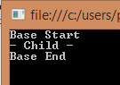

The current version of TypeScript 1.4 does't not have the notion of abstraction. This is not convenient for object oriented programmer that want to dive into TypeScript. However, it is possible to simulate the abstraction by combining overriding and exception.

Before going with the detail, why would we want abstract with TypeScript? Imagine that you want to force some logic to be called every time a concrete implementation is called. The way to do it is to call the method from the base class that has the the implementation of the method, this one call the abstract method of the child class. Here is C\# code for this pattern.


```csharp
class Program { 
  static void Main(string[] args) { 
    var rendering = new ChildClass(); 
    rendering.Render(); Console.ReadLine(); 
  } 
}

public abstract class BaseClass { 
  protected abstract void RenderChildImplementation();

  public void Render() { 
    Console.WriteLine("Base Start"); 
    RenderChildImplementation(); 
    Console.WriteLine("Base End"); 
  } 
}

public class ChildClass:BaseClass { 
  protected override void RenderChildImplementation() { 
    Console.WriteLine("- Child -");
  }
} 
```

The output is what expected, the base class control the final output by having the child implementation between its tags.



When you want to use this pattern with TypeScript, you have some limitation. First of all, protected method does not yet exist (but will be there soon) and the abstract concept does not exist and is not planned to be part of TypeScript soon. The workaround is to use exception for method that should not be called from the outside and to use override methods to simulate the abstraction. 

```typescript
export class BaseClass {

  public render() { 
    console.log('Base Start'); 
    this.renderAbstract(); 
    console.log('Base Start'); 
  }

  renderAbstract() { throw new Error('This method is abstract and must be overrided.'); }

  } 

  export class ChildClass extends BaseClass {

  public renderAbstract(): void { 
    console.log('- Child -'); 
  } 
} 
``` 
 This is far from being perfect since it is possible to call the renderAbstract() method directly from the implementation if you have instantiated the ChildClass, however, most of the case you should work with the BaseClass (or an interface) and abstract out this renderAbstract. Also, I have the convention to use a suffix "Abstract" to make sure not to call this one. Soon, with the keyword protected, this will be solved. The renderAbstract method will be changed to protected and even without the abstract, this code will work as supposed to.
