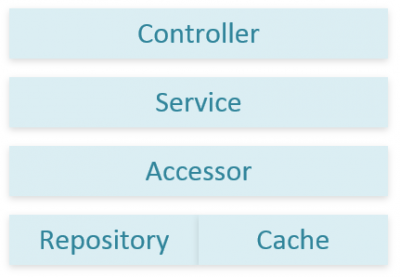

I wrote about how to integrate Redis into Asp.Net MVC few days ago. Here is a way how to integrate Redis into your solution with dependency injection and abstracting Redis. This additional layer will be helpful if in the future we change from Redis to Memcached or simply.

The first step is to create the interface that will be used.


```csharp
 public interface ICache { void SetString(string key, string objectToCache, TimeSpan? expiry = null); void Set<T>(string key, T objectToCache, TimeSpan? expiry = null) where T : class; string GetString(string key); T Get<T>(string key) where T : class; void Delete(string key); void FlushAll(); } 
``` 

This interface gives primary operations that can be execute against Redis (or any other cache system). It's possible to enhance this interface with more methods, This is the basic operations that is required to run a cache. The first two methods are to set a value inside the cache. One set a simple string, the second take a class of type T. The second one will be mostly used to take an object and serialize it. The next two methods are to get from a key the unserialized data. The next two methods is to delete. One use a key to delete a specific object and the other one delete everything from the cache.

A second interface is used. This one will allow us to get some status about if the cache is enable and if the cache is running properly.


```csharp
 public interface ICacheStatus { bool IsCacheEnabled { get;} bool IsCacheRunning { get;} } 
```

The difference between **IsCacheEnable** and **IsCacheRunning** is that the first one is controlled by us. Normally from the web.config, you should have a key to turn on and off the cache. In case you notice a problem with the cache, it is always a good option to be able to turn off. The Second property is about getting the status of the caching server, Redis. If this one become inactive, it's interesting to get the status from an administration panel for example.

Despite this interface, we need to have an abstract class with shared logic for any cache system (not only Redis). This is where we will have the serialization process, the error logging and the handling of the on/off mechanism. This is where the Circuit Pattern could also be used. I will discuss about it in a future article. Keep in mind for the moment that


```csharp
 public abstract class Cache : ICache, ICacheStatus { private readonly bool isCacheEnable;

public Cache(bool isCacheEnable) { this.isCacheEnable = isCacheEnable; }

public void Set<T>(string key, T objectToCache, TimeSpan? expiry = null) where T : class { if (string.IsNullOrEmpty(key)) { throw new ArgumentNullException("key"); } if (this.isCacheEnable) { try { var serializedObjectToCache = JsonConvert.SerializeObject(objectToCache , Formatting.Indented , new JsonSerializerSettings { ReferenceLoopHandling = ReferenceLoopHandling.Serialize, PreserveReferencesHandling = PreserveReferencesHandling.Objects, TypeNameHandling = TypeNameHandling.All });

this.SetStringProtected(key, serializedObjectToCache, expiry); } catch (Exception e) { Log.Error(string.Format("Cannot Set {0}", key), e); } } }

public T Get<T>(string key) where T : class { if (string.IsNullOrEmpty(key)) { throw new ArgumentNullException("key"); } if (this.isCacheEnable) { try{ var stringObject = this.GetStringProtected(key); if(stringObject == null) { return default(T); } else { var obj = JsonConvert.DeserializeObject<T>(stringObject , new JsonSerializerSettings { ReferenceLoopHandling = ReferenceLoopHandling.Serialize, PreserveReferencesHandling = PreserveReferencesHandling.Objects, TypeNameHandling = TypeNameHandling.All }); return obj; } } catch (Exception e) { Log.Error(string.Format("Cannot Set key {0}", key), e); } } return null; }

public void Delete(string key) { if (string.IsNullOrEmpty(key)) { throw new ArgumentNullException("key"); } if (this.isCacheEnable) { try{ this.DeleteProtected(key); } catch (Exception e) { Log.Error(string.Format("Cannot Delete key {0}",key), e); } } }

public void DeleteByPattern(string prefixKey) { if (string.IsNullOrEmpty(prefixKey)) { throw new ArgumentNullException("prefixKey"); } if (this.isCacheEnable) { try { this.DeleteByPatternProtected(prefixKey); } catch (Exception e) { Log.Error(string.Format("Cannot DeleteByPattern key {0}", prefixKey), e); } } }

public void FlushAll() { if (this.isCacheEnable) { try{ this.FlushAllProtected(); } catch (Exception e) { Log.Error("Cannot Flush", e); } } }

public string GetString(string key) { if (string.IsNullOrEmpty(key)) { throw new ArgumentNullException("key"); } if (this.isCacheEnable) { try { return this.GetStringProtected(key); } catch (Exception e) { Log.Error(string.Format("Cannot Set key {0}", key), e); } } return null; }

public void SetString(string key, string objectToCache, TimeSpan? expiry = null) { if (string.IsNullOrEmpty(key)) { throw new ArgumentNullException("key"); } if (this.isCacheEnable) { try { this.SetStringProtected(key, objectToCache, expiry); } catch (Exception e) { Log.Error(string.Format("Cannot Set {0}", key), e); } } } public bool IsCacheEnabled { get { return this.isCacheEnable; }

} protected abstract void SetStringProtected(string key, string objectToCache, TimeSpan? expiry = null); protected abstract string GetStringProtected(string key); protected abstract void DeleteProtected(string key); protected abstract void FlushAllProtected(); protected abstract void DeleteByPatternProtected(string key); public abstract bool IsCacheRunning { get; } } 
```

As you can see, this abstract class will delegate all methods into a protected abstract methods which contains the cache implementation code. This one does not know about concrete implementation, just how to handle general caching knowledge. It also abstract a single method which save a string. This mean that the implementer does not need to care about anything other than string. However, the one that will use the class has access to a Set method that allow to pass a string or an object. The next class, is the one that does the real job. Here is a simple Redis implementations of this abstract class.


```csharp
 public class RedisCache : Definitions.Cache { private ConnectionMultiplexer redisConnections;

private IDatabase RedisDatabase { get { if (this.redisConnections == null) { InitializeConnection(); } return this.redisConnections != null ? this.redisConnections.GetDatabase() : null; } }

public RedisCache(bool isCacheEnabled):base(isCacheEnabled) { InitializeConnection(); }

private void InitializeConnection() { try { this.redisConnections = ConnectionMultiplexer.Connect(System.Configuration.ConfigurationManager.AppSettings["CacheConnectionString"]); } catch (RedisConnectionException errorConnectionException) { Log.Error("Error connecting the redis cache : " + errorConnectionException.Message, errorConnectionException); } }

protected override string GetStringProtected(string key) { if (this.RedisDatabase == null) { return null; } var redisObject = this.RedisDatabase.StringGet(key); if (redisObject.HasValue) { return redisObject.ToString(); } else { return null; } }

protected override void SetStringProtected(string key, string objectToCache, TimeSpan? expiry = null) { if (this.RedisDatabase == null) { return; }

this.RedisDatabase.StringSet(key, objectToCache, expiry); }

protected override void DeleteProtected(string key) { if (this.RedisDatabase == null) { return; } this.RedisDatabase.KeyDelete(key); }

protected override void FlushAllProtected() { if (this.RedisDatabase == null) { return; } var endPoints = this.redisConnections.GetEndPoints(); foreach (var endPoint in endPoints) { var server = this.redisConnections.GetServer(endPoint); server.FlushAllDatabases(); } }

public override bool IsCacheRunning { get { return this.redisConnections != null && this.redisConnections.IsConnected; } } } 
```

The Redis connection get its setting from the web.config. The instantiation of the Redis object is done by using the **ConnectionMultiplexer** that come from the StackExchange API. This one is thread save and this is why the Cache will be a singleton from the dependency container.


```csharp
 container.RegisterType<RedisCache>(new ContainerControlledLifetimeManager() , new InjectionConstructor( Convert.ToBoolean(ConfigurationManager.AppSettings["IsCacheEnabled"]) )); //Singleton ( RedisCache use thread-safe code) container.RegisterType<ICache, RedisCache>(); //Re-use the singleton above container.RegisterType<ICacheStatus, RedisCache>(); //Re-use the singleton above 
```

This is how to register the cache with Microsoft Unity. The first one register the **RedisCache** class with a new object object shared by every queries to the cache, thus every requests. The two next registrations associate the two interfaces to that cache instance.

From there, it's possible to use anywhere the interface. It's also easy to unit test since you can mock the **ICache** interface which is the only interface that you need to pass through all your code. About what need to be used, it's clear from the dependency injection code that we use **ICache** as the interface to use and not the concrete **RedisCache** class. The cache shouldn't be used in the controller class, neither in your service class or in your repository class. This belong to the accessory classes which are between your service and repository class. Here is the a graphic of the layers that is recommended to have when using a cache system and a database.



The idea is that that the only layer to know about the cache is the accessor. The service layer does not know about the cache or the database -- it only know about to get and set from the accessor. The repository does not know about caching, it's responsibility is to get from the persistence storage the data. This can be with Entity Framework (or any other ORM) or directly with Ado.Net. On the other hand, the cache does not know about the database, it only know how to store data in a fast access way. This mean that the accessor class is the only one to get the cache injected. Here is a small example.


```csharp
 public class ContestAccessor: IContestAccessor { private readonly IContestRepository contestRepository; private readonly ICache cache; public ContestAccessor(IContestRepository repository, ICache cache) { //... } } 
``` 

This class can have methods to get specific information. Here is an example to get a contest by id. 

```csharp
 public Contest GetById(int id) { var key = string.Format("contest_by_id_", id); var contestObject = this.cache.Get<Contest>(key); if (contestObject == null) { contestObject = this.contestRepository.GetById(id); this.cache.Set(key, contestObject); } return contestObject; } 
```

This is a basic example, that get the contest from the cache, if this one does not find it, than get it from the repository and store it inside the cache for the next call. Every time, we return the object whatever where it comes from. The service layer uses the injected accessor (the interface IContest for example). It does not know anything about the repository or the cache -- the service just knows about getting its object by an id.
