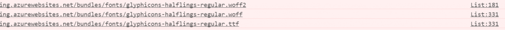

Upgrading Nuget package is always not an easy process. While the packages are downloaded for you, the migration side effects are often obscure. Some packages are not upgraded often and have some recurring issues. Bootstrap is one that doesn't work well with Asp.Net MVC that it's easy to forget. 

Using BootStrap is not a problem until you use Asp.Net MVC bundle. The problem you may have is that it will try to get the font from _\\bundles\\fonts\\glyphicons-halflings-regular.woff2_ instead of _\\fonts\\glyphicons-halflings-regular.woff2_. Why does it adds the _\\bundles\_ in front is still not clear but it's the problem is that the Nuget package comes with **\-min.css** version. The bundle engines try to use these files which cause the issue. The work around is to delete all the .min file. This way, Asp.Net MVC bundle system uses the non minimized version and will do a proper minimized version.

A second solution that I do not like would have been to copy the fonts into a new bundles folder at the root of the website. But, it's easier to delete and avoid repetition of files than doing so.
