In the winter of 2014 I decided to re-code my virtual stock exchange [boursevirtuelle.com](http://www.boursevirtuelle.com). The initial project started in 2004 and got released in 2005. From there, features got added, some removed. Technologies changed from not having Jquery to a transition with mostly only using it. The backend was done in MySql and MemCached on a Linux VPS. I have learned a lot and while the website is still running, around 2008 I was less interested into it. Mostly because with Asp.Net MVC I was able to have more control hover the Html than the traditional Asp.Net Webform, I loved Microsoft's tool and I was working in the Microsoft ecosystem professionally. This side project always was a playground to try new things, experiment on technologies and patterns and I wanted to try more stuff on my own with the .Net environment. The PHP project started to feel older, adding feature was more and more problematic due to the lack of automation. Unit tests were introduced in the last month of 2008, new features added around 2010 got some but never had anything automated. While I am glad to got that experience, I was ready to work on something else without killing the whole project.

This is when I thought that I can redo the virtual stock exchange instead of a new complete idea. I had a strong view about what is the business logic and could just jump on the code. I started a blog where I was describing every sprints (1 month). This one ran from January 2014 to August 2014 where I got approached by Microsoft to come work for them, at Redmond USA. I have been continue to develop the new simulator but stopped blogging about it. This post contains the information that I posed in the old blog that is now not anymore online. I will post further detail about what I have learn during the project directly on this blog in the future.

# Setuping Team Foundation Server (TFS) January 26, 2014 By: pdesjardins

Posted in Application Life Cycle The project is just starting and before even thinking about how to create the code, we need to do some application life cycle management. Team Foundation Server offers an online edition since few months and I believe it is the perfect software for this open source online application. You can get an account at VisualStudio.com. Once logged, you can create you own repository. I have created one named “BourseVirtuelle.com” which is the name of the website.

TFS online provides many tools. First, it has the TFS source control. All code will be located online with TFS. TFS and Visual Studio is tightly coupled with TFS which confirm the use of TFS. TFS also gives a good platform for activities. This is essential if we want to track the work to be done, bug tracking and future features to add. It has also a build server and testing capability. Since we are creating a enterprise website and not only a simple Asp.Net MVC tutorial, we will create unit test and we will execute automatized unit tests. Finally, TFS online offer the possibilities for deployment. Since this website is about how to create an Asp.Net MVC from the beginning to the end, we want to deploy everything in a later stage.

The TFS account used for this project is mine : https://patrickdesjardins.visualstudio.com and the project name is BourseVirtuelle.com (which will have its English version at StockVirtual.com).

Once created, it is the time to synchronize Visual Studio with TFS. Open Visual Studio and click Open from Source Control …

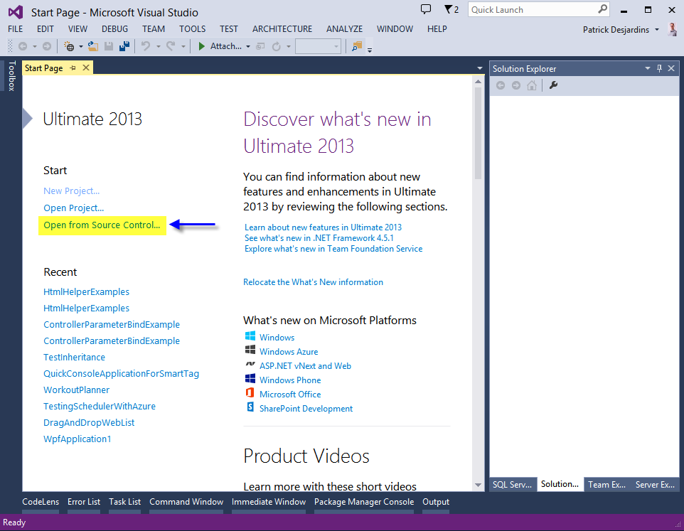

A window popup opens with the possibility to select a Team Foundation Server. I enter the URL that I have previously specified in this blog post and hit enter. From here, I can see all Team Projects available. I choose the BourseVirtuelle.com project and hit Connect.

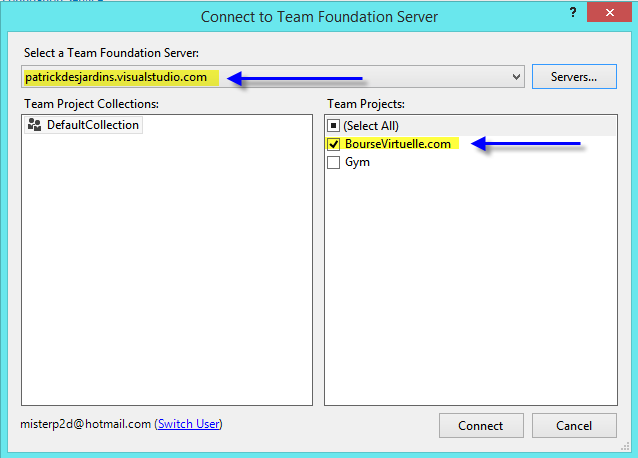

This step synchronize TFS and Visual Studio. It is possible to control TFS from Visual Studio with the Team Explorer tab.

I will end this post here and continue later. The next step is to create some Work Items. Work Items are element for managing the work to be done on the project. Since it is a big project that will be built part-time on spare time, it is a good idea to keep track of what needs to be done.

# Creating task with Team Foundation Server February 3, 2014 By: pdesjardins

We have now Visual Studio and TFS connected. It is the time to plan what we will do for the next sprint. Since we are not full time on this project, I plan to have monthly sprint. Maybe 10 hours per week will be set on this project, so a month is about 40 hours for 1 person. The first month will be mostly on configuring the project. But before planning anything, let’s setup TFS.

Visual Studio cannot change the backlog time frame. This is why, we will jump into the web portal. Once in the web portal, select WORK at the top of the screen. From there, you can choose Backlogs. When you select a sprint, you can then click at the top right the “No iteration dates” to setup and assign a range. At anytime it is possible to click the date and change the starting and ending date. It is also possible to rename the sprint.

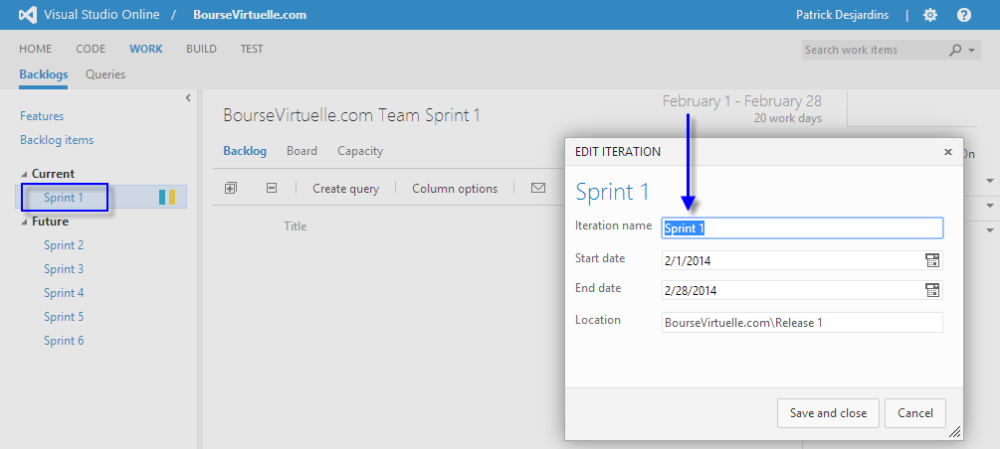

We are now ready to enter few back log items. Back log items are a use case. This one will be defined later in smaller task. A group of back log can be a feature. It is possible to work with TFS from big to small or small to big. I am note sure that I will go as much deep with Work Item for this project and will start just by defining Work Item as back log item.

The first step is to click BackLog items in the Work->Backlogs menu.

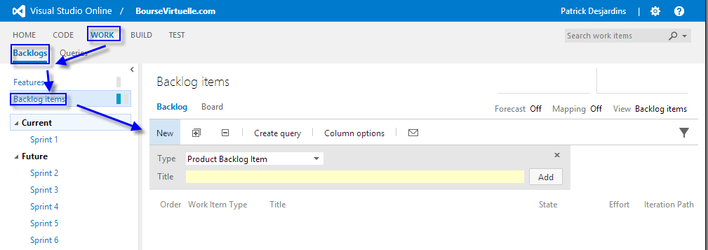

The type can be “Product Backlog Item” or “Bug”. Every time title are entered and the Add button is hit, then the grid below the form is filled up. But this is not the only way to create Backlog items. We can do it directly into Visual Studio 2013. First, open the Team Explorer. Second, on the home screen, click Work Items. Third, click New Work Item at the top of this panel.

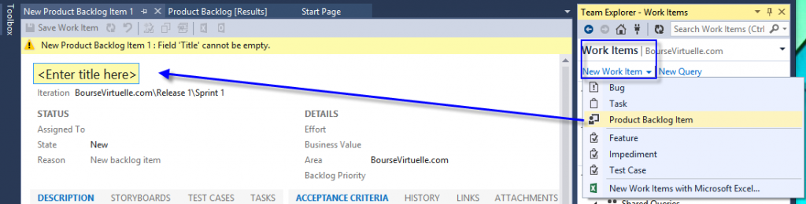

In both case system, the web portal and Visual Studio, it is possible to create a list of Work Item. Visual Studio may looks to have more field but in fact, the web portal does have them too. Once it is created from the team portal, right clicking Work Item in the grid and selecting Open, opens the Work Item with all fields.

At any time, from Visual Studio or the web portal, it is possible to see the list of backlog item. In Visual Studio, the list if under the Team Explorer, Work Items. A sub panel labelled Queries has a Shared Queries folder. Under this one, a pre-defined query “Product Backlog” exist. Double clicking this query execute this one.

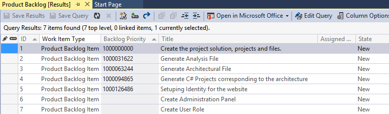

From here, it is possible to assign to double click any of the Work Item and to assign the effort and to who the Work Item is assigned. For the moment, I am sure that the four first Work Item can fit in the first sprint. So, I can with Visual Studio opens the Work Item and change the Iteration for the first sprint.

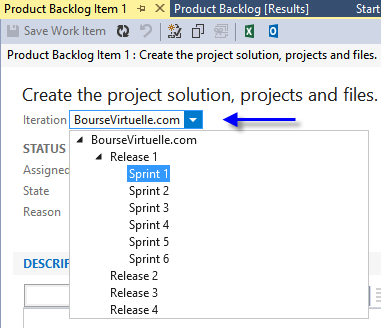

But, it is not efficient because it is slow. A faster way is to use the web portal because you can drag and drop Work Item.


This have move everything into the Sprint 1. Visual Studio has a Shared Query called “Sprint Backlog” and the web portal has the Sprint 1. Both display not only Work Items but also Task. Here is the two side by side that show the difference. I personally prefer the web portal.

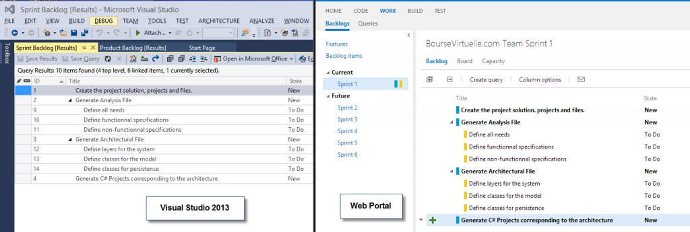

The next step is to assign capability for the team. For the sprint 1 (and for all other sprint) I will be alone. Nevertheless, let’s configure everything correctly. Inside the web portal, click the Sprint 1 and select the Capacity sub menu. From here, it is possible to select the capacity per day. We have defined that I will work about 10 hours per week, so it is 2 hours per day (5 workings day on 7 days).

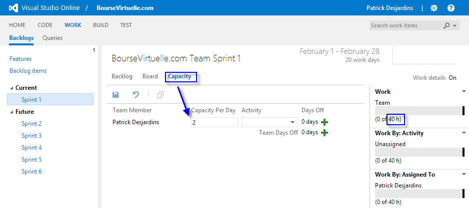

What is most interesting is to assign time into each task. I have say TASK because time cannot be assigned to Work Item directly. Work Item remaining time is the sum of every task times. It is possible to set the remaining time directly inside each Work Item but the fastest way is to open the web portal and to go inside the sprint ans select “Board”. This give a view where each Work Item has its row and each task has its square. It is possible from here to click an assign the time and to who the task is assigned.


Once all setup, if you go back to the Capacity window, the work for the team, for every user and for task should be all green if you do not overcharge.

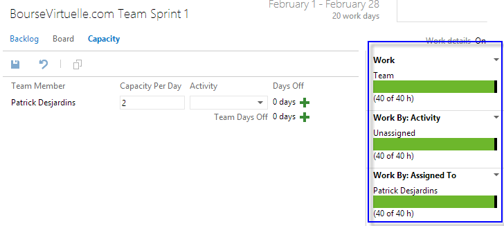

It is also possible to change the Board view by people instead of by Work Item. This option is inside the Board screen, at the top right.

# Sprint 2 : Planning model classes, creating the projects and starting authentification February 10, 2014 By: pdesjardins

Since I am working alone in this project and I do not have a lot of time, sprint was defined to be for a complete month. This give about 40 hours per sprint which is not that big. So far, the sprint 1 has been great because I have identified what we will do and what I will not do. I have filled up all the back log and started to organize what will happen in the next sprints.

Here is the summary of the needs:

Existing needs

- Create new accounts
- Display TOS
- Login for existing user
- Forget password mechanism
- Show old contest
- Show the name of the contest with the number of participants
- Give the possibility to show the rating
- Discussion forum
- Help for the user
- Have a way to communicate with the administration (contact page)
- Premium account
- Allow to enter contest that needs to have reputation point even if the user
- Show more detail in the portfolio
- Having more time for order
- Having action directly into the portfolio
- Having more decimal precision
- Search users
- Having an indicator that specify if a sell has been a success or not
- One screen that show all portfolio
- A list of all contest available to register.
- A list of all contest that we participate
- Create new contest and be able to edit them if we are an administrator
- Private contest can be created with a password
- Buy and sell action
- Limit and Stop order
- Buy and sell option
- Limit and Stop order
- See a graphic of the progression of the portfolio
- See historic of all transactions (success and fail)
- See all waiting order and their state
- Display statistic about the number of buy/sell that has been a success or not.
- List of all participants of a contest
- Displaying the rank of the logged user.
- Having moderator for the whole website or for just a contest
- Having badge and reputations system
- Badge for rank position, activity, beat the market, time registered
- Moderation tools for split and for symbol change
- Having script that automatically execute split and symbol change
- Voting system for split and symbol.
- Being able to see last registered user and to manually enable account
- Being able to see last transactions for a contest
- User Paypal to get premium account
- French and English website
- Having good URL (French and English)
- Short option
- Option Lookup (Ask and Bid Price)
- Show when market is open or close
- Be able to select which Market is available for a contest
- Keep tracks of every portefolios gain
- Something that remove limit order and option expiration automatically
- Send email if the user have the preference to receive email when new contest arrives
- Statistic for the contest. Daily, weekly, monthly best performer.
- It is too slow and not essential.
- Showing the forum last post in the website.
- This slow down the website. Possible to add it later.
- Having followers and being able to follow people portfolio.
- This feature is not used by 575 peoples at this moment. Can be added at any time later.
- Dashboard with widget.
- This is so slow that is not usable. I do not see a real use case for this feature.
- Wiki for help
- This has been targeted by hacker a lot. People do not participate.
- Winning by getting to a specific amount
- Never been implemented correctly. Too risky to end contest prematurely.
- Team contest (multiple people having the same portfolio) with the mechanism of creating team.
- The problem is that contest is spanned on multiple month. People forget to play and the team is with dead bodies. This need to be rethinking. The team building system is great.
- Having currency
- Currencies would be more realistic and could have impact. This would require to have a daily script to get conversion. Maybe we can limit to USD, CND, EURO.
- Mobile version of the website
- I think this is normal now and won’t be a problem to implement.
- Watch List
- This is not a priority but having a watch list of stocks seem to be naturally something interesting to have
- Showing historical price for stock
- This is frustrating at the moment because we have no clue about the past price of the stock. We only have the present time. We must have a list of pas price and being able to display the price on a graph.
- Create account with social website
- Simple as possible to create account
- Be able to create account from FaceBook or Twitter

Old needs that won’t be migrate

- Statistic for the contest. Daily, weekly, monthly best performer.
- It is too slow and not essential.
- Showing the forum last post in the website.
- This slow down the website. Possible to add it later.
- Having followers and being able to follow people portfolio.
- This feature is not used by 575 peoples at this moment. Can be added at any time later.
- Dashboard with widget.
- This is so slow that is not usable. I do not see a real use case for this feature.
- Wiki for help
- This has been targeted by hacker a lot. People do not participate.
- Winning by getting to a specific amount
- Never been implemented correctly. Too risky to end contest prematurely.
- Team contest (multiple people having the same portfolio) with the mechanism of creating team.
- The problem is that contest is spanned on multiple month. People forget to play and the team is with dead bodies. This need to be rethinking. The team building system is great.
- Having currency
- Currencies would be more realistic and could have impact. This would require to have a daily script to get conversion. Maybe we can limit to USD, CND, EURO.
- Mobile version of the website
- I think this is normal now and won’t be a problem to implement.
- Watch List
- This is not a priority but having a watch list of stocks seem to be naturally something interesting to have
- Showing historical price for stock
- This is frustrating at the moment because we have no clue about the past price of the stock. We only have the present time. We must have a list of pas price and being able to display the price on a graph.
- Create account with social website
- Simple as possible to create account
- Be able to create account from FaceBook or Twitter

New needs

- Having currency
- Currencies would be more realistic and could have impact. This would require to have a daily script to get conversion. Maybe we can limit to USD, CND, EURO.
- Mobile version of the website
- I think this is normal now and won’t be a problem to implement.
- Watch List
- This is not a priority but having a watch list of stocks seem to be naturally something interesting to have
- Showing historical price for stock
- This is frustrating at the moment because we have no clue about the past price of the stock. We only have the present time. We must have a list of pas price and being able to display the price on a graph.
- Create account with social website
- Simple as possible to create account
- Be able to create account from FaceBook or Twitter

For this sprint, the classes diagram has been done for the model. It was very easy to do because the system already exist. Nevertheless, improvement was required. The old system was done in PHP and did not had a lot of inheritance and a lot of dirty PHP trick was done. Also, nothing was injectable. This made unit testing harder.

Few class will be complex and will be directly added into all tables when used. This is the case for the Money and for the LocalizedString.

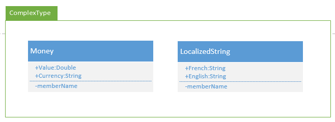

Then, we have classes that concern the user. In the current system user can win badges and reputations points. These will be in the User namespace. Every model namespace will be translated into schemas in the database. We will configure Entity Framework in a later post. User will be have role. So far, role will be Administrator, Moderator, Contest Moderator or simply a Registered User. The privileges table is linked to the User table. User will have the possibility to have privileges which are special account. 

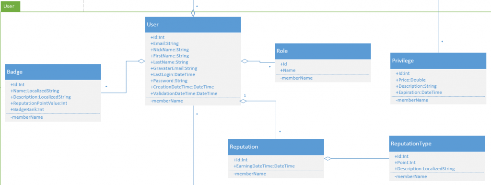

The Contest namespace is a huge one that contain a critical classes.

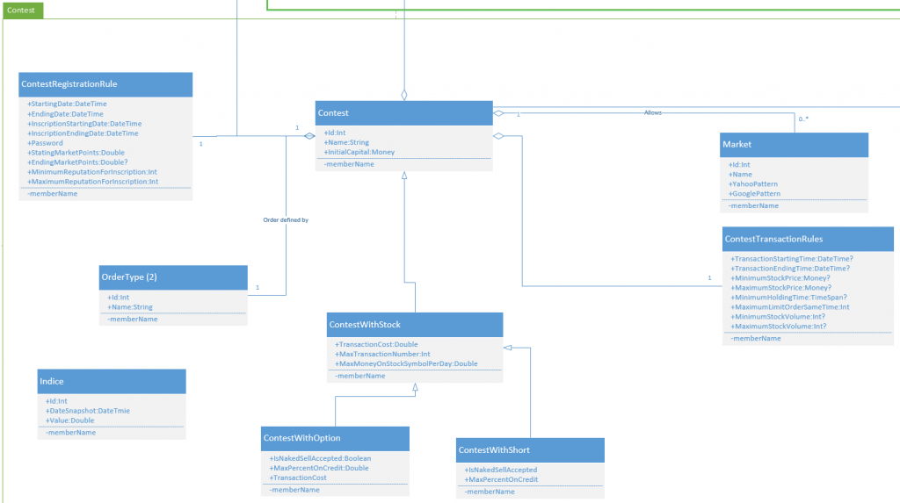

At its heart, this namespace has the Contest class. The registration rule has been set to an one to one relation. This has been not put inside the Contest class because it is only used in specific place. It does not need to be loaded 80% of the time. This class can be and must be inherited into a specific implementation like to have a simple stock market contest or have one that allows shorting or options. Nevertheless, I am not happy with the current class diagram because it is not possible to have a contest with Short and Option. Having the Option inherit from the Short will also cause problem because having option contest force to have short too. This need some work but since all options and short are planned in few sprints (months), I will leave this like that.

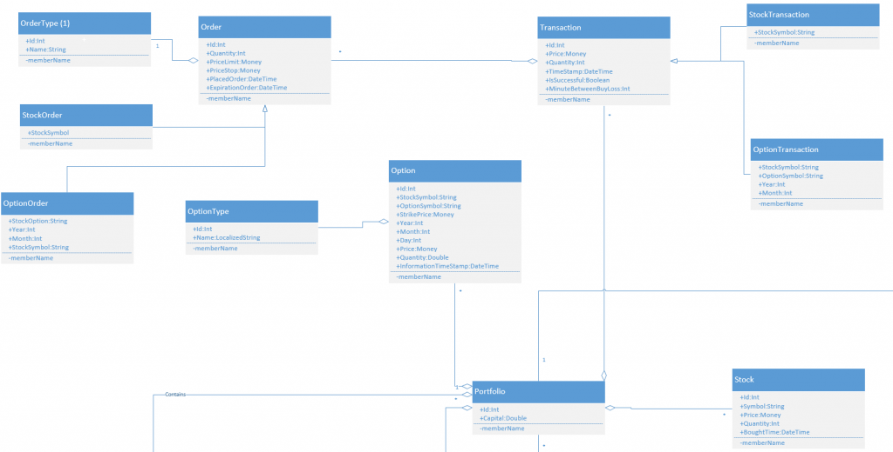

This is also a huge namespace, the Trading namespace. It contains all orders, transactions, stocks and options of every portfolio. Finally, some classes for Stock and Option are required to have real time value.

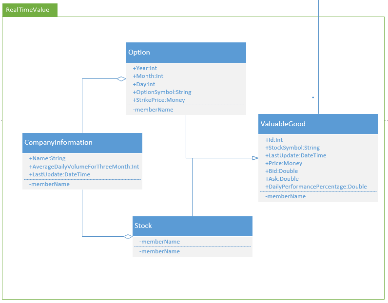

These classes will offer the information from external source. Like Yahoo or Google to get the real time price (or 15 minutes delayed).

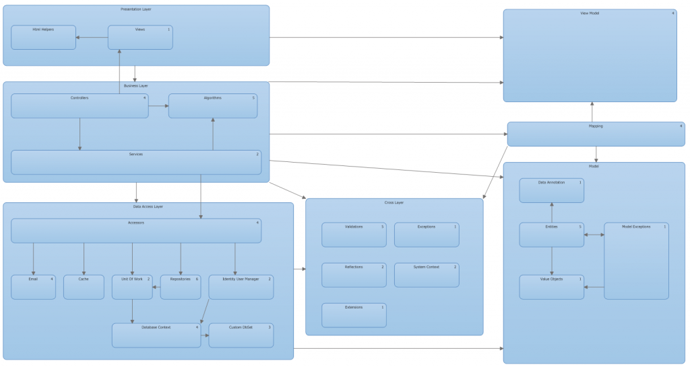

We want something efficient and with low maintainability. This require having high cohesive classes but also low coupling. Nevertheless, to be efficient we need to limit the number of classes which will increase the coupling. A good in the middle solution is to have View Model and Model classes. This project will have these two types of classes for entity classes. Otherwise, three majors layers are there. One for the presentation, one for the business logic and one for data access.

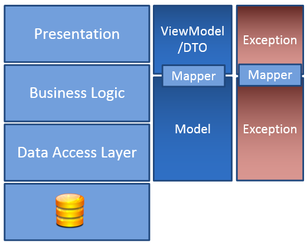

Exceptions are also limited to two levels. One that can goes up to the presentation and one that is only back end. During the process, if we have something to cut for shorter the development time, we may cut the exception to have this one go from the back end to the front end. However, this increase the coupling. Let’s go a little more in detail before going further in the code.

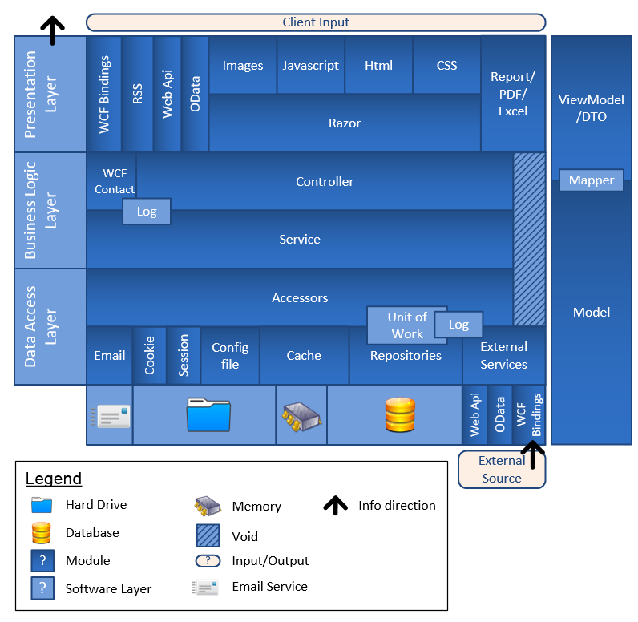

This is a more detailed view of how the system will be developed. On the left side and on the right side you can see what we just saw in the more abstracted view of the architecture. The in between are all Asp.Net technologies for the front end, the ASP.Net MVC controller for the business logic which share classes with a service layer. These one access any persistence storage by an accessor layer that do the proxy between multiple data access technologies.

Creating a new solutions and projects

So, from all information that we have gathered so far, it is possible to create the solution for this new software.

When creating the solution, we want to push all the code to TFS Online. It is important to select “Add to source control”. If you have not, do not worry, you can add it later.

CreateNewSolutionThen, we select MVC application and the authentication to be Individual User Accounts. This is because we want users to create account or to use their Facebook and Twitter account to link to a new account. We do not add unit test because we will create them later and in several projects.

I’ll stop here for now. Another post will be there soon concerning all the authentication process.

Sprint 2 : TFS Online Configuration and solution setup February 17, 2014 By: pdesjardins

Posted in Analysis and Architecture In the last post, we have created the new solution “BourseVirtuelle”. I have renamed the default project, which is the Asp.Net MVC project to “WebSite”. Now that the solution exist and is plain with the default folders and classes, it is the time to create the projects and folders that represent the software architecture.

I have put back the detailed architectural graph because you will see that Visual Studio solution will be pretty much the same. What I have not yet discussed and that is visually apparent here is the fact that we will have multiple unit testing project. Every projects contains at least a unit testing project. Some, contains two. One for unit testing and one for integration. The purpose of splitting this in several projects is because when we will setup the build server that we won’t let it build test that are slower, like integration tests.

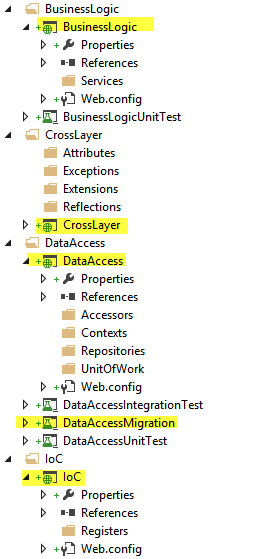

This is the first part of projects created. As you can see, they are grouped into folders. This allows us to easily find every layers with their test. Every project has their unit testing project inside their folder. The CrossLayer projet is a project that is referenced by almost all projects. Not a lot of classes will be set there, but some classes are cross layers. The BusinessLayer has the folder Service. One exception is all controllers that will be kept in the WebSite project. The reason is because Asp.Net MVC setup by default all controllers in the website project or within the Are folder of the website project. DataAccess folder contains the DataAccess project. This one contains Accessors, Contexts, Repositories, UnitOfWork and later everything related to others elements defined in the architectural graphic.

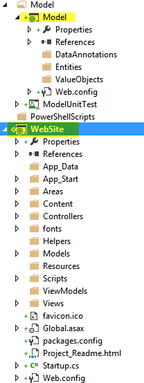

The second part contains the model folder. This one also contains a unit testing project. The model project is divided with some folders like the DataAnnotation, Entities and ValueObjects. DataAnnotation contains validation that can be shared across model classes. Entities are every classes used in the business. This has been defined in a previous post. However, the previous post contained some Value Object. Value Object are classes that could have been defined at enumeration but to have them in the database, they are defined as classes. They are not creatable or editable like entities. For example, an example of value object is the type of Option (Ask, Bid).

From there, it is the time to commit everything and end this post.

On a final note, this is a project that I am doing on my free time and I am commenting my commit. This should be a reflex for everybody. Later one, this can become very handy to know what is going on in the source control and to be able to come back on a specific commit.

# Sprint 2 : Identity and Architecture Part 1 of 2 February 24, 2014 By: pdesjardins

Posted in Analysis and Architecture, Asp.Net MVC, Back-End This is the first post that contains more code. But first, let me show the architectural diagram. This diagram as been created with the Architecture Tool from Visual Studio 2013 Ultimate. It is not available for other edition. What is interesting compared to other UML tool is that the layer diagram will validate later if the design is respected.


The image might be a little small but if you click on it you will see more details. As we can see, the presentation layer contains Html Helper and Views. Html Helpers will be defined later on its own name space to not disturb the Asp.Net MVC Html helpers. The diagram also show that presentation layer can only access View Model and not Model directly. Business Layer contains the controller, some algorithms and the service layers. I have put the controller in the Business Logic and not in the presentation layer because some basic logic and errors manipulation are done here. I concentrate the presentation layer for all visual aspect like Javascript, Css, Html.

The service layer inside the business layer contains the path to classes that has access to the data access layer. It can compute information from different sources. On the other side, the accessor layer. This is the first layer to reach once the data access layer is used. It chooses which technology to use. For example, this is where the cache will be checked, if not available than it will use the repository. This logic is in the accessor. Unit of work is used but not like Asp.Net MVC tutorial explains it. It is more like Julie Lerman explains it in her tutorial on PluralSight. I found it more logical. As you can see, the Unit of Work contains the Database Context (Entity Framework) but not repositories. I think it is better because you can adjust easily which repository to combine by having them in the accessor and this one give the Unit Of Work to each repository. The main goal is to have multiple repositories to share the same context.

Finally, this layer has model classes. This one can be used by the data access layer and the business layer. It would be interesting to have the data acess layer have its own entity classes but to limit mapping and tests to do, having only View Model and Model is enough.

Identity Preface

The website has for requirement to log with minimal information. I think the more minimal information to get is the email. I think it helps to have a lot of player if the form is very small. This is why what is built will have only one unique input that will ask for an email. This email address will be stored in the database and an emailed to send a validation link. Since we are using Identity, a password and a user name is required. To bypass this default behavior, a username is generated from the email address and a temporary password is set. This password is send in the email. Of course, the user must change this one.

When creating this behavior which can be found in this blog post I have notice that Asp.Net Identity framework has some difficulty to update custom field of your user. The Email is a custom field, so is the Creation date time and the Validation date time. These custom field must be updated. The first date when the account is created and the second when it is validated. This will be interesting to send back email after 24 hours if the account has not been validated and also to have some statistic about how many account has been created for real.

So the first step is to modify the Identity to have custom fields. The second step is to use the Identity User Manager to create and handle the user . The third step is to use Entity Framework to update the user for custom field.

Modifying Identity into Data Access Layer

We need to fit the Identity User Manager somewhere logical. By default, it is inside the WebSite project. This is wrong. The UserManager class use a DbContext. Of course, it is clear that it should be moved into the Data Access Layer. Its place is in in parallel of repositories. We will create our first repository to modify the user but the Identity User Manager should not be in the repository. It is a mechanism by itself and this why I have separated both. 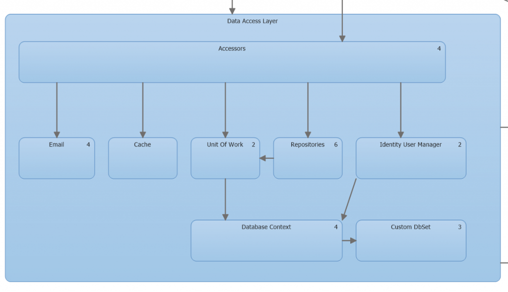

The website project must have the view model, the views and the controllers. That’s it. All model classes and user manager classes are moved.

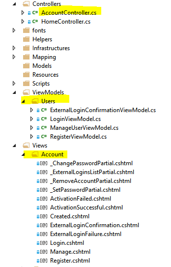

The model project has the custom class.

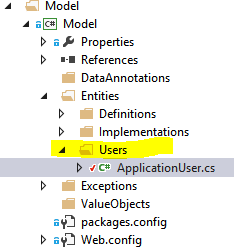

I have named mine ApplicationUser.cs. Asp.Net MVC Identity allows to inherit the IdentityUser class. This is where we add additional properties like the Email.


```csharp
 public class ApplicationUser : IdentityUser { public string Email { get; set; } public string GravatarEmail { get; set; } public string DisplayName { get; set; } public string FirstName { get; set; } public string LastName { get; set; } public DateTime? LastLogin { get; set; } public DateTime CreationDateTime { get; set; } public DateTime? ValidationDateTime { get; set; } } 
``` 

I added more than just the email because in back log of the project, one coming work item is to be able to change the profile. I want the user to be able to have an icon. I will use gravatar since it is the system used in the current PHP system. I have a DisplayName which is the nick name that we will use. I cannot reuse the UserName of IdentityUser becaues it has been generated by the email and must remain a system property because every time the user will login with its email, the system transforms the email to the username to use the User Manager to login.

As we have seen in the layer, we need to have something in the service, then in the accessor and finally use the repository for updating the user and using the Identity User Manager.

Let’s start with the service layer. You may jump of your chair because I am in the process of developing the software. So far, the code is simple and will be improved. The service class is a pass through for the moment and it is normal for the User because it does not have any logic. Here is the class at this time of the project.


```csharp
 public class UserService:IUserService { private readonly IUserAccessor userAccessor; private readonly IEmailCreationFacade emailFacade; private readonly IRunningContext runningContext; public UserService(IRunningContext runningContext, IUserAccessor userAccessor, IEmailCreationFacade emailFacade) { this.runningContext = runningContext; this.userAccessor = userAccessor; this.emailFacade = emailFacade; } public async Task<IdentityResult> CreateAsync(ApplicationUser user, string password) { var result = await this.userAccessor.CreateASync(user, password); if (result.Succeeded) { var email = this.emailFacade.GetCreationEmail(user.Email, password); this.userAccessor.SendEmailCreateAccountAsync(email); } return result; } public async Task<ClaimsIdentity> CreateIdentityAsync(ApplicationUser user, string applicationCookie) { return await this.userAccessor.CreateIdentityAsync(user, applicationCookie); } public async Task<IdentityResult> CreateAsync(ApplicationUser user) { return await this.userAccessor.CreateASync(user); } public async Task<ClaimsIdentity> SignInAsync(ApplicationUser user, bool isPersistent) { return await this.userAccessor.SignInAsync(user, isPersistent); } public async Task<IdentityResult> RemoveLoginAsync(string userId, UserLoginInfo userLoginInfo) { return await this.userAccessor.RemoveLoginAsync(userId, userLoginInfo); } public async Task<ApplicationUser> FindAsync(string userName, string password) { return await this.userAccessor.FindAsync(userName, password); } public async Task<IdentityResult> ChangePasswordAsync(string userId, string oldPassword, string newPassword) { return await this.userAccessor.ChangePasswordAsync(userId, oldPassword, newPassword); } public async Task<IdentityResult> AddPasswordAsync(string userId, string newPassword) { return await this.userAccessor.AddPasswordAsync(userId, newPassword); } public async Task<ApplicationUser> FindAsync(UserLoginInfo userName) { return await this.userAccessor.FindAsync(userName); } public async Task<IdentityResult> AddLoginAsync(string userId, UserLoginInfo login) { return await this.userAccessor.AddLoginAsync(userId, login); } public ICollection<UserLoginInfo> GetLogins(string userId) { return this.userAccessor.GetLogins(userId); } public ApplicationUser FindById(string userId) { return this.userAccessor.FindById(userId); } public void ActivateAccount(string guid) { try { var userAccount = this.userAccessor.FindById(guid); if (userAccount == null) { throw new GuidKeyNotFound(guid); } userAccount.ValidationDateTime = this.runningContext.GetCurrentTime(); userAccessor.Update(userAccount); } catch (ArgumentNullException) { throw new GuidKeyNotFound(guid); } } } 
```

This class is injected by Microsoft Unity. It could have been any inversion of control (IoC) but I try to keep it simple and Unity do the job well. It has three parameters. IRunningContext, IUserAccessor and IEmailCreationFacade. I will not talk about the first one yet more than it has the current date time and it has the user that is loggued. The user accessor is the accessor that the user service uses. The email facade is all the logic about creating emails. This is required to be able to send a verification email. Later, it will be also used when the user do not remember his password. Let’s focus on the creation of an account for now.

The CreateAsync method is the cone that concern us. We want to create an account into the database by using the default membership framework, called Identity. Here is an extraction of the method that is important for the moment.


```csharp
 public async Task<IdentityResult> CreateAsync(ApplicationUser user, string password) { var result = await this.userAccessor.CreateASync(user, password); if (result.Succeeded) { var email = this.emailFacade.GetCreationEmail(user.Email, password); this.userAccessor.SendEmailCreateAccountAsync(email); } return result; } 
``` 

First of all, it access the accessor. This is the entry door for the Data Access Layer. If everything is saved, than we send an email. It is the place of the service to trigger the email and not the accessor because it is a business logic to send an email after the creation of an account, not a Data Access Layer code. On the accessor side, it uses the unit of work because the accessor has the role to say if everything must be commited. I takes the user manager, the email provider and the user repository too.


```csharp
 public class UserAccessor:IUserAccessor { private readonly IUserRepository userRepository; private readonly IRunningContext runningContext; private readonly IUnitOfWork unitOfWork ; private readonly IUserManager userManager; private readonly IEmailProvider emailProvider; public UserAccessor(IRunningContext runningContext,IUnitOfWork unitOfWork, IUserRepository repository, IUserManager userManager, IEmailProvider emailProvider) { this.runningContext = runningContext; this.unitOfWork = unitOfWork; this.userRepository = repository; this.userManager = userManager; this.emailProvider = emailProvider; } 
```

The create method that is called by the service layer is very straightforward. It simply call the user manager.


```csharp
 public Task<IdentityResult> CreateASync(ApplicationUser user, string password) { return this.userManager.CreateASync(user, password); } 
``` 

If we go a little lower in the class, two other methods is different in the accessor.


```csharp
 public void Update(ApplicationUser userAccount) { this.userRepository.Update(userAccount); this.unitOfWork.Commit(); } public async void SendEmailCreateAccountAsync(Email.Implementations.Email email) { await this.emailProvider.SendEmailAsync(email); } 
``` 

The update does not use the UserManager because it does not work well with custom fields. It uses the repository that simply use Entity Framework to update the entity. The other method is for sending thee email. This one is async since we do not want to wait the email to be sent. It will call the command to send the email and return immediately.

Here is the repository code so far for the user.


```csharp
 public class UserRepository : RepositoryForUser<ApplicationUser>, IUserRepository { private IUnitOfWork unitOfWork; public UserRepository(IUnitOfWork unitOfWork):base(unitOfWork) { this.unitOfWork = unitOfWork; } public void Update(ApplicationUser userAccount) { base.Update(userAccount); } } 
``` 

What is very interesting with Entity Framework is that you do not have to change anything in the repository if an additional custom field must be added and modified. Later, when the profile page will be done, this repository should not change.

Concerning the email, because it uses an interface, the injection can push a real implementation but also a fake one.

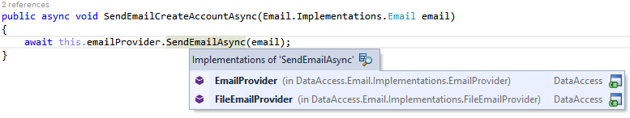

Instead of having email sent with SMTP, a fake one writes file is coded. This make it faster and easier during development to not have an intermediary protocol between the process of sending and receiving.

# SPRINT 2 : IDENTITY AND ARCHITECTURE PART 2 OF 2 March 3, 2014 By: pdesjardins

This second part is shorter than the first one. The sprint 2 has two others thing that must change with Identity. First of all it is the possibility to fake a user. This will be interesting for testing purpose. The second work item is to be able to log with third party, like Facebook or Twitter.

This part was not a piece of cake. It was working fine with an empty project but for unknown reasons, thing has gone wrong in few places. First of all, the use of external login was not working fine in the project but was fine in a new project solution. Second, the use of AccountManager of Identity cause some problem with Async.

I have modified the identity to have Model inside the Model project and ViewModel in the ViewModel project. The Model is very simple since we are using Identity. Most of the classes are ViewModel. 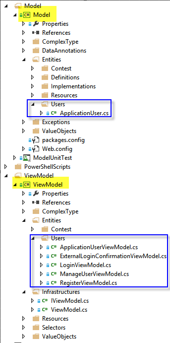


```csharp
 public class ApplicationUserViewModel { public string Email { get; set; } public string GravatarEmail { get; set; } public string DisplayName { get; set; } public string FirstName { get; set; } public string LastName { get; set; } } 
```

The view model is used to allow the user to add custom data. It is mapped to the model class. 

```csharp
 public class ApplicationUser : IdentityUser, IValidatableModel { public string Email { get; set; } public string GravatarEmail { get; set; } public string DisplayName { get; set; } public string FirstName { get; set; } public string LastName { get; set; } public DateTime? LastLogin { get; set; } public DateTime CreationDateTime { get; set; } public DateTime? ValidationDateTime { get; set; } public IEnumerable<ValidationResult> Validate() { return null; } public bool IsValid() { return !Validate().Any(); } } 
``` 

The model class is not yet done but has most of the properties that is required by the service to save it with Entity Framework. The Identity Framework does not work fine or easy with custom fields without the use of Entity Framework. This is why, the Service Layer will use Entity Framework for some operations and use the Identity Manager for others. Here is a sequence diagram from the AccountController to the Service layer. From here, the path change depending of the task.

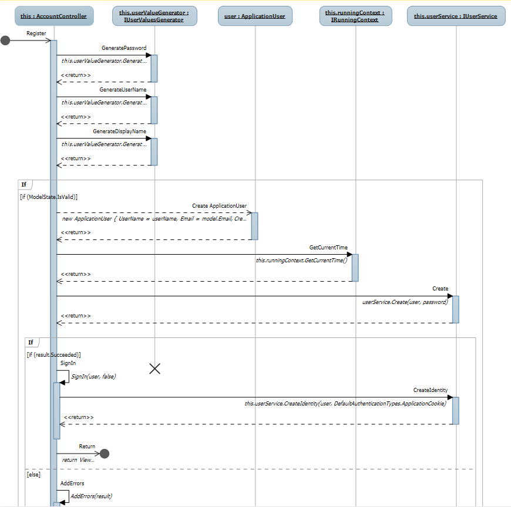

As you can see, the controller call some injected classes like a IUserValuesGenerator. This is the class that as the algorithm to generate the password to the user. Why? Because we want a minimalist sign up form. In fact, just the email is required.


```csharp
 public async Task<IdentityResult> CreateAsync(ApplicationUser user, string password) { var result = await this.userAccessor.CreateASync(user, password); if (result.Succeeded) { var email = this.emailFacade.GetCreationEmail(user.Email, password); this.userAccessor.SendEmailCreateAccountAsync(email); } return result; } 
```

The code above, create the user, if it succeed, it send an email to the user with his temporary password. The accessor layer is where the technology switch is done. Depending of the task, it uses Entity Framework or the User Manager.


```csharp
 public class UserAccessor:IUserAccessor { private readonly IUserRepository userRepository; private readonly IRunningContext runningContext; private readonly IUnitOfWork unitOfWork ; private readonly IUserManager userManager; private readonly IEmailProvider emailProvider; public UserAccessor(IRunningContext runningContext,IUnitOfWork unitOfWork, IUserRepository repository, IUserManager userManager, IEmailProvider emailProvider) { this.runningContext = runningContext; this.unitOfWork = unitOfWork; this.userRepository = repository; this.userManager = userManager; this.emailProvider = emailProvider; } public async Task<IdentityResult> CreateASync(ApplicationUser user) { return await this.userManager.CreateASync(user); } //... public void Update(ApplicationUser userAccount) { this.userRepository.Update(userAccount); this.unitOfWork.Commit(); } } 
``` 

Here is a code that show the difference between the creation of a user and an update.

This is it for the user. I will write later with external login when everything will be working correctly. So far, I had to do some weird thing to make it works.

# SPRINT 2: CREATING THE FIRST ENTITY March 10, 2014 By: pdesjardins

Creating the first entity has always something different from others entities. The reason is that a lot of the infrastructure is not yet in place. The first entity chose is the Contest entity. It is a very complex class that use others entities. Before going any deeper, let’s see the class diagram for the Contest that was planned to use.


As we can see, we firstly wanted to use inheritance for different type of contest. However, this is what will be done.


In fact, we have a contest class that use other classes. This simplify by a lot the use of contest with Entity Framework but also because we want to have contest with Option and Short and Stock or maybe a combination of some of them but not all. Having inheritance would require to have ContestWithStock having inheritance with ContestWithOption or vice versa but also all others different scenario. The concrete implementation of this architecture is mostly all in the Model project, inside the Entities folder.


As the diagram shows, Contest, ContestTransactionRules, ContestRegistrationRules and models classes like ContestWithOption, ContestWithStock and ContestWithShort inherit from ValidatableModel which has the Validate method and ValidateChildren. This mean that Contest will have inside its ValidateChildren a call to ContestWithStock, ContestWithShort and ContestWithOption but only if these one are required to be validated. This mean that if the contest does not allows options, than we will not validate options.


```csharp
 public override IEnumerable ValidateChildren() { var r = new List(); if(StockRules != null) r.AddRange(StockRules.Validate()); if(OptionRules != null) r.AddRange(OptionRules.Validate()); if(ShortRules != null) r.AddRange(ShortRules.Validate()); if(RegistrationRules != null) r.AddRange(RegistrationRules.Validate()); if(TransactionsRules != null) r.AddRange(TransactionsRules.Validate()); return r; } 
``` 

This is the ValidateChildren of the Contest. What is interesting is that it is easy to unit test since every different parts can be tested independently. Still, the Contest has its own validation in its Validate method.

Complex Type Another challenge of this sprint was the use of complex type. We have two complex types that is used by the Contest. The first one is a concept that I had already used and it concerns localized string. The LocalizedString is a class that has a property for each language supported. In this case, we have a French and English property. The system know which one to use because it has a Current property that select the good one depending of the current thread culture. What is interesting is since it is a complex type we have both property inside the entity that use this one. For example, the Contest table will have two fields like the following screenshot.

ContestTableWithLocalizedString

The challenge was more for the new complex type which is Money. The money type was harder because it has to use currency that come from Value Object. The problem is that complex object cannot use navigation property. It also need to have a reference to Value Object that is in the Model namespace. The problem is that Model reference the namespace ComplexTypes. Circular reference appears! To solve this problem, a new namespace has been created : “ComplexTypeWithValueObjects”. The second problem is solved by having the Money with a property to the ValueObject but it will not be mapped by Entity Framework with this property but with a Integer field that will not be associated to anything. Without the limitation of Entity Framework with Complex type and navigation property it would have been a Foreign Key, but this time we will save the entity id without navigation property. This is why you can see in the previous screenshot that the table has a field at the end without a foreign key for the currency. 

```csharp
 public class Money { public decimal Value { get; set; } public int CurrencyTypeId { get { return this.Currency.Id; } set { this.Currency = CurrencyType.GetCurrencyFromId(value); } } /// <summary> /// This is ignored by EntityFramework /// </summary> public CurrencyType Currency { get; set; } } 
``` 

The setter use a method that convert a integer to the value object. This way, we do not need to have the foreign key to have the full object loaded. We can do this only because we use Value Object and that we do have everything in the code.

For the rest of the sprint, we still work on the Contest entity but more visually. The view is also new with this sprint and this first entity because we have to play for the first time with BootStrap but also to create shared editor templates for all complex types. This sprint will not be the fastest one but it is totally acceptable since we are setuping the project core for a lot of features that will be reused by code or by concept.

# SPRINT 2 : A FIRST EXPERIENCE WITH THE UI March 17, 2014 By: pdesjardins

During the Sprint 2 we had to develop the creation of a contest. In the last post, we had to create the Contest entity. This was harder than planned and it was the same for the UI. The reason is the same as for the entity : the first entity, backend or frontend, takes more time.

This project is built with BootStrap. This library is very awesome for having a fast development of an application that works on multiple browsers and multiple platforms (like tablet, phone, computer). The problem with BootStrap is that if you want something a little bit different form the base, it requires some work. This is the first project that I have to use BootStrap 3. BootStrap 3 is oriented for smaller device first (mobile). During the creation of the contest screen, I had something that I wanted. I wanted something that work file with some of our entities like the LocalizedString which has 2 fields for a single property. Here is what I wanted for the mobile and what I wanted for tablet and desktop.

Mobile: BootStrapContestMobile Desktop: BootStrapContestDesktop

As you can see, the name as something different. This was a huge matter with BootStrap that would have be easier to do in plain CSS. However, the goal is to have the mobile version to work with the label at the top of inputs. This is where BootStrap shines. Without having to have two layouts, html elements change position.

How To Work With BootStrap The easier way to create a design that you have in you head into Visual Studio is to first create this one outside Visual Studio! Yes. It easier to not have in your arms to manage editor templates, html helpers and the binding. Simple create a .html file, add BootStrap styles sheet and JavaScript.


```html  
<html> <head> <link href="bootstrap.css" rel="stylesheet"> <style type="text/css"> body { padding:30px; } </style> </head> <body> <!-- HERE YOUR CODE --> </body> <script src="bootstrap.js"></script> </html> 
```  

This is the same template you can use for all your pages. I added in the header a style element. I would never do this in a real project, but to have fun with BootStrap, it’s faster. Now, it is the time to remove the “Here Your Code” comment with BootStrap.

The first component used is the panel. This create a division with a border and a title. That’s it. This is perfect because since the contest entity does have several sub object, a panel by object will be perfect.

Before doing anything you must do your BootStrap into a division that has the “container”. This will place your form in the middle of the page. Then, you must create some division for the panel. Details can be found on BootStrap but to be short you have one contain and one for the header and one for the body.

```html  
<div class="panel panel-default"> <div class="panel-heading">General Information</div> <div class="panel-body"> <!-- HERE YOUR CODE --> </div> </div> 
```  
LocalizedString Control The first control for the contest entity is the name. This one is for the LocalizedString complex type. Since we want to have this control in a single line, we start with a division that has the “row” class. We will not use form-group class directly because we have something particular with this control. We have a label that is for the control and then 2 labels and inputs.

```html  
<div class="row"> <div class="col-xs-12 col-sm-2"> <label class="control-label" for="Name">Name</label> </div> <div class="col-xs-12 col-sm-10"> <div class="form-group"> <label class="control-label col-sm-2">English:</label> <div class="col-sm-10"> <input class="form-control text-box single-line" id="Name_English" name="Name.English" type="text" value=""> </div> </div> <div class="form-group"> <label class="control-label col-sm-2">Francais:</label> <div class="col-sm-10"> <input class="form-control text-box single-line" id="Name_French" name="Name.French" type="text" value=""> </div> </div> </div> </div> 
```

At first, I started with the col-xs-12 without doing anything for bigger resolution (sm). I wanted to have the name label that takes the whole line. The same for the labels for all languages and inputs. This is why col-xs-12 is used. It takes the whole 12 columns that a grid has. This is not the same behavior for the small resolution and higher. In that case, we want to take only 2 columns for the main label and then the rest of the 10 columns for the label-input. What is important is to have columns into row every times.

From there, if everything is rendered correctly, than you can create a Html Helper that will help you to create this kind of behavior with property with dual-label and another one for a single label-input type.

Creating Asp.Net MVC Html Helpers for BootStraper You will repeat a lot of times this layout with a single layout and a single output. You may also repeat this LocalizedString that has more than one input for a single property. This is where Asp.Net MVC can make your life easier by creating Asp.Net Html Helper.

This way, the contest view can be clean and easy to change later on by modifying only a single place (the html placeholder) and affecting every pages. Here is a snippet of the contest view.


```html
<div class="panel panel-default"> <div class="panel-heading"> General Information </div> <div class="panel-body"> @Html.Custom().FormGroupWithSeveralSubProperties(model => model.Name) @Html.Custom().FormGroupFor(model => model.InitialCapital) @Html.Custom().FormGroupFor(model => model.OrderType) </div> </div> 
```  

As you can see, the property Name is of type LocalizedString, and InitialCapital and OrderType are both from a single value type. We do use two different Html Helpers to generate the BootStrap layout. If in the future we change the layout, all pages that use these Html Helpers will be affected easily without having to modify several pages. It has also the advantage to have a good separation of concern where the Html Helper handle the creation of Html controls while the page has the page layout goal. Nevertheless, the big disadvantage is the the Html Helper code is a mess to understand. It is a lot easier to read html tag not inside C\# code. Here is the Html Helper Code.


```csharp
 public MvcHtmlString FormGroupWithSeveralSubProperties<TProperty, TPropertyExpression>(Expression<Func<TModel, TProperty>> mainPropertyExpression, params Expression<Func<TModel, TPropertyExpression>>[] expressions) { var mainPropertyMetaData = ModelMetadata.FromLambdaExpression(mainPropertyExpression, htmlHelper.ViewData); //Division of the row var mainRow = new TagBuilder(Constants.DIV); mainRow.AddCssClass(Constants.Css.ROW); #region Main Label //The main column that divide the first property label from the other contains that will have label+input var mainLabelContainer = new TagBuilder(Constants.DIV); mainLabelContainer.AddCssClass(Constants.Css.COL_XS12); mainLabelContainer.AddCssClass(Constants.Css.COL_SM2); //Mark the required field on the first label var mainLabelAttributes = new Dictionary<string, object> { { Constants.CLASS, string.Concat(Constants.Css.CONTROL_LABEL, Constants.DELIMITER_CLASS, Constants.Css.COL_SM12) } }; if (mainPropertyMetaData.IsRequired) { mainLabelAttributes[Constants.CLASS] += string.Concat(Constants.DELIMITER_CLASS, Constants.Css.REQUIRED); } var mainLabel = htmlHelper.LabelFor(mainPropertyExpression, mainLabelAttributes); //Main Label Group. Required to have the same spacing of other FormGroup helper var mainLabelGroup = new TagBuilder(Constants.DIV); mainLabelGroup.AddCssClass(Constants.Css.FORM_GROUP); mainLabelGroup.InnerHtml = mainLabel.ToString(); mainLabelContainer.InnerHtml = mainLabelGroup.ToString(); mainRow.InnerHtml = mainLabelContainer.ToString(); #endregion #region SubProperties //Division for the sub properties var secondaryContainer = new TagBuilder(Constants.DIV); secondaryContainer.AddCssClass(Constants.Css.COL_XS12); secondaryContainer.AddCssClass(Constants.Css.COL_SM10); foreach (var expression in expressions) { //For each sub property specified in the PARAMS we set a group that has a label + input var secondaryFormGroup = new TagBuilder(Constants.DIV); //The label secondaryFormGroup.AddCssClass(Constants.Css.FORM_GROUP); var secondaryLabelAttributes = new Dictionary<string, object> { { Constants.CLASS, string.Concat(Constants.Css.CONTROL_LABEL, Constants.DELIMITER_CLASS, Constants.Css.COL_SM2) } }; var labelSecondaryContainer = htmlHelper.LabelFor(expression,secondaryLabelAttributes); //The input var containerForSecondaryContainer = new TagBuilder(Constants.DIV); containerForSecondaryContainer.AddCssClass(Constants.Css.COL_SM10); var controlForSecondaryContainer = htmlHelper.EditorFor(expression, new { htmlAttributes = new { @class = Constants.Css.FORM_CONTROL } }); containerForSecondaryContainer.InnerHtml = controlForSecondaryContainer.ToString(); var validationMessageForSecondaryControl = htmlHelper.ValidationMessageFor(expression); containerForSecondaryContainer.InnerHtml += validationMessageForSecondaryControl.ToString(); secondaryFormGroup.InnerHtml = labelSecondaryContainer + containerForSecondaryContainer.ToString(); secondaryContainer.InnerHtml += secondaryFormGroup.ToString(); } #endregion mainRow.InnerHtml += secondaryContainer.ToString(); return new MvcHtmlString(mainRow.ToString()); } public MvcHtmlString FormGroupFor<TProperty>(Expression<Func<TModel, TProperty>> mainPropertyExpression) { var mainPropertyMetaData = ModelMetadata.FromLambdaExpression(mainPropertyExpression, htmlHelper.ViewData); //Division for the row var mainRow = new TagBuilder(Constants.DIV); mainRow.AddCssClass(Constants.Css.ROW); //Division for the column inside the row var mainContainer = new TagBuilder(Constants.DIV); mainContainer.AddCssClass(Constants.Css.COL_XS12); //Division that contains the Label + control var formContainer = new TagBuilder(Constants.DIV); formContainer.AddCssClass(Constants.Css.FORM_GROUP); //The Label with required class if the field is required from the [Required] attribute var mainLabelAttributes = new Dictionary<string, object> { { Constants.CLASS, string.Concat(Constants.Css.CONTROL_LABEL, Constants.DELIMITER_CLASS, Constants.Css.COL_SM2) } }; if (mainPropertyMetaData.IsRequired) { mainLabelAttributes[Constants.CLASS] += string.Concat(Constants.DELIMITER_CLASS, Constants.Css.REQUIRED); } var mainLabel = htmlHelper.LabelFor(mainPropertyExpression, mainLabelAttributes); //The control is inside a Division to allow the label to be at the left when the screen is >= small var controlContainer = new TagBuilder(Constants.DIV); controlContainer.AddCssClass(Constants.Css.COL_SM10); //Row inside the control var rowInside = new TagBuilder(Constants.DIV); rowInside.AddCssClass(Constants.Css.ROW); //Column inside the control var columnInsideRowInside = new TagBuilder(Constants.DIV); columnInsideRowInside.AddCssClass(Constants.Css.COL_XS12); columnInsideRowInside.AddCssClass(Constants.Css.OFFSET_XS2); //Main Control var mainControl = htmlHelper.EditorFor(mainPropertyExpression); //Add everything columnInsideRowInside.InnerHtml = mainControl.ToString(); rowInside.InnerHtml = columnInsideRowInside.ToString(); controlContainer.InnerHtml = rowInside.ToString(); formContainer.InnerHtml = mainLabel.ToString() + controlContainer; mainContainer.InnerHtml = formContainer.ToString(); mainRow.InnerHtml = mainContainer.ToString(); return new MvcHtmlString(mainRow.ToString()); } 
``` 
What is very important is that the HtmlHelper still use the EditorFor template that use Shared Editor Template. This way, we can define by type or with UIHint attribute what to display within the BootStrap structure. This is important to not directly use TextBoxFor or any other HtmlHelpers because we want to be able to reuse this BootStrap Html Helper without having to create one for every possible type.

# SPRINT 2 : USING THE BUILDER IN SERVICE LAYER March 24, 2014 By: pdesjardins

When developing unit testing you have to reuse a lot of time the same configuration for your entities. This is why multiple patterns exist to create your entities. A simple one is to have a Builder for your Models and one for your View Models.

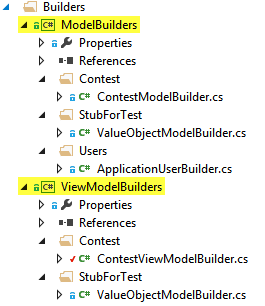

In this solution, I decided to create two projects. One for the Model and one for the ViewModel. I divide the project per entities. To keep it simple, I create static method that return for different scenario. Here are some signatures that I currently have for the Contest entity.


```csharp
 public static Model.Entities.Contest.Contest GetAStockContest() public static Model.Entities.Contest.Contest GetAStockShortOptionContest() public static Model.Entities.Contest.Contest GetANewContest() public static Model.Entities.Contest.Contest GetDefaultNewContest() public static ContestWithOption GetAnOptionRules() public static ContestWithShort GetAShortRules() public static ContestTransactionRules GetACorrectTransactionRules() public static ContestRegistrationRules GetACorrectRegistrationRules() public static ContestWithStock GetACorrectStockRules() 
```

As you can notice, the first 4 methods return a contest while the rest of the method does not. In fact, the four first methods use these other methods to get property filled up. For example, all these contests has transaction rule so they can use this builder. In a case that you do not want transaction, you can set to NULL the property or create a new GetContestWithoutTransaction() method.

It is up to you. What is it important is that you do not repeat yourself in all your tests. What is new in this sprint is that I used the builder into the service layer to return a new contest with default values. This way, the builder can be unit tested to be sure what are the expected default value returned but also to do tests.

This is the code in the service code.


```csharp
 public Contest New() { var newContest = ModelBuilders.Contest.ContestModelBuilder.GetDefaultNewContest(); return newContest; } 
``` 

This change required to modify the architecture layer to allow the service layer to access the Model Builder project. This is all fine with me since it already have access to the model layer that the builder uses.

# SPRINT 2 : IMPROVING DATA ANNOTATION, UNIT TESTING AND VIEW MODEL March 31, 2014 By: pdesjardins

This week I have improved a lot of different thing that was all related to the Contest entity. This is one of the last sprint we have for the creation and edition of the contest. It was the first entity that we had to create everything from the view to the database. This is always a lot more time consuming for the first entity. Not only we have to work on the UI and setup everything for the future to have a consistent layout but we also have to do this for unit testing, model, view model and Entity Framework.

Data Annotation Improvement One thing that was problematic was the validation that specify that a Contest starting date must be after the current date. This is always the case for new contest. However, if we edit a contest few time later, the starting date should not change and will be after the current date. The initial validation of the starting date was done by a custom Data Validation attribute.


```csharp
 [DateAfterOrCurrentDate] public DateTime StartingTime { get; set; } 
``` 

To modify this we need to know if we are editing or not for the first time the entity. The ContestRegistrationRules, that has the StartingTime property to validate, does not have any ID or date because it is saved inside the Contest table. It is divided only in the code. We had something for any model class to know if they are new because they inherit from IModel that has a IsNew method. However, this was problematic to implement for ContestRegistrationRules because this one inherit from IEntity that has a ID property that we do not want for the ContestRegistrationRules.

This is where we had to modify the classes. First of all, it was a mistake to think that IModel that has the IsNew method must inherit from IEntity. It does not mean that every time we want to check the IsNew from the ID.

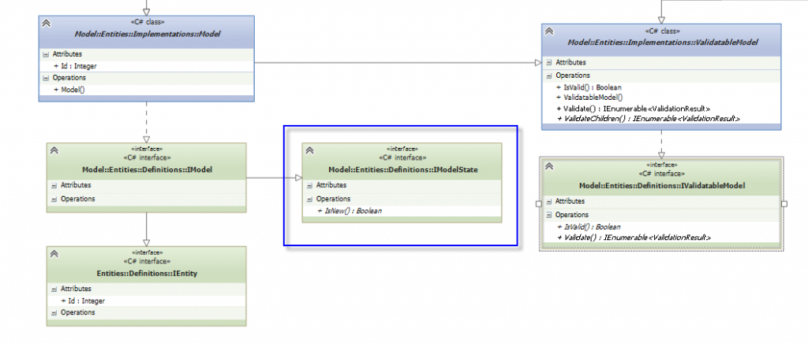

The modification add a new Interface and mode the IsNew from IModel into IModelState. This way, it is possible for a class, like the ContestRegistrationRules to inherit from IModelState without inheriting from IEntity or IModel. From there, we can pass the information from the Contest into the ContestRegistrationRules or during unit testing simply mock this value. Here is the code of the Contest now.


```csharp
 public class Contest : Implementations.Model, IValidatableObject { private ContestRegistrationRules registrationRules; public Contest() { RegistrationRules = new ContestRegistrationRules(this); //... } //... [Required] public ContestRegistrationRules RegistrationRules { get { return registrationRules; } set { registrationRules = value; registrationRules.ContestState = this; } } } 
``` 

The property is internal, which limit the case that you can set the state from the external. The constructor of the Contest allow Entity Framework to instantiate this one and send the information to the children without a problem.

For the unit test, it is now possible to test for new and existing ContestRegistrationRules the same rule. Here is the two tests that validate the same rule.


```csharp
 [TestMethod] public void GivenANewContestWithRegistration_WhenContestRegistrationStartingTimeIsBeforeNow_ThenReturnValidationResult() { // Arrange var contest = new ContestRegistrationRules { StartingTime = new DateTime(2021, 01, 01) ,EndingTime = new DateTime(2023, 01, 01) ,RegistrationStartingTime = new DateTime(1950, 01, 01) ,RegistrationEndingTime = new DateTime(2021, 01, 01) ,MaximumReputationForRegistration = 0 }; // Act var validationResults = contest.Validate(); var validationResult = validationResults.SelectMany(d => d.MemberNames); // Assert Assert.AreEqual(1, validationResults.Count()); Assert.IsTrue(validationResult.Contains(LambdaHelper.GetPropertyName(d => d.RegistrationStartingTime))); } [TestMethod] public void GivenAnExistingContestWithRegistration_WhenContestRegistrationStartingTimeIsBeforeNow_ThenReturnNoValidationResult() { // Arrange var state = new Mock(); state.Setup(d => d.IsNew()).Returns(false); var contest = new ContestRegistrationRules(state.Object) { StartingTime = new DateTime(2021, 01, 01) ,EndingTime = new DateTime(2023, 01, 01) ,RegistrationStartingTime = new DateTime(1950, 01, 01) ,RegistrationEndingTime = new DateTime(2021, 01, 01) ,MaximumReputationForRegistration = 0 }; // Act var validationResults = contest.Validate(); // Assert Assert.AreEqual(0, validationResults.Count()); } 
``` 

As you can see, not a lot change. In fact, just the constructor that take if it is a new or not.

Of course, the attribute has changed too. Now, it verifies the state before doing any validation.


```csharp
 /// /// Validate the the date with the attribute is after the current date or the current date /// [AttributeUsage(AttributeTargets.Property, AllowMultiple = true)] public class DateAfterOrCurrentDate : BaseDataAnnotation { protected override ValidationResult IsValid(object value, ValidationContext validationContext) { var model = validationContext.ObjectInstance as IModelState; if (model == null || !model.IsNew()) { return ValidationResult.Success; } if (value != null) { DateTime valueConverted; if (DateTime.TryParse(value.ToString(), out valueConverted)) { if (IsAfterCurrent(valueConverted)) { return ValidationResult.Success; } } } return base.ReturnDefaultErrorMessage(string.Format(Resources.DataAnnotationErrorMessage.DateAfterOrCurrentDate, validationContext.DisplayName) , new[] { validationContext.MemberName }); } /// /// This method is virtual for the purpose of unit testing. It it possible to override to mock a true or false without /// having to play with date /// /// /// protected virtual bool IsAfterCurrent(DateTime dateTime) { return dateTime.Date >= DateTime.UtcNow.Date; } /// /// To have multiple attributes of the same type to be validated /// private readonly object typeId = new object(); public override object TypeId { get { return this.typeId; } } } 
``` 

The new code is at the top where it check if the class that has the property to validate has the interface. If not, we validate. If it does have it, we verify if it is a new instance. In that case, we do all validation. In the case of being not a new instance, we skip the validation. This way, when editing something that was valid during the creation like the time that the contest start will not fail if you edit something like the name of the contest few months later.

Controller that help common Value Object Something else changed concerning the Controller and how it can help to fill up information for view model. We are using view model for many reasons and one of the reason is to be able to give list of choice. For example, I want to give a list of possible stock exchange market and allow the use to create a contest with a set of market that can be used. The model has the markets for the contest but does not hold all possibles market. The list of possible market are only required for choosing in the interface. This is why it is the role of the controller to provide the list to the view. This is done by filling the view model. This is the case for creating but also when editing a Contest.

This is the case for a lot of value object. This is why instead of inheriting of ModelViewModelMappingController I create a new controller that has some methods that can be used to set lists.


```csharp
 public class ModelViewModelMappingWithValueObjectsController<TModel, TViewModel> : ModelViewModelMappingController<TModel,TViewModel> where TModel : IValidatableModel { public ModelViewModelMappingWithValueObjectsController(IMapperFacade mapperFacade, IRunningContext runningContext) : base(mapperFacade, runningContext) { } protected void FillUpMarkets(List availableItems) { availableItems.Add(new SelectorItem(Mapper.Map<MarketType, MarketTypeViewModel>(MarketType.UsMarketType))); availableItems.Add(new SelectorItem(Mapper.Map<MarketType, MarketTypeViewModel>(MarketType.Toronto))); availableItems.Add(new SelectorItem(Mapper.Map<MarketType, MarketTypeViewModel>(MarketType.Vancouver))); availableItems.Add(new SelectorItem(Mapper.Map<MarketType, MarketTypeViewModel>(MarketType.OTCBB))); availableItems.Add(new SelectorItem(Mapper.Map<MarketType, MarketTypeViewModel>(MarketType.PinkSheet))); } protected void FillUpOrderTypes(List availableItems) { availableItems.Add(new SelectorItem(Mapper.Map<OrderType, OrderTypeViewModel>(OrderType.LimitOrderOnly))); availableItems.Add(new SelectorItem(Mapper.Map<OrderType, OrderTypeViewModel>(OrderType.MarketLimitOrderOnly))); availableItems.Add(new SelectorItem(Mapper.Map<OrderType, OrderTypeViewModel>(OrderType.MarketOrderOnly))); } protected void FillUpCurrencies(List availableItems) { availableItems.Add(new SelectorItem(Mapper.Map<CurrencyType, CurrencyTypeViewModel>(CurrencyType.Canada))); availableItems.Add(new SelectorItem(Mapper.Map<CurrencyType, CurrencyTypeViewModel>(CurrencyType.UnitedStatesOfAmerica))); } } 
``` 

It is now a lot cleaner in controller. Here is the Create and Edit action method of the Contest controller.


```csharp
 [HttpGet] public ActionResult Create() { var defaultContest = this.contestService.New(); var defaultContestViewModel = this.MapperFacade.GetViewModel<Contest, ContestEditableViewModel>(defaultContest); this.FillUpWithAllList(defaultContestViewModel); return View(defaultContestViewModel); } [HttpGet] public ActionResult Edit(int id) { var contestToEdit = this.contestService.GetContestById(id); var viewModel = this.MapperFacade.GetViewModel<Contest,ContestEditableViewModel>(contestToEdit); FillUpWithAllList(viewModel); return View(viewModel); } 
``` 

View Model and Titles Another issue I had was that I do not want the view, neither to use ViewBag to specify the title of the view. I also wanted to have page title and sub title that may be different from the title set to the browser. This is why it is now possible to inherit from a viewmodel named WebPageViewModel. It has three properties that is used by the layout and others views.


```csharp
 /// <summary> /// Contains information that is passed from the controller to the view that should be only uni-directionnal. The purpose of this class /// is to have common information that is required for most pages to be displayed into views or main layout. /// </summary> public class WebPageViewModel:ViewModel { /// <summary> /// This is the title that is displayed in the browser title /// </summary> public string PageTitle { get; set; } /// <summary> /// This is the main h1 of the page /// </summary> public string PageHeader { get; set; } /// <summary> /// This is the specification for the title. It is not required. /// </summary> public string PageSubHeader { get; set; } } 
``` 

In the layout, and header partial class, it is now possible to use this information.

First of all, I have in the Contest view:


```html  
@{ Html.Custom().SetHeader(Model); } 
```  

This allow to have for any view model passed into a view to set the information into a generic way : view bag. This could be improved later on. It has also the disadvantage to have to call this html extension for all your view. The problem is that the layout.cshtml cannot use the view model of the content.

The partial class for the header verify if the header is set and if the sub header is set. Depending of the value, it is displayed or not. 
```html  
<header> <div class="container">  @{ Html.RenderPartial("_Menu"); } @{ var headerTitle = ViewBag.HeaderTitle; var headerSubTitle = ViewBag.HeaderSubTitle; if (!string.IsNullOrWhiteSpace(headerTitle)) { <div id="header-title"> <h1> @headerTitle @if (!string.IsNullOrWhiteSpace(headerSubTitle)) { <small>@headerSubTitle</small> } </h1> </div> <hr/> } } </div> </header> 
```  

Conclusion This sprint is about to conclude. Some work is still required to make the edition work but it is only small detail since all Unit Test has been done. Even code for Entity Framework has been unit tested.

# SPRINT 3 : IMPROVE THE TESTABILITY OF YOUR REPOSITORIES April 7, 2014 By: pdesjardins

This first week of the sprint 3 aimed the contests entity. More precisely how to get from the database active contests and inactive one. This required to modify a little bit the Model Builder, the RunningContext, and TestBase.

Why all these modifications in the sprint 3? Mostly because to test the repository with the contest that we need to have more than only one contest in the database and depending of the test we want to have different contests. For example, we may want to have contest with a starting and ending date before the testing date. I have say “testing time” and not “current time”. This is important and this is why in this sprint the Model Builder has changed. Now, the builder have access to the running contest. This is why Model Builder is not anymore static and it takes in its constructor the IRunningContext.

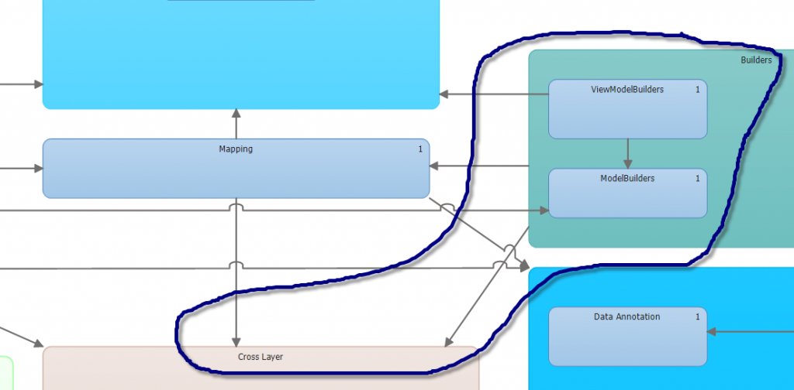

The ContestBuilder looks like this:


```csharp
 public class ContestModelBuilder { private IRunningContext runningContext; public IRunningContext RunningContext { get { return runningContext; } set { if (value == null) { throw new NullReferenceException("Running Contest must be set before using this method"); } runningContext = value; } } public ContestModelBuilder(IRunningContext runningContest) { this.RunningContext = runningContest; } //... } 
``` 

This would be te case for all builders. In fact, it will end that all ModelBuilder will inherit from ModelBuilder that will have the IRunningContext instead of having the IRunningContext in each builder.

The other modification to be able to test easily was to create automatic rollback to every unit test for the repository. This can be done by creating a TestWithDatabase class. This class allows to have unit of works, repositories, running context and builders.


```csharp
 public class TestWithDatabase { public const string CONNECTION_STRING_NAME = "DefaultConnection"; //It uses the same name of the web.config but from the app.config of the IntegrationTest protected IUnitOfWork unitOfWorkForInsertion; protected IUnitOfWork unitOfWorkForUpdate; protected IUnitOfWork unitOfWorkForReading; private IMainDbContext dbInsertDbContext; private IMainDbContext dbUpdateDbContext; private IMainDbContext dbReadingDbContext; protected Mock<IRunningContext> runningContext; private TransactionScope transaction; protected ContestModelBuilder contestModelBuilder; [TestInitialize] public void InitializeBetweenTest() { this.transaction = new TransactionScope(); runningContext = new Mock<IRunningContext>(); runningContext.Setup(d => d.GetCurrentTime()).Returns(new DateTime(2014, 03, 02)); runningContext.Setup(d => d.GetUserId()).Returns(ApplicationUser.SYSTEM_TEST_USER_ID); contestModelBuilder = new ContestModelBuilder(runningContext.Object); dbReadingDbContext = new MainDbContext(runningContext.Object, CONNECTION_STRING_NAME); dbInsertDbContext = new MainDbContext(runningContext.Object, CONNECTION_STRING_NAME); dbUpdateDbContext = new MainDbContext(runningContext.Object, CONNECTION_STRING_NAME); unitOfWorkForReading = new UnitOfWork(dbReadingDbContext); unitOfWorkForInsertion = new UnitOfWork(dbInsertDbContext); unitOfWorkForUpdate = new UnitOfWork(dbUpdateDbContext); } [TestCleanup] public void CleanUpBetweenTest() { this.transaction.Dispose(); } } 
``` 

The trick about rollbacking is to be in a transaction from the start of the unit test and to not complete at the end. In the code above, we have set a TestInitialize and TestCleanup to start and stop the transaction scope. This way, we are sure that everything tested is never persisted in the database.

Having this setup, it is now possible to modify some of the existing test to remove the transaction scope and let the base class to execute the one we just set.


```csharp
 [TestMethod] public void GivenANewContest_WhenContestIsLegitToSave_ThenTheDatabaseHasANewContest() { // Arrange var repositoryExecuting = new ContestRepository(unitOfWorkForInsertion, base.runningContext.Object); var repositoryReading = new ContestRepository(unitOfWorkForReading, base.runningContext.Object); var contest = contestModelBuilder.GetAStockContest(); int idSaved=-1; // Act try { repositoryExecuting.Save(contest); unitOfWorkForInsertion.Commit(); idSaved = contest.Id; } catch (Exception e) { Assert.Fail(e.Message); } var contestFromRepository = repositoryReading.GetById(idSaved); var countContest = repositoryReading.GetCount(); // Assert Assert.IsNotNull(contestFromRepository); Assert.AreEqual(1, countContest); } 
``` 

This unit test will not store anything in the database and do the job automatically to remove everything. It is not possible for a developer to store anything in the database which is a huge advantage to keep the testing database clean.

The next modification is that we need to have some contests in the database for some of our tests. The problem is that we need to save contest that might not be valid to save. For example, one of the business logic is that we cannot insert a new contest that has a starting and ending date before the current date. This is required to have contest with a starting and ending date before the current date because this is considerate an inactive contest. We want to test method that return only the active contest but to do the test, we want to insert inactive too. This is why we have changed the 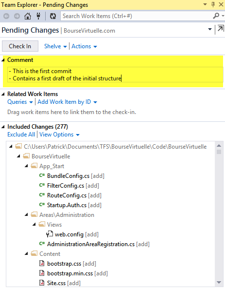


```csharp
 public void Commit(bool isValidatingBeforeSave=true) { if (isValidatingBeforeSave) { context.SaveChanges(); } else { context.SaveChangesWithoutValidation(); } } 
``` 

The contest has two save methods. One is SaveChanges that we had previously and the new SaveChangesWithoutValidation. Here is a part of the MainDbContext:


```csharp
 public int SaveChangesWithoutValidation() { var result = -1; this.Configuration.ValidateOnSaveEnabled = false; try { result = this.SaveChanges(); } catch { throw; } finally { this.Configuration.ValidateOnSaveEnabled = true; } return result; } int IMainDbContext.SaveChanges() { return this.SaveChanges(); } public override int SaveChanges() { IEnumerable<DbEntityValidationResult> errors = new List<DbEntityValidationResult>(); if (this.Configuration.ValidateOnSaveEnabled) { errors = this.GetValidationErrors(); } if (!errors.Any()) { try { //base.ChangeTracker.DetectChanges(); return base.SaveChanges(); } catch (OptimisticConcurrencyException concurrencyException) { throw new DatabaseConcurrencyException("Someone else has edited the entity in the same time of you. Please refresh and save again.", concurrencyException); } catch (DBConcurrencyException concurrencyException) { throw new DatabaseConcurrencyException("Someone else has edited the entity in the same time of you. Please refresh and save again.", concurrencyException); } catch (DbUpdateConcurrencyException e) { throw new DatabaseConcurrencyException("Someone else has edited the entity in the same time of you. Please refresh and save again.", e); } catch (Exception) { throw; } } else { throw new DatabaseValidationErrors(errors); } } 
``` 

As you can see, the SaveChangesWithoutValidation call the same SaveChanges but set the Entity Framework Configuration value to indicate if we must validate or not during the save. The trick is to set the code to rollback the property ValidateOnSaveEnabled to true in the finally. This way, even if something wrong appears that the system will validate for the next save.

The last modification require was to be able to create contest easily into the database. This is why some helper method has been created in the ContestRepositoryIntegrationTest.cs. This way, we can have a test like the following one:


```csharp
 [TestMethod] public void GivenARequestForActiveContest_WhenDatabaseAsActiveAndInactiveContest_ThenReturnListOfOnlyActiveContests() { // Arrange const int ACTIVE_CONTEST = 5; const int INACTIVE_CONTEST = 10; InsertActiveContestInDatabase(ACTIVE_CONTEST); InsertInactiveContestInDatabase(INACTIVE_CONTEST); unitOfWorkForInsertion.Commit(false);//Because we have stuff under the correct date // Act var readRepository = new ContestRepository(unitOfWorkForReading, base.runningContext.Object); var contests = readRepository.GetAllActiveContests(); // Assert Assert.AreEqual(ACTIVE_CONTEST,contests.Count()); } 
``` 

ou can see that we are using two helpers. One that Insert active contest and one that insert inactive contest. In both case, they are using the ModelBuilder and the insert repository.


```csharp
 #region Database Helpers private void InsertInactiveContestInDatabase(int amountOfContestToInsert) { var contestsToInsert = contestModelBuilder.GetBatchInActiveContest(amountOfContestToInsert); var insertRepository = new ContestRepository(unitOfWorkForInsertion, base.runningContext.Object); foreach (var contest in contestsToInsert) { insertRepository.Save(contest); } } private void InsertActiveContestInDatabase(int amountOfContestToInsert) { var contestsToInsert = contestModelBuilder.GetBatchActiveContest(amountOfContestToInsert); var insertRepository = new ContestRepository(unitOfWorkForInsertion, base.runningContext.Object); foreach (var contest in contestsToInsert) { insertRepository.Save(contest); } } #endregion 
``` 

The code create contests in batch and save them all. They are built to be unique. Here is the model builder for the GetBatchInActiveContest method. 
```csharp
 public IEnumerable<Model.Entities.Contest.Contest> GetBatchInActiveContest(int amountOfContestToInsert) { for (int i = 0; i < amountOfContestToInsert; i++) { var contest = GetDefaultNewContest(); contest.Name.English = "Inactive Contest #" + (i + 1); contest.Name.French = "Concours inactif #" + (i + 1); contest.RegistrationRules.StartingTime = RunningContext.GetCurrentTime().AddMonths(-amountOfContestToInsert * (i + 1) - 1); contest.RegistrationRules.EndingTime = RunningContext.GetCurrentTime().AddMonths(-amountOfContestToInsert); yield return contest; } } 
``` 

As you can see, this create a batch of contest with different name and different starting time and ending time. Since we are creating active contest than we are creating everything before the current time. As you can notice, we are using the RunningContext date time and not the current time. This is simpler because we control the time of the context. It is also using other builder method like the GetDefaultNewContest() method. This way we are reusing existing builder and only change method that we want to have for the test. In this example, the time.

Another modification has been in the contest repository. To get all active contest, two methods has been created.


```csharp
 public IEnumerable<Contest> GetAllActiveContests() { return GetAllActiveContestsQueryable() .ToArray(); } private IQueryable<Contest> GetAllActiveContestsQueryable() { var dateToBeBefore = base.RunningContext.GetCurrentTime(); return this.GetModelSet() .Where(d => d.RegistrationRules.EndingTime >= dateToBeBefore); } 
``` 

The public method is available through the interface. It call the private IQueryable method that is used here to get all active contest but also in a second method to get all active contest for a specific user.


```csharp
 public IEnumerable<Contest> GetAllActiveUnSubscribedContests(Guid userId) { var allActiveContest = GetAllActiveContestsQueryable(); var allActiveContestForUser = GetAllActiveContestForUserQueryable(userId); var difference = allActiveContest.Where(d => !allActiveContestForUser.Contains(d)); return difference; } 
``` 

Since we are using in the private method IQueryable we are building the query when we are adding statement in public methods. Something important to notice is that we are not using directly the RunningContext.getCurrentTime() method in where clause because Entity Framework does not understand this method. It only understand primitive comparison like comparing a date.

# SPRINT 3 : IMPROVING THE ERROR MANIPULATION WITH AUTOMAPPER April 14, 2014 By: pdesjardins

This week, we are still in Sprint 3 and few things has been done in the administration page. The page shows all contests. It is the first time we have a page with a grid. It has paging, sorting and multiples others features like filtering. I were using the WebMatrix Html Helper for grid but got some issues like that JQuery must be imported in the header. This is a big no for me. The reason is that it injects JavaScript into the page that execute some JavaScript that is executed without having the whole document ready. This kind of behavior is not fine. JavaScript should not be injected in the document and should not be executed until the whole page is loaded.

This reduced issue with the grid reduced the whole last week development and not yet done. However, some code has been improved in parallel with Auto Mapper. This project must take the error on the model to the ModelState with the name of the view model.

Previously, I posted some code but this code was not working correctly in the some scenarios.

```csharp
 namespace MappingUnitTest.Extensions { [TestClass] public class AutoMapperExtensionsGetMapperPropertyNameMultipleLevelTest { [TestInitialize] public void TestInitialize() { Mapper.Reset(); Mapper.CreateMap<Source, Target>() .ForMember(m => m.TargetSourceSubClassFrancais, a => a.MapFrom(s => s.SourceSubClass.SubDescription.Francais)) .ForMember(m => m.TargetSourceSubClassAnglais, a => a.MapFrom(s => s.SourceSubClass.SubDescription.Anglais)); Mapper.CreateMap<Source, TargetWithSub>() .ForMember(d => d.Title, a => a.MapFrom(f => f.Title)) .ForMember(d => d.Description, a => a.MapFrom(f => f.Description)); Mapper.CreateMap<LocalizedString, LocalizedStringViewModel>() .ForMember(d=>d.AnglaisVM, o=>o.MapFrom(d=>d.Anglais)) .ForMember(d=>d.FrancaisVM, o=>o.MapFrom(d=>d.Francais)) ; Mapper.AssertConfigurationIsValid(); } [TestMethod] public void GivenAnObjectWithPropertyForMultipleLevel_WhenGettingPropertyName_ThenCorrespondingPropertyNameIsGiven() { //Assert Assert.AreEqual("DescriptionFrancais", Mapper.Engine.ConfigurationProvider.GetMappedPropertyName<Source, Target>("Description.Francais")); Assert.AreEqual("DescriptionAnglais", Mapper.Engine.ConfigurationProvider.GetMappedPropertyName<Source, Target>("Description.Anglais")); Assert.AreEqual("TitleFrancais", Mapper.Engine.ConfigurationProvider.GetMappedPropertyName<Source, Target>("Title.Francais")); Assert.AreEqual("TitleAnglais", Mapper.Engine.ConfigurationProvider.GetMappedPropertyName<Source, Target>("Title.Anglais")); Assert.AreEqual("TargetSourceSubClassFrancais", Mapper.Engine.ConfigurationProvider.GetMappedPropertyName<Source, Target>("SourceSubClass.SubDescription.Francais")); Assert.AreEqual("TargetSourceSubClassAnglais", Mapper.Engine.ConfigurationProvider.GetMappedPropertyName<Source, Target>("SourceSubClass.SubDescription.Anglais")); Assert.AreEqual("Description.FrancaisVM", Mapper.Engine.ConfigurationProvider.GetMappedPropertyName<Source, TargetWithSub>("Description.Francais")); //CRASH HERE } internal class Source { public LocalizedString Description { get; set; } public LocalizedString Title { get; set; } public SourceSubClass SourceSubClass { get; set; } } internal class SourceSubClass { public LocalizedString SubDescription { get; set; } } internal class LocalizedString { public string Francais { get; set; } public string Anglais { get; set; } } internal class Target { public string DescriptionFrancais { get; set; } public string DescriptionAnglais { get; set; } public string TitleFrancais { get; set; } public string TitleAnglais { get; set; } public string TargetSourceSubClassFrancais { get; set; } public string TargetSourceSubClassAnglais { get; set; } } internal class LocalizedStringViewModel { public string FrancaisVM { get; set; } public string AnglaisVM { get; set; } } internal class TargetWithSub { public LocalizedStringViewModel Description { get; set; } public LocalizedStringViewModel Title { get; set; } } } } 
``` 

I noted by the comment “Cash HERE” where the code was not working previously. The problem is that it has a cascade of mapping configured by AutoMapper. This one was not working correctly because we were not looping through all possible sub properties type mapping but only from the first class to be mapped.

The correction is here:


```csharp
 public static string GetMappedPropertyName<TSource, TDestination>(this IConfigurationProvider mapper, string sourcePropertyName) { if(sourcePropertyName == null) throw new ArgumentNullException("sourcePropertyName"); return GetMappedPropertyName(mapper, typeof (TSource), typeof (TDestination), new List<string>{sourcePropertyName}); } private static string GetMappedPropertyName(IConfigurationProvider mapper, Type sourceType, Type destinationType, List<string> sourcePropertyNames) { //Analyse the first property name of the list. The list can have only one property if this one is at the end of a complex mapping or if it is a direct property var sourcePropertyName = sourcePropertyNames.First(); //Get all mappings that has the source and destination of the desired type. var typeMap = mapper.GetAllTypeMaps().FirstOrDefault(tm => tm.SourceType == sourceType && tm.DestinationType == destinationType); if (typeMap == null) return null; //Loop through all mappings for the source-destination members to find the destination value. var propertyMaps = typeMap.GetPropertyMaps().Where(pm => !pm.IsIgnored() && pm.SourceMember != null); foreach (var propertyMap in propertyMaps) { var sourceValueResolverPath = string.Empty; if (propertyMap.CustomExpression != null)//If it is a custom expression, then get directly the property text. { sourceValueResolverPath = LambdaHelper.GetPropertyText(propertyMap.CustomExpression); } else { var valueResolvers = propertyMap.GetSourceValueResolvers(); sourceValueResolverPath = valueResolvers.OfType<IMemberGetter>() .Aggregate(sourceValueResolverPath, (current, memberGetter) => current + (memberGetter.Name + PROPERTY_DELIMITER)) .RemoveLastChar(); } //Check if we have a source that match the source property if (sourceValueResolverPath == sourcePropertyName) { //If we have move than one property in the source, then we must loop and analyze sub property if (sourcePropertyNames.Count > 1) { sourcePropertyNames.RemoveAt(0); //Recursive call without the first element because we will concatenate the destination result of the first since we have a source match return string.Concat(propertyMap.DestinationProperty.Name, PROPERTY_DELIMITER, GetMappedPropertyName(mapper, ((PropertyInfo)(propertyMap.SourceMember)).PropertyType, propertyMap.DestinationProperty.MemberType, sourcePropertyNames)); } //They are no properties and the source matched the resolving path. We return the destination return propertyMap.DestinationProperty.Name; } } //If we are this far it is because we have not found the source property. But, we can split the name by dot and check for individual property mapping var splitProperties = sourcePropertyName.Split(PROPERTY_DELIMITER); if (splitProperties.Length > 1) { return GetMappedPropertyName(mapper, sourceType, destinationType, splitProperties.ToList()); } return null; } 
``` 

As you can see, if nothing is found, we split the string by the delimiter (dot) and we call again the property method. It uses recursive call to work on the property.

# SPRINT 3: SETUP USER ROLE April 28, 2014 By: pdesjardins

The last week of sprint 3 was consecrated to user role. The application has a default role that is named “normal user”. This is the default role. Even if everybody are in this role, we have this one defined. The reason is that I want to be able to differ a user that is registered to play contest from those who are not. For example, we will be able to assign to some controller’s action the role of normal user. It gives us some latitude about this role too. We may want to assign the role only when the user has validated its account. This would be interesting to limit the access without blocking the whole website to someone that has not activate its account.

We are still using the Microsoft Identity Framework for authentification and for roles. This mean that our roles are located in AspNetRoles. The association between users and roles are inside the table AspNetUserRoles.

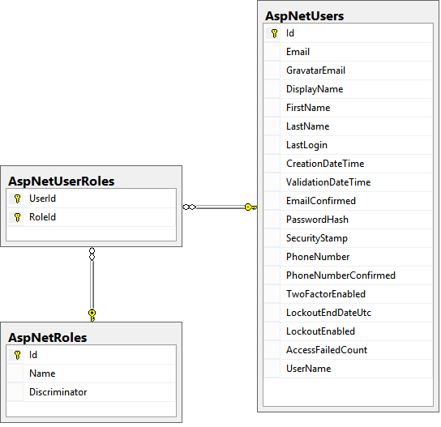

As you can see, the association table AspNetRoleUserTables contains both primary key to link AspNetUsers and AspNetRoles. This give us the possibility to have multiples roles for a single user.

Inside the code, I have created a model class that has all roles hardcoded. The reason is that I want to use these constant inside security attribute.


```csharp
 namespace Model.Entities.Users { public class ApplicatioRole : IdentityRole { public const string ADMINISTRATOR = "Administrator"; public const string MODERATOR = "Moderator"; public const string NORMAL_USER = "NormalUser"; public const string ADMINISTRATOR_MODERATOR = ADMINISTRATOR + "," + MODERATOR; } } 
``` 

I have also concatenate two constants that will be used in several screens. This is the case for screen shared by administrator and moderator. Since a user can have multiple roles, I do not do combination of normal user and administrator because an administrator should be a normal user and a normal user too.

Another steps during this week was to allow Entity Framework migration tool to seeds. Five account is required for some tests. One as a “system” user that will be used for system task. One for “test” for unit test. And three others user for the three possibles roles.


```csharp
 internal sealed class Configuration : DbMigrationsConfiguration<MainDbContext> { private readonly IRunningContext runningContext; const string EMAIL_ADMIN = "123@123.com"; const string EMAIL_NORMAL_USER = "qwe@qwe.com"; const string EMAIL_MOD = "asd@asd.com"; const string EMAIL_SYSTEM = "system@system.com"; const string EMAIL_TEST = "test@test.com"; //... 
``` 

This is why in the DataAccessMigration Configuration class, we setup five constants with for theses account. This allow us later to search these user by email.

The seeding method has four sub methods.


```csharp
 protected override void Seed(MainDbContext context) { SeedValuesObjects(context); SeedValuesForSystemUsers(context); SeedValuesForRole(context); SeedDemoValues(context); } 
``` 

The first one seed value for Value Object. The second one is for system user. These are the one that should be constant because they are used by the system. The last two methods are for roles and a seed to fill up the system with values. This is interesting to be able to test the system directly by the website without having to fill up manually data every time.

Roles are added into the system by using RoleManager.


```csharp
 private void SeedValuesForRole(MainDbContext context) { var roleManager = new RoleManager<IdentityRole>(new RoleStore<IdentityRole>(context)); var roleAdmin = new IdentityRole(ApplicatioRole.ADMINISTRATOR); var roleUser = new IdentityRole(ApplicatioRole.NORMAL_USER); var roleModerator = new IdentityRole(ApplicatioRole.MODERATOR); roleManager.Create(roleAdmin); roleManager.Create(roleUser); roleManager.Create(roleModerator); context.SaveChanges(); } 
``` On the other side, demo values are divided in three sub methods that all uses directly Entity Framework to insert Contests, User and User Role.


```csharp
 private void SeedDemoValues(MainDbContext context) { SeedDemoContests(context); SeedDemoUser(context); SeedDemoUsersRoles(context); } 
``` 

Demo value for user are using Entity Framework:


```csharp
 private void SeedDemoUser(MainDbContext context) { var userValueGenerator = new UserValuesGenerator(); var adminUser = new ApplicationUser { Id = Guid.NewGuid().ToString() , FirstName = "Patrick" , LastName = "Desjardins" , DisplayName = "pdesjardins" , Email = EMAIL_ADMIN , CreationDateTime = runningContext.GetCurrentTime() , UserName = userValueGenerator.GenerateUserName(EMAIL_ADMIN), PasswordHash = ApplicationUser.HashPassword("123123") , ValidationDateTime = runningContext.GetCurrentTime() }; var modUser = new ApplicationUser { Id = Guid.NewGuid().ToString() ,FirstName = "Jim" ,LastName = "Doe" ,DisplayName = "jdoe" ,Email = EMAIL_MOD ,CreationDateTime = runningContext.GetCurrentTime() ,UserName = userValueGenerator.GenerateUserName(EMAIL_MOD) ,PasswordHash = ApplicationUser.HashPassword("asdasd") ,ValidationDateTime = runningContext.GetCurrentTime() }; var normalUser = new ApplicationUser { Id = Guid.NewGuid().ToString() , FirstName = "Melodie" , LastName = "Savaria" , DisplayName = "msavaria" , Email = EMAIL_NORMAL_USER , CreationDateTime = runningContext.GetCurrentTime() , UserName = userValueGenerator.GenerateUserName(EMAIL_NORMAL_USER), PasswordHash = ApplicationUser.HashPassword("qweqwe") , ValidationDateTime = runningContext.GetCurrentTime() }; context.Set<ApplicationUser>().AddOrUpdate(adminUser); context.Set<ApplicationUser>().AddOrUpdate(normalUser); context.Set<ApplicationUser>().AddOrUpdate(modUser); context.SaveChanges(); } 
``` 

Finally, for roles, we need to associate them users. To have the good ID, we need to get from the email the entity and assign it to a new IdentityUserRole.


```csharp
 private void SeedDemoUsersRoles(MainDbContext context) { var administratorRole = context.GetDbContext().Set<IdentityRole>().Single(d => d.Name == ApplicatioRole.ADMINISTRATOR); var normalRole = context.GetDbContext().Set<IdentityRole>().Single(d => d.Name == ApplicatioRole.NORMAL_USER); var moderatorRole = context.GetDbContext().Set<IdentityRole>().Single(d => d.Name == ApplicatioRole.MODERATOR); var administratorUser = context.GetDbContext().Set<ApplicationUser>().Single(d => d.Email == EMAIL_ADMIN); var normalUser = context.GetDbContext().Set<ApplicationUser>().Single(d => d.Email == EMAIL_NORMAL_USER); var modUser = context.GetDbContext().Set<ApplicationUser>().Single(d => d.Email == EMAIL_MOD); var userRole1 = new IdentityUserRole { UserId = administratorUser.Id, RoleId = administratorRole.Id }; var userRole11 = new IdentityUserRole { UserId = normalUser.Id, RoleId = administratorRole.Id }; var userRole2 = new IdentityUserRole { UserId = normalUser.Id, RoleId = moderatorRole.Id }; var userRole3 = new IdentityUserRole { UserId = modUser.Id, RoleId = normalRole.Id }; context.Set<IdentityUserRole>().AddOrUpdate(userRole1); context.Set<IdentityUserRole>().AddOrUpdate(userRole11); context.Set<IdentityUserRole>().AddOrUpdate(userRole2); context.Set<IdentityUserRole>().AddOrUpdate(userRole3); context.SaveChanges(); } 
``` 

The database is now having everything related.

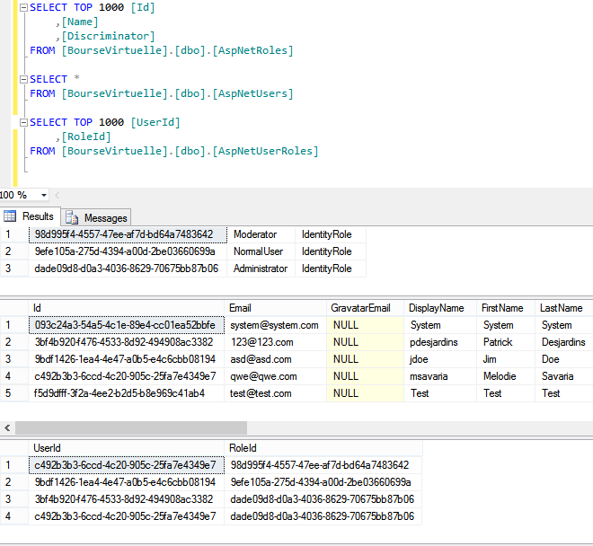

Contests are also inserted by Entity Framework but use the ModelBuilder to get a batch of contest.


```csharp
 private void SeedDemoContests(MainDbContext context) { var unitOfWork = new UnitOfWork(new MainDbContext(this.runningContext)); var contestRepository = new ContestRepository(unitOfWork, this.runningContext); var contestModelBuilder = new ModelBuilders.Contest.ContestModelBuilder(this.runningContext); var contests = contestModelBuilder.GetBatchActiveContest(20); contestRepository.DeleteAll<Contest>(Constants.SchemaNames.Contest); foreach (var contest in contests) { contestRepository.Save(contest); } unitOfWork.Commit(); } 
``` 

This is interesting because we are using this builder for some unit tests too. We reuse code!

# SPRINT 3 : GETTING VIEW THAT CHANGE DEPENDING OF USER ROLE May 5, 2014 By: pdesjardins

The menu of the website display moderation links and administration links only to user with these respective roles. Validation on the server is also done but this article aims particularly how to handle role for specific portion of the view.

First of all, you could use like most tutorial and use the User.IsInRole(“YourRoleHere”). The problem is that your role will be defined in the model. In the application we are building, roles are in ApplicationRole.


```csharp
 public class ApplicationRole : IdentityRole { public const string ADMINISTRATOR = "Administrator"; public const string MODERATOR = "Moderator"; public const string NORMAL_USER = "NormalUser"; public const string ADMINISTRATOR_MODERATOR = ADMINISTRATOR + "," + MODERATOR; } 
``` 

This is used later in every actions.


```csharp
 [HttpGet] [Authorize(Roles = ApplicationRole.ADMINISTRATOR_MODERATOR)] public ActionResult Edit(int id) { //... } 
``` 

But the model is not accessible by the view. The view use the View Model classes. And, in fact, the View should not do any conditional clauses by executing any method to validate if a user is in a role or not. This is a back-end operation. The front end should only use something that say if it is in the role or not. This is why the best way to proceed is to have property method that indicate with a boolean if the user can display something or not.

The first class to create is an interface that has all visual constraints. For the sake of simplicity, we will do two properties. One for Administration and one for Moderation. It could be better to have IsMenuDisplay or IsYourActionDisplay and to hide the role. Nevertheless, the point is to remove from the view everything related to User.IsInRole().


```csharp
 public interface IUIPermission { bool IsAdministrator { get; set; } bool IsModerator { get; set; } } 
``` 

I have also created a new concrete class that implement the interface.


```csharp
 public class UIPermission:IUIPermission { public bool IsAdministrator { get; set; } public bool IsModerator { get; set; } } 
``` 

This class will be used in the situation that the action does not return any view model. In that case, we will use a default UIPermission that denied everything. Otherwise, we will use the one of the view model. The second place to use the interface is into the base class WebPageViewModel.


```csharp
 public class WebPageViewModel:ViewModel, IUIPermission { /// <summary> /// This is the title that is displayed in the browser title /// </summary> public string PageTitle { get; set; } /// <summary> /// This is the main h1 of the page /// </summary> public string PageHeader { get; set; } /// <summary> /// This is the specification for the title. It is not required. /// </summary> public string PageSubHeader { get; set; } public bool IsAdministrator { get; set; } public bool IsModerator { get; set; } } 
``` 

This is the class that is inherited by every view model that is bound to a view. It is the place to use this interface. The next step is to find a place to set the user role to all view model without having to add some code every time we are using a view model for a view. This can be done in BaseController.

This can be done by overriding the OnActionExecuted method. We need to get the result model object, verify if this one inherit from IUIPermission to set permission. This still work fine with our other base class ModelViewModelMappingController that inherit BaseController.

The last step is to do the conditions in views. One of the challenge is that we wanted to display links or not depending of the view model UIPermission. The problem is that Layout.cshtml that has the partial class for the menu does not has a Model set. Also, this one change depending of which controllers and which action is used. To be able to make it works with every situations, the trick is to use a model of object type.


```html  
@model object <!DOCTYPE html> <html> ... ... @Html.Partial("_Header", Model as IUIPermission ?? new UIPermission()) 
```  

The partial must not be NULL, otherwise an exception is throw. The exception looks like “The model item passed into the dictionary is of type X but this dictionary requires a model item of type Y”. From there, the menu partial class get a model IUIPermission and use the required properties for the task. Here is an example of the menu.


```html  
<div class="navbar-collapse collapse"> <ul class="nav navbar-nav"> <li>@Html.ActionLink("Home", "Index", "Home")</li> <li>@Html.ActionLink("Contests", "List", "UserContest", new { Area = Constants.Areas.CONTEST }, new { })</li> @if (Model.IsAdministrator || Model.IsModerator) { <li> <a href="#">Moderation</a> <ul class="dropdown-menu"> <li><a href="#">Split</a></li> <li><a href="#">Symbol Change</a></li> <li class="divider"></li> @if (Model.IsAdministrator || Model.IsModerator) { <li class="dropdown-header">Administrator</li> <li><a href="#">DashBoard</a></li> <li><a href="#">News</a></li> <li><a href="#">User</a></li> <li> <a href="#">Contest</a> <ul class="dropdown-menu"> <li>@Html.ActionLink("List", "List", "Contest", new {Area = Constants.Areas.ADMINISTRATOR}, new {})</li> <li>@Html.ActionLink("Create", "Create", "Contest", new {Area = Constants.Areas.ADMINISTRATOR}, new {})</li> </ul> </li> <li class="divider"></li> } <li class="dropdown-header">Statistics</li> <li><a href="#">Server</a></li> <li><a href="#">Users</a></li> </ul> </li> } </ul> @Html.Partial("_LoginPartial") </div> 
``` 

# ADJUSTING GRID COLUMN WITH RESOLUTION WITH PAGING AND SORTING May 12, 2014 By: pdesjardins

We have to show information inside a grid. I first used the WebMatrix Web Grid that allow to have sorting, paging, ajax call back etc. The problem is that it does not work very well if you want something flexible. I also had problem with paging and with sorting. At the end, I figured it out that it was less problem to just create an Html grid and using some custom Html Helper to create something very clean. I also wanted to integrate the FootTable.js JavaScript library to have dynamic column display. It was very hard with the WebMatrix and a breeze with custom html helper. An example is that I wanted to sort on a property that when clicked and sent to the controller was the name of the view model. The problem was that the WebMatrix must have the same name between view model and model otherwise the mapping cannot be done. This article explains how to create a grid that can be sortable with paging and that when resizeable continue to be usable.

Here is images of the final result. The first image is when the resolution full screen (desktop).

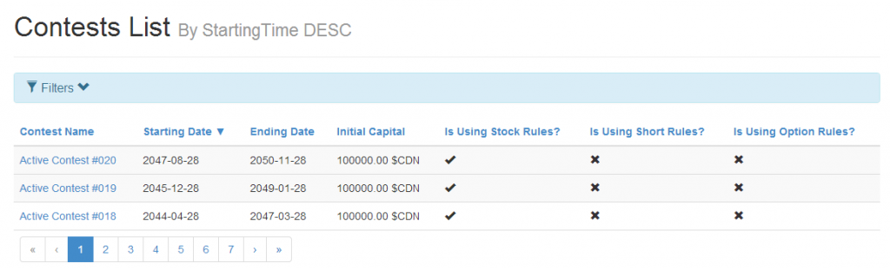

This one is for tablet resolution: 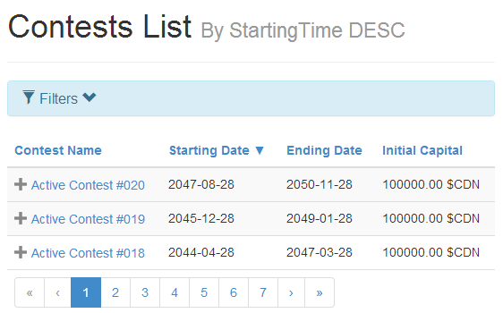

This one is for phone. The second row is open to show you that the FooTable.js library allows you to have some interesting features.

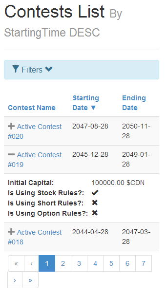

I will not discuss here about the filter capability because it is a subject that does not touche the grid. This allow to have some condition on the data set that is bound to the grid but does not affect the creation of the grid.

View Model

The first thing is that I was using WebMatrix which required to have some field like “sort”, “sortdir” and “page” defined in lowercase. This is why you will see in few that I have still used this nomenclature. Now, it could be renamed but I have not do it yet. Nevertheless, the principle is the same. You need to have your view model, that has the list of element you want to bind to the grid, to inherit from a base class that has these three properties. These one are used to know the sort property, the sort direction and which page to load information.


```csharp
 public interface IWebGridPagingInformation { string sort { get; set; } string sortdir { get; set; } int page { get; set; } } public class GridFilterSortableViewModel:WebPageViewModel, IWebGridPagingInformation { public string sort { get; set; } public string sortdir { get; set; } public int page { get; set; } public bool HasSortAndPagingFilter { get { return !(sort == null && sortdir == null && page == default(int)); } } } 
``` The Interface is used for information about the sort and paging. It will be mapped later to a interface that the model known to execute its query with Entity Framework.

This last class, GridFilterSortableViewModel, can be used for your concrete implementation for your entity. For example, I have a list of Contest entity. This class has the list of contest to display and a property that is all filters that you want to apply to the entity. This allow to offer more filter or less than what it is displayed.


```csharp
 public class ContestListViewModel : Infrastructures.GridFilterSortableViewModel { public ContestListViewModel() { Filters = new ContestListFilterFieldsViewModel(); } public IEnumerable<ContestListItemViewModel> Contests { get; set; } public ContestListFilterFieldsViewModel Filters { get; set; } } 
``` On the controller side, one action is available. Everything is within GET which allow to use filtering and paging from an URL. This is very interesting to communicate a grid preference by URL.


```csharp
 [HttpGet] [Authorize(Roles = ApplicationRole.ADMINISTRATOR_MODERATOR)] public ActionResult List(ContestListViewModel contestListViewModel) { //Get filter contests var contestsListModel = this.MapperFacade.GetModel<ContestList, ContestListViewModel>(contestListViewModel); var contests = this.contestService.GetContestsByFilter(contestsListModel.Filters);//This one load the filter with good value (COUNT of contest) + return contest for filter contestsListModel.Contests = contests; //Transform back everything for the page var viewModelWithContestsAndFilter = this.MapperFacade.GetViewModel<ContestList, ContestListViewModel>(contestsListModel); //View Model viewModelWithContestsAndFilter.InitializeTitles(); ModelState.Clear(); //Return only a partial if the grid has called the controller with Ajax call return View(viewModelWithContestsAndFilter); } 
``` 

The first step in the action is to convert the contest list view model into the model. The model is simple and allows to have columns in the sort and filters to be translated into the model property name and not anymore the view model property name.


```csharp
 public class ContestList { public IEnumerable<Contest> Contests { get; set; } public ContestListFilterFields Filters { get; set; } } 
``` 

The ContestListFilterFields has all Contest Filter fields that we allow to filter but also inherit from FilterEntity.


```csharp
 public class ContestListFilterFields : FilterEntity { public LocalizedString Name { get; set; } public DateTime? StartingTime { get; set; } public DateTime? EndingTime { get; set; } [Display(ResourceType = typeof(ModelPropertyDisplayName), Name = "IsUsingStockRules")] public bool IsUsingStockRules { get; set; } [Display(ResourceType = typeof(ModelPropertyDisplayName), Name = "IsUsingShortRules")] public bool IsUsingShortRules { get; set; } [Display(ResourceType = typeof(ModelPropertyDisplayName), Name = "IsUsingOptionRules")] public bool IsUsingOptionRules { get; set; } public Money InitialCapital { get; set; } public bool IsFilteringOnInitialCapital { get { return InitialCapital != null; } } public ContestListFilterFields() { Sort = CrossLayer.Reflections.LambdaHelper.GetPropertyName<ContestListFilterFields>(d => d.StartingTime); SortDirection = SortDirection.Desc; } } 
``` 

The constructor define the default behavior of the grid. As you can see, it is possible to use the sort property to set the default to be the starting time in descending order. The mapping will set these default properties to model.


```csharp
 Mapper.CreateMap<ContestListFilterFields, ContestListFilterFieldsViewModel>() .ForMember(d=>d.EndingTime, option=>option.MapFrom(d=>d.EndingTime)) .ForMember(d => d.InitialCapital, option => option.MapFrom(d => d.InitialCapital ?? new Money())) .ForMember(d=>d.IsUsingOptionRules, option=>option.MapFrom(d=>d.IsUsingOptionRules)) .ForMember(d=>d.IsUsingShortRules, option=>option.MapFrom(d=>d.IsUsingShortRules)) .ForMember(d=>d.IsUsingStockRules, option=>option.MapFrom(d=>d.IsUsingStockRules)) .ForMember(d=>d.Name, option=>option.MapFrom(d=>d.Name)) .ForMember(d=>d.RowsPerPage, option=>option.MapFrom(d=>d.NumberOfEntitiesPerRequest)) .ForMember(d => d.StartingTime, option => option.MapFrom(d => d.StartingTime)) .ForMember(d => d.TotalRecords, option => option.MapFrom(d => d.EntityTotalCount)) ; Mapper.CreateMap<ContestListFilterFieldsViewModel, ContestListFilterFields>() .ForMember(d => d.EndingTime, option => option.MapFrom(d => d.EndingTime)) .ForMember(d => d.InitialCapital, option => option.MapFrom(d => d.InitialCapital.Value!=0?d.InitialCapital:null)) .ForMember(d => d.IsUsingOptionRules, option => option.MapFrom(d => d.IsUsingOptionRules)) .ForMember(d => d.IsUsingShortRules, option => option.MapFrom(d => d.IsUsingShortRules)) .ForMember(d => d.IsUsingStockRules, option => option.MapFrom(d => d.IsUsingStockRules)) .ForMember(d => d.Name, option => option.MapFrom(d => d.Name)) .ForMember(d => d.StartingTime, option => option.MapFrom(d => d.StartingTime)) ; 
```

The FilterEntity class that inherit your concrete ContestListFilterFields is very generic which mean that you have all what you have for all future entities. It has the current page property, the property name for the sort, the sort direction, total count of entities and the number of entity to display per page.


```csharp
 public class FilterEntity:IPagingInformation { public const int DEFAULT_CURRENT_PAGE = 0; public const int NUMBER_OF_ENTITIES_PER_PAGE = 3; public FilterEntity() { SetDefaultValues(); } public int NumberOfEntitiesPerRequest { get; set; } public int CurrentPage { get; set; } public string Sort { get; set; } public SortDirection SortDirection { get; set; } public int EntityTotalCount { get; set; } public void SetDefaultValues() { this.CurrentPage = DEFAULT_CURRENT_PAGE; this.NumberOfEntitiesPerRequest = NUMBER_OF_ENTITIES_PER_PAGE; this.SortDirection = SortDirection.Asc; } } 
``` The last thing to do is to mark the table with the sort direction. It does two things. The first is to set the arrow for the current view (with the current field that could have been set by URL or by form). The second thing is to apply the FootTable plugin to the table.

```typescript
$(document).ready(function () { setArrows('contests-list'); $('#contests-list table').footable(); }); /* * @description: Set the arrows to the column header that is active for sorting */ function setArrows(idDivisionThatContainTable) { var dir = $('#' + Application.ControldsId.SortId).val().toUpperCase(); var col = $('#' + Application.ControldsId.ColumnId).val(); var header = $('#'+idDivisionThatContainTable+' th a[href*=' + col + ']'); if (dir === 'ASC') { header.text(header.text() + ' ▲'); } if (dir === 'DESC') { header.text(header.text() + ' ▼'); } }; 
``` 
 As you can see, the method use a Aplication.ControldsId.SortID and ColumnId that is set inside a script tag of the view.


```html  
@section scripts { <script> Application.ControldsId.SortId = "@Html.IdFor(d=>d.sortdir)"; Application.ControldsId.ColumnId = "@Html.IdFor(d=>d.sort)"; </script> <script src="~/Scripts/Customs/Views/ContestList.js"></script> } 
```  

This could be improved because in a situation of two tables in a page it will not work. However, it would not be the only thing that would not work. The URL parameter is only designed for one grid per page. Nevertheless, this is almost always the case.

# SPRINT 4 : MENU WITH SECURITY AND JOINING CONTEST June 16, 2014 By: pdesjardins

The Sprint 4 was shorter due to some time restriction. However some good development have been done. The first one concern the menu where it is now possible to display depending of the user role. The first thing to do is to modify the_layout.cshtml file. First, we need to add the @model to specify what we want to get from the controller the entity. This is required because the controller will pass the role of the user logged in the system. Depending of his role, we will adjust the menu. The second thing in the layout partial is that we will pass this model to the partial of the menu.


```html  
@using WebSite.Resources @model object /*This is required to work with the model passed by the controller*/ <!DOCTYPE html> <html> <body> @Html.Partial("_Header", Model) <div class="container body-content"> @RenderBody() </div> </body> </html> 
```  

Having the model set to object allow us to work with every model/view model possible. In the header partial it is possible to compare to an interface. If the view model that we pass from the controller inherit from the interface than we can check the role and proceed. Otherwise, we display nothing. The header partial do several thing and one of them is to parse to IUIPermission and pass this parsed object to the Menu partial.


```csharp
 var permission = Model as IUIPermission ?? new UIPermission(); Html.RenderPartial("_Menu", permission); 
``` 

The IUIPermission allows us to specify roles and check them to display or not elements of the menu.


```csharp
 public interface IUIPermission { bool IsAdministrator { get; set; } bool IsModerator { get; set; } } 
``` 

Here is an example of the menu:


```html  
<div class="navbar-collapse collapse"> <ul class="nav navbar-nav"> <li>@Html.ActionLink("Home", "Index", "Home")</li> <li>@Html.ActionLink("Contests", "List", "UserContest", new { Area = Constants.Areas.CONTEST }, new { })</li> @if(Model.IsAdministrator || Model.IsModerator) { <li> <a href="#">Moderation</a> <ul class="dropdown-menu"> <li><a href="#">Split</a></li> @if (Model.IsAdministrator || Model.IsModerator) { <li class="dropdown-header">Administrator</li> <li><a href="#">DashBoard</a></li> <li><a href="#">News</a></li> } <li><a href="#">Users</a></li> </ul> </li> } </ul> </div> 
```  

The second big thing that has been done is concerning joining a contest for a user. A page with the description of the contest has been created. Under the description, a button is displayed to join the contest if the user logged is not already subscribed.


```csharp
 [HttpGet] [Authorize(Roles = ApplicationRole.NORMAL_USER)] public ActionResult Detail(int id) { //Get the contest to show it information but also to know if the current user is subscribed to the contest var contestForUser = this.contestService.GetContestByIdWithContesters(id); //Transform back everything for the page var viewContestsForUser = this.MapperFacade.GetViewModel<Model.Entities.Contest.Contest, ContestDetailViewModel>(contestForUser); //View Model viewContestsForUser.IsCurrentUserRegisteredToThisContest = contestForUser.IsUserInContest(new ApplicationUser {Id = this.runningContext.GetUserId().ToString()}); return ViewModel(viewContestsForUser); } 
``` 

The line before the return is the one that tell the view model if the user is in the contest or not. As you can see, we get the contest with all contesters. From here, we check if the user is in the list or not. The view change depending of if the user is already in the contest or not.

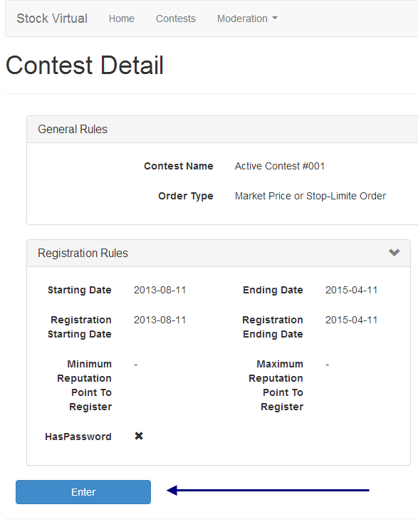

And the view if the user is already in the contest:

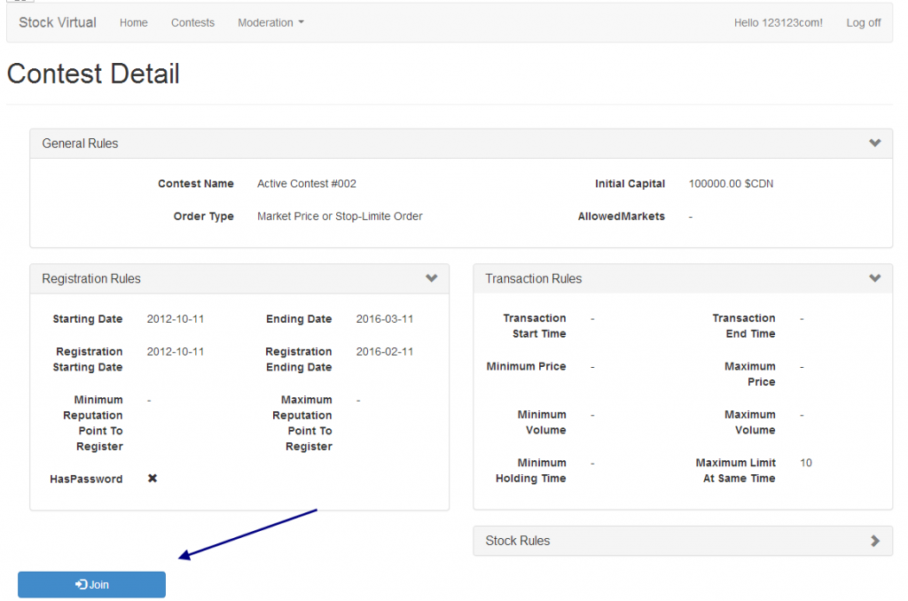


```csharp
 [HttpPost] [Authorize(Roles = ApplicationRole.NORMAL_USER)] [ValidateAntiForgeryToken] public ActionResult Join(int id) { //Get the contest information but also the confirmation that the user is not already registered for the contest IEnumerable<ValidationResult> validationsMessage; try { validationsMessage = this.contestService.SaveUserToContest(id, this.runningContext.GetUserId()); } catch (Exception e) { Log.Error(string.Format("Error during the UserPortefolio Join for contest id {0}", id), e); return View("JoinFail"); } if (validationsMessage != null && validationsMessage.Any()) { Log.Warning(string.Format("The user {0} is trying to join contest id {1} but has the error '{2}.'", this.runningContext.GetUserId(),id,string.Join(",",validationsMessage))); var viewModel = Mapper.Map<IEnumerable<ValidationResult>, GeneralValidationsMessageViewModel>(validationsMessage); return View("JoinFail", viewModel); } var contestForUser = this.contestService.GetContestById(id); //Transform back everything for the page var viewContestsForUser = this.MapperFacade.GetViewModel<Model.Entities.Contest.Contest, ContestDetailViewModel>(contestForUser); return ViewModel(viewContestsForUser); } 
``` 

Joining a contest require to verify if the user is already subscribed to the contest, if not we join. The controller call the service, which call the accessor.


```csharp
 public IEnumerable<ValidationResult> SaveUserToContest(int contestId, Guid userId) { var contest = this.contestRepository.GetById(contestId); //This is in the accessor because later we could search in Cache if(contest.RegistrationRules.IsDateValidToSubscribeUser) { this.contestRepository.SaveUserToContest(contest, userId); this.unitOfWork.Commit(); } else { return new List<ValidationResult>() {new ValidationResult(Resources.ContestValidationMessage.InvalidDateToSubscribe)}; } return new List<ValidationResult>(); } 
``` 

We do a quick validation about if the date is still okay to subscribe. Then, we go in the repository to save everything in the database. The repository verify some other thing like if the user already has a portefolio in this contest.


```csharp
 public void SaveUserToContest(Contest contest, Guid userId) { var portefolioExist = this.UnitOfWork.Set<Portefolio>() .Include(d=>d.Owners) .Any(p => p.ContestId == contest.Id && p.Owners.Any(d => d.UserId == userId.ToString())); if (portefolioExist) { throw new UserAlreadyInContestException(string.Format(Resources.ContestValidationMessage.PortefolioAlreadyCreatedForUserAndContest, contest.Id, userId)); } var portefolio = this.UnitOfWork.Set<Portefolio>().Create(); this.UnitOfWork.Entry(portefolio).State = EntityState.Added; portefolio.ResetFromContest(contest); //Required to set the default values like the initial capital var userPortefolio = new UserPortefolio() {Portefolio = portefolio, PortefolioId = portefolio.Id, UserId = userId.ToString(), DateJoin = this.RunningContext.GetCurrentTime()}; this.Save(userPortefolio); } 
``` 

It is also the time where we set to the portefolio the default values from the contest registration rules. This is the case of the initial money for a portefolio.

}

# SPRINT 5 : MODIFYING THE CLASSES ARCHITECTURE July 2, 2014 By: pdesjardins

To end the month of June, some modification has been made on the classes and layers. Once again, it is to simplify the maintenance. The biggest change is in the business layer. Previously, some classes were present but should not be. It is the same in the Data Access Layer which had some classes about Email. Yes, it is the place to send email but not to store those classes. Now, the Business Layer has all entities and non-entities classes like Email.

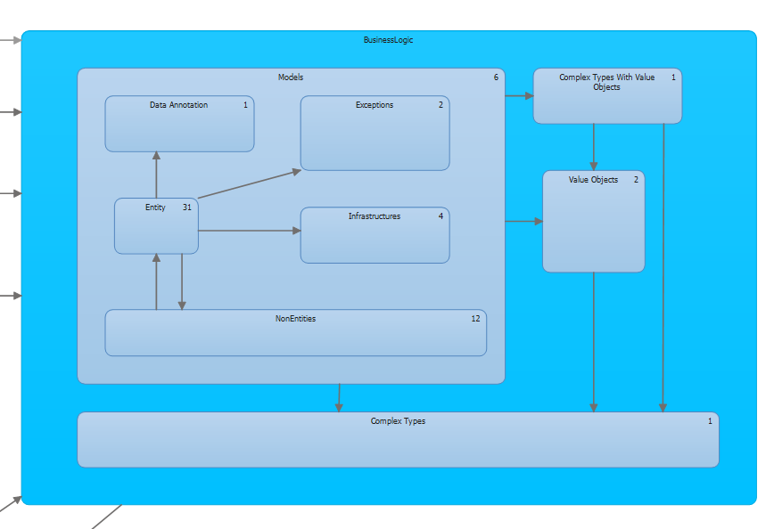

The second big change in the Sprint 5 was about the introduction of Trading business logic entities like Order, Portefolio, Stock and Transaction.

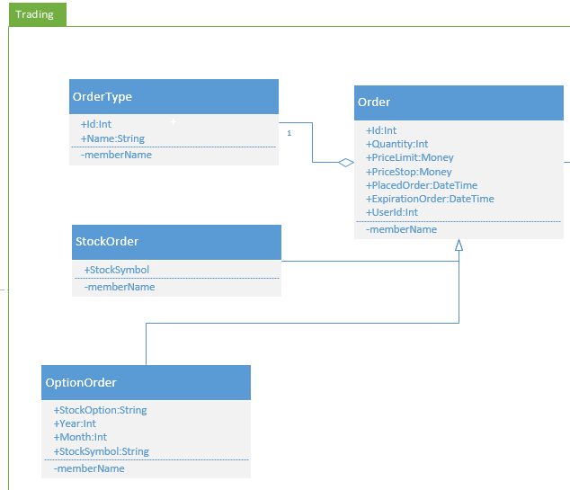

The Order class is abstract and has several class the inherit it like the StockOrder. The StockOrder class is very simple and add only the StockSymbol. It inherits from all other properties.


```csharp
 public class StockOrder : Order { [Required] public string StockSymbol { get; set; } public override IEnumerable<ValidationResult> ValidateChildren() { return base.ValidateChildren(); } } 
``` 

The Order class is interesting for several reasons. First, it uses Value Object design pattern with the collaboration of Entity Framework. Not only it use Value Object but it does use it in three different ways. The first one is with TransactionType. It uses the pattern of having the TransactionTypeId directly into the classes to let Entity Framework save this one without having to attach the whole value object. This also has a performance gain by having the value object class without requiring to include. This is possible with the GetFromId method defined in the base class of the value object (this can be found in my Blog PatrickDesjardins.com/blog). The second way is with the OrderType. This time, it does not require to save anything in the database since it is calculated on the fly by the property getter. The last way value object is used is hidden inside the complex type Money. This one use value object for the currency type but cannot be set with a foreign key since Complex Type cannot have foreign key to any table. The integrity is only done on the code side.


```csharp
 public abstract class Order : Implementations.Model { protected Order() { this.Status = OrderStatusType.Waiting; } [Required] public int Quantity { get; set; } public int TransactionTypeId { get { return TransactionType.Id; } set { this.TransactionType = TransactionType.GetFromId(value); } } [Required] public TransactionType TransactionType { get; set; } public OrderType OrderType { get { if (PriceStop != null && PriceLimit != null) return OrderType.StopLimit; if (PriceStop == null && PriceLimit != null) return OrderType.Limit; return OrderType.Market; } set { }/*This is required for Entity Framework*/ } public Money PriceLimit { get; set; } public Money PriceStop { get; set; } [Required] public DateTime PlacedOrderTime { get; set; } [Required] public DateTime ExpirationOrderTime { get; set; } public bool IsMarketPriceOrder { get { return PriceLimit == null && PriceStop == null; } } public Portefolio Portefolio { get; set; } public int PortefolioId { get; set; } public ApplicationUser UserWhoPlacedTheOrder { get; set; } public string UserWhoPlacedTheOrderId { get; set; } public int StatusId { get { return Status.Id; } set { this.Status = OrderStatusType.GetFromId(value); } } public OrderStatusType Status { get; set; } public override IEnumerable<ValidationResult> ValidateChildren() { if (!this.IsMarketPriceOrder) { if (this.PriceStop != null) { if (TransactionType == TransactionType.Buy) { if (PriceLimit < PriceStop) { yield return new ValidationResult("Price Limit must be higher or equal to the price stop" , new[] { LambdaHelper.GetPropertyName<Order>(d => d.PriceLimit), LambdaHelper.GetPropertyName<Order>(d => d.PriceStop)} ); } } else if (TransactionType == TransactionType.Sell) { if (PriceLimit > PriceStop) { yield return new ValidationResult("Price Limit must be lower or equal to the price stop" , new[] { LambdaHelper.GetPropertyName<Order>(d => d.PriceLimit), LambdaHelper.GetPropertyName<Order>(d => d.PriceStop) }); } } } } } public IEnumerable<ValidationResult> ValidateNewOrder(IRunningContext runningContext, int numberDayMaximumForExpirationOrder) { if (this.ExpirationOrderTime.Subtract(runningContext.GetCurrentTime()).TotalDays > numberDayMaximumForExpirationOrder) yield return new ValidationResult(string.Format("You cannot set an order with a ending time above {0}", numberDayMaximumForExpirationOrder) , new[] { LambdaHelper.GetPropertyName<Order>(d => d.ExpirationOrderTime) }); } } 
``` 
The Order class is also interesting because it add some business logic like the validation of a new order that can be called when the order is created. This is used by the new class Portefolio. The Portefolio class is used in the OrderService class when we record a new order into a portefolio. The order is pass to the portefolio to be added, and this one validate if it is possible to add. A lot of business logic is done here to know if the order is fine or not. The Order Service looks so far like that for the validation:


```csharp
 public IEnumerable<ValidationResult> RecordOrder(StockOrder order) { var validationsToReturn = new List<ValidationResult>(); //1- Current contest from the portefolio //2- Verify that the contest can execute this order (validations for contest/order) var portefolio = this.portefolioAccessor.GetById(order.PortefolioId); IEnumerable<ValidationResult> validationContests = portefolio.ValidateOrder(order, this.runningContext, this.quoteProvider); if (validationContests.Any()) { return validationContests; } //3- Validate the order var validations = order.Validate(); if (validations.Any()) { return validationsToReturn; } //4- Record the order in the order queue to be executed at the proper time var validationsOnSave = this.orderAccessor.RecordOrder(order); validationsToReturn = validationsToReturn.Concat(validationsOnSave).ToList(); //5- Display any feedback from the RecordOrder operation return validationsToReturn; } 
``` 

The interesting part is the one the validate the order from the portefolio. The code below is not yet done but it shows that some validation are done. At some point, the validation does not concern the portefolio rules but the order. This is why this method call the Order.ValidateNewOrder.


```csharp
 public IEnumerable<ValidationResult> ValidateOrder(StockOrder order, IRunningContext runningContext, IQuoteProvider quoteProvider) { if (!this.Contest.ContestOrderType.Accept(order.OrderType)) yield return new ValidationResult("Order is not valid for the current contest", new[]{LambdaHelper.GetPropertyName<StockOrder>(d=>d.OrderType)}); if((order.OrderType == OrderType.Limit || order.OrderType == OrderType.StopLimit) && this.NumberOfActiveOrder>=this.Contest.TransactionRules.MaximumLimitOrderSameTime) yield return new ValidationResult("The maximum number of order has been reached.", new[] { LambdaHelper.GetPropertyName<Portefolio>(d => d.NumberOfActiveOrder) }); var numberDayMaximumForExpirationOrder = 7;//ToDo var orderValidations = order.ValidateNewOrder(runningContext, numberDayMaximumForExpirationOrder); foreach (var validationResult in orderValidations) { yield return validationResult; } if (!this.Contest.TransactionRules.IsInOrderTimeFrame(runningContext.GetCurrentTime())) { yield return new ValidationResult(string.Format("Order must be set between {0} and {1}" , this.Contest.TransactionRules.OrderStartingTime , this.Contest.TransactionRules.OrderEndingTime) , new[] {LambdaHelper.GetPropertyName<Portefolio>(d => d.Contest.TransactionRules)}); } var stockValidations = quoteProvider.GetValidation().Validate(order.StockSymbol); foreach (var validationResult in stockValidations) { var newValidationWithMembers = new ValidationResult(validationResult.ErrorMessage, new[] {LambdaHelper.GetPropertyName<StockOrder>(d => d.StockSymbol)}); yield return newValidationWithMembers; } } 
``` 

Not only it calls the Order validation but it also validate the Stock Symbol. This is interesting because it use the QuoteProvider. This allow us to change the stock provider from any provider like Yahoo to Google without having to change a lot of logic. It implements the strategy pattern.

Additional information about the Strategy Pattern and the Quote Provider will be provided in a later article.

# MOVING FROM IIS EXPRESS TO IIS AND SQL SERVER August 18, 2014 By: pdesjardins

Moving from IIS Express to IIS was a natural decision for many reasons like not having to launch IIS Express for the Web Service every time we wanted to run the web site. This way, the Web API Service can always run until modification is required. It has not been as a simple switch to IIS by creation new website under IIS. This require to have some change. First, we were using localdb. We could continue to use localdb but it would have require us to change the credential of the running Application Pool to use my credential. The reason is that localdb is under the user profile. The best solution at this point is to run the database inside a real Sql Server.

Cannot get a local application data path. Most probably a user profile is not loaded. If LocalDB is executed under IIS, make sure that profile loading is enabled for the current user. Next warning that you will get is that the Application Pool does not have access to the database.

``` 
 Process information: Process ID: 7732 Process name: w3wp.exe Account name: IIS APPPOOL\\BourseVirtuelle Exception information: Exception type: SqlException Exception message: The SELECT permission was denied on the object ‘AspNetUserLogins’, database ‘BourseVirtuelle’, schema ‘dbo’. at System.Data.SqlClient.SqlCommand.b__24(Task`1 result) at System.Threading.Tasks.ContinuationResultTaskFromResultTask`2.InnerInvoke() at System.Threading.Tasks.Task.Execute() This can be done by going into Microsoft Sql Server Manager, under Security, Logins and add entries for all your Application Pool. For example, here is the application pool that I created. 
``` 

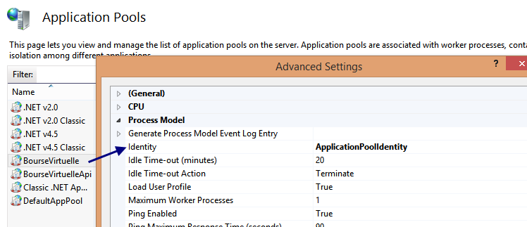

You need to have the user name with the IIS APPPOOl\\ in front of your Application Pool name. You have also to keep Windows Authentification checked.

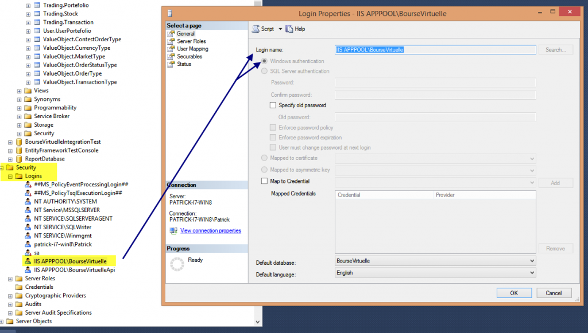

The last step is to give the user access to the Database. You have give the account enough role to be able to run you application.

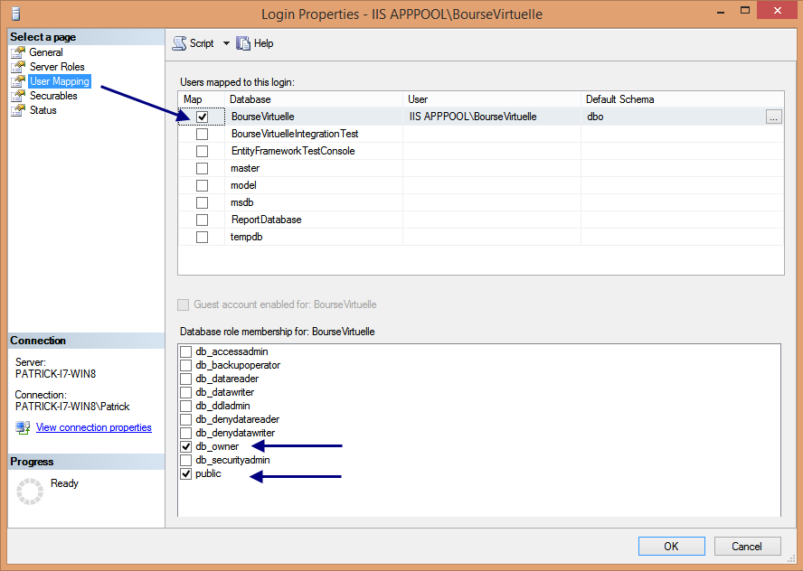

The last error that you can have is something about the creation of table. I had this error when migrating this website with the Identity framework when trying to get the user in the authentication window. 

```csharp 
 Exception information: Exception type: SqlException Exception message: CREATE TABLE permission denied in database ‘BourseVirtuelle’. at System.Data.SqlClient.SqlConnection.OnError(SqlException exception, Boolean breakConnection, Action`1 wrapCloseInAction) at System.Data.SqlClient.TdsParser.ThrowExceptionAndWarning(TdsParserStateObject stateObj, Boolean callerHasConnectionLock, Boolean asyncClose) 
``` 

The solution was to set the default initializer to null


```csharp
 public MainDbContext(IRunningContext runningContext) : this() { Database.SetInitializer<MainDbContext>(null); //No initialization ConfigurationContext(runningContext); } 
```
