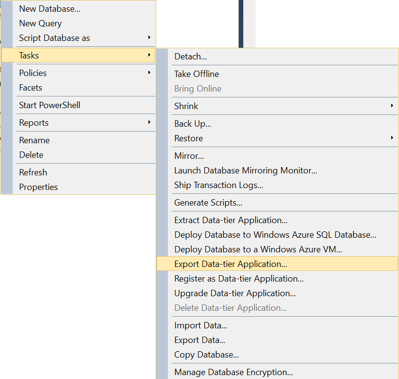
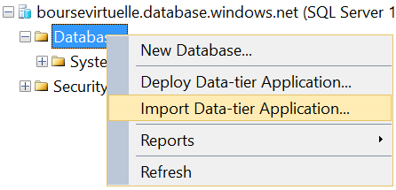

Migrating a SQL Server Database into Azure is easy but not obviously. Here is few steps that might save you some hours. These steps are migrating the schema by creating a new database at destination with all data.

First of all, you need to open Microsoft SQL Server Management Studio. Right click the database you want to migrate to Azure and select **Task**, and **Export Data-tier Application**. It's important that you do not choose the option Deploy Database to Windows Azure Sql Database because this option doesn't keep the identity (primary keys) of you tables.



To import into Azure, you need to right click the Databases folder of Azure SQL Server. Select **Import Data-tier Application**. 



A short wizard will open and let you select the name of the destination database as well as some primitive Azure configuration. This may take a while to transfer depending of the size of your database.

Once it's done, it's always a good idea to verify if everything has been transferred.


```sql
 SELECT OBJECT_SCHEMA_NAME(p.object_id) AS [Schema] , OBJECT_NAME(p.object_id) AS [Table] , i.name AS [Index] , p.rows AS [Row Count] FROM sys.partitions p INNER JOIN sys.indexes i ON p.object_id = i.object_id AND p.index_id = i.index_id WHERE OBJECT_SCHEMA_NAME(p.object_id) != 'sys' ORDER BY [Row Count], [Schema], [Table], [Index] 
```
 That query will show the information about the number of rows per table. You can compare from the local database and the Azure one to see any disperency.
