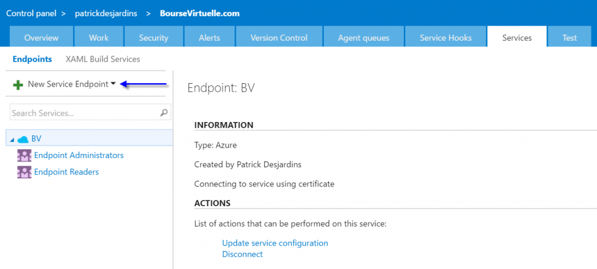
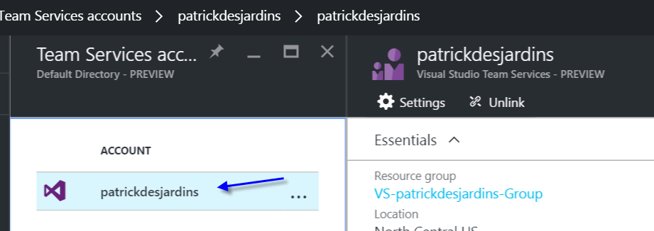
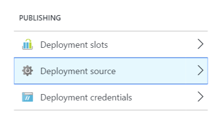

Connecting VSTS to Azure is not something well documented. You will see few articles that talk about configuring a step in VSTS build, some other article that talk about steps with the old Azure portal. After few hours, I realize that deploying VSTS code to Azure is more easy than initially thought. First, you need to create in VSTS a service endpoint. In the settings of VSTS, select "New service endpoint". Multiple options are available, the one that is needed is "Azure Classic". The name doesn't matter of the connection your choose. What is important is the subscription id and name. I choose to authenticate with the publish setting file.

Once done, you need to go in Azure and search for "team" in the browse. Select the Visual Studio Team Service, and connect your MSDN subscription.

The last step is to select under your website's setting the deployment configuration. You can select multiple sources, but only one at the time can be selected. Choose VSTS.

From there, if you push something, Azure will get the code, build and deploy.
