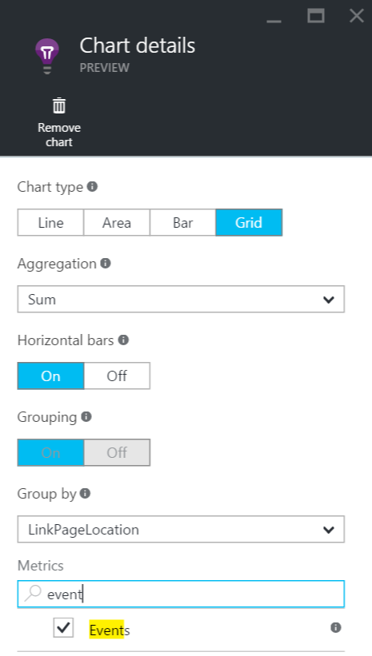
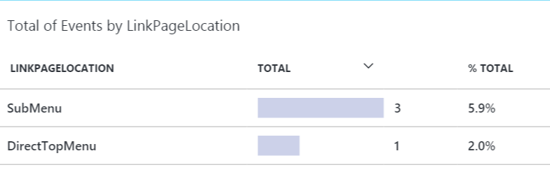

Application Insights is a system that run on Azure that lets you send information about your application. I will not go in detail in that post about all its capability. I suggest you read the [overview](https://azure.microsoft.com/en-us/documentation/articles/app-insights-overview/) page from the official documentation. This article goal is to use Application Insights to collection information about two buttons that go to the the same page to figure out which one is the most popular. Since both links are normal Html link, we need to use JavaScript to bind the click event to both buttons and send the telemetry before moving to the actual page.

The first step is well documented which is to add the Telemetry to the web project. The detail are also explained in the [documentation](https://azure.microsoft.com/en-us/documentation/articles/app-insights-asp-net/). In short, it consists to get the right Nuget Package, create the Azure Application Insights account (needed to get a key) and then setup the Global.asax.cs + set the JavaScript that will collect client side telemetry. What is not really well clear is that you need to setup the maxBathSizeInBytes to zero if you want to get the telemetry sent very fast. This is required if you want it on a click event that leave the page. This is not required if you have a single page application that remains on the same page. The setup code look like the following:

```typescript
<script type="text/javascript"> var appInsights=window.appInsights||function(config){ function r(config){t[config]=function(){var i=arguments;t.queue.push(function(){t[config].apply(t,i)})}}var t={config:config},u=document,e=window,o="script",s=u.createElement(o),i,f;for(s.src=config.url||"//az416426.vo.msecnd.net/scripts/a/ai.0.js",u.getElementsByTagName(o)[0].parentNode.appendChild(s),t.cookie=u.cookie,t.queue=[],i=["Event","Exception","Metric","PageView","Trace"];i.length;)r("track"+i.pop());return r("setAuthenticatedUserContext"),r("clearAuthenticatedUserContext"),config.disableExceptionTracking||(i="onerror",r("_"+i),f=e[i],e[i]=function(config,r,u,e,o){var s=f&&f(config,r,u,e,o);return s!==!0&&t["_"+i](config,r,u,e,o),s}),t }({ instrumentationKey: "@Microsoft.ApplicationInsights.Extensibility.TelemetryConfiguration.Active.InstrumentationKey", maxBatchSizeInBytes: 0 });

window.appInsights=appInsights; appInsights.trackPageView(); </script> 
``` 


The second step is to add event on each link that you want to collect the click.

```typescript
function attachTelemetries() { $('#all-contests').click(function () { appInsights.trackEvent("BestLinkLocation", { LinkDestination: "Contest/List", LinkPageLocation: "DirectTopMenu" } ); appInsights.flush() }); $('#user-contests').click(function () { appInsights.trackEvent("BestLinkLocation", { LinkDestination: "Contest/List", LinkPageLocation: "SubMenu" } ); appInsights.flush() });

} 
``` 


You can use the _appInsights_ variable, defined when setuping Application Insights with the method _trackEvent_. The method take a name for the telemetry captured following by properties and if needed some metric. In our case, we can just sum the each properties (each link location) and determine which one is the most popular. Something not clear in the documentation is that it is required to call the _flush_ method. The reason is that once the click event is done, the browser move to the next page. Flush ensures that the telemetry is sent. 



You can add a chart in the Metric blade, see a the top. Select Sum, in a grid, and group by the property you want to get the data. In our example, it is the property that change which is the location of the link. What can be confusing is to be able to select the property you need to go at the bottom of that blade and select the metric **event**.



The result is a table that contains only the data that has been collected. Hence, you need to have people clicking the buttons to see anything. Also, it can take some time (about 30 minutes) to see the information into the Azure portal.
