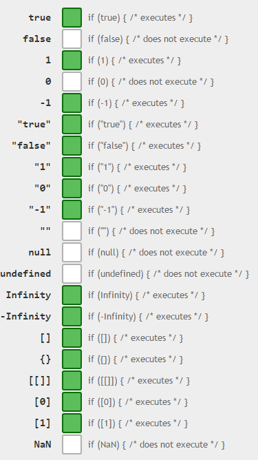

Comparing if something is null or undefined is a trivial task but can take different color depending to whom you talk. This article will try to make it simple to understand. Since TypeScript is built on top of JavaScript, it has to handle the craziness of how JavaScript compare. In this article we will compare 4 types to check if the value is null, undefined or really reflect the values intended. All tests are built with this simple class and utility method:

```typescript
class TestClass { public propString: string; public propNumber: number; public propBoolean:boolean; public propObject:TestClass; }

function show(propertyName:string, operator:string) { var output = document.getElementById("output"); output.innerHTML = output.innerHTML + ("<p class='one-result'>" + propertyName + " is null true with " + operator + "</p>"); }

var trr = new TestClass(); 
``` 


First, let's test the boolean value when this one is set to nothing. We expect to have this value to be undefined which can be validated by ==, ===, ! and typeof :

```typescript
if(trr.propBoolean === null) { show("propBoolean", "=== null"); } if(trr.propBoolean == null) { show("propBoolean", "== null"); } if(trr.propBoolean) { show("propBoolean", "no operator"); }

if(!!trr.propBoolean) { show("propBoolean", "!!"); }

if(trr.propBoolean === undefined) { show("propBoolean", "=== undefined"); } if(trr.propBoolean == undefined) { show("propBoolean", "== undefined"); }

if(typeof(trr.propBoolean) === "undefined") { show("propBoolean", "type of === undefined"); } 
``` 


The output is what expected except the `!` operator which doesn't work with undefined with a boolean value.

``` 
 propBoolean is null true with == null propBoolean is null true with === undefined propBoolean is null true with == undefined propBoolean is null true with type of === undefined 
``` 

If we redo the test with boolean, but this time by setting the value to null `(trr.propBoolean = null;)` we get this result: 

``` 
 propBoolean is null true with === null propBoolean is null true with == null propBoolean is null true with == undefined 
``` 

The result is more surprising. As expected, the typeof undefined is not working anymore since it's defined to null. However, the comparison the `== undefined` is true. Also, the direct validation doesn't work as well as the !!.

Setting the value to true, we have the no operator and the !! that let it through. Setting to false, nothing is printed. So, if we only take the boolean case in consideration and you want to be sure that true or false is set to the variable than you must use:
1. == null
2. == undefined

## Number

If we do the test with number, we have the same result than with boolean when comparing to nothing (undefined) as well as null. 

``` 
 propNumber is null true with == null propNumber is null true with === undefined propNumber is null true with == undefined propNumber is null true with type of === undefined 
``` 

and : 

``` 
 propNumber is null true with === null propNumber is null true with == null propNumber is null true with == undefined 
``` 

The problem is when we set the number to the value of 1. This one will pass the test of being true if compared with `if(numberOfValue1)` and also `if (!!1)`. So, the only way to really validate number type to check if they are null or undefined is to use `== null` or `== undefined`.

## String

Comparing a string is producing the same value when undefined and null than the boolean and number. The problem is if the value of the string is "0" or "true" than it will goes in the `if(stringValueWithZero)` or if`(stringValueOfTrue)`.

``` 
 propString is null true with no operator propString is null true with !! 
``` 

It means that you can really truly just verify null or undefined value of a string with the equal operator -- again.

## Object

The last test is to compare a custom object. As expected, when undefined and null the result is the same. You can also use the `if(trr.propObject)` and `if(!!trr.propObject)` without problem. In that case, you have more options.

## Summary

From all scenarios cover in this article, it's obvious that the only save way to check if a value has been set or if this one is set to null that is to compare with the double equal with null or undefined. I prefer the == null because undefined, in JavaScript, could be rewritten with a value. Thus causing some false-true. You can always use the triple equal to check null and undefined, but this is just more typing for the same result. You can have fun at this link to play around with the test : [http://typescript.io/aEeZGxas0wg](http://typescript.io/aEeZGxas0wg). If you are interested to see all other cases where comparing with if(yourVariable) can be dangerous, you should look at [https://dorey.github.io/JavaScript-Equality-Table/](https://dorey.github.io/JavaScript-Equality-Table/) where they show multiple scenario where a true value can occur when not expected. Here is a glimpse: 



You can see many discussion on [StackOverFlow about checking the value in TypeScript](http://stackoverflow.com/questions/28975896/is-there-a-dedicated-function-to-check-null-and-undefined-in-typescript) or in 


[Stackoverflow](http://stackoverflow.com/questions/2647867/how-to-determine-if-variable-is-undefined-or-null/21273362) which lead to the same conclusion of not trying to use semantic shortcut but to compare with the double `==`. TypeScript supports it in [strict mode](https://github.com/Microsoft/TypeScript/pull/8452) as you can see in this pull request where Anders Hejlsberg is involved (core developer of TypeScript).
