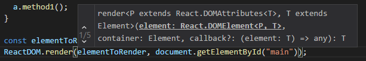

This article explains how to get an exiting **TypeScript** project that use **Gulp** to use **ReactJs**.

## React NPM Packages

To use **ReactJs** you needs four different NPM packages for **React** and **React-Dom**. 

``` 
 npm install react@latest --save npm install react-dom@latest --save npm install @types/react --save-dev npm install @types/react-dom --save-dev 
```  

Two of them are the actual Facebook ReactJs libraries and the two others are Types which allow to use these two JavaScript libraries with TypeScript. This means that you will get all the autocomplete features while typing.



## Modifying RequiresJs

Inside the configuration of your RequireJs, you need to add two entries for react and react-dom to indicate where will be the module to load. This is tricky in term that you must point to the "dist" folder. If you look in node_modules you will see that react exist in the main folder but also in the lib folder. These won't work. The other tricky part is that react-dom use a hyphen, which will require you to use quote. Both need to have lowercase path key, and both will be used with the lowercase on the import statement.

```javascript
<script> requirejs.config({ 
  baseUrl: 'output/', 
  paths: { vendors: 'vendors', jquery: '../vendors/jquery/jquery', react: "../vendors/react/dist/react", "react-dom": "../vendors/react-dom/dist/react-dom" } 
});

//Startup file 
requirejs(['file1']); 
</script> 
``` 


If your file1.ts was your entry point, this one can remain. You just need to have this one to be file1.tsx since it will use React JSX syntax.

## TypeScript TsConfig.json

The TypeScript's configuration file needs to be altered to indicate the type of JSX we want to compile. 
```typescript
"jsx": "react" 
``` 


If you want, you can add both types under the property "types" but this is optional since TypeScript will looks into the node_modules package to get the definition.

## Gulp and React

If you are using Gulp or any other toolkit for automation, you need to do a change. The change is mainly to change the path of file to compile to get TSX file additional to TS file. 

```javascript
paths.allTypeScript = paths.typescript_in + "**/*.{ts,tsx}"; 
// ... 
gulp.task("build", () => { 
  var compilationResults = gulp.src(paths.allTypeScript) 
    .pipe(sourcemaps.init()) 
    .pipe(tsProject());
    compilationResults.dts.pipe(gulp.dest(paths.typescript_out)); 
    return compilationResults 
      .pipe(sourcemaps.write('.')) 
      .pipe(gulp.dest(paths.typescript_out)); 
}); 
``` 
This change add ts and tsx file to be compiled by TypeScript Compiler (TSC).

## Using React

Once React is setup, you can modify your entry point by rendering a simple component. Here is an example that use a simple component. The component code:

```typescript
import * as React from "react"; 
interface ComponentProps { name: string; }

export class Component extends React.Component<ComponentProps, {}> { 
  public render(): JSX.Element { 
    return <div>React: Hello, {this.props.name}</div >; 
  } 
} 
``` 

The original TypeScript modified to have the .tsx extension:

```typescript
import * as React from "react"; 
import * as ReactDOM from "react-dom"; 
import { Component } from "component1";

const elementToRender = <Component name="Test"/>; 
ReactDOM.render(elementToRender, document.getElementById("main")); 
``` 

The difference is that we import the two libraries and use the component that we also import.

You can find the whole source in GitHub at [https://github.com/MrDesjardins/TypeScriptReactBoilerplate](https://github.com/MrDesjardins/TypeScriptReactBoilerplate).
