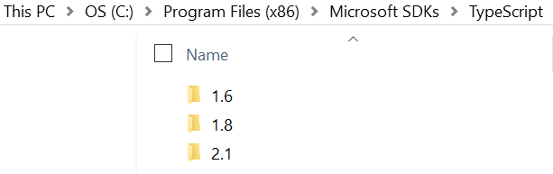
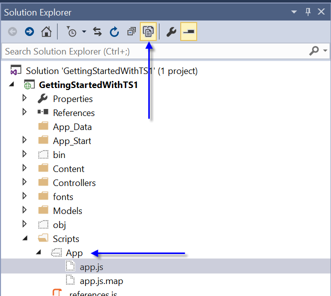
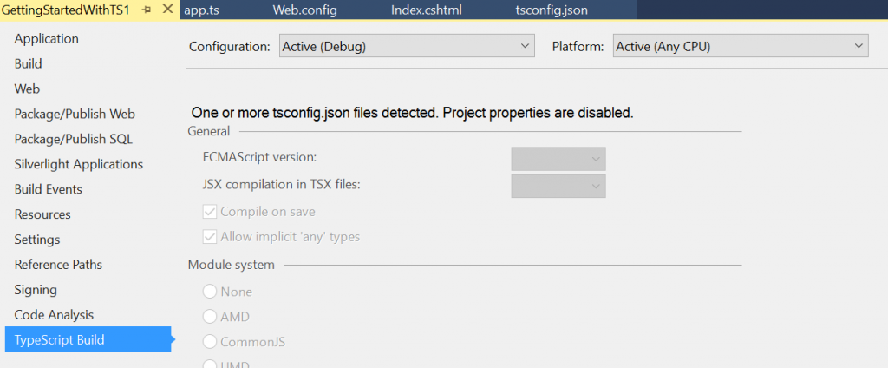
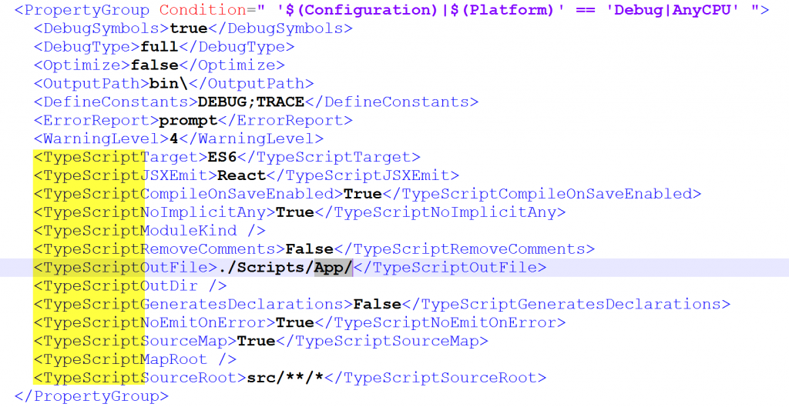

TypeScript is a wonderful language for front-end developing. It helps by make front-end code feels like C\#. At the end you compile the TypeScript code in JavaScript like if you had do without TypeScript. The first step is to setup Visual Studio to use TypeScript. On the official website, there is [instruction for Asp.Net MVC4](https://www.typescriptlang.org/docs/handbook/asp-net-4.html) which doesn't work very smoothly with MVC5 and the latest version of TypeScript. In fact, following those instructions will lead you into a compilation problem that would tell you that VSTSC doesn't exist. In this article, I'll show you the quickest way to use TypeScript.

The first step is to download the latest version of TypeScript. This will install TypeScript in Program Files (C:\Program Files (x86)\Microsoft SDKs\TypeScript). Be aware that you may already have some older version of TypeScript (like 1.6 and 1.8) but you want to have 2.1.



Installing TypeScript should take about 3 minutes. Once it's done, you need to add a tsconfig.json file at the root of your project. This second step add a file that gives configuration to TypeScript. For example, where to take the TypeScript and where to output the JavaScript result. Here is an example: 
```typescript
{ 
  "compilerOptions": { 
    "sourceMap": true,
     "target": "es6", 
     "outDir": "./Scripts/App" 
    }, 
    "files": [ "./src/app.ts" ] 
} 
``` 


That said to take the file app.ts from the src folder and create the corresponding JavaScript in the outDir. In this example, we take the file in /src/ and output the result in /Scripts/App/ which is the default JavaScript folder in Asp.Net MVC. It could have been any other folder as long as in your .cshtml you refer to this one. That said, we need to change the .cshtml where we want to consume the JavaScript. We need to add the script tag like we would do normally. 

```typescript
<script src="~/Scripts/App/app.js"></script> 
``` 


Before going any further, let's talk about the tsconfig.json. The option are very basic, the first one indicate that we want sourcemap which allow you to debug directly the TypeScript file instead of the JavaScript. The second parameter is the target. It indicates in which version of JavaScript (EcmaScript) to output. The third one if where to save the JavaScript files compiled. Files is the input.

From here, you just need to have a TypeScript file called app.ts and write some code. Do as normally with C\#, go in Visual Studio's menu under Build and do Build Solution. This will output JavaScript. You may not see the output file if you do not have "Show all Files" selected in the Solution Explorer.



At that point, you may ask yourself that it sounds cumbersome to manually add files if the project is big. This is why you can change the tsconfig.json to compile all TypeScript file of specific folders. 
```typescript
{ 
  "compilerOptions": { 
    "sourceMap": true, 
    "target": "es6", 
    "outDir": "./Scripts/App" 
  }, 
  "include": [ "src/**/*" ] } 
``` 


This will go through all .ts, .tsx, and .d.ts file and generate the right JavaScript.

You may fall into the problem that while writing your TypeScript that Visual Studio 2015 tells you that you are using a version different from the version specified in the tsconfig.ts. 

The problem is that Visual Studio is having TypeScript configuration directly into the .csproj file. You can open with a text editor the .csproj and search for TypeScript. 

There is two options here. The first one is to remove the tsconfig.json file and configure from Visual Studio project property. However, you will be limited in term of options. The second is to remove all TypeScript entries inside the .csproject and keep the tsconfig.json. You may have to restart Visual Studio to have Intellisense to work again.
