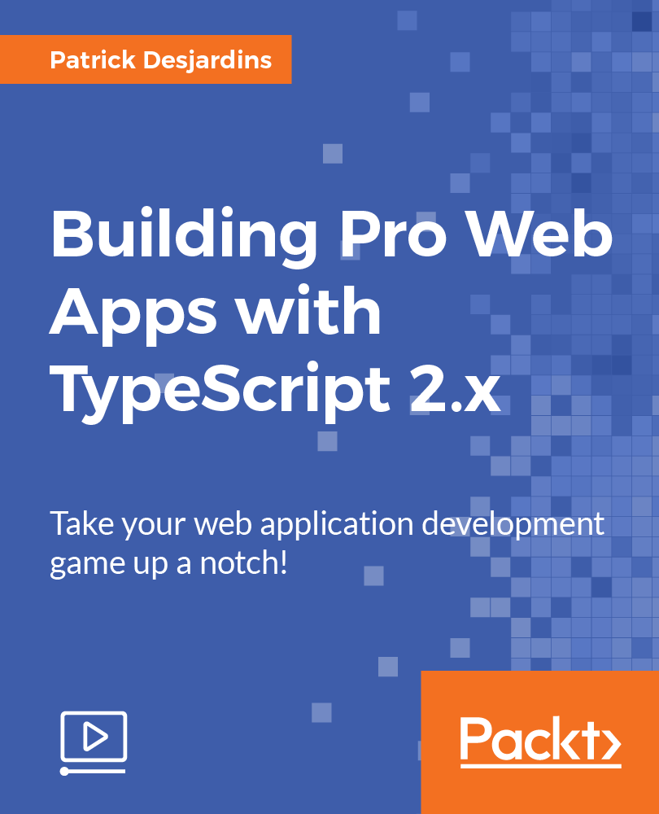

Early this year, I got contacted to record two courses by Packt. The two courses are around a simple TypeScript web project. The first course is entitled "Rapid Web Application Development with TypeScript 2.0" and the second course is entitled "Building Pro Web Apps with TypeScript 2.x". This was the first time I had to record myself while coding and it was quite a challenge!

These two courses represent a final product of about 3 hours of high quality content. The amount of work behind these 3 hours is 4 months where more than half of my evenings were dedicated to these courses. Between organizing the content, preparing the code, building the slides, recordings the audio and video, and applying the touch up from the technical reviewer and the editor, time was flying! I hope that everyone who take the course will enjoy the content and how it is presented.

Here is the link to the course 1 : [Rapid Web Application with TypeScript 2.x](https://www.packtpub.com/application-development/rapid-web-application-development-typescript-2x-video) Here is the link to the course 2 : [Building Pro Web Application with TypeScript 2.x](https://www.packtpub.com/application-development/building-pro-web-apps-typescript-2x-video)
