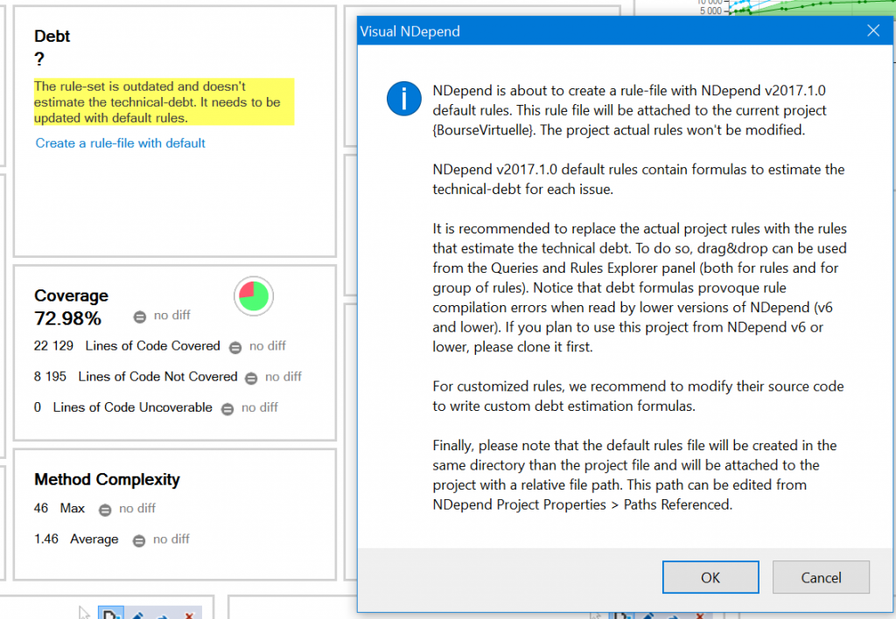
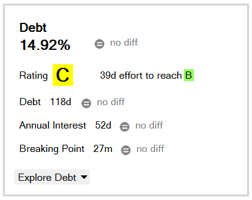
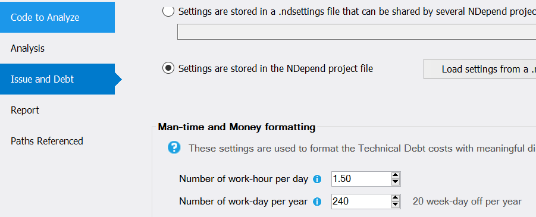
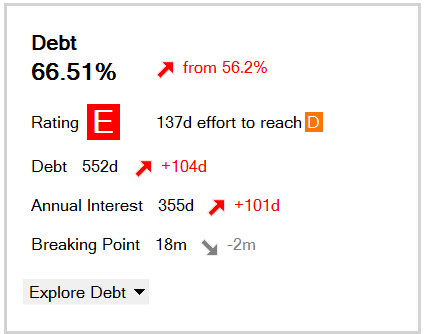

I have been a fan of [nDepend](http://www.ndepend.com/) since many years now. nDepend is a tool that run in parallel of Visual Studio as well as in Visual Studio. Fully compatible from early version up to Visual Studio 2017. The role of nDepend is to improve your code quality and the newest version step up the game by having few [new features](http://www.ndepend.com/ndepend-v2017). The three main new features are the called "Smart Technical Debt Estimation", "Quality Gates" and "Issues Management". In this post, I will focus on the first one "Smart Technical Debt Estimation".

The feature goal is to give a number in term of cost. It also give grade to your code as well as an estimate effort in time to improve that rating. Everything is configurable for your preference.

First of all, if you are coming from nDepend version 6, when opening your old project with nDepend version 2017 you will get a notification. About dept not configured. You just need to click on it and you will get a message that will guide you on this new feature.

From there, you will get a first rating. 

From here, you can click the rating, the effort or any numbers to get an idea how to improve. But before going too deep, you better configure your setting. For example, I ran this project on a project that I am phasing out where I'll work about 1.5 hours for the next year per day. This can be configure!

Indeed, reducing the number of hour per day and running a new analysis, plunged the rating down in my case. 

That said, the rating is meaningful if you have configured the rules to be along with what you believe to be a dept which mean that you have to setup the rules to fit your needs. For me, I never really modified the default values, always browsed the results and skipped those that wasn't important for me. With this new feature, I am more encouraged to make the rule more like I want. For example, I do not mind about long method name, in fact, I like them.

I'll post in few weeks the result of tweaking some rules, adjusting the code and so on. This is not an easy tasks, because it cannot be just changed blindly. Some private method that doesn't seem to be used might be called by Entity Framework, some attribute classes may seem to be great sealed but they are also inherited by other classes. This is also true for other rules like static methods that can be converted, sometime it has some side effects. So far many features of this new version of nDepend seem promising. Not only for Visual Studio, but now with the integration to VSTS (Visual Studio Online) that can be used on each of your build.
