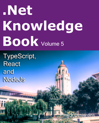

As every year since the last five years, I am compiling all relevant blog articles I wrote during the year, format and review all of them and send them to be proofread by someone way better than me! This year, I was able to accomplish it few weeks before Christmas. It is available right now on [Amazon](https://www.amazon.com/dp/2981311050) and will be available in few days for Kindle.

For the curious, the picture of the front page is a picture I took while visiting Stanford University this year.

The first four volumes were more around Microsoft Asp.Net in enterprises. This one focuses on TypeScript and React. Here are some subjects discussed in the book: New features about TypeScript, differences between Flow and TypeScript, migrating AngularJs to React, processing images with NodeJs, flux cycle with React and Redux, Redux middleware, configuring Gulp and Webpack for TypeScript, NPM, webworker, building performance with TypeScript, Rest and destructor operators, multitudes of JavaScript sort algorithms.
