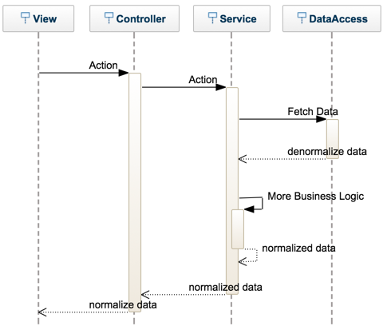
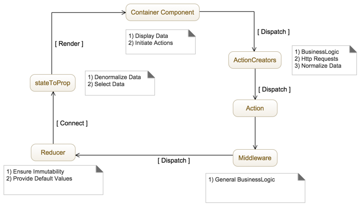
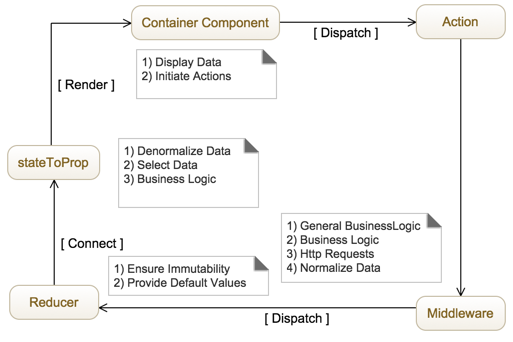

Before digging into the main topic of not using action creator, let me establish some contexts. There is nothing white or black and this is even truer in regards to anything touching JavaScript these days. The official documentation of Redux talks about action creator but is very unopinionated about how the full flow should me. A few weeks ago, I was working in a Redux application at Netflix and find myself using the action creator approach, which is the natural way to me. However, my partner was not. Also, I found myself not using action creator in a particular flow as well, hence started to thinking about converging into a single approach which was to avoid having the action creator. I still believe action creator is a simple way to have a proper React and Flux flows of information, and in this article want to highlight a different way to work with Redux.

I like working with action creators and this is the first time I used Flux a few years ago. To me, it makes sense that a component initiate an action using the action creator. A parallel can be made if you are from Asp.Net MVC. The action creator is acting like the controller, receiving the action, and executing the logic before sending the information to be persisted. In Asp.Net MVC the controller would have delegated the logic into the service layer who would have manipulated the data with logic and pass along the transformed data to the persisted layer. If the service layer requires more data to execute any logic, it would call the persistent layer and continue its logic until the transformed data require to be saved. So far, nothing new for people who worked with Asp.Net MVC. The same approach can be followed with Redux. The component can dispatch to an action creator function. The action creator does its business logic by calling other classes and functions and if it needs more data can do an Ajax call, get the data and when ready dispatch an action to persist the information in the store which would be caught by the reducer and so on. So far, so good; so far, nothing novel here.

My partner was also doing something similar but was using a concept that is not present in Flux, neither in Asp.Net MVC, which is middleware. The middleware is a function that listens to every action and can decide to opt in or not. Redux loops through all the middleware right before the action read the reducers. This means that it's pretty close to where the action creator is located. The main difference is that if we move the logic from the action creator to middleware naively we would end up having a lot of middleware. If you have 50 pages, with 50 action creators, this would result to 50 middlewares. It is also against the spirit of how to use middleware even if how to use middleware is not very documented or should I say opinionated. While you could in practice have a lot of middlewares, it becomes fast cumbersome. Middleware needs to be registered and that would end up having to register a lot of them which would also all be invoked on every action.

So what is the pros and cons of this middleware approach? Well, the pro is definitely that it remove some boilerplate. You have one level of indirection that is completely gone. The cons that come with the level of indirection is that you need a design that pushes later the business logic. We could have a 1-1 migration between action creators and middleware but that wouldn't scale. It means that the middleware needs to be more generic. The guideline would be one middleware per source of data (API services for example) but you might see an issue there. If there is no logic being processed before reaching reducers it means that the store is having almost saw data. This is partially true. The data can be normalized in the middleware, but no business logic will be applied to the data. For example, if you are used having some sorting, filtering, and data manipulation to be stored as a result in the store you will need to change that pattern. The business logic is now moved in the function that does the mapping between the store and the property passed to the container component. This one will take the normalized data, do the denormalization and apply the logic. So far, no issue else than changing some habit about what is stored in the store.

The big difference is that you might be more confined in terms of how deep can be your logic. What I mean is that with the action creator, you could do additional calls to external services and doing additional calls. However, with the business logic at a later stage, this is impossible. It means that you need to anticipate which information might be required and do everything (if even possible) at the middleware level. This is a very important nuance between the action creators approach and the middleware.

The approach surrounding middleware allows great reusability of accessing external resources and remove the burden of adding an additional layer. It works great in scenarios that are more CRUD (creat-read-update-delete), less in scenarios that are more convoluted with deeper logic. I personally prefer the action creators pattern because of its universal application across potential scenarios at the cost of adding more boilerplate. However, it's great to have a different pattern in hands.
