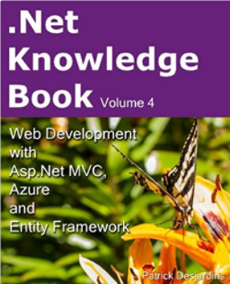
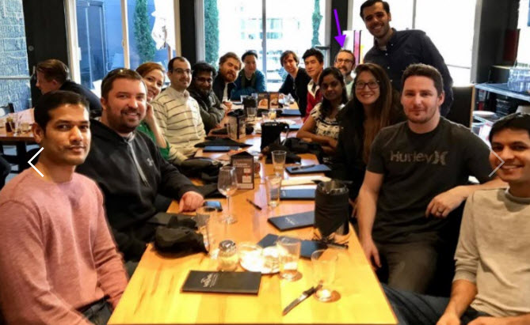
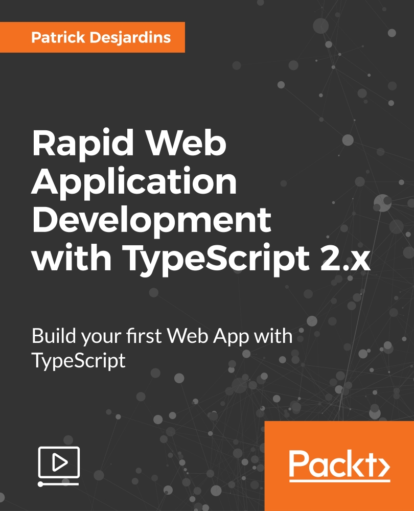
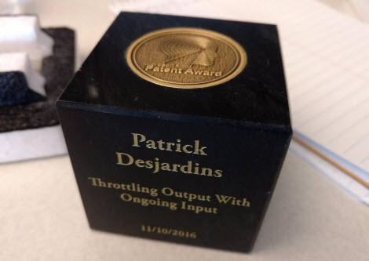
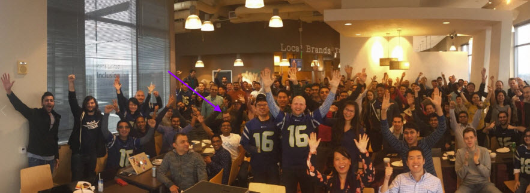
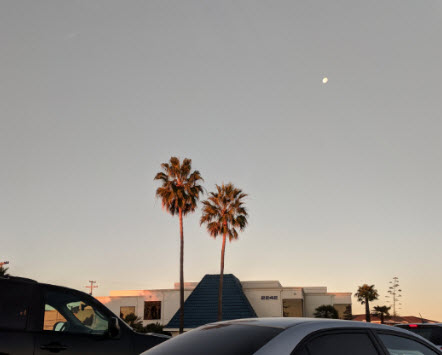
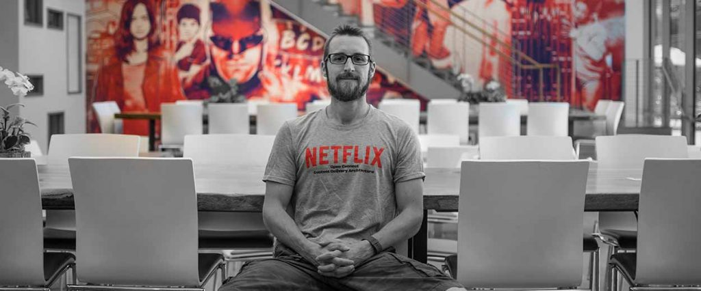
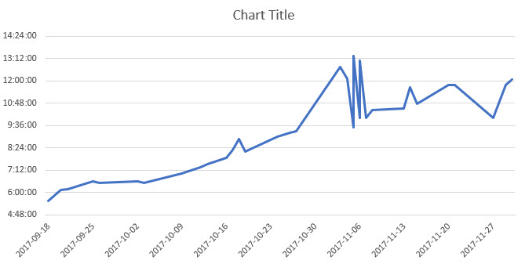
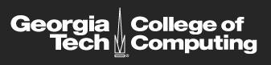

Every year, since about 5 years, I've been wondering how the next year could be better than the one that just finished. It seems that it always get better and I am blessed that it continues this way. This year, I decided to proactively make this year awesome by setting a monthly objective of having one [accomplishment or objective that get me out of my comfort zone](./2017-accomplishment-goals) to be a better person. Nothing is planned ahead, it comes and goes during each month. We are now getting in the last few days of the year and it's a good time to step back and look what happened.

**January 2017** I started the year by publishing my [2016 blog's posts annual book](https://www.createspace.com/6697657). This was something I started writing in November and December of the previous year but was able to publish it as the first achievement of the year. This is something I kept doing even if I am limited in time since the arrival of my daughter two years ago. I keep writing to this blog every week and sometimes twice. In 2017, I've been able to write 56 articles which resulted in a book of 272 pages. Like everytime I publish a book, I found a professional to proofread and each time learns a lot since I am still learning how to be efficient in English.

**February 2017** The second month's accomplishment was to leave Microsoft Visual Studio Online team to join Microsoft Teams. I had been at Microsoft for two years and a half and it was time to see something different and Microsoft Team was a new challenge while remaining at Microsoft. The product was not yet released to the public and was also an opportunity to launch a Microsoft version 1 product. It was a big change, not only it was physically farther at Bellevue instead of Redmond, but the programming language was AngularJS instead of React that I was using for about a year. I was in charge, with a small team, of all the front-end code for the notification and feeds for the web application.

**March 2017** The third-month objective was to start recording two online courses in TypeScript. I got approached by Packt to deliver these few months later. It was a good learning experience and a significant amount of work. The preparation for recording is gargantuan. Lots of slides, lots of code and everything was project based so it needed to make sense from the start to the end. I won't hide that it was all my evenings for few months. I delivered everything about 2 months earlier than the deadline which was perfect for what will happen next. Recording in English was also more demanding for me which required writing a script since I couldn't improvise and code whilst still be coherent. I would do it again, but differently.

 

**April 2017** April was a totally different project. Still aligned with an improvement in myself, this time physically. I finally decided to jump to fix my teeth. This might not sound like a challenge or an improvement but I've been thinking about it for a while and wasn't something I was a thrill to do. At the time I am writing this recapitulation I am already half-way through the treatment and it's working good. So far, I did one round of Invisalign which require keeping a retainer in your mouth for more than 22 hours per day. The first weeks were harder since it requires to develop new habits like carrying always with you a toothbrush and floss, but now I am used to it and keep them more than the recommended time. It's a long process that will continue in 2018. So far, compared to when I jumped into this objective, the visual difference is remarkable and will help me to have a healthy mouth in the long term.

This month was rich in objectives and accomplishments because I also decided to start reading books. I decided to set the bar to one book per month, so 12 for the year even if I decided this objective in April. Few days remain to December and I have read 22 books. I had the challenge at some point that I couldn't use public transportation so I moved to audiobook to be able to fulfill my goal. Here is the list of book I read this year.

- 📖 [Elon Musk: Tesla, SpaceX, and the Quest for a Fantastic Future](https://www.amazon.com/Elon-Musk-SpaceX-Fantastic-Future/dp/006230125X)
- 📖 [Zero to One: Notes on Startups, or How to Build the Future](https://www.amazon.com/Zero-One-Notes-Startups-Future/dp/0804139296)
- 📖 [No fear, No Excuse. What you need to do to have a great career](https://www.amazon.com/No-Fears-Excuses-Great-Career/dp/0544663330)
- 📖 [Maximize Your Potential: Grow Your Expertise, Take Bold Risks & Build an Incredible Career](https://www.amazon.com/Maximize-Your-Potential-Expertise-Incredible/dp/1477800891)
- 📖 [Patton: Blood, Guts, and Prayer](https://www.amazon.com/Patton-Blood-Prayer-Michael-Keane/dp/1596983264)
- 📖 [Trump, The Art of the Deal](https://www.amazon.com/Trump-Art-Deal-Donald-J/dp/0399594493)
- 📖 [Chaos Monkeys Obscene Fortune and Random Failure in Silicon Valley](https://www.amazon.com/Chaos-Monkeys-Obscene-Fortune-Failure-ebook/dp/B019MMUAAQ)
- 📖 [Self-Editing for Fiction Writers, Second Edition: How to Edit Yourself Into Print](https://www.amazon.com/Self-Editing-Fiction-Writers-Second-Yourself/dp/0060545690)
- 📖 [Unstoppable: 45 Powerful Stories of Perseverance and Triumph from People Just Like You](https://www.amazon.com/Unstoppable-Powerful-Stories-Perseverance-Triumph/dp/1570713383)
- 📖 [Shoe Dog: A Memoir by the Creator of Nike](https://www.amazon.com/Shoe-Dog-Memoir-Creator-Nike/dp/1501135910)
- 📖 [The Richest Man in Babylon & The Magic Story](https://www.amazon.com/Richest-Man-Babylon-Magic-Story/dp/1455817279/)
- 📖 [Outliers: The Story of Success](https://www.amazon.com/Outliers-Story-Success-Malcolm-Gladwell/dp/0316017930/)
- 📖 [Act Like a Success, Think Like a Success: Discovering Your Gift and the Way to Life's Riches](https://www.amazon.com/Act-Like-Success-Think-Discovering/dp/0062220322/)
- 📖 [If You're Not First, You're Last: Sales Strategies to Dominate Your Market and Beat Your Competition](https://www.amazon.com/Youre-Not-First-Last-Competition/dp/0470624353)
- 📖 [50 lessons I learned from the world's #1 goal achiever](https://www.amazon.com/Lessons-Learned-Worlds-Goal-Achiever/dp/1937918793)
- 📖 [The Future of Happiness: 5 Modern Strategies for Balancing Productivity and Well-Being in the Digital Era](https://www.amazon.com/Future-Happiness-Strategies-Productivity-Well-Being/dp/1942952945/)
- 📖 [The End of Average: How We Succeed in a World That Values Sameness](https://www.amazon.com/End-Average-Succeed-Values-Sameness/dp/0062358367)
- 📖 [How Google Works](https://www.amazon.com/How-Google-Works-Eric-Schmidt/dp/1455582344)
- 📖 [1984 by George Orwell](https://www.amazon.com/1984-Signet-Classics-George-Orwell/dp/0451524934)
- 📖 [Never Split the Difference: Negotiating As If Your Life Depended On It](https://www.amazon.com/Never-Split-Difference-Negotiating-Depended/dp/0062407805/)
- 📖 [Listen!: The Art of Effective Communication](https://www.amazon.com/Dale-Carnegie-Associates-Listen-Communication/dp/1469005360/)
- 📖 [Many Lives, Many Masters](https://www.amazon.com/Many-Lives-Masters-Prominent-Psychiatrist/dp/0671657860/)

I strongly recommend three books of his list because of how they are written and how the message is inspiring and motivating: "The End of Average: How We Succeed in a World That Values Sameness", "If You’re Not First, You’re Last: Sales Strategies to Dominate Your Market and Beat Your Competition" and "Never Split the Difference: Negotiating As If Your Life Depended On It" which was both a delight to listen/read from the first page to the end. The three worse books of the list, because of very little value content that you should skip are "The Future of Happiness: 5 Modern Strategies for Balancing Productivity and Well-Being in the Digital Era", "Listen!: The Art of Effective Communication" and "The Richest Man in Babylon and The Magic Story".

Lastly, in April I finalized two patents at Microsoft as a sole inventor. This was my second and third at Microsoft. I was very happy.

**May 2017** In May, I decided to start writing a private journal. The goal was to reflect on what went well and not. Also, a way to meditate in time of struggle. I gave myself the objective of writing every two days about 500 words. I did 162 entry for a total of 46 000 words. It's less than desired but the time to write was way more than expected. I also wanted to write in English and in a proper form. I still count it as a success since I didn't give up and found that writing at the proper time to be very soothing. It also gives me a time to re-evaluate some perspectives on different events that were happening. I'll continue in 2018 without having a hard rule about how many time I should write. It's also a great way to improve my writing. During that month, I filled my fourth patent with Microsoft.

**June 2017** In June, I got approached by many big companies which most of them have their headquarters in Silicon Valley. I was satisfied with Microsoft and had joined Microsoft Team merely 6 months ago, so I was not looking actively. I decided to do the interview as my June objective. Not only this was a good objective to get out of my comfort zone, I also went on-site for Netflix interview and got an offer. In addition, in June, I filled my fifth and sixth patent at Microsoft. I'll never get the Microsoft's cube for these two patents (neither the third one), but I am still honored to have the change to have 6 patent at Microsoft.

**July 2017** In July, it is not an objective, but an accomplishment and a challenge. I accepted the offer of Netflix. Time to move from Washington (Redmond) to California (San Jose). Moving with a toddler is not as easy that moving alone but it went well. Public transportation is lacking, and I needed to get a second car, which I chose to have an electric car. I am renting a house where we plan to stay for several years. I am right now in charge of a brand new web portal written in React, Redux and TypeScript. Like many projects at Netflix, individual contributors are responsible and own a lot of responsibilities and this portal is on my own shoulders -- I like it. I am learning about Docker, see a new way to work which is very different from every place I worked before. I am still adapting to that new style of work but enjoy having a lot of responsibilities. Netflix definitely treats its employees as self-sufficient for everything. This month was also with the objective to switch to a Mac and Google ecosystem, leaving Microsoft and Windows behind. I could have decided to work on a Dell computer with Windows, but since the majority of the developers are using a MacBook Pro I decided to jump and learn. So far so good, few things are better, few things are worse, overall I do not think it's worth a feud on any sides.

**August 2017** August was the time I realized that my English was worse than I thought. At Microsoft, there is a lot of immigrants (like myself) and the level of English was more forgiven. At Netflix, I found myself in many situations where using the exact right word was a missing key. Nothing bad, nothing wrong and all on me. So I decided to start studying a popular test called "GRE". I first intended to actually do the test at some point, but the level if a little higher than expected. I never gave up and from August to November spent 2 hours every weekday learning new words and reading preparation materials. I study new words using an application called Quizlet which I can enter words and definition. The application quizzes you afterward. So far, I have around 440 new entries and I am mastering half of them. I can definitely recognize all of them so, I plan to keep going but I slowly diminished the number of time to about 15 minutes per day. I am taking some pause to do few quizzes and go back to work. On the long term, I believe I'll grow my vocabulary and be able to have a more decent conversation with accurate words.

**September 2017** September was the time to get an improvement physically. It was a while since I did some sport. Before moving to the USA (three years and a half ago), I was doing weight exercises three to four times every week. I continued in the USA until I got my daughter. I always felt bad to go to the gym while I had worked the whole day. And, when she was asleep, I had so many things to do that I skipped more and more the gym. In September, I decided to do cardio. I didn't want to run because I always hated it. So, I started doing jump rope. I started in September doing 2 minutes, 3 times per week. I am now at 14 minutes 3 times per week. I am increasing about 10 to 20 seconds every time. Little by little my cardio is getting better. It's also not too much time consuming and I can do it outside the house or in the garage hence keep an eye on my daughter while she sleeps and runs to her if she requests my attention. This month I also added a new objective to add 2 words per day in the application to keep me going to learn new words. This is good to start, but keeping the pace would be hard. I found myself forgetting older words, so I decided to stop adding new words in December to really master the 440 that I had. I was still a very good objective because when I started to study for the GRE in August, I had about 100 words. So, the 4 following months allowed to be successful with that objective.

**October 2017** October was interesting. Few weeks before, I decided that I wanted to slowly start to study more around machine learning and artificial intelligence. There is a lot of material online, maybe too much to get started. I am also deeply in web development which is something that never ends since there are so many materials and new technologies that see the day. So, I decided that it might be a good idea to be more focused and guided. I decided to apply for Georgia Tech Master Program in Computer Science under the machine learning profile. If everything goes well, this will take me three years in half at the pace of one class per session which is about an average of 15 hours per week. This seems realistic since I can do this amount of work when my daughter goes to sleep. I am excited and looking forward to start in January next year.

**November 2017** November was quieter. However, I got a good news at Netflix which was unexcepted since I just started at Netflix. I also published the [2017 blogs post book](./new-book-released) in a record time. Mostly because I already had written all the article to be published for the remaining of the year. 81 articles and 225 pages. I'm thinking that next year to do the same instead of publishing the following year. So, this is [my 7th books](http://patrickdesjardins.com/books.php).

**December 2017** December objective is still under development. I've been developing and writing about TypeScript for a while but never had a book written about TypeScript. So, my goal is to be able to draft a whole book about the fundamental of TypeScript. I am aiming to write about 200 pages book from the basic to advanced stuff that is actually useful. I aim this book to target people with experience in JavaScript that would like to switch to TypeScript. This will be an open door to provide in the future the second book with only advanced topics. Regardless of the forthcoming, the goal is to try to write this one quickly. Since I work day to day since the last 3 years with TypeScript, it shouldn't be hard. However, I am realistic that it will be just the draft since editing and proofreading and publishing takes time.

I am finishing writing this recapitulation and I am quite proud of this year. Once again, the year finish and I have the self-thought of wondering how can the next year be even better. One key principle I learned since I moved in the USA is that people make their own luck. I could wish to have a next new year awesome and just wait or to do actions. I decided to take monthly actions in 2018 and couldn't be happier. That being said, will I continue to have a monthly accomplishments or objectives every month next year? I am still debating. I like the idea to have a deadline to force myself to find something out of my comfort zone but this needs to be executed smartly. I plan to stay at Netflix in 2018, I plan to stay in California and plan to have bigger projects like starting the master program at Georgia Tech. There is a balance between quantity and quality and I foresee 2018 being less in quantity, and deeper in quality. There are many 2018 changes that I desire to pursue. I plan to continue to improve my vocabulary every month but won't go any further with the GRE. I plan to keep doing physical exercise and continue to write blog posts as well. I also really enjoy reading books, or should I say listen to audiobooks and will keep that habit. The important at the end is to be satisfied with what has been done and I am quite happy so mission accomplished. It was awesome 2017, looking for you 2018!
