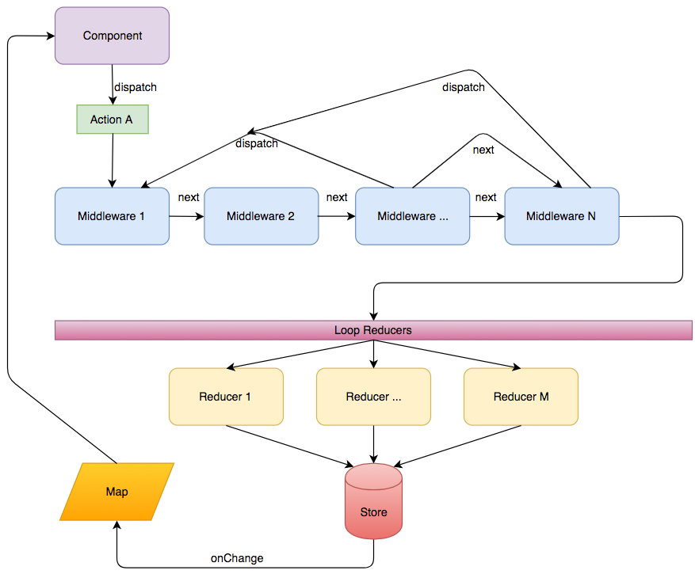

Redux offers many ways to handle the flow of information in your system. One tool in the toolbox is using Middleware. I already discussed how we can [leverage Middleware to do the heavy lifting instead of action creators](./react-and-redux-without-actioncreator). In this article, we will look at one question that you may stumble which is should I use next() or dispatch() withing my middleware?

Before digging into the main topic, let's illustrate the flow on which we will analyze the question.



The illustration works from top to bottom. A component dispatches an action with the **dispatch** function from Redux library. The action contains a type (string) and a payload (data). Middlewares are injected in the flow with Redux at the configuration stage of Redux with the function **applyMiddleware**. For the hypothetic case illustrated, the configuration would be like the following code.

```typescript
import { createStore, applyMiddleware } from "redux";
const appliedMiddleware = applyMiddleware(
  middleware1,
  middleware2,
  middleware3,
  middleware4,
  middleware5,
  middleware6
);

const reducers = { reducer1, reducer2, reducer3, reducer4 };
const reducers = combineReducers(reducersTyped);

const store: Store<YourAppState> = createStore(
  reducers,
  composeEnhancers(appliedMiddleware)
);
class App extends React.Component<{}, YourAppState> {
  public render(): JSX.Element {
    return <Provider store={store}></Provider>;
  }
}
```

The amount of middleware and reducer doesn't need to coincide. They are orthogonal concepts. At some point, an action will be invoked via the **dispatch** function provided by Redux. Let's call the action "A". When the action is dispatched, Redux will pass the object to the first middleware. This one is responsible to do something or not. The middleware can inspect the type (string) and look if it knows what to do with it. Or, it can look at the payload and do something with it -- it's very flexible and unopinionated about the selection logic. The default behavior, when nothing is required, is to pass to the next middleware the action. This is done by calling the **next** function. As you can see in the image, middleware1 next connect to middleware2 and so on.

Imagine the scenario where you have an asynchronous call to an API in one of your middleware. This one should not block and must return something. Usually, you return the same action but before calling your API and wait for the response to come back (mostly wait the promise to be resolved). When the response comes back you have two choices: call **next** or **dispatch** a new action. The first option, calling next, will take the action you choose and pass it to the next middleware, bypassing all previous ones. Dispatching the action you choose will bring back the new action at the beginning of the stack to have this one move down the each middleware.

There is not an absolute solution in this regard. It's a case by case solution. However, you mostly want to move the new action back to the front. In most cases, middleware might not do anything. For example, you may want to use next if your middleware is the last one and is doing the final manipulation to the data and doesn't require any other middleware to alter the data before reaching the reducers. You might want to use next in cases where the new data may start new work from a previous middleware. This can be the case if when fetching data from a middleware require another middleware to fetch more data while analyzing the response.

Once the last middleware is reached and return for the last time **next**. The reducers are called in sequence and depending on their selection pattern may take the payload of the action and alter the store. In the case of the component dispatching data that require having a response from an API which is asynchronous, reducers will receive the initial action with the payload that requests the data, hence may do nothing to the store or just change a boolean to indicate that something is loading. Later, when the middleware dispatch or next the response, reducers will be called again and they may do something.

Finally, the loop is closed by having the store raising an event saying that the store has changed. From there Redux-React offers a "Provider" component that takes care to refresh the state or you can subscribe directly to the store to get notified a refresh the state manually. In both cases, the component is rendered and the changes are displayed to the user.
