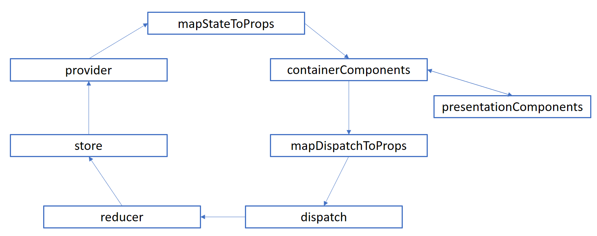
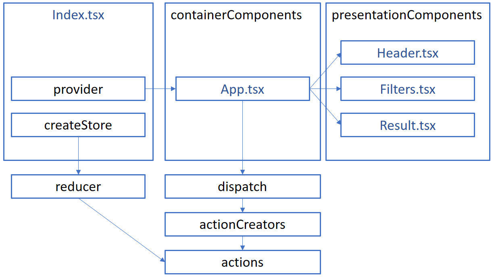
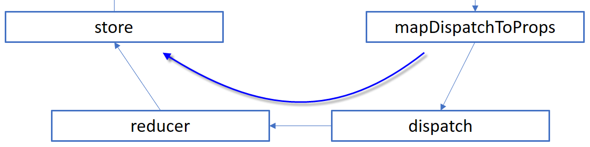
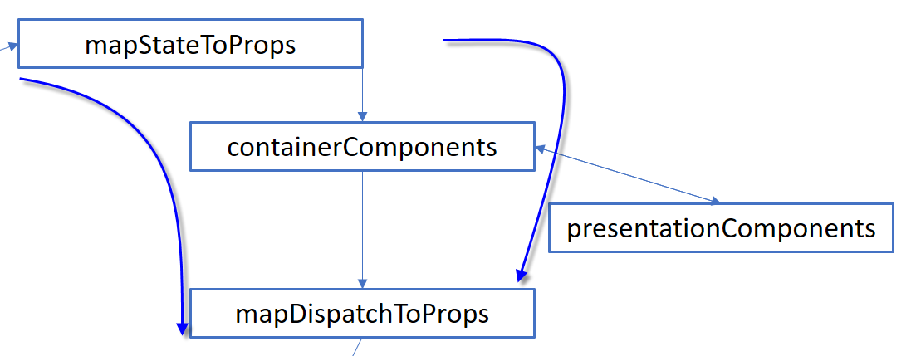

Redux is a state manager that allows flowing the data from component to the store and from the store to components. It is one of the most popular flux cycles at this moment. The reason for its popularity is mostly because of how everything is well separated and have its own unique goal. Once set up, it's a chart to maintain and to extend. While Redux has a lot of documentations in term of videos, text tutorials and examples. However, Redux can be intimidating because of its steep learning curve. TypeScript is also not as well documented with Redux and require some more work to make it work. This is part 1 of many that will describe how to use TypeScript, React and Redux.



The first thing to understand is some of the terms used. The first one is "provider". The provider is coming from the "react-redux" library. It's a React's component that wraps your main component.



For example, if your application main entry point is "App.tsx", which use ReactDom. Render, then you need to import the "provider" component and wrap your "App" container.

```typescript
ReactDOM.render( <Provider store={store}> <App /> </Provider> , document.getElementById("main")); 
``` 


In term of code, almost nothing is changed. You have the same ReactDOM.render method, but the use of this new "provider" component. This component takes property named "store". The store is the second term that is important. This one will keep the state of the application. State means it holds the JSON object that contains the whole data for your application. This means that the entry point component needs to create the store just before rendering the Provider & App component.

```typescript
const store = createStore(appReducer); ReactDOM.render( <Provider store={store}> <App /> </Provider> , document.getElementById("main")); 
``` 




This introduces us the third term which is "reducer". To create a store you need to pass the application reducer. This one is a little bit more complex to understand. The store is not a store in the way of a SQL database, or a Local Storage or any kind of persistence. It's a place where the JSON will live, but also where handle the transformation of the data. The transformation is where the logic resides. The return values of a reducer is always a copy, immutable of the actual state. It's getting the actual state (JSON object) as a parameter and return back a JSON object with the same schema of the state that came in. For example, if the website allows having a different kind of filtering for the result, every user's choice will be sent to a reducer that will change the state to set the value of the filter selected and the new state will be returned by the reducer which will be stored in the store. The store will automatically emit a change event which the "Provider" component will propagate.



In the world of Redux, there is a separation among components. There are two types. The first one is **container component**, the second one is **presentation component**. The second one is the easier to understand. It is a React's component that doesn't have any knowledge of Redux or any Flux pattern or life pattern. It receives properties to display and action is also part of delegate action passed by a property. The first type, the container component, is handling Redux. In our example, it's App.tsx. It's a stateless React component that is exported by using Redux's "connect" function which has two parameters that take care of the mapping between Redux's store state and the container component, and the other way around between the dispatcher actions to the component properties. The method that maps the state to the props allows to pass down a portion of the store instead of the whole store. The method that maps the dispatch to properties. This method will be invoked when the property of the action is invoked. This means that the return type must be part of the container component property type.

In this article, we saw some key concepts of Redux. We saw that the provider allows to glue Redux and React, and understand that components can be aware and not of Redux. The concept of reducer was introduced as a way to modify the state. Finally, we briefly exposed that we need to connect the container component with a specific method to bind React to Redux with the "mapDispatchToProps" and the method "mapStateToProps" to bind Redux to React. The second part will bring code to see how React and Redux can be used with the collaboration of TypeScript.


### Articles of the series:

1. [TypeScript, React and Redux](./typescript-react-and-redux-part-1-the-big-picture)
2. [TypeScript and Redux Store](./typescript-react-and-redux-part-2-creating-the-store-and-the-reducer)
3. [TypeScript Redux Store Binding](./typescript-react-and-redux-part-3-binding-the-store-and-component)
4. [TypeScript Redux Action Creators](./typescript-react-and-redux-part-4-multiple-returns-from-action-creator)
5. [TypeScript, React and Redux Part 5 : Reducer with Different Actions](./typescript-react-and-redux-part-5-reducer-with-different-actions)
