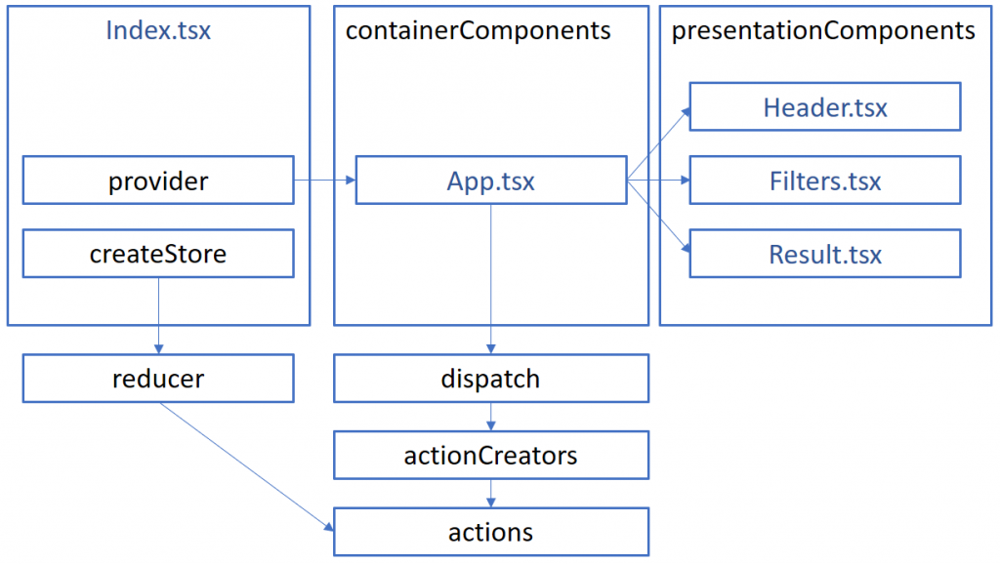

In the previous article, we discussed what is Redux and how the information flow through the data life cycle. This time, we will see more concretely how to bring Redux into a small React application written with TypeScript.

The first step is to get some NPM packages. We need TypeScript, React, React-Dom, Redux and React-Redux libraries.

```typescript
npm install --save-dev typescript npm install --save react npm install --save react-dom npm install --save redux npm install --save react-redux npm install --save-dev @types/react npm install --save-dev @types/react-dom npm install --save-dev @types/redux npm install --save-dev @types/react-redux 
``` 


In the example that we will explain, the life cycle starts from the file "index.tsx".



In this basic example, we will use a single store with a single reducer. This means we can use the createStore function from Redux directly without using any combiners of any kind (this will be cover in a future article). This file contains almost more imports than code.

```typescript
import \* as React from "react"; import \* as ReactDOM from "react-dom"; import { createStore } from "redux"; import App from "./components/containerComponents/App"; import { appReducer } from "./redux/reducers"; import { Provider } from "react-redux";

const store = createStore(appReducer); ReactDOM.render( <Provider store={store}> <App /> </Provider> , document.getElementById("main")); 
``` 


The goal is to setup the store and the reducer. The store is where the data is stored and where the reducer will be invoked. To have the store being able to use a reducer, we need to pass down the reducer in the create store function. To have the store being able to notify our React's components, we need to use a "react-redux" component. This component goal is to notify the React component to update. This helper is named "Provider" and come from "react-redux" and pass a store property which is the created store few lines above. The missing piece is the reducer to pass to the store. This is coming from your own file. In this example, it's coming from a file that we will see in the next paragraph named "appReducer".

The example allows the user to change some filter options to get picture depending on the selected criteria. The reducer will modify the state (store) depending on what the user selects from the form. The reducer will be called by the React component (see later in this article) with an action which the reducer will digest. That is why we import the action at the beginning of this file. The second important type of class to import is the contract/schema of the store. The reducer is the only one who modifies the state of the store, hence needs to know about the interface of the state. Finally, we need to import the action creator (we will see soon) which will indicate to the reducer which action that is active right now.

Below the imports, the file contains an initial state which is how the state should be if nothing has been yet initialized. This is the

```typescript
import { FILTER\_APPLIED, RESET, SHOW\_RESULT, FILTER\_CHANGED } from "./actions"; import { IAppState, IResults, IFilters } from "../models/filterModels"; import { IUpdateFilterActionCreator } from "./actionsCreator";

const initialState = { filters: { tags: [], isBlackAndWhite: false, startingDate: new Date(), endingDate: new Date(), numberOfPeople: 100, smileLevel: 0, happinessLevel: 0, peopleName: [] } as IFilters , results: { pictureResults: [] } as IResults } as IAppState; 
``` 


The final piece is the reducer code. The reducer is a single method that takes the state and the action. The state and the action come from the component. If you need to send a subset of the state there are multiple possibilities. You can use multiple states in the store and use a combined reduced (will be discussed in a future article) or copy the actual state (so immutable) and alter the modified value. The latter is what we will do.

```typescript
export function appReducer(state: IAppState = initialState, action: IUpdateFilterActionCreator): IAppState { switch (action.type) { case RESET: return initialState; case FILTER\_CHANGED: return Object.assign({}, state, { filters: action.filters }) as IAppState; case SHOW\_RESULT: return Object.assign({}, state, { results: action.results }) as IAppState; default: return state } } 
``` 


The reducer looks for the action and alters the state by returning a new state. This is important to always return a new object with a brand new reference. This makes the store's state immutable. If someone tries to change the value of the store somewhere else, it won't affect the React components. In this example, we have 3 actions which one reset the filters to the initial state, one that changes the filter from the filters object received by the "Apply" button from the UI and one that will be executed once the filter got applied (after the request to the back-end returned a response.

In this article, we created a store with the createStore method provided by Redux. We wrapped our application component (App.tsx) in the entry component (Index.tsx) to allows the store to be a hook with react with the Provider component from "react-redux". We saw how to create a reducer which is a function that takes the state and the action creator and return an immutable state which is why we call the reducer's function a pure function. In the next article, we will explore the missing piece to hook actions from the component to the reducer we created.

Articles of the series:

1. [TypeScript, React and Redux](http://patrickdesjardins.com/blog/typescript-react-and-redux-part-1-the-big-picture)
2. [TypeScript and Redux Store](http://patrickdesjardins.com/blog/typescript-react-and-redux-part-2-creating-the-store-and-the-reducer)
3. [TypeScript Redux Store Binding](http://patrickdesjardins.com/blog/typescript-react-and-redux-part-3-binding-the-store-and-component)
4. [TypeScript Redux Action Creators](http://patrickdesjardins.com/blog/typescript-react-and-redux-part-4-multiple-returns-from-action-creator)
[](http://patrickdesjardins.com/blog/typescript-react-and-redux-part-4-multiple-returns-from-action-creator)6. [](http://patrickdesjardins.com/blog/typescript-react-and-redux-part-4-multiple-returns-from-action-creator)[TypeScript, React and Redux Part 5 : Reducer with Different Actions](http://patrickdesjardins.com/blog/typescript-react-and-redux-part-5-reducer-with-different-actions)
[](http://patrickdesjardins.com/blog/typescript-react-and-redux-part-5-reducer-with-different-actions)
