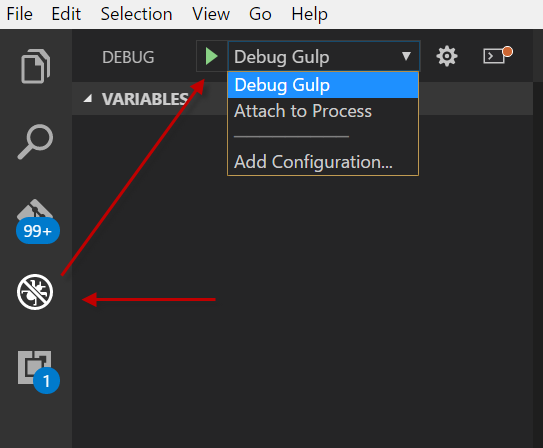
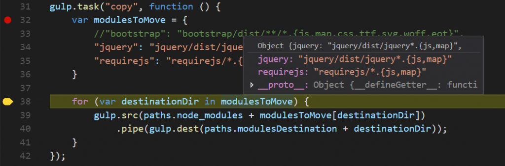

Microsoft Visual Studio Code (VSCode) has the capability to debug TypeScript, JavaScript and a lot of other languages. One interesting thing is that Visual Studio Code can also debug Gulp script (written in JavaScript). This is very useful since writing code that become complex is easier with good step through capabilities.

To do so, we need to add a launch configuration for VSCode. This is done by adding inside the root of your project a folder called ".vscode" and adding a file named "launch.json".

This file is used by Visual Studio when you hit "F5" or when you go in the left panel, under "debug" and click "Play". 

The configuration contains few item that you must have, and some that you need to configure. ```typescript
{ "version": "0.2.0", "configurations": [ { "type": "node", "request": "launch", "name": "Debug Gulp", "program": "${workspaceRoot}/node\_modules/gulp/bin/gulp.js", "stopOnEntry": true, "args": [ "copy" ], "cwd": "${workspaceRoot}/", "outFiles": [], "sourceMaps": true, "runtimeExecutable": null, "env": { } } ] } 
``` 


The type, request are required to be "node" and "launch" which said to VSCode that we will debug a node application. The "name" property is the name that will show in the debugger. In the screenshot you see it's written "Debug Gulp" which is the name specified here. The very important part is the "program" which must point to Gulp. So far, we said to VSCode to execute node with the program Gulp.

"StopOnEntry" is not required but it will stop right when it loads the program. I found it handy to have it stop, which allow me to go set my breakpoint into the Gulp's task I want to debug. In regard of which task we debug, it is defined under the args. In my example above, I am debugging the task named "copy". The "cwd" is where the gulpfile.js is located, this is where the task to debug is located. It's white to use the workspace root keyword to start from a good unchangeable root. 
