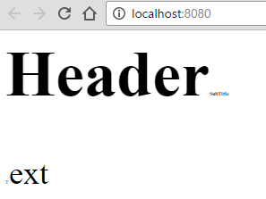

Transforming SCSS into CSS is a matter of using less than 5 lines of code. NPM has a package that you can use with Gulp. In less than 5 minutes, you can have SCSS configured to compile all your files into CSS.

The first step is to get the gulp sass package. You need to install the dependency has development since you won't need it at the browser level. ``` 
 npm install gulp-sass --save-dev 
``` 

The next step is to create a step that will take all you scss files, pipe the files into the sass compiler and pipe the output into your output folder, where you will references them from your HTML file to serve the style. Here is the Gulp task.

```typescript
gulp.task('scss', function() { gulp.src('sass/**/*.scss') .pipe(sass().on('error', sass.logError)) .pipe(gulp.dest('./css/')); }); 
``` 


You can find all changes for SCSS inside [this commit](https://github.com/MrDesjardins/TypescriptNpmGulp/commit/02410d535a12cb48b167ff45b18970d312776270)[1] for the project we are building up. You may see some differences in the commit compared to this blog post. For example, instead of relying on string directly inside the task for path, I opted to use a constant. It's always better to have in a centralized way in case of change or in case that it can be reused in another task.

Another change that you might consider is to add this new created task in the dependency of tasks for the build task or the watcher.

Here is a screenshot of the output where the SCSS generates CSS that modify the HTML.

SCSS: 
```css
 body{ font-size:36px; span{ font-size:6px; } } 
```


CSS: 
```css
 body { font-size: 36px; } body span { font-size: 6px; } 
```


HTML Output: 

[1]:https://github.com/MrDesjardins/TypescriptNpmGulp/commit/02410d535a12cb48b167ff45b18970d312776270
