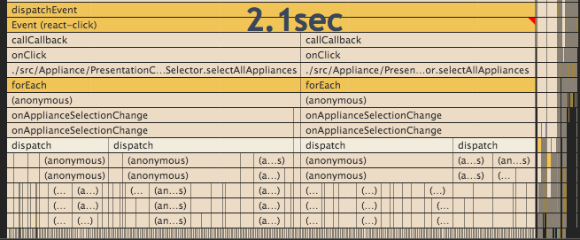
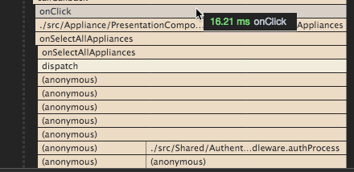

Imagine the situation of a UI with many checkboxes and an option to select them all. With the perspective that the feature of checking all checkboxes is new, wouldn’t it be a good idea to have the “select all” button loop the checkbox action with each ID one by one? The short answer is no, and we will see how doing so can be expensive.

It might be the most straightforward and quickest way to invoke `onCheck` in a loop. It has the advantage of reusing the dispatch function, as well as the action function and the reducer. The problem is the number of computations done by calling several actions in a loop. While Redux can handle quite a lot of actions fast, there are some boundaries where you will notice some slowing down. Here is an actual code I had to optimize which went **from 2100ms to 16ms**.

The following image is the benchmark of a code that was looping in the React component when you click a function for each checkbox with a selected value.

Chrome Performance on the Click Event Before the Modification

This is the code with a dedicated function that a middleware was creating another action with the list of all entity from the Redux's state with the mention to select the entity which the Reducer can read once and set the state once.

Chrome Performance on the Click Event After the Modification

Creating the additional dispatch function, passing this one down to the component and creating the actions was more work. It takes about 20 minutes mostly because I wanted to have the middleware to handle the logic of selecting all because I keep all reducers very slim and dummy. So, I had to create 2 actions. However, this 20 minutes was well worth it because the user sees a user interface that is O(1) when clicking the "select all" instead of being O(n).

The underlying problem is that every action goes back to a [full Redux's lifetime loop](a-simple-react-and-redux-architecture) format. Indeed, optimization can occur at that level as well, but avoiding starting Redux's cycle was a step in sound practice.
