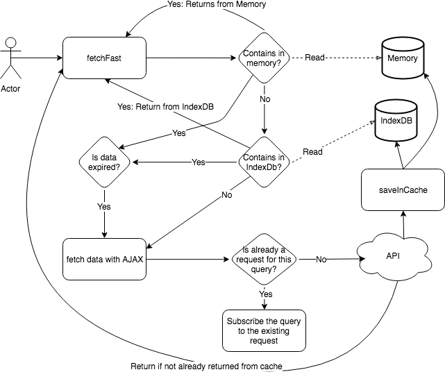
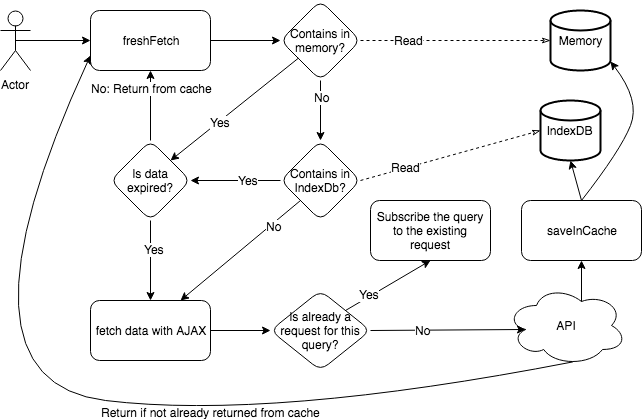
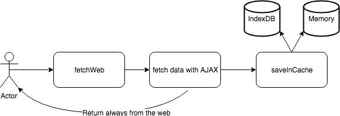
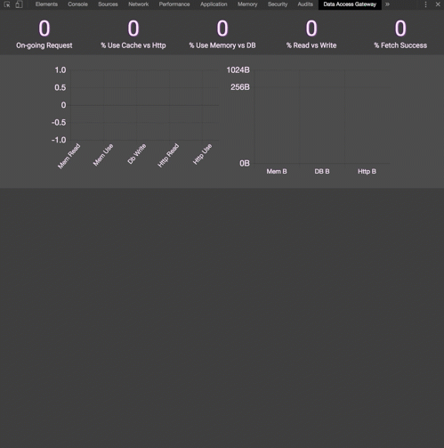

I have an [open source project](https://github.com/MrDesjardins/dataaccessgateway) to handle Ajax call and cache for about 3 months now. I am building that project in my free time and I have been dogfooding the library in one of my project at Netflix. The goal of the library is to avoid having parallel similar Ajax calls and to leverage a cache mechanism to avoid fetching data on the backend.

Why not leveraging the service worker? Service worker is a great way to have background queries executed and cached. However, it has some drawbacks. The first one is that you have all the logic outside the scope of your project. It means that if you want to have a particular caching policy depending on the data that it is harder to handle. For example, depending on some metrics that are displayed in a chart, the cache lifetime of some objects might be different. A graph for several years could be cached longer than a chart for the last hour. I am not saying it is impossible to handle at service worker but that code would still be required to customize and would be spread between the caller (who know the logic) and the service worker (which should be as generic as possible). The second drawback is that you cannot have several strategies easily. Some part of your application might be good to get data that is obsolete while other parts can use the cache but the data must be under a specific time window and finally some other part might require to always have the latest from the server. In the end, a system with different logics of caching makes the service worker harder because the logic is divided. Finally, regardless of the separation and the rules, you have to code the service worker to handle the cache, so you have to code the code that goes in the index db, etc.



The library I built handle HTTP request to fetch the data and allows to cache the data in an IndexDB and/or in memory. There are two levels of cache which is handy for fast access but also for returning user. The library also has three built-in functions to query data: fast, fresh and web. The fast approach gets as fast as possible the data from the cache regardless of if obsolete or not. If obsolete it will do a HTTP request for the next request to be ready with fresh data.



The fresh approach checks for the date of expiration and if still fresh will return immediately. Otherwise, it will fetch and wait for the answer. Once the answer is back, it returns the data and stores it. Indeed, this is a little bit slower since in many scenarios you have to wait.



The last function fetches the data from the web directly without looking at the cache. The function stores the data in the cache, letting the two formers function leveraging the data. The function handles concurrent requests for the same request as well. Like the other functions, the concurrency is interesting in a situation where the user clicks around the interface which launches several same requests. Instead of having all these requests in parallel who would return the same response, the caller will be subscribed to the former request and will receive the initial response. It means that the data is fresh and is returned faster for the subsequent call. It also pollutes less the backend with useless calls.

To have insight into what is happening, I created a second [side-project that is a Chrome Extension.](https://github.com/MrDesjardins/dataaccessgatewaychromeextension). This is not released yet, but the code is available. It gives information about the quantity of call done at each level (HTTP request, IndexDb, Memory) and what is actually used. It has insight into the size of data fetching by each source. Finally, you can see all the logs and a summary of the percentile of all the fetches.



So, how does it looks? While it might sound complicated it is actually easy to use. There is the initialization portion that is done once in your single-page application, and after the request.

```typescript
// Initialization
export const DATABASE_BASE_WITH_VERSION = "DB_V1";
export const DataAccess = DataAccessGateway(DATABASE_BASE_WITH_VERSION);

// Configuration can change at any time
DataAccess.setConfiguration({
  isCacheEnabled: true,
  logError: (error: LogError) => {
    Log.trackError(error.error, "DataAccessError", error);
  },
});

// Query example
const requestInfo: AxiosRequestConfig = {
  method: "GET",
  url: "http://yoururl.com",
};
const promise1 = DataAccess.fetchFast<YourEntityModel>({
  request: requestInfo,
})
  .then((response) => {
    // Do here what ever you want
    return response.result;
  })
  .catch((error: AxiosError) => {
    // You can track error here throw error;
  });
```

The query use AxioRequestConfig that is a popular Ajax library. I am leveraging the library at the moment. Every request use the URL has the unique identifier of unicity for a request. In case you have POST with data, you can provide manually an ID in the object of the data access request fetch request. It is also possible to pass configuration for the life of the cache (in memory and IndexDB) for a single request or globally for all the Data Access Gateway library.

To summarize, Data Access Gateway is a library that helps handling caching and improve the performance of your application. It can be used directly in your code or even in your service worker. The goal is to avoid redundant request as well as having a fine-grained control on the caching policy while being as simple as possible to use.
