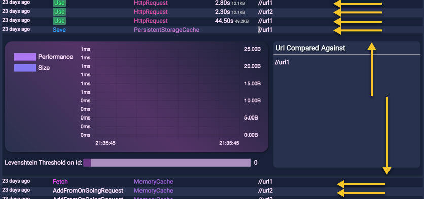
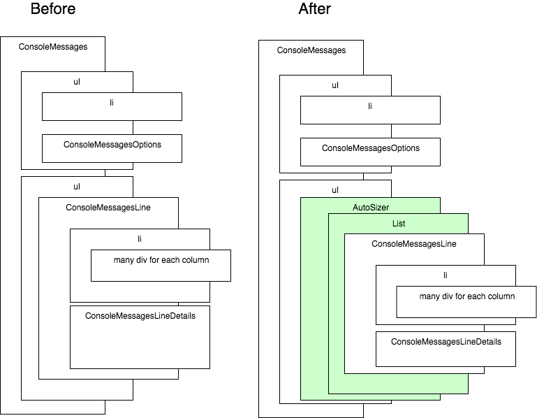

Like most of the application, everything is smooth with testing data. After a while of usage, the application gathers more and more bytes which change the whole picture. In some situation, the data does not expire, hence the collection of data grow out of proportion, way beyond the normal testing scenarios that the developer might anticipate at the inception of the code. The problem is the browser, the lack of understanding of the purpose of so many elements. Using HTML with overflow to scroll (or auto) and relying upon that the scrolling will always be smooth is a fallacy -- the browser will need to render and to move all these elements.

There are a few options. The easiest one is to only display a subset of the whole collection of data. However, the solution penalizes users who may want to reach that information again in the future. A second popular option is to render only what is visible. It means that we need to remove from the screen elements that are hidden, out-of-range of the user. Everything above and under the viewport is removed. The challenge is to keep right the scrollbar position and size. Using a virtualization library that calculates the number of element out of the viewport and simulates the space while avoiding generating too much element is a valid solution. It works well with a fixed row. However, in my use case, I have the possibility to click the row which expandable this one with many inputs, graphs, and text. I also didn't use a table, so I wasn't sure how it would work. At my big surprise, not only variable row's height is supported by the most popular virtualization library, it also supports a collection of an element that is not a table (for example UL>LI). I am talking about the [React-Virtualized library](https://github.com/bvaughn/react-virtualized).

In this article, I'll show how to transform a list built with a single UL and many LI. Clicking the LI, open add another React component inside that increase the height of the row. The full source code is coming from the [Data Access Gateway Chrome's Extension](https://github.com/MrDesjardins/dataaccessgatewaychromeextension). In the following image, you can see that we have many rows of 15px height followed with one that got expanded to 300px. The idea is that the code is smart enough to take the different heigh in its calculation.



Before explaining, the official library has many examples which are great. However, they are not all written in JSX which can be cumbersome to read. I hope that this article might help some people in understanding how you can do it with JSX as well as with your own React components. To explain my scenario, here how it was before and how we will modify the structure in term of React components hierarchy. The following diagram shows that I am simulating a header of the grid, outside the range of what can be scrolled with the first UL. The second UL, contains a collection of "ConsoleMessageLine" component which is a LI with many DIV. One DIV per column positioned with a FLEX display. When one row is clicked, it toggles the possibility to render an additional component the "ConsoleMessagesLineDetails" or to render undefined which do not display anything.




The division of the component satisfy my needs and I desired to alter the composition as little as possible. It ended that I only had to add two different components from the [React-Virtualized library](https://github.com/bvaughn/react-virtualized) without having to change the UL>LI>DIV composition.

The first step is to get the library. This is straightforward if you are using NPM. Indeed, I am using TypeScript and the library has a @type package. 

```
npm install react-virtualized --save npm install @type/react-virtualized --save-dev 
``` 


However, with TypeScript 3.0rc, I had an issue with the definition file. It has some conflicting type which required me to indicate to TypeScript to forgo analyzing the definition file. It doesn't remove the strength of having types, but TypeScript won't use it when compiling. In your tsconfig.json file, you shall add and enable "skipLibCheck".

``` 
 "skipLibCheck": true 
``` 

The next step is to add the AutoSizer and the List component from the library to the existing code. Few important details. First, you must have a "ref" to the list. The reference gives us a pointer to force redraw when we know the user change the height of an existing component. We will see the code later. Second, we must provide a function that will return the row height. The property "rowHeight" is a must in the situation where the row can change depending of some characteristic of this one. In my case, the row will be either 15px or 300px depending if this one is collapsed or expanded.

```typescript
<ul className="ConsoleMessage-items"> 
  <AutoSizer> 
    {
      ({ width, height }) => ( 
        <List 
          ref={r => (this.list = r)} 
          className="ConsoleMessage-virtual-list" 
          height={height} 
          rowCount={this.state.filteredData.length} 
          rowHeight={p => this.calculateRowHeight(p)} 
          rowRenderer={p => this.renderRow(p)} width={width} /> 
        )
    } 
  </AutoSizer> 
</ul> 
``` 


The AutoSizer component has an unusual way to use its children by allowing a width and a height. You can see an extract of the definition file under this paragraph. The Size type has a width and a height determined by the AutoSizer. 
```typescript
children: (props: Size) => React.ReactNode; 
``` 


The List component is wrapping our rows and will generate one row for every rowCount provided in the properties. It means that I had to modify my code because I was mapping my collection to render a ConsoleMessagesLine and that now it will to a for-loop and I'll have to indicate by index what element to render.

```typescript
<ul className="ConsoleMessage-items"> {
  this.props.listMessages.filter((m) => this.logics
    .filterConsoleMessages(m, this.state.consoleMessageOptions.performance, this.state.consoleMessageOptions.size))
    .map((m: MessageClient) => <ConsoleMessagesLine key={this.logics.getMessageKey(m)} 
        message={m} listMessages={this.props.listMessages} 
        demoModeEnabled={this.props.demoModeEnabled} />) 
  } 
</ul> 
```


The first modification from the code above was that I was filtering in the rendering. Instead, I have to have this list somewhere to be sure to be able to refer by index to it. I leveraged the static React function to derive from the props into the state of the components a filtered collection.

```typescript
public static getDerivedStateFromProps( props: ConsoleMessagesProps, state: ConsoleMessagesState ): ConsoleMessagesState { 
  const allData = props.listMessages.filter(m => 
    ConsoleMessages.logics.filterConsoleMessages( m, state.consoleMessageOptions.performance, state.consoleMessageOptions.size ) ); 
  return { ...state, filteredData: allData }; 
} 
``` 


The next step was to create two functions. One for the dynamic height determination of each row and one to the actual render function of a single line that will use the data we just stored in the component's state. The dynamic height is a single line function, that use on its turn the list as well.

```typescript
private calculateRowHeight(params: Index): number { 
  return this.openMessages[this.state.filteredData[params.index].uuid] === undefined ? 15 : 300; 
} 
``` 


As you can see, it goes into the filtered list, it uses the parameter that has an index and determines whether the unique identifier of the object is in a map that we populate when the user clicks the row. I have a uuid field, but it could be anything that is proper to your logic and code. For the curious about the "openMessages" map, it is a private member of the component that adds and remove element depending on the toggle of each row. Small but important detail, because we are modifying the height of an element of the virtualization, we must expliclity and manually invoke a recalculus of the rows. This is possible by calling "recomputeRowHeights" from the list. The reference to the list is handy because we can invoked in the function that toggle the height.

```typescript
private lineOnClick(msg: MessageClient, isOpen: boolean): void { 
  const unique = msg.uuid; 
  if (isOpen) { 
    this.openMessages[unique] = unique; 
  } else { 
    delete this.openMessages[unique]; 
  } 
  if (this.list !== null) { 
    this.list.recomputeRowHeights(); 
  } 
} 
``` 


The last crucial piece is the render of the element. Similarly to the function to determine the height of the row, the parameter gives the index of the element to render.

```typescript
private renderRow(props: ListRowProps): React.ReactNode { 
  const index = props.index; 
  const m = this.state.filteredData[index]; 
  return ( <ConsoleMessagesLine key={m.uuid} 
          style={props.style} 
          message={m} 
          listMessages={this.props.listMessages} 
          demoModeEnabled={this.props.demoModeEnabled} 
          onClick={(msg, o) => this.lineOnClick(msg, o)} 
          isOpen={this.openMessages[m.uuid] !== undefined} 
          charTrimmedFromUrl={this.state.consoleMessageOptions.charTrimmedFromUrl} /> 
          ); 
} 
``` 

The code is very similar to my code before the virtualization modification. However, it has to fetch the data from the filtered list by index.

Finally, the code is all set up, without major refactoring or constraint in term of how the components must be created. Two wrappers in place, a little bit of code moved around to comply with the contract of having rows rendered by function and we are all set. The performance is now day and night when the number of row increase.
