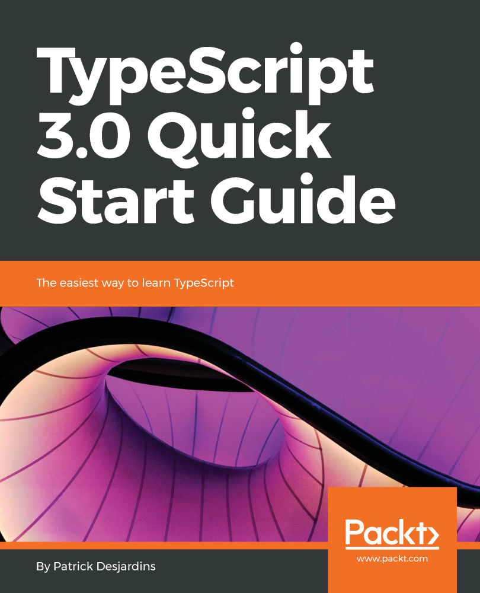

You read right! My [second TypeScript book](https://www.packtpub.com/application-development/typescript-30-quick-start-guide)! I published [my first book entitled Holistic TypeScript](https://www.amazon.com/Holistic-TypeScript-Patrick-Desjardins/dp/2981311069/) in April this year and wrote about [my motivation in a blog post](why-i-wrote-a-typescript-book). This time, the publisher Packt reached for a quick start guide for TypeScript 3.0.

I jumped at the opportunity to cover all feature in a simpler way than my original book. While the former book is up-to-date with all TypeScript's features in a great depth, the latter is targeting introducing all powerful feature of the language.

The book is available on [Packt website](https://www.packtpub.com/application-development/typescript-30-quick-start-guide) and on [Amazon](https://www.amazon.com/TypeScript-3-0-Quick-Start-Guide/dp/178934557X).

In this book you will learn how to:

- Set up the environment quickly to get started with TypeScript
- Configure TypeScript with essential configurations that run along your code
- Structure the code using Types and Interfaces to create objects
- Demonstrate how to create object-oriented code with TypeScript
- Abstract code with generics to make the code more reusable
- Transform the actual JavaScript code to be compatible with TypeScript

I encourage you to read TypeScript 3.0 Quick Start Guide if you are new to TypeScript or if you want to share your love of TypeScript to a friend that is not yet leveraging the power of type for web development. For those at an intermediary level and higher, [Holistic TypeScript](http://typescriptbook.com/) remains the best choice even if it cover up to 2.8. I'll update Holistic TypeScript every year with new TypeScript features.
