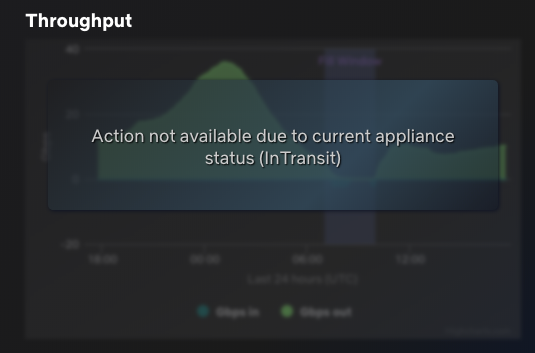
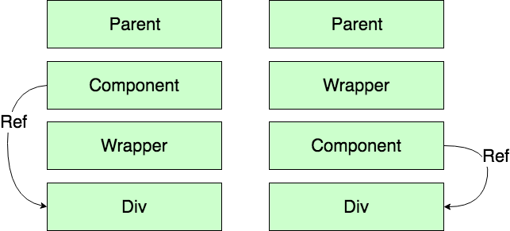

Recently, I had the requirement to disable some parts of the user interface if an entity is under a specific state. I decided to create a reusable component that would blur its child and show a message to the user explaining why a section of the screen is inaccessible. You can see the final rendering in the screen capture under this paragraph. The implementation of the solution worked -- except when I was refreshing the page.



Refreshing the page cause the React component to be in a different path of execution. It has to fetch the information and mount for the first time the React component. While other navigation displayed the image above, in the case of refreshing the page, the graphic was never loading. In fact, even when the appliance status was in a good status, the component was totally blank.

After a while, I realized something: the wrapper I created was the cause of the issue. The following image shows on the left the problematic arrangement of components and on the right the solution that I will explain shortly.



Left side is the wrong implementation; Right side is the good implementation

The problem was that the parent container was loading the chart component and in the render function was using the wrapper. The component was using a ref to access the DOM because the chart built with HightChart (a JavaScript not a React library). However, the introduction of the wrapper (to blur or not the chart) was in the middle of the way. The wrapper was rendering the children (the div that was hooked to Highchart) differently. When the status was good it was rendering the children directly, when the status was not good it was creating a DIV and inserting the children. Here was the problem. The difference of depth in the DOM element was breaking Highchart. In fact, it's not the fault of Highchart, but more that the code in the component that was hooking Highchart to the DIV was suddenly rendering another DIV that had not knowledge of the modification Highchart had done. A quick fix to change the hierarchy of HTML elements fixed the issue, but it was not right.

Here is a snippet of the wrapper:

```typescript
export class Wrapper extends React.Component<WrapperProps> { 
  public render(): JSX.Element { 
    if (this.props.isEnabled) { 
      return <>{this.props.children}</>; 
    } 
    return ( <> <div> {this.props.children} </div> </> ); 
  }
}
``` 

The core of the problem is that the component access a ref of an element outside its own render. It accesses a reference from a child that is rendered by the wrapper. Swapping the component, like illustrated in the right column, fixed the issue and rendering the children without having to care about the hierarchy of the elements.

The explanation, for my case, was that Highchart was configured in the `componentDidMount` and then had the data pushed in the chart in the `componentDidUpdate`. However, this was done by accessing the reference of the DOM element which was changing position once rendered by the wrapper. Moving the wrapper a level up and allowing the component to have a reference of a DOM element that it owns (inside its own render) mitigate the issue because of the configuration executed on a reference that does not "move".

I discussed with one my teammate at Netflix and we built a demo inside a live sandbox that you can find at this address: [https://codesandbox.io/s/74w7nz3m2j](https://codesandbox.io/s/74w7nz3m2j)

The sandbox contains a simplification of the behavior described. There is a parent container named "App" and a render function that render two sibling wrappers named "SameStructure" and "DifferentStructure". The "App" has a state that changes when you click anywhere in the application. The click event changes the state to the value `false` and uses the reference to change the DOM. It simulates changes that occur to Highcharts when the parent container is updated. The "App" sets a unique string in the mount to simulate the initial configuration of Highchart on a DOM ref of a child DOM element. There are two wrappers to illustrate that one has the same structure regardless of if the flag is set to false or true. However, the second wrapper change it's structure. The code is succinct, here are the wrappers.

```typescript
export default class SameStructure extends React.Component<Props> { 
  render() { 
    if (this.props.flag) { 
      return <div className="first">{this.props.children}</div>; 
    } else { 
      return <div className="second">{this.props.children}</div>; 
    } 
  } 
}

export default class DifferentStructure extends React.Component<Props> { 
  render() { 
    if (this.props.flag) { 
      return ( <div className="first"> <div>{this.props.children}</div> </div> ); 
    } else { 
      return ( <div className="second" style={{ color: "blue" }}> {this.props.children} </div> );
     } 
  } 
}
``` 


The result is unexpected if you are not aware of the weakness of using a reference of a child at a higher level. 
The output does not have the text sets in the `componentDidMount` for the wrapper that has a structural change. 
Here is the output where you can see that the "Different Structure" misses the `MountText` string.

Same Structure:
```html  
SameStructureMountText[appendTextOnClick][appendTextOnClick][appendTextOnClick]
``` 

Different Structure:
```html  
 InitialDifferentStructureText[appendTextOnClick][appendTextOnClick][appendTextOnClick] 
``` 

To conclude, a React component that has a reference should only refer to DOM element that it owns. React has ways to pass down a parent reference to a children if needed. However, in this particular case, we were accessing a children from a parent which is cause unexpected behavior. The work around is to ensure the hierarchy of component is respected and avoiding having "ref" from a DOM inside element (children) of a component.
