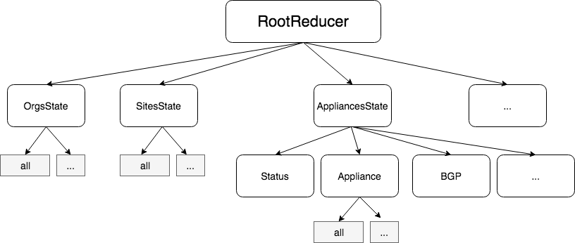
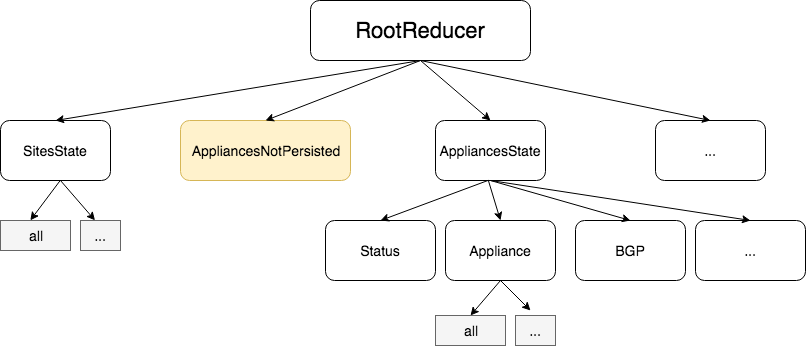

I have been coding in one of our web application at Netflix for more than 15 months, and I realized that my Redux's state got better in time. In hindsight, it is easy to recognize that the initial draft of the state was performing its job but not efficiently. However, after a few Internet searches, I realized that not a lot of guidance a year ago, neither today, on how to divide a Redux state efficiently. In this article, I'll describe crucial points that increase performance over 8x when the store was getting populated with complex objects.

A little disclaimer: I will not elaborate on how to optimize the whole React-Redux flow. I already discussed how to increase the overall React-Redux application in this [top 5 improvements post.](top-5-improvements-that-boost-netflix-partner-portal-website-performance) but this time it is mainly with the structure of the Redux state.

I assume your Redux's state contains only normalized data. Normalized data means that every state has entities that describe their relationship with unique identifier instead of a deep object that contain children and other objects. In short, every entity are unique, not duplicated in the Redux state. Also, I assume that during the life-cycle of your application, your denormalize the objects when they need to be consumed to have fully fledged objects with deep and rich entities. A commonplace, to denormalize is inside the mapping between the reducer and React. Depending on the complexity this can be expensive to construct. A natural consequence of an active web application well normalized is that the mapping will be a bottleneck. If you have many actions, the mapping can happen quite often. While the [4 tips to improve Redux performance](4-features-to-boost-react-redux-performance) does a beautiful job to mitigate some of the calls, it still requires to workout on a structure that is optimized for speed.

In the Netflix Partner Portal, the first version of the Redux state was dividing the entity per domain. For example, one reducer for Organization, one for Site, one for Cache, etc. Sub-Reducers were available for each area. For instance, under Cache, you can find the Reducer Interfaces, BgpSessions, etc. The separation makes sense conceptually. However, it falls short when within these reducers you start mixing data coming from data API and data from the user.

Initial Reducer Structure: By domain and sub-domain

The problem with mixing data from the API and from the user is that the user may type, change a configuration, set a temporary information and the data from the API does not change. The lack of separation causes issues in term of performance. A user change should never make an already formed object to be recomputed and build again: they have not changed. The reason is that the tree of objects changes if one of its node is changing. Let's see the consequence with a small example. An organization contains a list of site which contains a list of appliances which contains many children and so on. If we set the property "activeAppliance" in one of the sub-reducer of an appliance, it will have a chain of effect. First of all, the object that holds the "activeAppliance" will get a new reference (because of immutability), then the sub-reducer will get a new reference and its parents. But, it does not stop there. All memoized data ofReSelect or Re-reselect are flushed. The reason is Re-select selector are logically linked to specific are of the Reducer trees and check if something has changed. If nothing has changed, it returns a pre-computed denormalized instance. However, if not present or if the memoized selector has changed (which is the case with this example in many ways) it will invalidate the cache an perform a denormalization.

Dividing the data from the source of truth, the API, from the one that the user is using while editing cause all the memoize data to remain intact. If a user is changing the active appliance, there is no need to invalidate a whole organization with all its sites and appliances. Thus, the separation allows avoiding computer data that barely change. In that example, the "activeAppliance" moves from "Appliance" sub-reducer to the "AppliancesNotPersisted" reducer. The change the reference on the "AppliancesNotPersisted" state and invalidate a limited amount of selector compared to the ones on the business logics entities.

Not persisted data are separated from the main domain reducer

While this might sound simplistic - and it is - this little change had a big impact. Refactoring code that already exists is not an easy task. However, the Netflix Partner Portal is made with TypeScript and has thousands of unit tests. Most changes were done within a day without disrupting the quality of the application.

Another pattern is to ensure that you are comparing correctly the entity you are memorizing with ReSelect. I am using [Re-reselect](https://github.com/toomuchdesign/re-reselect) which allows deep memoization. For some reason, the Partner Portal requires to pass the whole state down to each selector. Usually, that would cause any change to invalidate the cache because the Reducer is immutable hence any change cause create a new reference. However, with a custom shallow equal function that Re-reselect can use. The way I coded this one is that it checks if the object is the root of the reducer, if it is it avoids the invalidation. Other optimizations are done which are beyond the scope of this article like comparing last updated date on the entities coming from the backend.

A third and last best practice is to have entities inheriting or intersecting data that are not coming from the API. The reason is the same as having data not coming from the API with data from the API: it invalidates the selector hence require to compute hierarchies of object for no reason. For example, if you have an Organization entity coming from a REST API and you enhance the entity with some other data (e.g. add the preferred timezone that can be selected by the user) then you will be in a trap when the user change this non-persisted state. Once again, denormalization will occur causing a waste of CPU time.

To conclude, it is primordial to separate your Redux's store in a structure that is conceptually sound for your business logic, but also clearly separated in term of the behavior. A rule that I draw from my experience with the Netflix Partner Portal is so always have a reducer for data coming from the source of truth and one for the user interaction. It makes the store clean with a clear idea of where belongs each data as well as increasing your performance at the same time.
