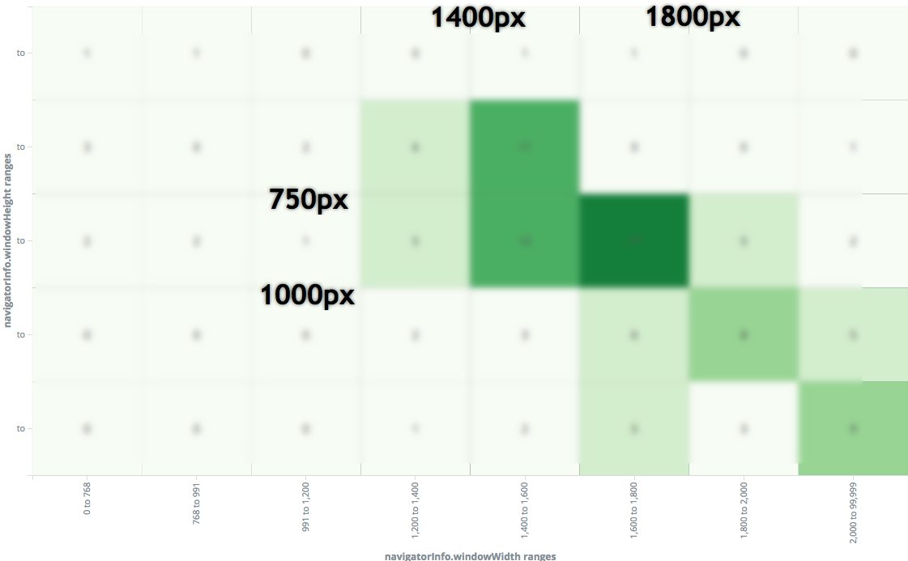
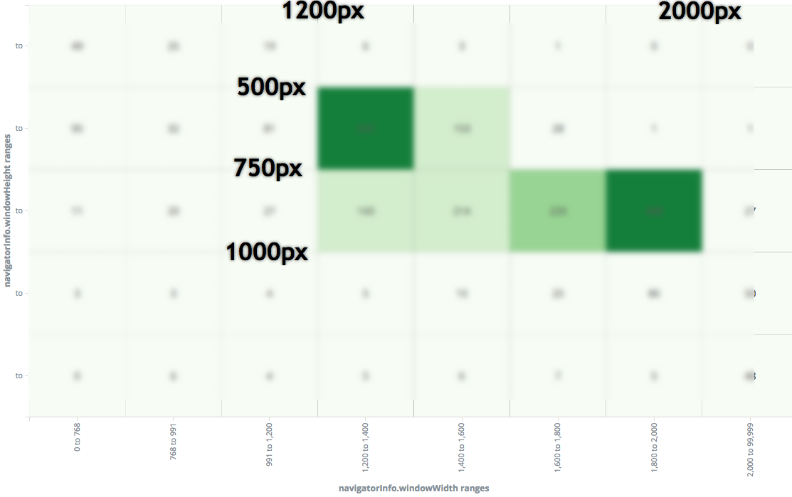
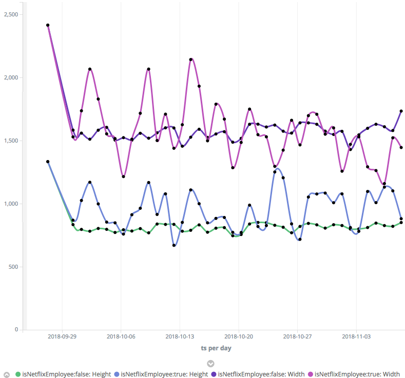
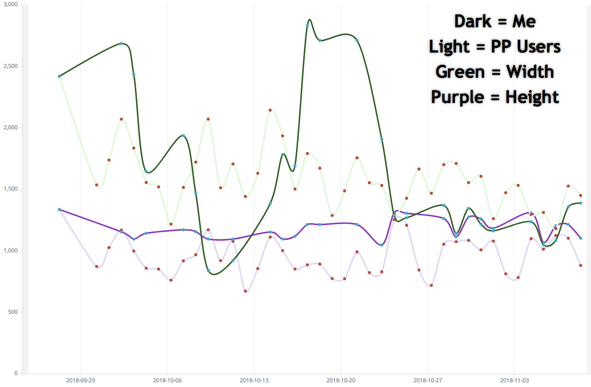

An interesting challenge with web development is the unlimited different combination of width and height that people can consume the application. I am developing with a wide screen most of the time and once in a while directly on my MacBook Pro that has a retina resolution. In all cases, I have the Chrome's developer tool open which allows to change the viewport of the web application at the exact amount of pixel desired. The question remains which resolution is the best?

The answer depends of your application. For website that have millions of user it will be harder to converge into a single or even a couple of combination of width and height. However, most people develop web application that are internally used or used by similar group of individual which usually lead into a handful amount of resolution.

At Netflix, I am working on the Open connect Partner Portal where thousands of partners consult the application as well as many Netflix employee. The application is built with React and Redux and I am capturing in every action the width and height of the browser. I am also getting a lot more information and one of it is if it is an employee at Netflix or not. The information about if the data is coming from Netflix or not may or may not be relevant but I wanted to confirm. The reason is that I am getting more direct feedback from internal employees than from partner around the worlds. I wanted to confirm that they are viewing the same web application.

I created a heat map with Kibana who is a simple user interface to visualize Elastic Search data. I created different bucket of resolution and normalized every employe data to have a proportional idea. The first heat map was about Netflix employee. The application was mostly used around 1600x750.

Heat map of resolution used by Netflix employee on the Open Connect Partner Portal

The data shows a different picture of partners where the height is smaller of about 250 pixels and a width with two distincts categories which is 1300px and 1900px.

Heat map of resolution used by non-Netflix employee on the Open Connect Partner Portal

Another view is to see the average width and height per day of all employees and non-employees. The following graph shows in purple the average screen width. The darker line is non-employee, lighter is an employee. Under is the height. The blue line is the employees average and the light green is the non-employee average.

Average of employee vs non-employees width and height

I was curious how bias I was while developing the application. Because I am gathering a lot of telemetry, I was able to plot my resolution through time during the development in parallel of how the users were using the application. The following graph shows my average and the users' average for the last 10 weeks. 

Me vs Users

The Y-axis is the number of pixel. The two green lines represent the width, the darker line is me, the lighter green is the user. The purple line is the height, again the darker color is me and lighter are the users. In the last few three weeks I was aware of the resolution of my users, hence I was developing conscientiously with the most popular categories discovered. 

The best resolution for Netflix Open Connect Partner Portal is different from the best resolution that you should build your application. While it is crucial to develop for all resolutions, it is realist to have few preset defined to be efficient. The exercise showed me that I have a tendency to use and build the application with more height. I realized that few buttons were under the fold making it harder to find to several of our external users.
