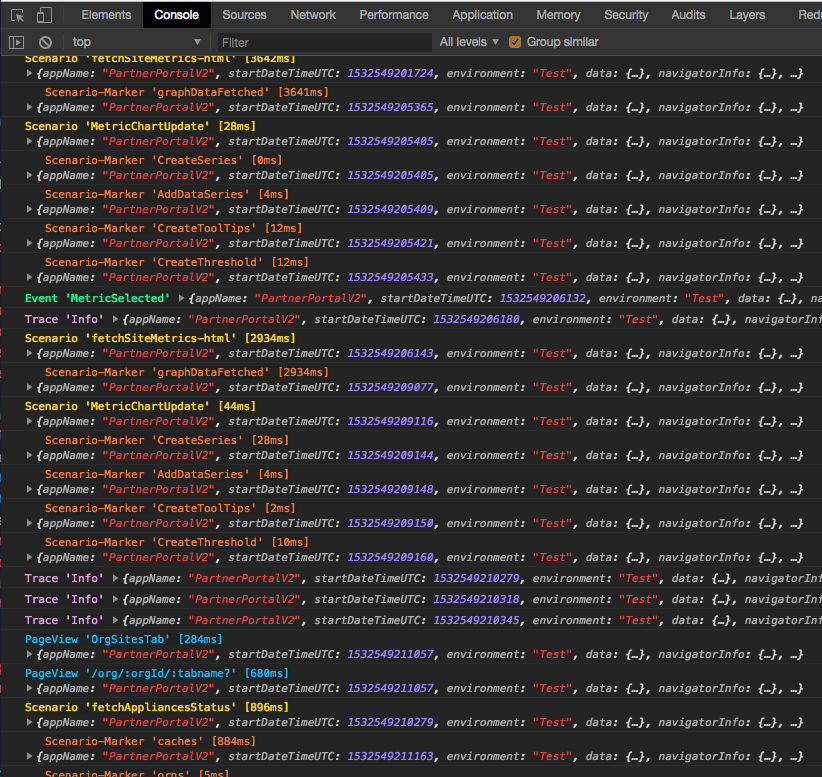
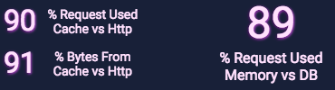
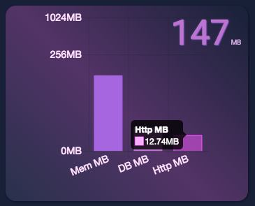

Netflix is all about speed. Netflix strives to give the best experience to all its customers -- and no one like to wait. I am working in the Open Connect division which ensures that movies are streamed efficiently to everyone around the world. Many pieces of the puzzle are essential for a smooth streaming experience but at its core, Netflix's caches act like a smart and tailored CDN (content delivery network). At Netflix, my first role was to create a new Partner Portal for all ISP (Internet service provider) to do monitoring of the caches as well as other administrative tasks. There is a public [documentation about Partner Portal available here](https://openconnect.netflix.com/en/partner-portal/) if you are interested to know more about it. In this blog post, I'll talk about how I was able to take users' a specific scenario that required many clicks and an average of 2 minutes 49 seconds to under 50 seconds (cold start) and under 19 seconds once the user visited more than once the website. An 88% reduction of waiting time is far more than just an engineering feat but a delight for our users.

### #1: Tech Stack

The framework you are using has an initial impact. The former Partner Portal was made in AngularJS. That is right, the first version of Angular. No migration had been made for years. There were the typical problems in many areas with the digest of events, as well as how the code was getting harder to maintain. The maintenance aspect is out of scope of this actual article, but AngularJS always been hard to follow without types, and with the possibility to add values in a variety of places many functions and values in scope it becomes slowly a nightmare. Overall, Netflix is moving toward React and TypeScript (while not being a rule). I saw the same trend in my years at Microsoft and I was glad to take this direction as well.

React allows having a fine-grained control over optimization which I'll discuss in further points. Other than React, I selected Redux. It is not only a very popular framework but also very flexible in how you can configure it and tweak the performance. Finally, I created the [Data Access Gateway library](https://github.com/MrDesjardins/dataaccessgateway/) to handle client-side request optimization with two levels of cache.

The summary of the tech stack point is that you can have a performant application with Angular or any other framework. However, you need to keep watering your code and libraries. By that, you must upgrade and make sure to use the best practices. We could have gone with Angular 6 and achieve a very similar result in my opinion. I will not go into detail about why I prefer the proximity to JavaScript of React to AngularJS templating engine. Let's just end up that being as close of the browser and avoiding layers of indirection are appealing to me.

### #2: More click, less content per page

The greatest fallacy of web UI is the optimization for the less amount of click. This is driven by research on shopping websites where the easiest and quickest the user can press "buy" that will result in a sell. Great, but not every website goal is to bring someone having one particular action in the less amount of click. Most website goal is to have the user enjoy the experience and to have the user fulfill his or her goal in a fast and pleasant way. For example, you may have a user interface that requires 3 clicks but each click takes 5 seconds. Or, you could have a user interface that requires 4 clicks with 2 seconds each. In the end, the experience is 15 seconds versus 8 seconds. Indeed, the user clicked one more click but got the result way faster. Not only that, the user had the impression of a way faster experience because he or she was interacting instead of waiting.

Let's be clear, the goal is not to have the user click a lot more, but to be smart about the user interface. Instead of showing a very long page with 20 different pieces of information, I broke the interface into separated tabs or different pages. It reduces some pages that required to do a dozen of HTTP calls to 1-2 calls. Furthermore, clicks in the sequence of action could reuse data previously fetched giving fast steps. The gain was done automatically with the [Data Access Gateway library](https://github.com/MrDesjardins/dataaccessgateway/) which cache HTTP responses. Not only in term of performance it was better, in term of telemetry it is heaven. It is now possible to know what the user is looking at very accurately. Before we had a lot of information and it was hard to know which one was really consulted. Now, we have a way since we can collect information about which page, tabs, and section is open or drilled down.

### #3: Collect Telemetry

I created a [small private library](telemetry-has-a-centerpiece-of-your-software) strategy.

To summarize, not only data is a keystone of knowing what to optimize, it is crucial for the developer to always have the information in his/her face. The library I wrote for the telemetry output in the console a lot of information with different color and font size to clearly give insights into the situation. It also injects itself into the Google Chrome Performance tooling (like React does) which allow seeing different "scenario" and "markers". No excuses at the development phase, neither at production time to not knowing what is going on.

### #4: Rendering Smartly

In a single-page application that optimizes for speed, not clicks, rendering smartly is crucial. React is build around virtualization but it still requires some patterns to be efficient. I wrote several months ago [4 patterns to boost your React and Redux performance](4-features-to-boost-react-redux-performance). These patterns are still very relevant. Avoiding rendering helps the whole experience. In short, you can batch your Redux actions to avoid having several notifications that trigger potential view update. You can optimize the mapping of your normalized objects into denormalized objects by using a function in Redux-Connect to cancel the mapping. You can also avoid denormalizing by "selecting" the data if the normalize data in your reducers have not changed. Finally, you need to use React to leverage the immutable data and only render when data change without having to compute intense logic.

### #5: Get only what you need

We had two issues in term of communication with the backend. First, we were doing a lot of calls. Second, we were performing the same call over and over again in a short period of time. I open-sourced a library that we are using intensively for all our need of data called [Data Access Gateway library](https://github.com/MrDesjardins/dataaccessgateway/). It fixes the second issue right away by never performing two calls that are identical at the same time. When a request is performed and a second one wants the same information, the latter will subscribe to the first request. It means that all subsequent requesters are getting the information from the former requester -- it receives it pretty fast. The problem with several calls could be in theory handled better by having less generic REST endpoints. However, I had low control over the APIs. The [Data Access Gateway library](https://github.com/MrDesjardins/dataaccessgateway/) offers memory cache and persisted cache with IndexDb for free. It means that calls are cached and depending on the strategy selected in the library you can get the data almost instantly. For example, the library offers a "fetchFast" function that always returns as fast as possible the data even if this one is expired. It will perform the HTTP call to get fresh data which will be ready for the next request. The default is 5 minutes, and our data does not change that fast. However, we have a scenario where it must be very fresh. It is possible to tailor the caching for these cases. Also, it is possible to cache for a longer time. For example, a chart that displays information on a year period could be cached for almost a full day. Here is a screenshot of [Chrome's extension of the Data Access Gateway](https://github.com/MrDesjardins/dataaccessgatewaychromeextension) which shows that for a particular session, most of the data was from the cache.

The persisted cache is also great for returning user. Returning users have a return experience that is also instantly. The data might be old, but the next click performed to update everything.

The experience and numbers vary a lot depending on how the user interacts with the system. However, it is not rare to see that above 92% of requests of information are delivered by the cache. By delivered I mean that is returned to the user regardless if it comes from the memory cache, persisted cache or HTTP request. The other way to see it is that when a user clicks on the interface that only 8% of the data is requested via HTTP (slow). However, if the user stays under the same amount of feature the number can climb easily to 98%. Not only the amount of consumed data is very high at a level fast for the user, it is also very efficient in term of data moved across the network. Again, the number varies greatly depending on how the user interacts with the Netflix Partner Portal. But, it's not rare to see that only 10% of bytes used by the application are actually coming from HTTP request, while 90% are already cached by the library -- this means that on a session where a user performed many actions that instead of having to download about 150megs could have downloaded less than 15 megs of data. Great gain in term of user experience and great gain in term of relaxing our backend. Also, one gain for our user who saves bandwidth. Here is a screenshot of a session recorded by the [Chrome's extension of the Data Access Gateway](https://github.com/MrDesjardins/dataaccessgatewaychromeextension).

### What next?

Like many of you, my main task is about delivering new features and maintaining the actual code. I do not have specific time allowed for improving the performance -- but I do. I found that it is our (web developer) duty to ensure that the user gets the features requested in a quality. The non-functional requirements of performance is a must. I often take the liberty of adding a bullet point giving a performance goal before starting to develop the feature. Every little optimization along the journey accumulates. I have been working for 13 months on the system and keep adding once in a while a new piece of code that boost the performance. Like unit testings, or polishing the user interface, or to add telemetry code to get more insight; performance is something that must be done daily and when we step back and look at the big picture that we can see that it was worth it.
