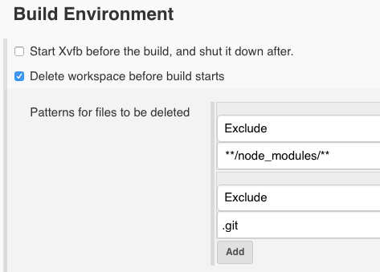

At Netflix, software engineers own the full lifecycle of an application, from gathering the requirement to building the code, to the way we handle our life cycle process to the deployment which includes configuring AWS for DNS and load-balancing. I personally like to have on every pull request a build that makes sure that everything is building and not only on my machine as well as my unit tests to be run to make sure that no regression is introduced. For several months, this process was taking 3 minutes +-10 seconds. This was satisfying for me, it was accomplishing its main goal. I was expecting some time because of the nature of the project. First, I am using TypeScript, seconds I am using node modules and third I need to run these unit tests. The code is relatively small on that project. I wrote about 36k lines in the last 11 months and there are about 900 unit tests that need to run.

# Moving from 3 minutes to 1 minute 30 seconds

The first step was to add the unit tests. Yes! The first few months only the build was running. Mainly because we are using Bitbucket and Jenkins and I never took the time to configure everything -- and it is not straightforward to get [coverage with Jenkins for JavaScript code](unit-tests-and-coverage-report-in-jenkins-using-jest-from-create-react-app). Nevertheless, I was using the create-react-app `react-scripts-ts build` command which are way slower than running the command `react-scripts-ts test --env=jsdom --coverage`. In my case, it trimmed 1 minutes 30 seconds.

Still, I was observing in the remaining 1 minute 30 seconds a waste of 1 minute trying to get `node_modules` by the command `npm install` regardless of my step specifying `npm ci`. The difference between `install` and `ci` is that the first one is slower because it performs a task for the `package-lock.json` which the `ci` command skip by relying on an existing generated `package-lock.json` file

# Moving from 1 minute 30 seconds to 1 minute 10 seconds

The install command was bothering me and I found out that we had some internal process taking over some steps. To keep it show, I had to do some modification. First, in Jenkins, you can preserve folder like the node_modules. This is under "Build Environment". Do not forget to check the "Apply pattern also on directories". However, the problem is still npm. The `ci` removes the `node_module`. We are not more advanced than before. So, the idea is to use back the install command.

# Conclusion

There is still some room for improvement. To be honest, I had to completely not delete the whole workspace to have it to work. Jenkins was removing all the time the node_modules regardless of the syntax I was using. I also found suspecious that it takes 20 seconds for npm install to figure out that nothing has changed -- that is very slow. I'll have to investigate further with yarn.
