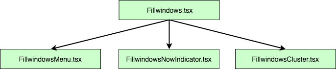

In my work at Netflix, I had to create a page to visualize when a cache (also known as an [appliance](https://openconnect.netflix.com/en/deployment-guide/)) can receive new movies. The former [Partner Portal](https://openconnect.netflix.com/en/partner-portal/) had a table with one row per cache for a specific organization. Every row had one column for every hour of the day (24 columns). The table can be very verbose depending on how structured an organization is in term of sites and appliances. I opted to an improved visualization that removed the redundancy of the unused cells and leveraged [React and animation](https://patrickdesjardins.com/blog/animating-a-react-component) to have the user following the transformation when changing options like timezone and visualization preferences. The result is that a user interfaces less clunky that displays four times more information for the same viewport.

## Cache Fill Window

I decided to design a simplistic user interface. The top row of the section is what the user can configure for the chart. The first selector allows choosing from a limited set of timezone available from the organization' sites. The second selection is how caches are sorted. Underneath is the result. You can see the actual time with the "now" pin and the hour used that are highlighted. This is a small detail that fades away most of the hours of the day instead of having a dedicated column as in the previous design.

I opted to remove the redundancy of repeating the hours on every row. The original design has on top of each appliance a row with 24 columns for each hour of the day. It was taxing the screen with redundant information and it was taking space were pertinent information can be positioned. The change lights up the readability but also give more room for useful data. To help the user having a clear idea of the time, I drop a line from the used hour down to the bottom of the page. Also, when the user hovers a cache, I have a popover that mentioned the time frame.

In term of navigability, it is possible to click on any cache to move to the detail page of this one. The green handle shows the manifest cluster of the caches. It has multiple goals. The first one is to show the name of the manifest cluster. The second is to indicate if the caches type (manifest cluster, global, flash). The third is for the future when we add the feature to allow the user to alter the time from a manifest cluster -- the green handle will be an actual drag-and-drop handle.

So, how it was built? All with TypeScript, React and HTML/CSS. The first row of option has its own component and the result has also its own component. Both live in the "FillWindows" component.



The menu is simple and has two functions in its props which allows the "Fillwindows.tsx" to know how to render the information.  The "FillwindowsNowIndicator" is the pin that point the current time. It receives the timezone as well as some detail about the width of the diagram. Finally, depending on the organization, a different number of "FillwindowsCluster" are generated. Information travels always from the "Fillwindows.tsx" which has the main DIV with a position absolute. The position type to absolute is required to position every element with a left and top style which will be animated later by setting the value and animating everything with a translation.

The "Fillwindows.tsx" is rendering the vertical bar as well but this could be extracted into another component as well. The separation into an additional component is a future improvement I plan to execute. However, at the moment, it works flawlessly by having the "Fillwindows.tsx" knowing about the business models object that has the information about the caches. With the information, it is possible to figure out which hours to highlight and which one to draw.

The graph is horizontally centered as well as being absolute. It is centered allowing a variety of resolution to have a look and feel similar. The configuration is written in the CSS file of the main component. The reason is that it will not change dynamically, hence can set it outside React.

```css 
.FillWindows .timeline-container { 
  position: absolute; 
  left: 0; 
  right: 0; 
  margin-left: auto; 
  margin-right: auto; }
 ``` 

Most of the feat of this feature is how to get the right position for every element. The calculation is performed at the "Fillwindows.tsx" render's level where the width and height of the whole graph can be calculated with the business models. From the main component, the right final position of every element can be passed down in all children component by properties. For example, the "FillwindowsCluster.tsx" is receiving a top and a left position and also receive the height of each appliance they must render.

```typescript
const individualClusters: JSX.Element[] = []; 
let top = tableHeader; 
clusters.clusters.forEach((cluster: FillWindowsDataCluster) => { 
  individualClusters.push( <FillWindowsCluster key={"fwc-" + cluster.clusterId} 
                          cluster={cluster} 
                          top={top} 
                          columnWidth={columnWidth} 
                          applianceHeight={applianceHeight} 
                          />); 
  top += cluster.numberOfAppliances * applianceHeight + spaceBetweenCluster; 
  }
);

return <div className="clusters" 
            style={ { width: totalClustersWidth } }> 
              {individualClusters} 
       </div >; 
``` 

The animation is using the [React and animation](https://patrickdesjardins.com/blog/animating-a-react-component) technic previous discussed. For each element, it sets the top and left of the final position and rewind with the previous position with CSS animation that has a transition. It means the "FillwindowsCluster.tsx" has in its class the two values as well as a reference to the DOM element to modify the style dynamically.

```typescript
private domCluster: HTMLDivElement | null = null; 
private lastLeftPosition: number = 0; 
private lastTopPosition: number = 0; 
``` 

The React receive property function get the current position.

```typescript
 public componentWillReceiveProps(nextProps: FillWindowsClusterProps): void { 
   if (this.domCluster !== null) { 
     const coord = this.domCluster.getBoundingClientRect(); 
     this.lastLeftPosition = coord.left; 
     this.lastTopPosition = coord.top; 
     } 
  } 
``` 

And the React did update function calculate the animation values, moving immediately the position to its last position relatively to the final position and using the request animation frame to tell the browser to remove the transformation (delta between last and current position).

```typescript
 public componentDidUpdate(previousProps: FillWindowsClusterProps): void { 
   if (this.domCluster !== null) { 
     const coord = this.domCluster.getBoundingClientRect(); 
     const deltaPositionLeft = this.lastLeftPosition - coord.left; 
     const deltaPositionTop = this.lastTopPosition - coord.top; 
     if (this.domCluster !== null) { 
       this.domCluster.style.transform = `translate(${deltaPositionLeft}px, ${deltaPositionTop}px)`; 
       this.domCluster.style.transition = "transform 0s"; 
    } 
    requestAnimationFrame(() => { 
      if (this.domCluster !== null) { 
        this.domCluster.style.opacity = "1"; 
        this.domCluster.style.transform = "";
        this.domCluster.style.transition = "transform 850ms, opacity 800ms"; 
      } 
    }); 
  } 
} 
``` 

If this is not clear, please refer to the link previous mentioned in this article.

The re-design of the feature could have been the same old static grid with a huge repetition of "hours" and several cells empty. However, with a little bit of design, something more refines was born. The touch of animation improves the user experience while adding a finishing touch.
