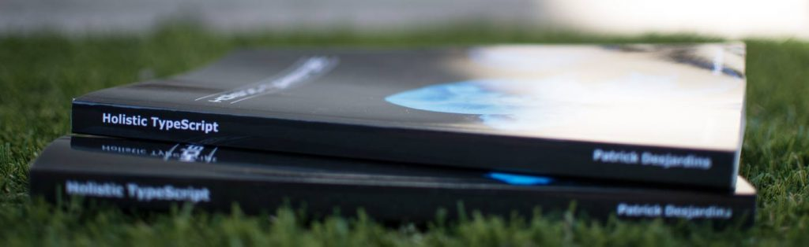
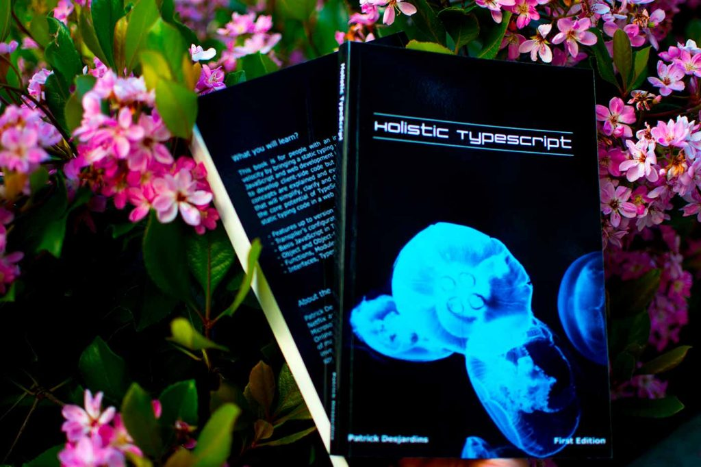

I published a 194 pages [TypeScript book](https://typescriptbook.com/) last week under the name "Holistic TypeScript.". It's been a while since I desired to write about a single subject. I've been releasing since many years a compilation of my blog posts, but otherwise, it's been a while since I focused on a single topic. The last time was with Apress with a book on Visual Studio 2013 and before with a French book around stock investment. [Last year, I had a monthly objective](https://patrickdesjardins.com/blog/recapitulation-of-2017) and the December objective was to draft a TypeScript book. Indeed, I missed the schedule by three additional months and that is not that I didn't work on it: writing a book is quite a long endeavor.

So, why TypeScript? Because it's the language I have been using in the last four years and that I firmly believe it a considerable multiplicator in efficiency for any developer that use JavaScript. There is plenty of books, but I wanted something simple, with very targeted examples that cover the fundamental concepts of each feature. I was aiming for something between 175-200 pages that was covering everything from TypeScript 1 to TypeScript 2.8 (latest current version). I plan to add new edition every year with new feature and revisit sections that do not satisfy me. Thus, this book is the first brick on the foundation to create Holistic TypeScript as a substantial book to get a clear overview of all feature.

The second reason is that I plan to write next year a book that will be very advanced. The future book will be probably shorter, won't talk about features but will analyze advanced typing scenario that arises in complex situations. It is still far in the future, and at the moment, I am thrilled with Holistic TypeScript. The book is available on [Amazon](https://www.amazon.com/Holistic-TypeScript-Patrick-Desjardins/dp/2981311069) in Kindle and paperback version. Enjoy!
