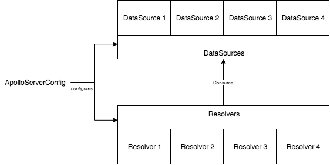
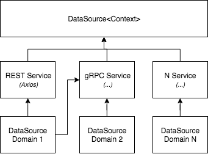

Resolvers can perform asynchronous call to fetch data. Using the specific implementation to perform the fetch in the resolver cause the resolver to have high-coupling into the technology to access the data but also increase the complexity of the resolver by boosting the size of each function with the request's details. Apollo's resolver allows to pass from the Apollo server's configuration a set of data sources that can be used down the line by every resolver.



Resolvers and DataSource Relationship

Similar to _resolvers_, _datasources_ is a member is defined in the _ApolloServerConfig_. The member is a function that returns a map (dictionary) of data sources. The _datasources_ is strongly typed as `DataSrouces<T>` where T is your custom context.

```typescript
dataSources: () => {
    const dataSources: DataSources<GraphQLCustomContext> = {
        dataSourceName1: new MyDataSource1()
    };
    return dataSources;
},
```

I create one data source per domain because all Rest and gRPC service are already divided by business domain. However, there is no conscribed way to split the data sources. Each data source is class that eventually must inherit extends `DataSource<T>` where T is the custom context you have defined for your GraphQL server. 

In the Netflix Open Connect GraphQL, I decided to have all my REST data source inherit a generic base class that handles all Axios code. The REST class inherits the DataSource from "apollo-datasource" package. The REST encapsulate the Axios package which can be changed later for something else without having to touch resolvers.



Data Sources and Services

It worth pointing that a single data source can use more than a single service. A data source class has many functions for different requests and each of the function can request to one or many services.

Resolvers are now getting access to the data sources by reaching the context which is the third parameters.

```typescript
export const bookResolversMap = {
    Query: {
        book: async (source: null, args: { bookId: number }, context: GraphQLCustomResolversContext, graphQLResolveInfo: GraphQLResolveInfo) => {
            try {
                return await context.dataSources.bookService.getBook(args.bookId);
            } catch (e) {
                console.error(e);
            }
        }
    }
};
```

One question might rises. How is the context having the data source? A keen observer might have spotted that resolvers are not using the type _GraphQLCustomResolversContext_ for the context instead of the GraphQLCustomContext has in all the previous article of this series. The type remains like the original context for everywhere in the application, except for the resolvers. The data sources are injected into the context by Apollo. The TypeScript types for GraphQL context is now in three interfaces.  A first one that contains all the data source, one that contain the actual context which we previously defined to contain user's information. Finally, a third one that has the data source and extends the custom context.

```typescript
export interface GraphQLCustomDataSources {
    dataSource1: MyDataSource1;
}

export interface GraphQLCustomContext {
    userRequest: IUserRequest;
}

export interface GraphQLCustomResolversContext extends GraphQLCustomContext {
    dataSources: GraphQLCustomDataSources;
}
```

## Summary

In this article, we saw how to move a piece around to have a cleaner architecture. The separation of concern allows changing piece without potentially breaking other pieces of code. The division of the task increases the easiness to create unit tests. The little job that each part must conduct simplify the understanding of the code and increase the reusability. In the next article, I'll present how to debug the NodeJS server, Apollo and all the part we already have a setup which will simplify diagnostic when something is going south.

## My Other GraphQL Posts

- [Getting Started with GraphQL for Netflix Open Connect](getting-started-with-graphql-for-netflix-open-connect)
- [Install Apollo Server to host a GraphQL service](install-apollo-server-to-host-a-graphql-service)
- [Apollo Server and Secured Playground](apollo-server-and-secured-playground)
- [GraphQL Context](graphql-context)
- [GraphQL Query with Argument](graphql-query-with-argument)
- [Apollo GraphQL Resolvers and Data Source separation](apollo-graphql-resolvers-and-data-source-separation)
- [How to setup a TypeScript, NodeJS, Express Apollo Server to easy debugging with VsCode](how-to-setup-a-typescript-nodejs-express-apollo-server-to-easy-debugging-with-vscode)
- [GraphQL Resolvers with Apollo](graphql-resolvers-with-apollo)
- [Configuring Apollo Playground and API on two different URL](configuring-apollo-playground-and-api-on-two-different-url)
- [How to automatically generate TypeScript for consumers of your GraphQL](how-to-automatically-generate-typescript-for-consumer-of-your-graphql)
