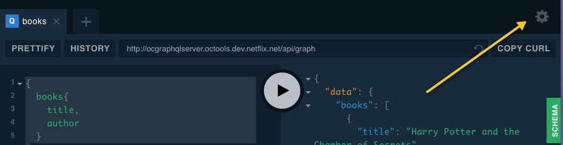

In the [last article of the series on how to create a GraphQL server with TypeScript and Apollo](https://patrickdesjardins.com/blog/?p=6156) I demonstrate how easy is to setup the playground. However, there is still a piece that is missing and is authentication. [In](https://patrickdesjardins.com/blog/?p=6143) [first](https://patrickdesjardins.com/blog/?p=6143) [post](https://patrickdesjardins.com/blog/?p=6143), I explicitly mentioned that every request goes first through Apache that has a special module that handles authentication. Apache will set in the HTTP request some headers with authorization information like a bearer token. At the moment, the playground receives the header but not for any subsequent calls it performs. It leads to HTTP requests that are not authenticated. In my particular case, the request was performing a HTTP 302 trying to redirect to the web portal to get authenticated. Great! The security kick-in! However, how can we force subsequent code to have the header in the playground was the question.

Fortunately, the _ApolloServerConfig_ has the property playground that can be something else than a boolean. It can be a _ISettings_. The interface has a "request.credentials" and by default "omit". Changing the default to "same-origin" will carry the missing headers.

```json
playground: {
    settings: {
        "general.betaUpdates": false,
        "editor.theme": "dark",
        "editor.reuseHeaders": true,
        "tracing.hideTracingResponse": false,
        "editor.fontSize": 14,
        "editor.fontFamily": "'Source Code Pro', 'Consolas', 'Inconsolata', 'Droid Sans Mono', 'Monaco', monospace",
        "request.credentials": "same-origin"
    }
}
```

 I had to specify additional configuration because the TypeScript definition type has all the field required, so I copy pasted the default value I found under the gear icon in the playground.



# Summary

In this article we configured subsequent calls to keep the authentication set in the former request that brought the playground in the browser. In the next article we will see how to read the content of the header to know which user is authenticated. The next step is crucial to have a user experience secured and tailored to the active user.

# My Other GraphQL Blog Posts

- [Getting Started with GraphQL for Netflix Open Connect](getting-started-with-graphql-for-netflix-open-connect)
- [Install Apollo Server to host a GraphQL service](install-apollo-server-to-host-a-graphql-service)
- [Apollo Server and Secured Playground](apollo-server-and-secured-playground)
- [GraphQL Context](graphql-context)
- [GraphQL Query with Argument](graphql-query-with-argument)
- [Apollo GraphQL Resolvers and Data Source separation](apollo-graphql-resolvers-and-data-source-separation)
- [How to setup a TypeScript, NodeJS, Express Apollo Server to easy debugging with VsCode](how-to-setup-a-typescript-nodejs-express-apollo-server-to-easy-debugging-with-vscode)
- [GraphQL Resolvers with Apollo](graphql-resolvers-with-apollo)
- [Configuring Apollo Playground and API on two different URL](configuring-apollo-playground-and-api-on-two-different-url)
- [How to automatically generate TypeScript for consumers of your GraphQL](how-to-automatically-generate-typescript-for-consumer-of-your-graphql)
- [GraphQL and HTTP Telemetry](graphql-extension-to-collect-http-and-resolvers-telemetry)
- [GraphQL and TypeScript/React](how-to-consume-graphql-in-typescript-and-react)
