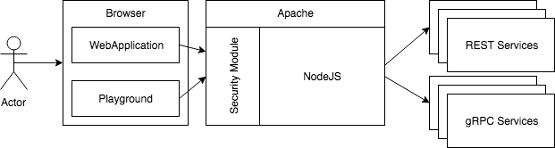

I recently started an initiative about GraphQL for Netflix Open Connect. Netflix already invests in GraphQL and some of the other teams previously discussed on the Netflix's Medium page [here](https://medium.com/netflix-techblog/our-learnings-from-adopting-graphql-f099de39ae5f) and [there](https://medium.com/netflix-techblog/https-medium-com-netflixtechblog-engineering-to-improve-marketing-effectiveness-part-2-7dd933974f5e). I'll approach the writing of my discovery with GraphQL not in hindsight but during my journey.

## What is GraphQL?

[GraphQL](https://en.wikipedia.org/wiki/GraphQL) is an open source project that started at Facebook and recently moved to the non-profit Linux Foundation. It started in 2012 and was released publicly in 2015. GraphQL is a query language that allows fetching information in a custom way. A traditional REST endpoint responds with all the information defined by the endpoint. GraphQL allows selecting which field. We can use the metaphor of a SQL query that is fetching with the star operator as the REST equivalence and a _select_ with specific fields to GraphQL**.**

GraphQL stitches independent endpoints by their natural business relationship. The services endpoints type can be of REST or [gRPC](https://grpc.io/) -- GraphQL blends the different technologies. The abstraction is possible by configuring the GraphQL server to query on multiple endpoints. The consumer is shielded from details of the backend implementation. It means that a user can query for an entity one day, and in the future keep requesting with the same query without having to worry if the backend changed from REST to gRPC. The GraphQL layer that disguises where the response fields come from one source or several sources. This veil allows improving the backend without impacting the frontend which increases the velocity of the consumer and maintainer of the services.

## Why using GraphQL?

The main reason for using GraphQL in the perspective of my actual team at Netflix is having a multitude of services that belong to a single realm. There are many cross entities among our tools (scripts and web applications) and many repetitions. With GraphQL we would have **one source of truth** of each entity and GraphQL would consolidate the need to join the information as requested. A collateral benefit is the reduction of API services.  

The second reason is to start **using the same schema for entities**. Instead of duplicating different version of the same data, we could have a single source of truth owned by the expert of the information and have the client entity generated by the architecture. It is possible to generate entity schema from Protocol Buffer (gRPC’s data structure), to GraphQL, to TypeScript for example. A unified schema would remove mismatch, simplify engineering mental models to a single one and allows a single dialect when talking about a part of our business models. Furthermore, we could reuse entities, mock entity, and unit tests.  

A third reason is the flexibility that GraphQL provides by exposing all the information in a non-opinionated payload independently of the backend sources. Every client of the information can request the information desired without needing backend changes. The side effect is a **reduction of human involvement**. GraphQL opens the doors to future applications to not rely on human resources to create a specialized backend API.  

A fourth reason is to improve the **performance**. At the moment, several REST queries are required to build a client-side sub-world. With GraphQL, a single query can request from multiple sources and return a single query that does not over-fetch information.  

A fifth reason is **discovery**. The centralized source of information that is strongly typed increase the discovery of information and provide a living documentation by identifying which entity related to which one. It is even possible to use an online portal (playground) to query live information to reduce the learning curve by interacting with the data directly. The playground can be open and allows custom queried in an interactive and real-time way without having the consumer to install or having a deep knowledge of our business domain.  

A sixth benefit is the **reduction of service endpoints** consolidation. When requesting information from multiple services, there is always a stitching of the information to create a workable domain of objects. The duplication is spread across all our web applications. With GraphQL, the multiple requests are executed on the server side, consolidated in a single place and returned. The maintainability is improved by having a single place to modify, the productivity is increased by removing duplicated effort among our consumers.  

Many other advantages exist that might not be appealing at in short term. For example, GraphQL works on HTTP(s), but also WebSockets. There is also the possibility to manage a safe list of known clients. GraphQL gives a possibility to test schema changes. Versioning is a matter of deprecating fields, no version number involved.  

## Let's get started

As the first post, I believe it makes sense to start from the beginning: placing the first brick of the structure. The variety of "material" to settle the foundation can be challenging.  There are many implementations of GraphQL. Per se, [GraphQL is a query language](https://graphql.org/) and nothing more. The community (and support) mostly motivated the decision to go toward one or another choice. The features of the free-tier and pro-tier (if available) as well as the direction that most of Netflix's team were already invested or interested to move. Without going in too much detail, I decided to choose [Apollo](https://www.apollographql.com/) with their NodeJS based solution.

In summary, they have an open source client and server with the possibility to have further features that require a paid subscription. The NodeJS approach is interesting because we use TypeScript for all our front-end application. It also allows us to leverage many NPM packages that we are familiar as well as having a lot of flexibility that the JavaScript ecosystem provides.

We already have several REST services with many endpoints. They are built in several formats, the responses are not always in strict REST flavors, and many schemas exist for similar entities. We also have a limited of gRPC services in which I foresee a potential possibility to auto-generate TypeScript definition files. GraphQL seems to be promising because it allows stitching different technologies and also allows to perform a custom merge of information.

## High level architecture

Before going head down into building with Apollo and GraphQL, let's draw what is going to be built. First, everything must be secured. At Netflix, we have a paved path that handles the authentication and it is baken within Apache. As mentioned, Apollo is leveraging NodeJS. This is not an issue because we can deploy on the server the Apache server that will redirect all HTTP requests to NodeJS. Having Apache as the front server wrap NodeJS for the security. NodeJS will not be accessed directly outside the machine and only Apache will be able to communicate with NodeJS. In the eventuality that there is a bug and NodeJS is accessible, the request will not go very far: it won't be authenticated hence will fail on the actual web service.

To simplify the development, I'll reuse a recipe that I have been using since I joined Netflix which is to develop with a Docker container. The major gain is that I do not have to run Apache locally which could interfere with many other applications that must use Apache as well. 

## Summary

I'll write down many future posts about how the initial vision change and how I am implementing the whole solution. I hope that this prototype will see the day and will spread as broad as I expect. I foresee a huge gain in term of auto-generation of TypeScript for all our web application from GraphQL. I foresee also a lot of code generation from Protobuf from our services that are gRPC allowing a good developpement experience at the NodeJS layer. 

## My Previous GraphQL Articles

- [Getting Started with GraphQL for Netflix Open Connect](https://patrickdesjardins.com/blog/getting-started-with-graphql-for-netflix-open-connect)
- [Install Apollo Server to host a GraphQL service](https://patrickdesjardins.com/blog/install-apollo-server-to-host-a-graphql-service)
- [Apollo Server and Secured Playground](https://patrickdesjardins.com/blog/apollo-server-and-secured-playground)
- [GraphQL Context](https://patrickdesjardins.com/blog/graphql-context)
- [GraphQL Query with Argument](https://patrickdesjardins.com/blog/graphql-query-with-argument)
- [Apollo GraphQL Resolvers and Data Source separation](https://patrickdesjardins.com/blog/apollo-graphql-resolvers-and-data-source-separation)
- [How to setup a TypeScript, NodeJS, Express Apollo Server to easy debugging with VsCode](https://patrickdesjardins.com/blog/how-to-setup-a-typescript-nodejs-express-apollo-server-to-easy-debugging-with-vscode)
- [GraphQL Resolvers with Apollo](https://patrickdesjardins.com/blog/graphql-resolvers-with-apollo)
- [Configuring Apollo Playground and API on two different URL](https://patrickdesjardins.com/blog/configuring-apollo-playground-and-api-on-two-different-url)
- [How to automatically generate TypeScript for consumers of your GraphQL](https://patrickdesjardins.com/blog/how-to-automatically-generate-typescript-for-consumer-of-your-graphql)
