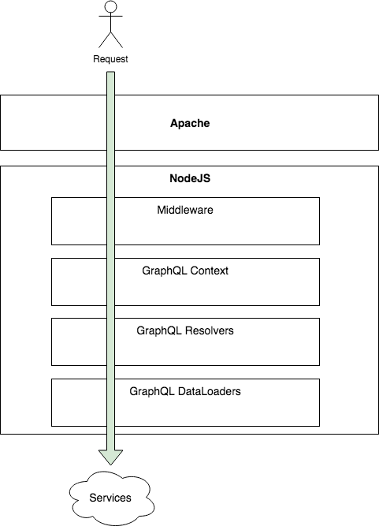

Implementing a service that covers many systems might be frightful in term of data exposition. While wandering the Internet for resources about GraphQL and security, we often see cases where the security is not paramount -- it is easier to ignore security. The reality is that most corporation that desire to bring GraphQL will also need to secure the information. This article sheds light on how I approached the security in my implementation of GraphQL at Netflix for Open Connect.

## Prelude

In an ideal world, we have the GraphQL server getting the authorization from the corporate security infrastructure and the GraphQL delegate downstream to the actual data source the responsibility of returning an error. For example, if the data source is a REST API, the token of the user is used for the call, hence can return an HTTP code 401 and GraphQL will handle the error. However, in maybe the GraphQL exposes some internal services that were secured only by the premise that it was under a VPS (virtual private server). Meaning that not validation is actually performed. In that case, some custom code is required by the executioner of the service: GraphQL. Another case could be that the security is by a specific group of entity (organization, user, etc) meaning that you do not want user A to access user B information. Again, a strong security model would perform the validation at the source (Rest, SQL views, etc) but in the real world, it is not always the case. To mitigate the possibility of security issues among the sea of services that was cover in my scenario, the security was placed in GraphQL. Meanwhile, further modification in the data sources could be planned and put in place without compromising the delivery of the GraphQL server.

## Exploring the possibilities

One strength of GraphQL is the flexibility. The flexibility nature remains true for security and it opens many doors to where to secure the service. As mentioned earlier, the NodeJS server that host Apollo is behind Apache. The reason is that at Netflix, we have many tools integrated within Apache to secure the user like single-sign-on, OpenID Connect and OAuth 2.0. The Apache module is great for authentication but not for authorizing. It does check if the user is one that can access the GraphQL but does not discriminate on which information the user can consult.

Flow of the request from user to services that contain the information

Apache gives information about the user and provides the additional HTTP headers to NodeJS. The first stop is a custom NodeJS Express middleware. The middleware is a piece of code executed in each request. The middleware check if the user is a Netflix employee with a specific grant right. If that is the case, it marks a particular field in an enhanced request object to signal the user as "authorized for full access." The idea is to avoid every future validation that can be performance costly. This shortcut works well because the Apache module can be trusted with its information. It might not work well in your organization, thus do your homework. The next stop is at the GraphQL context. In my case, I have no validation to do at that level because I did the check in the NodeJS Express middleware. However, if you are not using NodeJS, it would be the place to do HTTP request checks. However, I instantiate a secure object at that level that contains functions that check particular lists of objects. The lists of objects are specific ids of secured entities that the user has access. Then, the context performs a query on specific backend services to fetch what objects ids the users can access. The list goes in the request. The idea is to have before the user reaches the resolver a well-defined list of authorized entities and ids.

It is possible to perform at the resolver checks, but the problem is that if you are not querying for the field that contains the ids that the user can access that you will not have the value available. For example, if a user can only access the data of the organization that he/she belongs and that the user requests for the organization by id for its name then you could block. But, if the user request for a sub-entity, for example a _contact_ and then in the query's tree the name of the _organization_, without the organization id, then the resolver cannot check if the organization's data belong or not to the authorized ids.

Finally, the place I found the best to handle authorization is at the data loaders level where every HTTP requests to service are performed. Upon reception of a query, the data is examined to check if the payload contains information from the entities we want secure. If the response contains an entity that does not belong to the user, an exception is thrown and GraphQL bubble up the exception to the resolver who initiated the request. GraphQL handles the exception properly and your message is given to the user.

## Conclusion

The solution is not ideal because it requires the user to have an additional call, per service, to have a list of entities and ids. I opted to have the GraphQL cache all the entities-ids per user in a server cache (not a request cache) for few minutes. The solution has a flaw that the request is still performed to the service. The reason is the lack of transparency from an entity B on entity A before getting the data. Nonetheless, it secures because the response does not go beyond NodeJS, it is not cached either. These loops are required because of weakness at the leaf of the architecture: the service that has access to the data. As a reminder, even if you are building an internal service that is secured by a network, it is always better to not rely on that infrastructure and to perform database checks. The future is never known, infrastructure change, security change, a potential consumer of the information evolve, and we never know when something will be exposed. For future resiliency and for an optimal defense: always authorize at the source.

## My Other GraphQL Articles

- [Getting Started with GraphQL for Netflix Open Connect](getting-started-with-graphql-for-netflix-open-connect)
- [Install Apollo Server to host a GraphQL service](install-apollo-server-to-host-a-graphql-service)
- [Apollo Server and Secured Playground](apollo-server-and-secured-playground)
- [GraphQL Context](graphql-context)
- [GraphQL Query with Argument](graphql-query-with-argument)
- [Apollo GraphQL Resolvers and Data Source separation](apollo-graphql-resolvers-and-data-source-separation)
- [How to setup a TypeScript, NodeJS, Express Apollo Server to easy debugging with VsCode](how-to-setup-a-typescript-nodejs-express-apollo-server-to-easy-debugging-with-vscode)
- [GraphQL Resolvers with Apollo](graphql-resolvers-with-apollo)
- [Configuring Apollo Playground and API on two different URL](configuring-apollo-playground-and-api-on-two-different-url)
- [How to automatically generate TypeScript for consumers of your GraphQL](how-to-automatically-generate-typescript-for-consumer-of-your-graphql)
- [GraphQL and HTTP Telemetry](graphql-extension-to-collect-http-and-resolvers-telemetry)  
- [GraphQL and TypeScript/React](how-to-consume-graphql-in-typescript-and-react)