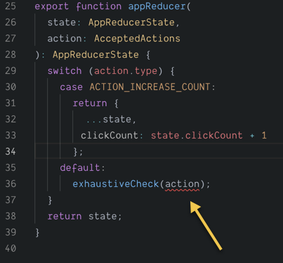

A few weeks ago, I wrote about how to use [React Hooks useReducer with TypeScript](https://patrickdesjardins.com/blog/typescript-with-strong-typed-action-when-using-usereducer-of-react-hooks). The natural follow-up for many is to ensure that the set of action allowed is all served with the reducer. Not only it helps to tidy up the accepted actions by reducers when building the reducer, it also help ensuring during the lifetime of the reducer that the list of action remains up-to-date.

If we recall, the reducer is taking the state and the action. The action was typed to be a list of function that must be part of the AppActions. An utility type was used that allowed to union many set of action, but not used since we were using a single type. Nonetheless, everything was in place to ensure a flexible configuration of actions.

export type AcceptedActions = ActionsUnion<typeof AppActions>;
export function appReducer(
  state: AppReducerState,
  action: AcceptedActions
): AppReducerState {
  switch (action.type) {
    case ACTION_INCREASE_COUNT:
      return {
        ...state,
        clickCount: state.clickCount + 1
      };
    case ACTION_SET_NAME:
      return {
        ...state,
        activeEntity: { ...state.activeEntity, ...{ name: action.payload } }
      };
  }
  return state;
}

While we cannot add subjective case with action not defined in the AcceptedActions type, the weakness of the code is that we can remove one of the two cases without being noticed. Ideally, we would want to ensure that all actions are defined. In the case that an action is not anymore required that we would need to remove it from the list of action.

The solution require only a few amount of lines. First, you may already have have the core of the needed logic: an exhaustive check function. I have covered many months ago the idea of an [exhaustive check in this article](https://patrickdesjardins.com/blog/typescript-exhaustive-check). In short, it is a function that should not be reached, when TypeScript found a logical path that can reach the code, the code will not compile.

export function exhaustiveCheck(check: never, throwError: boolean = false): never {
    if (throwError) {
        throw new Error(\`ERROR! The value ${JSON.stringify(check)} should be of type never.\`);
    }
    return check;
}

The use of reducer and TypeScript's exhaustive check pattern is similar to what we would have done for checking if all values are covered on an Enum. The code needs to have a default case which we do not expect the code go fallthrough.

The two new lines:

    default:
      exhaustiveCheck(action);

Removing a required action cause TypeScript to go in the exhaustive check and since the function is marked to accept a never argument does not compile.

TypeScript catching the missing action

I have [updated the original code sandbox](https://codesandbox.io/s/6xj5nn7q2n?fontsize=14). Click on the reducer.ts and try to remove on the of action.

<iframe src="https://codesandbox.io/embed/6xj5nn7q2n?fontsize=14module=%2Fsrc%2Freducer.ts" title="TypeScript useReducer" style="width:100%; height:500px; border:0; border-radius: 4px; overflow:hidden;" sandbox="allow-modals allow-forms allow-popups allow-scripts allow-same-origin"></iframe>

In conclusion, the solution might not be ideal for you if you have all your actions into a huge function, or if you do not even group your action might not be even possible. However, grouping actions tidy up your code by having a better idea of what possible actions are expected in different domain of business your application handles. It is not much more work, and it self-document the code. The exhaustive check is an additional step to maintain order.
