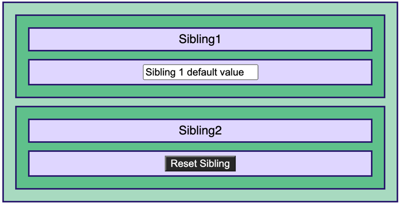

The topic of this article follows the recent topic of [communication across React component](./communicating-between-sibling-react-hook-components). The following example is based on two sibling components. One has a textbox, and one has a button. The button triggers the action to reset the field to an initial value. Thus, the component that fires the event is **unaware** of the initial value. Also, the component with the textbox is **unaware** of the button. Both are separated and do not have any link outside a React context. Because the component that fires the action does not store the initial state, it cannot send a string with the initial value as a reset strategy. Instead, we must rely upon the component that will send a beacon to the component responsible for the value.


First of all, the application remains almost the same as previously in terms of actors. The following image shows the user interface. Each green rectangle illustrates a component. `div` inside a component are purple.



I've removed all the superfluous properties from the two siblings of the previous article. It still has the context provider at the top, allowing it to perform changes and have the underlying component to be notified.

```typescript
export default function App() {
  return (
    <div className="App">
      <CommunicationContextProvider>
        <Parent>
          <Sibling1 />
          <Sibling2 />
        </Parent>
      </CommunicationContextProvider>
    </div>
  );
}
```
The goal is that the button residing in `<Sibling2 />` makes the `<Sibling1 />` textbox to change to its initial value.

The component that initiates the action to reset uses the context. So in that example, it calls `context.reset`.

```typescript
export const Sibling2 = () => {
  const context = useContext(CommunicationContext);
  return (
    <div id="sibling2">
      <div>Sibling2</div>
      <div>
        <button
          onClick={() => {
            context.reset();
          }}
        >
          Reset Sibling
        </button>
      </div>
    </div>
  );
};
```
The context has the following contract:

```typescript
export interface Communication {
  reset: () => void;
  isResetting: boolean;
}
```
The reset function invokes the action to reset the text box in the other component. We need to add a second property in the interface: `isResetting` to indicate to the consumer the reset to reset its text box. The whole idea sits on the `boolean` value. We will toggle the value at each action. Changing the value from `false` to `true` and then `false` and so on will change the context's value, making the components rely on the context to re-render.

The consumer of the action, the first sibling that has the text box, has a listener on the boolean value of the context. 

```typescript
export const Sibling1 = () => {
  const DEFAULT_VALUE = "Sibling 1 default value";
  const [val, setVal] = useState(DEFAULT_VALUE);
  const context = useContext(CommunicationContext);

  useEffect(() => {
    setVal(DEFAULT_VALUE);
  }, [context.isResetting]);
  return (
    <div id="sibling1">
      <div>Sibling1</div>
      <div>
        <input
          type="text"
          value={val}
          onChange={(e) => {
            setVal(e.target.value);
          }}
        />
      </div>
    </div>
  );
};
```

The hook `useEffect` listens to a change. In our case, we listen to the `isResetting`. When the value toggles in the context, the effect is called. Inside the effect, we do the actual action to reset the field. The code is clean because the invoker, the `Sibling2` is separated from the implementation of the reset logic. Also, the separation removes future modification frictions. For example, another component can subscribe to the notification, or sibling1 can stop relying on the reset. In all cases, the role of sibling2 remains the same and is not impacted by other components' roles.

You can play with the code in [CodeSandbox.io](https://codesandbox.io/s/react-sibling-communication-novalue-part1-forked-wv314).

