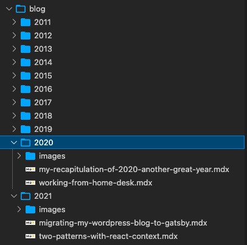
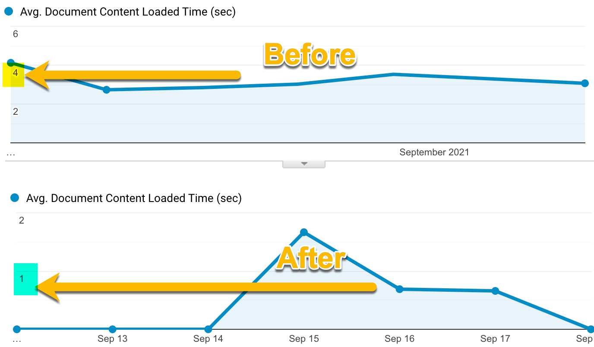

When I renewed my VPS account for the year, I realized something: I do not have much going on anymore. In the last five years, I have been relying on the VPS because of my blog.  I have been hosting since 2011 on WordPress my blog using Apache and MySql.  So, one of my objectives was to transfer my personal webpage and blog to something static.

I decided to move with a solution that relies on Github to host the source code of my new system but also Github to host the static pages. Github offers the possibility to host static pages like HTML, JS, CSS directly on their site. The solution is called _GitHub Pages_ and it has pretty improved throughout the years. For example, it offers with a simple button the possibility to have your pages under HTTPS. So, now that I knew where to host the code and where the host the website and blog, I had to find how to continue to blog without WordPress. There are many solutions available; one that is popular is to use a system that builds the static file from dynamic language. I landed on Gatsby.js, which allows me to create the website (and blog) in TypeScript with React and GraphQL, which are all technologies that I am familiar with.

The road of moving from a WordPress blog to Gatsby.js is not uncharted but also not a walk-to-the-park. I was disconcerted to see that Gatsby v2 and v3 are pretty different, making many documentation irrelevant. Also, something to know about Gatsby is that it relies heavily on plugins. Many are deprecated or do not work, seemingly as we will see in this article.

## Migration WordPress Articles to Markdown

The migration starts by moving all the assets from WordPress. WordPress has an export feature built-in which worked fine. It produces an XML file with the articles from the database. Once the data was on my computer, I used a script to convert the XML into Markdown. The script name is [wordpress-export-to-markdown](https://github.com/lonekorean/wordpress-export-to-markdown). It is open-source and available on Github. The script performance was greater than expected. I had issues with many images, but I could retrieve those from the servers. Overall, very satisfied. A quick thing to know, Markdown (md) is not anymore _the way_ to write in Gatsby. In version 3, the new format is Markdown for component a.k.a. [MDX](https://mdxjs.com/). A quick rename of all file extensions, and I was all set. Here is the command line I used:

```sh
find . -name '*.md' -exec rename .md .mdx {} +
``` 

## Getting Started with Gatsby.js

The official website has a lot of documentations. The problem is to get your head straight to what you can do or not. It is not a normal Webpack/CRA/React website. Gatsby is actually a system that compile .jsx or .tsx into HTML files. The system has a great development experience that lets you not rebuild everything while building. Nonetheless, I tour a detour reading article that was showing one of many ways which was not the way I desired.

For example, I wanted to have a page to see all articles for a specific year. I also wanted to be able to do pagination of my writing since I have over 650. This might look easy, but with Gatsby, it is different. You can write a GraphQL query but cannot pass a variable in the React component: you must give it by the context. The values of the object inside the context are defined at compilation time! It means you need to think always from the perspective of building time and consuming time. The value you pass must be all defined during the build time inside a file named `gatsby-node.js`.

The file is in JavaScript and is one of the few files that I had to keep in JavaScript. The rest of the code can be written in TypeScript without custom configuration. 

## Two Types of Page

Gatsby allows creating automatically pages depending on where you put your TypeScript file (template) or programmatically. The flexibility is interesting but also confusing when you get started. I ended up having everything for the blog in the programmatic pattern for consistency and control. My personal website consists of a single page, and it relies on folder structures. For example, in my `src/pages/index.tsx` is my website. It is elementary, has no access to GraphQL, and displays images and texts. The blog has all its pages inside `src/templates`. As you might understand by now, the `src/pages/` is a folder that creates a route with the file name. The pages in the template folder (could be any time that is not reserved) are used by the `gatsby-node.js` where you create pages with JavaScript.

Without getting in too much detail, the script needs to export a `createPages` function where you fetch all your Markdown file (MDX)

```javascript
exports.createPages = async ({ graphql, actions, reporter }) => {
  const { createPage } = actions;

  const result = await graphql(`
    query {
      allMdx {
        edges {
          node {
            id
            fields {
              slug
            }
            frontmatter {
              date(formatString: "YYYY-MM-DD")
            }
          }
        }
      }
    }
  `);
  // ....
}
``` 

This is a GraphQL query at the top of the function to gather the id of the node. The node is a MDX file. There was a little confusion because the GraphQL fetches the slug, which is the URL that identifies the blog article. However, there is a `slug` underneath the `node` and one inside the `fields`. The `fields` is the good one because everything inside the `fields` are custom fields. That is right; I had to create a custom field! The reason is that I wanted to have all my markdown files by year in my repository.



The problem is the generated default slug uses the path, which means the year was on all slugs. To create a custom field that will contain the same slug but without the year, you need to create a function called `onCreateNode` inside the `gatsby-node.js` file. In short, it checks if the node is a MDX file, creates a file path that removes the six first characters and creates a new URL that can be used in a later stage (the `createPages`).

```javascript
exports.onCreateNode = ({ node, actions, getNode }) => {
  const { createNodeField } = actions;
  if (node.internal.type === `Mdx`) {
    const relativeFilePath = createFilePath({
      node,
      getNode,
      trailingSlash: false,
    });
    const newSlug = relativeFilePath.substring(6); // Remove the year
    const url = URL_BLOG_ARTICLE.replace("{slug}", newSlug);
    createNodeField({
      name: `slug`,
      node,
      value: url,
    });
  }
};
``` 

From the GraphQL above, we need to loop each node and create the page for what is needed. For example, we need 1 page per article. Then, we need each year to create a page for that year. And, it gets tricky: one page for each page of the pagination. It means you cannot have custom number of articles by page and that every time you have a new article about rebuilding your solution.

Here is the code for the page that hosts the text of the article. It was created for the 650+ articles.

```javascript
createPage({
  path: node.fields.slug /*defined in `onCreateNode`*/,
  component: path.resolve(`./src/templates/BlogArticle.tsx`),
  context: { id: node.id, totalPages: totalPageCount },
});
```
The `context` is where you pass information down to the `component`. In that case, I am passing the node `id`, which I can retrieve to fetch the content of the MDX file. Again, keep in mind that the id passed is passed at the build time to GraphQL. And, at build time, it fetches in GraphQL the content. Hence, the `totalPageCount` is also passed to have the pagination control to be filled of data at the bottom of the article.

Without getting in all the page templates, here is a last example displaying all articles for a year.

```javascript
const year = node.frontmatter.date.substr(0, 4);
if (!years.has(year)) {
  const yearStart = year + "-01-01";
  const yearEnd = year + 1 + "-01-01";
  createPage({
    path: URL_PER_YEAR.replace("{year}", year),
    component: path.resolve(`./src/templates/BlogsByYear.tsx`),
    context: {
      yearStart: yearStart,
      yearEnd: yearEnd,
      year,
      totalPages: totalPageCount,
      currentDate: formattedCurrentDate,
    },
  });
  years.set(year, year);
}
``` 

The configuration is still in the loop but does not need to create a page for each entry. That time, it does only when a new year is discovered. The path does not use a slug but uses a format from a constant with the year. It looks like `/year/2021`. The component is different because we will display a list of titles and dates for each year's article. The context has more information. It has the starting date and ending year. The years are passed in argument in the GraphQL of this component (at built time) and filter the list of MDX to the year.

Here is an example of the TSX file that displays all article for a year.

```typescript
const BlogsByYear = (queryInfo) => {
  const data = queryInfo.data;
  const context = queryInfo.pageContext;
  return (
    <Layout
      pageTitle="Blog Posts"
      currentPageYear={context.year}
      totalPages={context.totalPages}
    >
      {data.allMdx.nodes.map((node) => (
        <BlogEntry
          id={node.id}
          slug={node.fields.slug}
          title={node.frontmatter.title}
          date={node.frontmatter.date}
          categories={node.frontmatter.categories}
        />
      ))}
    </Layout>
  );
};

/**
 * the $yearStart$yearEnd are provided in the `context` of the gatsby-node.js `createPages` function
 */
export const query = graphql`
  query BlogsInYear($yearStart: Date!, $yearEnd: Date!, $currentDate: Date!) {
    allMdx(
      sort: { fields: frontmatter___date, order: DESC }
      filter: {
        frontmatter: {
          date: { gte: $yearStart, lt: $yearEnd, lte: $currentDate }
        }
      }
    ) {
      nodes {
        frontmatter {
          date(formatString: "MMMM D, YYYY")
          title
          categories
        }
        id
        fields {
          slug
        }
      }
    }
  }
`;
export default BlogsByYear;
``` 

It is simple but took longer than I wished. For example, the pattern of passing the dates is something to think about since it relies on the build script. Also, you can see that the `query` variable is not used directly. Gatsby has many default behavior, like this one, that is by convention. By convention, you can have a single GraphQL query that is called during the call of `createPages`. So, when looping the page, it performs a call with the context information. The current date allows not to display blog articles planned in the future. Quick remark here: many things that WordPress offers from many years are not present in Gatsby. Gatsby is not specialized as a blog platform like WordPress. Thus, some manual work is needed. There are many gotchas. For example, you cannot have a GraphQL in the Typescript component, similar to an image that you cannot pass a path to a TypeScript control without error. It is also harder to debug because you need to debug during build time, not during execution time. While you can still debug the TSX for some elements, most of the code is executed only at build time. that being said, I was able to use VsCode to debug the build script without a problem. Here is my VsCode for debugging:

```
{
  "name": "Gatsby develop",
  "type": "pwa-node",
  "request": "launch",
  "program": "${workspaceRoot}/node_modules/.bin/gatsby",
  "args": ["develop"],
  "runtimeArgs": ["--nolazy"],
  "console": "integratedTerminal"
}
```

## MDX
I had to spend about 10 hours fixing the generated markdown file. Most issues were related to 10 years of different ways to have code snippets. I was able to use many Regex replace to fix URL, code blocks, and bad image links, but I also had to deal with hundreds of MDX files with issues. Overall, my situation is way better than before with a more uniform content, but it was not quick. Here are some of the Regex I kept around and changed to fix a couple of issues. I used them in VsCode.

``` 
URL to the IMAGE folder
\[!\[(.+)?\]\(http(s?):\/\/patrickdesjardins.com\/blog\/wp-content\/uploads\/(\d+)\/(\d+)\/([\w\.\-_]+)(.*)?\)\](.+)

!\[(.+)?\]\(http(s?):\/\/patrickdesjardins.com\/blog\/wp-content\/uploads\/(\d+)\/(\d+)\/([\w\.\-_]+)(.*)?\)


Remove the caption tag
(\[caption\s([^\]]+)\])

URL to the relative
\[(.+)?\]\(http(s?):\/\/patrickdesjardins.com\/blog\/([\w\.\-_]+)(.*)?\)
[$1]($3)
``` 

## Basic Stuffs Missings
I do not want to spend too much time on the stuff that is not working. Mostly because it might be because I am lacking experience. The migration took me about 20 hours which included to re-write everything (website and blog) from the ground. It also includes the time spent to fix the Markdown that was not compiling.

I still haven't found a way to display an animated gif. Something that in my book should be covered by default. But even basic images like jpg and png are handled by a plugin.
Similarly, I have a couple of mp4 that I cannot render. There are many plugins, but none of them work for me. Many plugins for core concepts like images are also not so popular in terms of download count. So, this makes me suspectful for the platform health. Plugins are handled in the `gatsby-config.js`. As for today, I am using this list of plugins:

- gatsby-plugin-typescript
- gatsby-plugin-google-analytics
- gatsby-remark-images
- gatsby-plugin-image
- gatsby-plugin-mdx
- gatsby-plugin-sharp
- gatsby-transformer-sharp
- gatsby-source-filesystem

I tried many more for what I am missing without success yet.

## Code
Showing code is more than just a plugin, to my big surprise. At this point, I thought that I would need one more plugin that goes along the MDX, and I could call it a day. I was wrong. I had to create a TypeScript component that wrapped the article. It relies on `Prime.js`, which is a popular framework to render code online. So, I had to:

```typescript
<MDXProvider components={components}>
  <MDXRenderer>{data.mdx.body}</MDXRenderer>
</MDXProvider>
```
and the components is:

```
const components = {
  pre: CodeBlock,
};
```

The `CodeBlock` is where I had to rely on this [article](https://codetrain.io/adding-prism-syntax-highlighting-to-gatsby-mdx). I actually copied the whole 20ish lines of code. To me, all that shouldn't be necessary, and it causes the code less flexible. For example, I haven't yet found how to add the line numbers on the left side of the code snippet. To be continued!

## New Habit to Change
I am used to open the browser and write a little bit and continue my day and keep going. Now, I have to have the project code available on my computer. The files are MDX, meaning Markdown editor is not supported. For example, writing in VsCode does not have the preview window. So, the trick is to start in the `develop` mode, and you can write and save and see in the browser the content appearing. It's okay, but less convenient. I know I could create a branch and work directly on Github and then merge into the main branch... again, less convenient.

Also, taking a screenshot and pasting directly in the browser was super fast. Now, I need to save the file locally in the right folder, then use MDX to load the image. Not a big deal, but more friction.

I usually write many weeks if not months in advance, and to make that happen I had to pass the current date in all the pages at **build** time. So it means that I must have the whole website build and deploy not only when I am modifying the user interface but also every day in case an article date is reaching the date of the blog article. Not a huge deal either since I am using GitHub workflow but again, more detail to handle.

## Deployment
To have the website and blog running as with GitHub pages, you need to deploy your built website (static assets) into a specific branch. Recently, GitHub introduced Workflow, which is a continuous integration system. It allows hooking on some events like when new code is pushed but also automated on a schedule (like every day). I created a custom workflow for Gatsby. You can find some available online for Gatsby, but it wasn't super clear to be. Hence I made a basic one inspired by the [GitHub Pages Action in the MarketPlace](https://github.com/marketplace/actions/github-pages-action). The deployment takes 4 minutes in my case, and it has been one area where I enjoyed learning and seeing working flawlessly with little investment in time.

## Custom Domain

The final piece was to change the DNS from my VPS to GitHub. The [documentation](https://docs.github.com/en/pages/configuring-a-custom-domain-for-your-github-pages-site/managing-a-custom-domain-for-your-github-pages-site) from GitHub is pretty straightforward, and after changing the A Record, I was all set. Twenty-four-hour laters, I had an HTTPS certificate, and everything was shipped.

## Positives of Moving to Gatsby
The main advantage is reducing the cost from about 200$ per year (which was way higher when I had many websites) to 0$. The second advantage is the performance. Because everything is performed at build time. Visiting the website and the blog articles is fetching an HTML page and some other files that do not require processing. The following image is the last two months' average document loading time with the WordPress blog (from Google Analytics in production) compared to Gatsby's last few previous days. The average time is a little bit over 4x faster.



