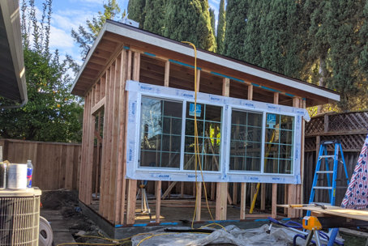
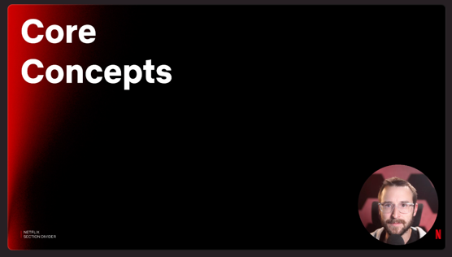

For several years, when I was looking back at what I accomplished during the year, I had the feeling that it was another year that had beaten all my previous ones. Strangely, I do not have that sensation for the first time (as I can remember). I am writing these first few lines and realizing that 2020 and 2021 are vague. So, let's step back and see what happened this year.

# New Home Office

At the beginning of the year, I decided to change the way I was working at home. With Covid getting more and more permanent in our lives, I decided that it was time to have a better place to work. So, in 2020, I [build a desk](working-from-home-desk) that was self-contained.

<iframe
  style="display:block; margin:auto;"
  width="560"
  height="315"
  src="https://www.youtube.com/embed/m3wZlIzsYqs"
  title="YouTube video player"
  frameborder="0"
  allow="accelerometer; autoplay; clipboard-write; encrypted-media; gyroscope; picture-in-picture"
  allowfullscreen
></iframe>

The problem was that it was still in the living room and the separation from our family life and work was not ideal. Meetings were fine when the children were out, but school finished early and wasn't optimal. I also started to add more lighting for better visuals when recording videos. However, the pieces of equipment were outside the protection of the desk. So, I decided to build a backyard shed that I am using as an office.

The shed has the desk I built, and I can spread all the lights without fear of my youngest one pulling a wire. It is soundproofed, heated/a.c. and I passed an RJ45 wire so well connected.

# School

I started a master's degree in 2018 at Georgia Tech in machine learning. I completed the program a few days ago. I [wrote about my experience](i-completed-my-master-degree) as well. I am glad that it is behind me. It was an interesting experience after so many years of not being at school. 

In a nutshell, I realized a few things while completing the program:

- School aims **not** for students to understand, but to provide many pointers to potential paths. Thus, you can have good grades without _mastering_ the content
- Redirecting students to read dozen of white papers is not teaching. Instead, always put yourself in the shoes of someone who want to learn, go slowly, many examples, etc.
- I like leading a small group of people. I feel motivated, encouraging; I like keeping track of the project and empowering people. I also like playing a part in the project, hence guiding and unblocking, providing a good foundation, etc.
- Machine learning is applying statistics in scripts. Nothing is magic; most of technics are more or less efficient.

# Work

I think the feeling of having accomplished less than that previous year is mainly that I have been head down at work and school. Trying to balance both without disrupting my family was time challenging. Before Covid, I would go to work around 6h30am to start school until around 8h00am to then work. Then, family time and school in the evening. But, this year, I had to bring my younger one to pre-school, so my morning routine was family and then work. Once at work, I found myself working more hours. I worked until dinner time instead of finishing once my "time was up." Blocking time between work and dinner did not work for me: often, I found a reason to continue what I was working. When I had to work on school for the evening, I barely had an hour with my wife. I conclude that time shrinks fast with commitment and when not setting hard limits to stop something.

In terms of work, I continued to work on GraphQL for Open Connect, and our internal React applications. Outside adding features, I started to migrate (slowly) some code out of Redux to rely solely on the Appolo client. The complexity of normalizing the data and having the life cycle with Redux was not always apparent for all the engineers and was also time-consuming. I like separating the logic from the user interface, but it costs. For GraphQL, Netflix is moving toward having services having their own GraphQL services instead of gRPC/Rest; hence I took under my wing the responsibility to migrate our big NodeJS GraphQL server to be Federated compatible, and we will slowly in 2022 have many GraphQL servers serving data and extending our current NodeJS server. So we are moving into a federated world. I am glad that I presented this new path to the team as it is getting the official one but also because it will improve our efficiency with one less layer of abstraction.

Also, this year I am the person who did the most asynchronous technical presentations on the team. I started recording 5 to 15 minutes videos about different topics. These videos were one shot, not edited. The goal was to share software development interest, programming ideas, directions of some technologies, or update about GraphQL that was touching many of us. Asynchronous presentations are great for letting people consume the information as they see fit. And, it is always possible to have a conversation offline afterward.

# Health & Hobbies

I usually try to do some gym in my garage. It is limited in terms of exercises. I need to get more into it. Related to the time challenge described in the section above, I found myself skipping more than I wanted. I averaged about nine times per month and for 25 minutes each time. There is some improvement to be done here.

Since we work from home, I have not read books or listened to audiobooks. Audiobooks, while working does not work for me. I cannot 100% focus on two things, and work remains a top priority during the day. A solution that I know works is to block a portion of time, but with school and the children, it wasn't easy for 2021.

I have not done many electronic projects or side projects outside exploring Github workflow, benchmarking, and automating a small library that wraps the [Hilbert curve algorithm in TypeScript](https://github.com/MrDesjardins/hilbert-curve-ts).

During the little free time, for example, between the semesters, I decided to enjoy some old games. I rarely play or watch movies, but I decided to give myself some non-productive time to help me enjoy and relax. So I have been playing [Starcraft II Coop](https://starcraft2coop.com/), which are small 20 minutes missions. Not stressful, fun, and I think it helped me decompress.

# 2022 Plans

I have a couple of plans for next year. First, with the master's degree out, I have about 15 hours back available every week.

I want to jump back in more backend work, which requires me to ramp up. Netflix is using Java. I used Java during my former education in Canada from 2001 to 2008. Then, I moved to C#/.NET. In the last few weeks, I started to update my knowledge of Java and the Spring framework. However, I do not have practical experience, so I might build a project.

Someone from my team said that algorithms and system design are like brushing our teeth and should be part of a weekly/monthly habit to stay up-to-date. I have never been really into spending time on activities that do not bring me immediate or medium-term benefits. However, it might be wise to stay fresh. Maybe I can find a way to update my knowledge while learning Java practically. The specifics are still unclear about approaching an optimal balance of fun, learning theoric algorithms/system designs, and brushing my Java skills.

# Conclusion

2021 might not have been as complete as the previous years. That might be okay as well. Writing about a number of accomplishments is easier than writing about the quality of them. 2021 was leaning on the quality. Closing a four-year master's program is not a simple task, neither finding a balance between work and the family. I'm satisfied with the work performed at Netflix. However, it is not easy to demonstrate all the accomplishments achieved internally.

2021 gave me a clear understanding to be happier. I realized that I must focus on the positive. Identifying potential improvements is a great skill I possess, but optimizing all the time does not bring anyone (myself included) happiness. Also, focusing on what I can control is what is essential. You can teach someone to fish, but there is nothing to be dissatisfied with if the person does not have an interest. That is life.

I also tend to produce a lot and forget to commit some "marketing" about what has been produced. For some reason, this year, I noticed that some people make half of the features, half of the unit tests, half of the documentations, etc. but seem to be working twice as much. Their secret is how they sell what they are doing. It is the art of producing and selling. As much as I like building features, creating unit tests, and adding values, it is not as impactful if no one knows about it.

# Previous Recapitulations

You can see my previous year recapitulation of [2020](my-recapitulation-of-2020-another-great-year), [2018](recapitulation-of-2018), and [2017](recapitulation-of-2017).
