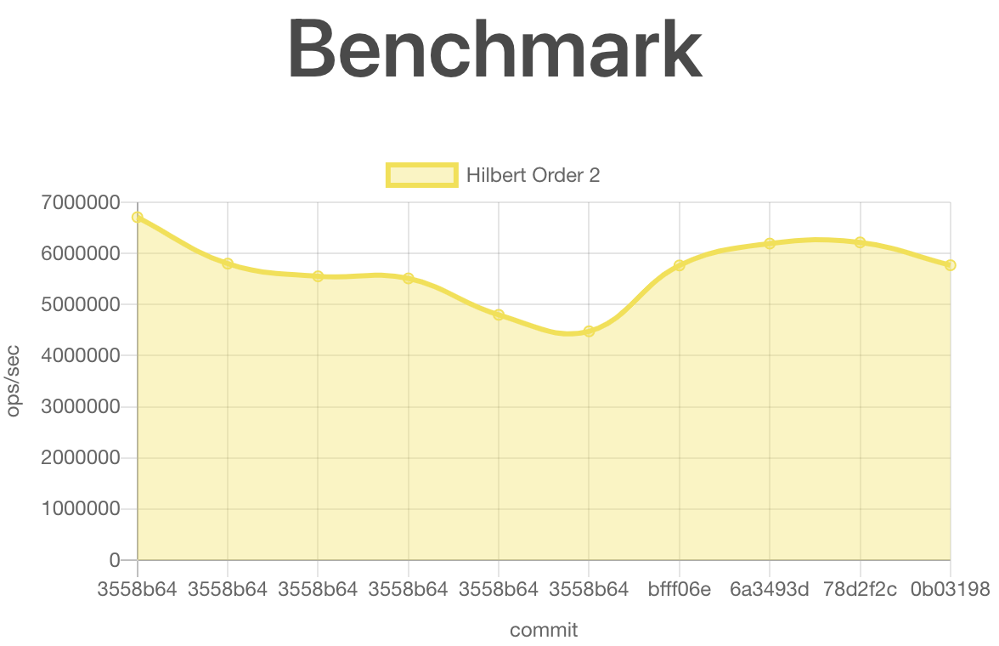

Automation is vital for delivering a product of consistent quality. In that domain, automated assertive unit tests are the epitome. Unit tests are a well-accepted cog in a software engineer arsenal and rarely contested. While avoiding injecting new errors in the code is critical, ensuring another non-functional regression is equally valuable. However, we rarely see these other non-functional characteristics automated. In this article, I'll describe how to have your TypeScript code automatically tested for performance regression on Github.

Before getting into the detail, here is a screenshot of the generated image for my [TypeScript Hilbert Curve library](https://github.com/MrDesjardins/hilbert-curve-ts). The Github workflow generates a [dynamic HTML page](https://mrdesjardins.github.io/hilbert-curve-ts/dev/bench/) with one chart per performance test. The x-axis contains the commits (in time) with a y-axis with the number of operations conducted.



# TypeScript Benchmark Code

The first step is to create a benchmark. You can see a benchmark as a unit test suite that contains many unit tests. Github uses a workflow action that supports many benchmark libraries. For example, the currently supported one for JavaScript relies on the [Benchmarkjs library](https://benchmarkjs.com/).

I am using TypeScript, hence use the `@types/benchmark` library as well. 

``` 
npm install --save-dev benchmarke@latest
npm install --save-dev @types/benchmark@latest
```

Then, creating a benchmark test is a matter of defining what you want the library to perform several times. In my case, I wanted to benchmark the algorithm of a function with a specific parameter. Hence, I am creating one function (`.add`) per scenario for this function.

```typescript
const Benchmark = require("benchmark");
const suite = new Benchmark.Suite();
const { HilbertAlgorithm } = require("../dist/lib/es5/hilbertAlgorithm");

suite
  .add("Hilbert Order 2", function () {
    const h = new HilbertAlgorithm(2);
    h.indexToPoint(0);
  })
  .on("cycle", function (event: any) {
    console.log(String(event.target));
  })
  .run();
``` 

You can see the [full benchmark TypeScript file here](https://github.com/MrDesjardins/hilbert-curve-ts/blob/master/benchmarks/benchmarks.ts).

# TypeScript Benchmark Script

Once the benchmark functions are created, we need to have an entry point in the package.json. I added one command.

```
"benchmarks": "ts-node benchmarks/benchmarks.ts --project tsconfig.benchmarks.json",
```

As you can see, the command relies on `ts-node` because the benchmark is in a TypeScript file. Hence, you need to add the dependency in your package.json.

``` 
npm install --save-dev ts-node@latest
```

# Github Workflow

I'll assume you already have a workflow action that builds and run some unit tests (or not). Hence, we will need to add a step to your current workflow. Here is the full code of the two steps:

```yaml
- name: Run benchmarks
    run: npm run benchmarks | tee output.txt
    if: matrix.os == 'ubuntu-latest' && matrix.node-version == '16.x'

- name: Store benchmark result
  uses: benchmark-action/github-action-benchmark@v1
  with:
    tool: "benchmarkjs"
    output-file-path: output.txt
    github-token: ${{ secrets.GITHUB_TOKEN }}
    auto-push: true
    comment-on-alert: true
    alert-comment-cc-users: "@mrdesjardins"
  if: matrix.os == 'ubuntu-latest' && matrix.node-version == '16.x'
``` 

The first step, named `Run benchmarks`, which calls the NPM command created earlier. It uses a `|` to send the output into a file using the Unix `tee` command. The command redirects the output to a file. The file name is important and will be used later in the second step. The `if` is optional. In my workflow, I have a matrix of different compilations under different NodeJS versions and operating systems (OS). I want to run the performance test only in 1 particular combination, which is under Ubuntu and NodeJS 16. The reason is that it increases the process and also that I do not mind about performance between NodeJS version and OS.

The second step, named `Store benchmark result`, which uses `benchmark-action/github-action-benchmark@v1`. The action takes the generated benchmark output from the file specified in the previous step and knows how to interpret the result. Then, it uses the Github token provided and pushes the result into another branch called `gh-pages`. The branch contains one folder with `data.js`. The folder contains the historical data of each time the benchmark was executed. Also, a file named `index.html` is the entry point to read the result. 

To create the `gh-pages` branch, you need to execute:

``` 
git switch --orphan gh-pages
git commit --allow-empty -m "initial commit"
git push -u origin gh-pages
``` 

You can find further information for the action at the [Benchmark-action](https://github.com/benchmark-action/github-action-benchmark) repository.

# Conclusion

The [workflow](https://github.com/MrDesjardins/hilbert-curve-ts/blob/master/.github/workflows/action.yml) for the [TypeScript Hilbert Curve library](https://github.com/MrDesjardins/hilbert-curve-ts) library builds, tests for logic, and now performance test. I am confident when I am modifying the code that the output of the functions is stable in terms of data and performance. The additional automation steps were a little investment, thanks for the _action_  that is already integrated into Github.