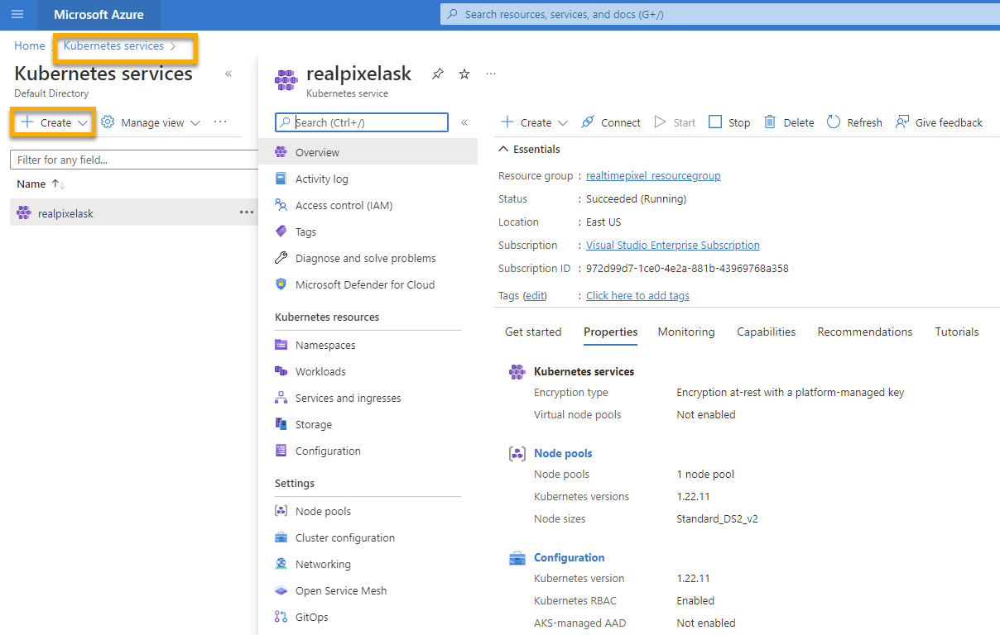
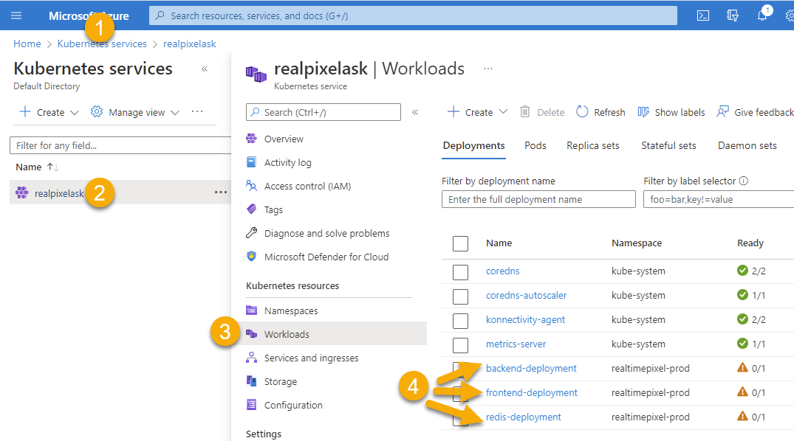
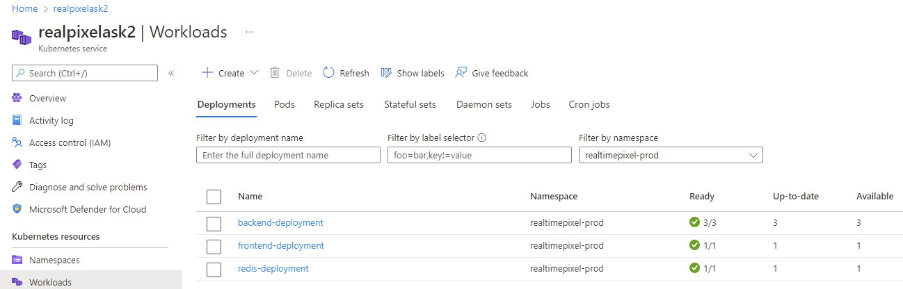

Kubernetes is a convenient way to deploy an infrastructure of services in a central place. Once you have your service Docker images built and deployed you can use Kubernetes to deploy multiple instances across the cloud. In this article, we will see how Microsoft Azure can use a Kubernetes configuration generated with Helm and deploy many images from Azure Registry Container.

# Create an Azure Kubernetes Service (AKS)
There are two ways to create a Azure Kubernetes Services: Azure Cli and Azure Portal.

## Azure Cli
A few pieces of information is required that were built when we created our Azure Docker Image Repository.
You need to use the Azure resource group name after `--resource-group`. The name of the Kubernetes service is after `--name`. The `--attach-acr` is the name of the Azure Container Registry (acr). 

```
az aks create --resource-group realtimepixel_resourcegroup --name realpixelask --location eastus --attach-acr realtimepixel --generate-ssh-keys
```
There are a few things to know:
1. The name cannot have an underscore. Even if you enclose with double quote, it does not work
2. The command takes a while to run. Expect at least 1 minute.

## Azure Portal
Many online tutorials show the Azure CLI (`az` command), but it is also possible to create the Kubernetes service on the Microsoft Azure Portal.



I personally prefer to use a web interface. For creating a Kubernetes cluster, the Azure Portal guides you through several steps, which in my opinion worth doing that step that you will rarely do compared to operation Azure CLI command.

# Configure Github Workflow
You can edit the existing Github workflow defined [previously](./azure-docker-container-repository-github) that was building the image and pushing it into Azure Container Registry (ACR). However, I created a new workflow to manually decide when to push the image into production.

Here is the entire Github workflow that I store in the repository in `.github/workflows/k8sdeploy.yml`

```
name: Kubernetes Prod Deployment
on:
  workflow_dispatch:

# Environment variables available to all jobs and steps in this workflow
env:
  REGISTRY_NAME: realtimepixel
  CLUSTER_NAME: realpixelask2
  CLUSTER_RESOURCE_GROUP: realtimepixel_resourcegroup
  NAMESPACE: realtimepixel-prod

jobs:
  build:
    runs-on: ubuntu-latest
    steps:
      - uses: actions/checkout@main

      # Set the target Azure Kubernetes Service (AKS) cluster.
      - uses: azure/aks-set-context@v1
        with:
          creds: ${{ secrets.AZURE_CREDENTIALS }}
          cluster-name: ${{ env.CLUSTER_NAME }}
          resource-group: ${{ env.CLUSTER_RESOURCE_GROUP }}

      # Create namespace if doesn't exist
      - run: |
          kubectl create namespace ${{ env.NAMESPACE }} --dry-run=client -o json | kubectl apply -f -

      - name: Helm tool installer
        uses: Azure/setup-helm@v1

      - name: Azure Login
        uses: Azure/login@v1.1
        with:
          creds: ${{ secrets.AZURE_CREDENTIALS }}

      - name: Get Latest Tag Redis
        id: latesttagredis
        run: |
          tag_redis=$(az acr repository show-tags --name ${{env.REGISTRY_NAME}} --repository realtimepixel_redis --top 1 --orderby time_desc -o tsv)
          echo "::set-output name=tag_redis::$tag_redis"
      
      - name: Tag Redis
        run: echo "Tag Redis is ${{ steps.latesttagredis.outputs.tag_redis }}"

      - name: Get Latest Tag Backend
        id: latesttagbackend
        run: |
          tag_backend=$(az acr repository show-tags --name ${{env.REGISTRY_NAME}} --repository realtimepixel_backend --top 1 --orderby time_desc -o tsv)
          echo "::set-output name=tag_backend::$tag_backend"

      - name: Tag Backend
        run: echo "Tag Backend is ${{ steps.latesttagbackend.outputs.tag_backend }}"
      
      - name: Get Latest Tag Frontend
        id: latesttagfrontend
        run: |
          tag_frontend=$(az acr repository show-tags --name ${{env.REGISTRY_NAME}} --repository realtimepixel_frontend --top 1 --orderby time_desc -o tsv)
          echo "::set-output name=tag_frontend::$tag_frontend"

      - name: Tag Frontend
        run: echo "Tag Frontend is ${{ steps.latesttagfrontend.outputs.tag_frontend }}"

      - name: Deploy
        run: >
          helm upgrade realtimepixel ./kubernetes/realtimepixel 
          --install 
          --namespace=${{ env.NAMESPACE }} 
          --set namespace=${{env.NAMESPACE}}
          --set image.pullPolicy=Always
          --set image.redis.repository=${{env.REGISTRY_NAME}}.azurecr.io/realtimepixel_redis
          --set image.redis.tag=${{ steps.latesttagredis.outputs.tag_redis }}
          --set image.backend.repository=${{env.REGISTRY_NAME}}.azurecr.io/realtimepixel_backend
          --set image.backend.tag=${{ steps.latesttagbackend.outputs.tag_backend }}
          --set image.frontend.repository=${{env.REGISTRY_NAME}}.azurecr.io/realtimepixel_frontend
          --set image.frontend.tag=${{ steps.latesttagfrontend.outputs.tag_frontend }}
```
Here is a description of what is going on:

1. The first section, called `env`, is variable that can be used across the workflow. It is a simple way to configure data in a central place for the script. It defined the registry (Azure Container Registry) name, the Kubernetes cluster name created in this blog post, the Azure resource group (previous article), and the Kubernetes namespace.

2. The second section connects to AKS: Azure Kubernetes Service

3. We create the namespace

4. We then connect with Helm and Azure Login. From now, we are ready to perform some commands

5. First, we get the latest image tag for each image

6. Finally, we use **Helm** to install or update the Kubernetes configuration. What is important is to override a lot of values from `kubernetes\realtimepixel\values.yaml` (Helm values file)

# Verification

At this point, the Helm command pushes the instruction to Azure Kubernetes Service. Going in the portal you can see under `Workloads` the deployment.



Everything should be running as expected! The screenshot shows three orange symbols next to my three deployments because there is an issue with the Kubernetes configuration, which is outside the goal of this post. However, it is still interesting to know that you can drill and see the error reason being: `ErrImageNeverPull`.

## Debug Azure Kubernetes ErrImageNeverPull
The first steps are to access the reason the image is not pulling. You need to get one of the pods under the deployment that is falling.
```
kubectl get pods -n realtimepixel-prod
kubectl describe pod redis-deployment-6495cd48cc-fhzjg -n realtimepixel-prod
```
The last command gives more information saying the policy is to `Never`

```
Events:
Type     Reason             Age                    From               Message
----     ------             ----                   ----               -------
Normal   Scheduled          59m                    default-scheduler  Successfully assigned realtimepixel-prod/redis-deployment-6495cd48cc-fhzjg to aks-agentpool-28884595-vmss000002
Warning  Failed             57m (x12 over 59m)     kubelet            Error: ErrImageNeverPull
Warning  ErrImageNeverPull  4m36s (x260 over 59m)  kubelet            Container image "realtimepixel.azurecr.io/realtimepixel_redis:67dfbf27b868bd0b9e7c77aefafb596f2adb3ca0" is not present with pull policy of Never
```
So, once we know the problem is the `Never`, we can see what is happening between Helm and Azure Kubernetes. Trying to see what is sent to Kubernetes is by using the `template` command of Helm.

```
helm template realtimepixel ./kubernetes/realtimepixel --set namespace=realtimepixel-prod --set image.pullPolicy=Always --set image.redis.repository=realtimepixel.azurecr.io/realtimepixel_redis --set image.redis.tag=123123 --set image.backend.repository=realtimepixel.azurecr.io/realtimepixel_backend --set image.backend.tag=123123 --set image.frontend.repository=realtimepixel.azurecr.io/realtimepixel_frontend --set image.frontend.tag=123123 > temp.yaml
```

I found a case-sensitive issue with the `image.pullPolicy` where the `p` was lowercase and needed to be uppercase.

## How to Debug with Azure Kubernetes Containers
The first issue was out of the way, and a second appeared. This time, the Azure Kubernetes was showing the pods having a `CrashLoopBackOff`.There is a command to get the health of all your pods. In my case, some of them were crashing:

```
kubectl get pods -n realtimepixel-prod
```
Resulted with: 
```
NAME                                   READY   STATUS             RESTARTS         AGE
backend-deployment-69c99548d9-g2w5d    0/1     CrashLoopBackOff   10 (3m28s ago)   30m
backend-deployment-69c99548d9-wrhzp    0/1     CrashLoopBackOff   10 (3m42s ago)   30m
backend-deployment-7dfbc4f7f8-m99kl    0/1     CrashLoopBackOff   10 (3m51s ago)   109m
backend-deployment-7dfbc4f7f8-vbp24    0/1     CrashLoopBackOff   10 (4m4s ago)    109m
frontend-deployment-6f88fdb587-2p2lk   1/1     Running            0                30m
redis-deployment-5d48cc44bd-8w869      1/1     Running            0                30m
```

It is possible to see the logs of the deployment:

```
kubectl describe pod backend-deployment-69c99548d9-g2w5d -n realtimepixel-prod
kubectl logs backend-deployment-69c99548d9-g2w5d -n realtimepixel-prod
```
The output:
```
> start:production
> node -r ts-node/register/transpile-only -r tsconfig-paths/register build/backend/src/index.js

Error: Cannot find module '/node/build/backend/src/index.js'
    at Function.Module._resolveFilename (node:internal/modules/cjs/loader:933:15)
    at Function.Module._resolveFilename.sharedData.moduleResolveFilenameHook.installedValue (/node/node_modules/@cspotcode/source-map-support/source-map-support.js:679:30)
    at Function.Module._resolveFilename (/node/node_modules/tsconfig-paths/src/register.ts:90:36)
    at Function.Module._load (node:internal/modules/cjs/loader:778:27)
    at Function.executeUserEntryPoint [as runMain] (node:internal/modules/run_main:77:12)
    at node:internal/main/run_main_module:17:47 {
  code: 'MODULE_NOT_FOUND',
  requireStack: []
}
```

My instinct was to get into the container.
```
kubectl exec -it backend-deployment-69c99548d9-g2w5d -n realtimepixel-prod -- sh
```
But was producing:

```
 error: unable to upgrade connection: container not found...
```
The problem is that the issue is on the `run` command of the container that is failing because the starting file (index.js) is not present. However, because it cannot start the command, the container closes not letting me accessing the container to inspect the folder structures and files.

You can test it by creating a Pod for the problematic image that will not restart using the following commands:
```
kubectl run debug-demo -n realtimepixel-prod --image=realtimepixel.azurecr.io/realtimepixel_backend:67dfbf27b868bd0b9e7c77aefafb596f2adb3ca0 --restart=Never
kubectl get pods -n realtimepixel-prod
kubectl exec -it debug-demo -n realtimepixel-prod -- sh
```
However, the problem will remain that when the Kube Control runs the image that it will crash. However, the log above provides good information. In my case, I realized two things:

1. When testing locally, I wasn't testing correctly. The build was passing because I had a `node_modules` with a dependency that was installed when performing `npm run install` which was adding all the `devDependencies`. On Github, performing the same command, with the `NODE_ENV` to `production` was causing `npm install` to install only the `dependencies` without the `devDependencies`.
2. I added the `--target` in the build for the multi-stage. I had the impression that it would start the build with the target, but it is saying that it will be the latest. Oddly, using `docker-compose`, the build step is only the one in the target but using the docker command runs the developer portions and the production.

# Still Not Working! What to do next?
In my case, it was still not green. Same error about `CrashLoopBackOff` on the startup of the container. Time to get back locally.

Instead of using `docker-compose`, I decided to mimic what I was doing on the Github workflow.
```
docker build -f ./services/backend/Dockerfile --target production --build-arg NODE_ENV=production .
```
Then get the image built and run it.

```
docker images
docker run 40d4941a9092
docker ps
```

Take the _image id_ from the ps command:

```
docker run -it 40d4941a9092 bash
```

I could see the error, but like Kubernetes, the container shut down. So now, time to make the container crash but to hang it there in an infinite loop:

```
docker run 40d4941a9092 /bin/sh -c "while true; do sleep 2; df -h; done"
```

In another terminal window, you can connect.
```
docker run -it 40d4941a9092 bash
```

At that point, I saw that the build was messing around with the folders of the output of TypeScript. So I modified the path and was good to go.


# Conclusion
At this point, the image was created with a build that was successful. 



I would say that the experience was enriching. However, one question kept getting in the back of my mind: why isn't the Azure Portal guiding me with more than a single keyword for the failure. As we saw, by messing around with commands, we found the root cause, but some support would have been great. Nonetheless, if something happens to you, now you should be equipped to diagnose a little bit better.

<TocAzureContainerSeries/>