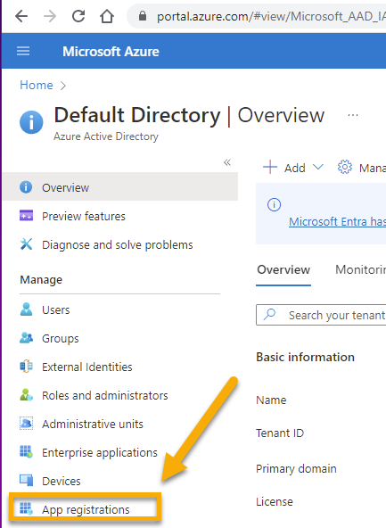
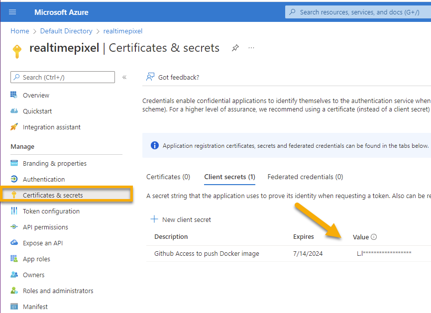
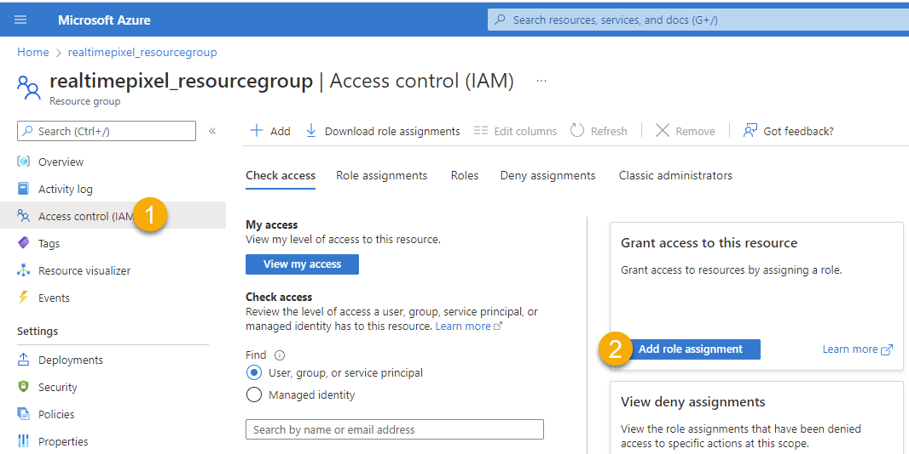
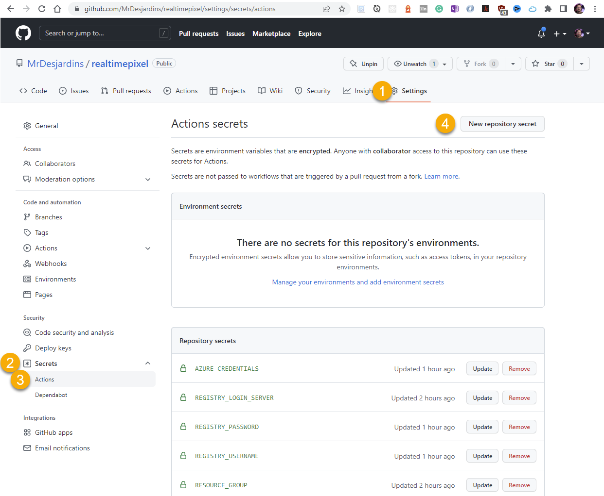

In a [previous blog article](./azure-docker-container-repository), I defined how to build a Docker image and push it from my local desktop machine. The next step is to build our project images and push them from Github to Azure. The main advantage of using a continuous environment to build your image is to have a central place that many developers can use without relying on local configuration. Also, having the creation of the Docker images built and pushed automatically in the continuous delivery pipeline forces some steps to be valid before publishing a new version of the images. Finally, the main gain is performance! With my Internet connection, it takes about 45 minutes, and using a Github workflow; it takes under 5 minutes! Yes, it saves 90% of the time!

# Azure Access
The first step is to give Github access to Azure. Especially, you want to provide access to Github a particular resource group. In my case, we [previously](./azure-docker-container-repository) already created a resource group named `realtimepixel_resourcegroup`. The goal of the resource group is to have all your containers, servers, and Azure resources under the same _bucket_. The resource group is a neat way to separate Azure's resources per project or application. However, Github needs to behave like a contributor to the repository to securely access the Azure Container Registry (ACR). There are two ways to perform that task, and it is very cumbersome to find documentation about them on the Internet. I'll show two ways to do it: by the Azure web portal and Powershell.

In both ways, the goal is to create **an application** that will behave as a fake human. The **application** will have a password to access the determined resource. In our case, we will let the **application** access all resources from the resource group. I bolded the word **application** to ensure that we are using the proper term. You do not create a traditional user account but an application.

Using the Azure Portal web interface or the command line requires you to have an Azure Active Directory.

# Azure Web Interface Way

## Register an Application inside Azure Active Directory

From the main page, select the `Azure Active Directory` service.

Click on `App Registration`inside Azure Active Directory page. The link is on the left menu under the group "Manage".



Click the page menu called `New registration`. Remember the name you choose, you will need it to assign the service principal in the next step. During the creation process, choose a single tenant and no redirect URL. Then, save. Once created, take note of the Application (client) id.


## Generate the Password to use for Github
Again in the active directory, under the application we created, click `Certificates & secrets`. The option is on the left menu. 

Add a "client secrets". Add a new secret and take notes of the `value` (not the secret id). The value will be used to authenticate from Github.





## Service Principal A.K.A. Assign a Role to Manage Resources

The next step is mentioned in many articles, and it is called `Creation of a service principal`. That is confusing, in my opinion. It means that you need to assign a role to the application. We want to give access to the application we just created to the resource group. So, here are the steps.

Get back on the home page of Azure Portal. Click on the [resource group previously created](./azure-docker-container-repository).
Click on the `Access control (IAM)` and `Add role assignment`.



Click the members tab and select the first option, `User, group, or service principal`.
Type the name of the application in the`members` section. That is why you needed to remember the name you created previously.
Set the role to `Contributor` and save. You are all done!

# Azure CLI Way
The Azure CLI ways might not be as complicated, but you must know what to type. I ended up using that way because the Github action `azure/login@v1` requires authentication with a JSON format that the CLI gives you and that I haven't found (yet) how to generate from Azure Portal.

## Create the Access from Git to Azure

First, let's get the full path of the resource group that will be used to create the application.
```
az group show --name realtimepixel_resourcegroup --query id --output tsv
```
It should look like this:

```
/subscriptions/972d99d7-1ce0-4e2a-881b-4fake/resourceGroups/realtimepixel_resourcegroup
```

Create the application:

```
az ad sp create-for-rbac --scope /subscriptions/972d99d7-1ce0-4e2a-881b-4fake/resourceGroups/realtimepixel_resourcegroup --role Contributor --sdk-auth
```
You will get a warning about the `skd-auth` that is deprecated. However, the official documentation keeps using it, and so do we.
Result:
```json
{
  "clientId": "a4851496-0bae-4e52-8f75-fake",
  "clientSecret": "RsS8Q~UhAtzIowHX_g-tNVG6t~49ai.fake",
  "subscriptionId": "972d99d7-1ce0-4e2a-881b-fake",
  "tenantId": "696c5f9e-7731-475c-a98b-fake",
  "activeDirectoryEndpointUrl": "https://login.microsoftonline.com",
  "resourceManagerEndpointUrl": "https://management.azure.com/",
  "activeDirectoryGraphResourceId": "https://graph.windows.net/",
  "sqlManagementEndpointUrl": "https://management.core.windows.net:8443/",
  "galleryEndpointUrl": "https://gallery.azure.com/",
  "managementEndpointUrl": "https://management.core.windows.net/"
}
```

Copy the whole JSON. If you were to use the first way (Azure Portal) that would be the step that you would need to craft my hand.

## Get the Container Registry ID
The next step is to get the full container path [previously created](./azure-docker-container-repository).

```
az acr show --name realtimepixel --query id --output tsv
```

The result should be in the following format:
```
/subscriptions/972d99d7-1ce0-4e2a-881b-fake/resourceGroups/realtimepixel_resourcegroup/providers/Microsoft.ContainerRegistry/registries/realtimepixel
```

## Assign the Access created to the Container
We will take this `id` and use it to assign the created app from the first step tp the resource group. Take the `clientId` from the JSON for the `assignee` value and take the registry id for the `scope`.

```
az role assignment create --assignee a4851496-0bae-4e52-8f75-fake --scope /subscriptions/972d99d7-1ce0-4e2a-881b-fake/resourceGroups/realtimepixel_resourcegroup/providers/Microsoft.ContainerRegistry/registries/realtimepixel --role AcrPush
```

# Github Secret
At this point, Azure is all configured: we have an **application** associated with a resource group that can access the Azure Container service. Now, we need to configure in a secure way the access and this is by using the Secret feature of Github.


In Github, click your project and "Settings". Then, Secret and Actions.




You need to add five entries with the name you want. You do not have to use the one I chose. 

1. Azure_Credentials is the JSON blob of info generated by the command line when we created the application. It contains the client id and secret as well as the subscription id and other information that will allow the Github action to know where to connect and with a credential to your resource. That is tricky if you used the Azure portal since you will need to craft the JSON.
2. REGISTRY_LOGIN_SERVER: The container registry "login server". Mine is `realtimepixel.azurecr.io`. You can find the information in the Azure Portal. Click your container registry and look under the "Essential" portion of the default page of the container registry.
3. REGISTRY_USERNAME: The `clientId` from the JSON (or the GUID from the user interface)
4. REGISTRY_PASSWORD: The `clientSecret` from the JSON (or the `value` from the `secret` on Azure portal)
5. RESOURCE_GROUP: The name of the resource group. Mine is `realtimepixel_resourcegroup`

You need to click `New repository secret` if you are wondering how to add secrets to the Github website.

# Github Actions
The final step is to create a workflow that is a group of actions. That is under your project's Github main navigation bar called `Actions`.

The Github action needs to perform a couple of steps. 

1. Checkout: To access the master source code branch
2. Azure Login: To access your Azure project
3. Azure Docker: To access the `docker` command

My workflow file has two triggers that will build and push an image: one manual `workflow_dispatch` and one when new code reaches the master branch.

```yaml
push:
   branches: ["master"]
```

The checkout is performed with the following step:

```yaml
- name: "Checkout GitHub Action"
  uses: actions/checkout@main
```

The Azure connection is done with the command that relies on the JSON blob that we stored in the Github secret:

```yaml
- name: "Login via Azure CLI"
    uses: azure/login@v1
    with:
      creds: ${{ secrets.AZURE_CREDENTIALS }}
```

Finally, one build and push per image. I have three, hence three times the same action. Here is one:

```yaml
- name: "Build and Push Redis Image"
  uses: azure/docker-login@v1
  with:
    login-server: ${{ secrets.REGISTRY_LOGIN_SERVER }}
    username: ${{ secrets.REGISTRY_USERNAME }}
    password: ${{ secrets.REGISTRY_PASSWORD }}
- run: |
    docker build -f services/redis/Dockerfile -t ${{ secrets.REGISTRY_LOGIN_SERVER }}/realtimepixel_redis:${{ github.sha }} .
    docker push ${{ secrets.REGISTRY_LOGIN_SERVER }}/realtimepixel_redis:${{ github.sha }}
```
As you can see, I am not using the `docker-compose` but the `build` that allows me to build individually. In the future, I might be able to optimize the process by only building and pushing if a specific part of the code has changed. Also, the action _tag_ the image with the latest git `sha` which will be unique. Furthermore, I found it easier to auto-generate than having a semantic version (e.g. `1.3.5`). Finally, the idea of using `build` is that it could be possible to have a parallel build instead of sequential like at the moment, making the whole build 3 times faster.


# Conclusion
After not using Azure for over six years, it took me longer than expected to figure out what "Service Principal" meant. There is many Microsoft's documentations around the same topic, and depending on your search keyword might find it directly or not. The best one is located under [Azure](https://docs.microsoft.com/en-us/azure/container-instances/container-instances-github-action) documentation and focuses on the Azure CLI. By how the documentation is dressed, the standard way to work on Azure seems to be by the Azure CLI and not the Azure Portal. Hopefully, this article shed some light on how to have your continuous integration pipeline on Github ready to build and tag your images.

<TocAzureContainerSeries/>