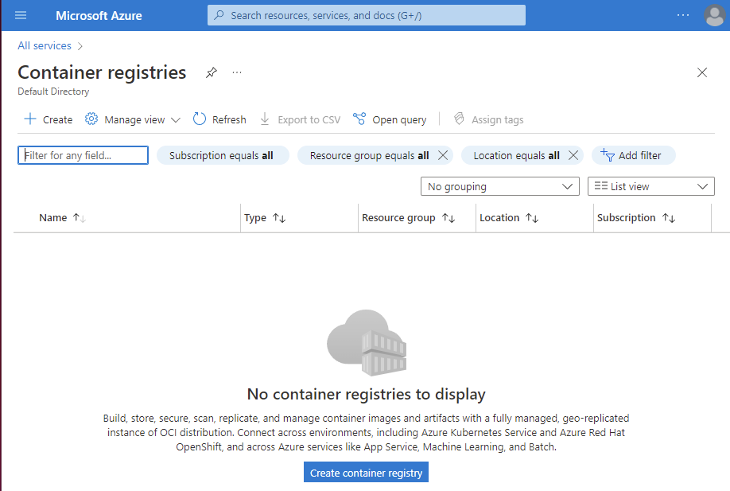
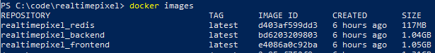
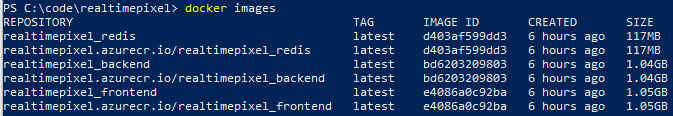
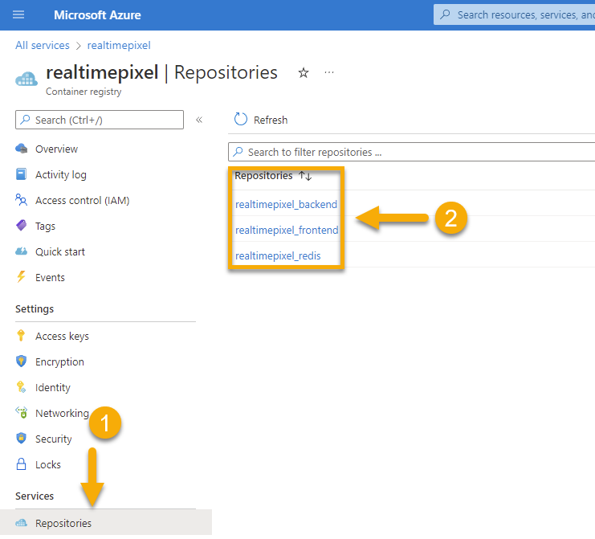

There are many resources about hosting an image on Microsoft Azure but most assume some expertise around Azure -- I have none. At least, I have not touched Azure for at least five years (at that time, the user interface was using the "blade" format). In this article, I'll describe how to host a Docker image in Azure from the perspective of someone who is a beginner on Azure.

# Creating the Container Registry

First, you must have an account on [Azure](https://portal.azure.com/). Once in the portal, search (top bar) for `Container registries` and click the "Create container registry". The goal of the container registry is to host the Docker images file that will be used in Kubernetes later.



A form appears with a required field named _resource group_. In short, _resource group_ is a project. Everything related to your project should be in a single _resource group_. In this example, I plan to deploy three images from my open-source game called [Real Time Pixel](https://github.com/MrDesjardins/realtimepixel). Hence I named the resource group: `realtimepixel_resourcegroup`.

The next steps are the networking options, encryptions, and tags. Most possible options are disabled on my account because I do not have a _Premium SKU_. At that point, you click create and the container registry takes about 10 to 20 seconds to be available. The web application will automatically redirect you to the _overview_ page when the deployment is complete.

# Uploading the images

I have the Dockerfiles on my Github repository (and locally). As a new user of Azure, I automatically thought that I could probably use many ways to push the image definition (Dockerfile). Probably by command line (Azure Command line tool) or by using [Github action](https://docs.microsoft.com/en-us/azure/container-instances/container-instances-github-action). Because, at this stage, I am looking to debug and explore, I do not want yet to have something automated. Browsing the Azure portal, I found a _Quick Start_ that gives instructions using Docker.

The first step is to log in with Docker to the Azure container registry we just created.

```
docker login realtimepixel.azurecr.io
```

The command asks for a user name. That step is confusing. The help mentions a login URI and credentials from the Access keys page. The Access page does not guide much, but a checkbox allows you to enable `Admin user`. Clicking the button reveals a user name and two passwords! Exactly what is needed! I got an error after pasting the password:

> Error response from daemon: Get "https:///v2/": http: no Host in request URL

So, I did it again. It worked! Once you login it is time to tag an image. I also got some questions at that step since I am usually not tagging with `docker-compose` starting in dev always the latest version. A quick way to know what image you have built locally is to perform `docker images`. If there is none, you need to build your images. In my case, I am using `docker-compose build,` and it creates the three images.

```
docker tag realtimepixel_redis realtimepixel.azurecr.io/realtimepixel_redis:latest
docker tag realtimepixel_backend realtimepixel.azurecr.io/realtimepixel_backend:latest
docker tag realtimepixel_frontend realtimepixel.azurecr.io/realtimepixel_frontend:latest
```

Here is a screenshot before and after the tag commands:

Before:



After:



Once the image id and tag are created for the containers, and they are linked to the Azure container registry, it is the type to push the image. Before, ensure that the images you tagged are from the right environment. For example, in my project, I am using multi-stage for development and production. Because we are uploading to Azure, in my case, it is production. Hence the environment variable must be set accordingly to my multi-stage configuration. Then, run `docker-compose build` and then the tag commands.

```
docker push realtimepixel.azurecr.io/realtimepixel_redis
docker push realtimepixel.azurecr.io/realtimepixel_backend
docker push realtimepixel.azurecr.io/realtimepixel_frontend
```

The process of pushing is long, about 45 minutes, but that will vary on your network connection and the size of all your images. In my case, the image relies on the Redis image, the Node image, and the Nginx image, and it ended up being a few gigs. Once the docker commands are completed, you can go back into the Azure portal and scroll down to the `Services` category on the left menu. The category has a link named `Repositories` where you should see the images.



# Conclusion

It is not too complicated if you already have your Docker images and you need to host on Azure. However, doing the task from your machine might not be the best solution in the long term. As described, modifying one of the images would require building the image, tagging it, and pushing it, causing another gig of data to be transferred. Therefore, in part two of _how to host docker images_ we will perform the same task from Github. Also, we will avoid using `latest` as the tag and provide a more meaningful tag to keep track of the version throughout the time.

<TocAzureContainerSeries/>