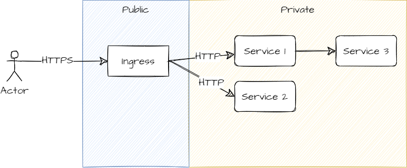
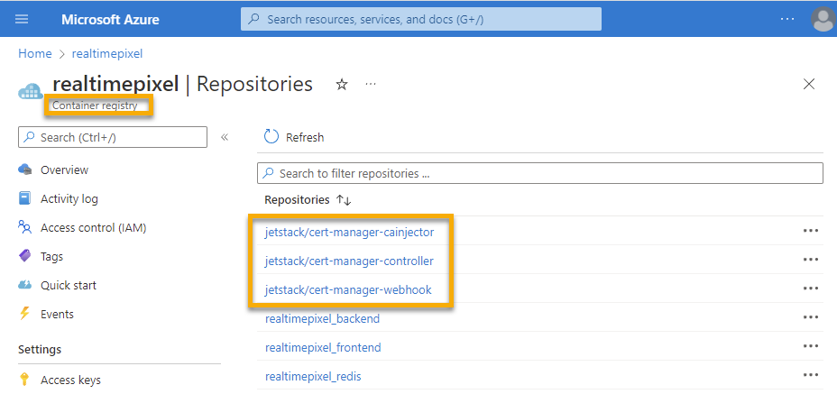

The article goals is to expose your web application on the Internet. We already [explained how to publish a service with a public IP](./azure-kubernetes-public-access). Now, in this article we will add an Ingress (and an Ingress Controller) fronting all our services exposing many possible services from a single public entry point that can also terminate TLS/SSL.


# Ingress and Ingress Controller

At the moment, we were able to set an IP to a service but not to an ingress. Let's define what is a Kubernetes Ingress. The Kubernetes official documentation defines Ingress:

> An Ingress may be configured to give Services externally-reachable URLs, load balance traffic, terminate SSL / TLS, and offer name-based virtual hosting.




We want our users to hit the Ingress that will be with HTTPS and then have the HTTP traffic to the frontend service without SSL / TLS. The Ingress allows to have several services exposed publically. While relying on the private service name to reach some Kubernetes Pods, the same is not true from the external. Hence, we could have public IPs for each service but the recommended way is to have a single public entry point with an Ingress.

However, Ingress requires also a Ingress controller. What is an Ingress controller?

> An Ingress controller is responsible for fulfilling the Ingress, usually with a load balancer, though it may also configure your edge router or additional frontends to help handle the traffic.

Hence, a controller will also be needed. 

First, let's create a second static IP for the Ingress.

```
az network public-ip create \
  --resource-group MC_realtimepixel_resourcegroup_realpixelask2_eastus \
  --name realtimepixel_public_ip_ingress \
  --sku Standard \
  --allocation-method static \
  --query publicIp.ipAddress \
  -o tsv
```

The result is different everytime you create a new one, but once generated remains the same. The previous command created a static IP with a value of `52.255.155.119`. Now, we can assign this IP to a resource.

The next step is to create the Ingress server. The step is non-obvious with several articles even under the Azure documentations that mixed several Kubecrl and yaml configurations. In short, it seems that the straightforward version is to use the command line to create the Ingress using NGINX which cannot be completely done using a yaml configuration like we are doing for services and deployement.

```sh
helm upgrade nginx-ingress ingress-nginx/ingress-nginx \
  --namespace realtimepixel-prod \
  --set controller.service.annotations."service\.beta\.kubernetes\.io/azure-dns-label-name"=realtimepixel-ingress \
  --set controller.service.loadBalancerIP=52.255.155.119
```

If you are getting this error:

> Error: failed to download "ingress-nginx/ingress-nginx"

The error means that `ingress-nginx` is not part of the the Helm repository. To add:

```sh
helm repo add ingress-nginx https://kubernetes.github.io/ingress-nginx
```

Running the `helm upgrade` again cause a new error:

> Error: UPGRADE FAILED: "nginx-ingress" has no deployed releases


To fix, change the `helm upgrade` to `helm install`:

```sh
helm install nginx-ingress2 ingress-nginx/ingress-nginx \
  --namespace realtimepixel-prod \
  --set controller.service.annotations."service\.beta\.kubernetes\.io/azure-dns-label-name"=realtimepixel-ingress \
  --set controller.service.loadBalancerIP=52.255.155.119
  -f nginx-ingress-install.yml
```

The response should be positive this time:


>The ingress-nginx controller has been installed.
>
>It may take a few minutes for the LoadBalancer IP to be available.


You can check that the ingress is working on the specified IP:

```sh
kubectl --namespace realtimepixel-prod get services -o wide -w nginx-ingress-ingress-nginx-controller
```

If you need to uninstall (remove the installation), you can use the following command:

```sh
helm uninstall nginx-ingress -n realtimepixel-prod
```

If you need more detail about this section, the [Azure documentation](https://docs.microsoft.com/en-us/azure/aks/kubernetes-helm) as some detail that might supplement my text.

If you are stuck in a the state "Pending" you may want to use the following command to find any warning or error:

```sh
kubectl get events --all-namespaces
```

In one of my case, I was getting:


>realtimepixel-prod   41m
>Warning   SyncLoadBalancerFailed   service/realtimepixel-ingress-ingress-nginx-controller
>Error syncing load balancer: failed to ensure load balancer: ensurePublicIPExists for service(realtimepixel-prod/realtimepixel-ingress-ingress-nginx-controller): failed to reconcileDNSSettings: ensurePublicIPExists for service(realtimepixel-prod/realtimepixel-ingress-ingress-nginx-controller): pip(realtimepixel_public_ip_ingress) - there is an existing service realtimepixel-prod/nginx-ingress-ingress-nginx-controller consuming the DNS label on the public IP, so the service cannot set the DNS label annotation with this value
## nginx-ingress Deployment CrashLoopBackOff

If the deployment of the nginx ingress fail, you can get the pod name and get the logs

```
kubectl logs nginx-ingress-679f9f8c57-q9p8r -n realtimepixel-prod
```

> W0810 03:51:47.459974       1 flags.go:273] Ignoring unhandled arguments: []
> I0810 03:51:47.460083       1 flags.go:190] Starting NGINX Ingress Controller Version=2.3.0 PlusFlag=false
> I0810 03:51:47.460090       1 flags.go:191] Commit=979db22d8065b22fedb410c9b9c5875cf0a6dc66 Date=2022-07-12T08:51:24Z DirtyState=false Arch=linux/amd64 Go=go1.18.3
> I0810 03:51:47.493979       1 main.go:210] Kubernetes version: 1.22.11
> F0810 03:51:47.496903       1 main.go:225] Error when getting IngressClass nginx: ingressclasses.networking.k8s.io "nginx" is forbidden: User > "system:serviceaccount:realtimepixel-prod:default" cannot get resource "ingressclasses" in API group "networking.k8s.io" at the cluster scope

Getting all the validation we can compare with the error we are getting:

```
kubectl get validatingwebhookconfigurations
```
>NAME                                            WEBHOOKS   AGE
> aks-node-validating-webhook                     1          24d
>nginx-ingres-ingress-nginx-admission            1          6d12h
>nginx-ingress-ingress-nginx-admission           1          5d23h
>realtimepixel-ingress-ingress-nginx-admission   1          7d23h

The name is not matching between `realtimepixel-ingress-ingress-nginx-admission` that is running and the `realtimepixel-ingress-ingress-nginx-controller-admission`.

In that case, you may delete everything and start again. You may have previous tentative ingress laying around.


# Ingress Update and Install

In the previous section, I shown that we can create (or update). However, if you are developing and moving stuff around fast you may be sometimes in need to update and sometimes to install. You can combine both commands:

```sh {2}
helm upgrade realtimepixel ingress-nginx/ingress-nginx \
  --install \
  --namespace realtimepixel-prod \
  --set controller.service.loadBalancerIP=52.255.155.119

```

It will install if not present and update if already present.

# Configure the Ingress

At this moment, there is an Ingress with an external static IP and an internal IP but it does nothing. The configuration will be part of our yaml configuration like our services and deployments.

```
kubectl get deployment realtimepixel-ingress-nginx-controller -n realtimepixel-prod
kubectl describe deployment realtimepixel-ingress-nginx-controller -n realtimepixel-prod
```

>   Volumes:
>   webhook-cert:
>    Type:        Secret (a volume populated by a Secret)
>    SecretName:  realtimep

# Configuring HTTPS Certificates

Next step, the ingress certificate manager:

```sh
REGISTRY_NAME=realtimepixel
CERT_MANAGER_REGISTRY=quay.io
CERT_MANAGER_TAG=v1.8.0
CERT_MANAGER_IMAGE_CONTROLLER=jetstack/cert-manager-controller
CERT_MANAGER_IMAGE_WEBHOOK=jetstack/cert-manager-webhook
CERT_MANAGER_IMAGE_CAINJECTOR=jetstack/cert-manager-cainjector

az acr import --name $REGISTRY_NAME --source $CERT_MANAGER_REGISTRY/$CERT_MANAGER_IMAGE_CONTROLLER:$CERT_MANAGER_TAG --image $CERT_MANAGER_IMAGE_CONTROLLER:$CERT_MANAGER_TAG
az acr import --name $REGISTRY_NAME --source $CERT_MANAGER_REGISTRY/$CERT_MANAGER_IMAGE_WEBHOOK:$CERT_MANAGER_TAG --image $CERT_MANAGER_IMAGE_WEBHOOK:$CERT_MANAGER_TAG
az acr import --name $REGISTRY_NAME --source $CERT_MANAGER_REGISTRY/$CERT_MANAGER_IMAGE_CAINJECTOR:$CERT_MANAGER_TAG --image $CERT_MANAGER_IMAGE_CAINJECTOR:$CERT_MANAGER_TAG
```

The result is 3 new repository that contain 3 images in your Azure Container Registry (ACR).



<TocAzureContainerSeries />

helm install nginx-ingres ingress-nginx/ingress-nginx \
 --namespace realtimepixel-prod \
 --set controller.service.loadBalancerIP=52.255.155.119


Uses kind: Ingress
https://github.com/nginxinc/kubernetes-ingress/tree/27d60365ba5806952faf846759d5563443d75797/examples/basic-auth


Uses kind controller
https://github.com/nginxinc/kubernetes-ingress/tree/6a45f42ee0da3ec0e4360f2c2de3c6d9288be9ad/examples/complete-example


