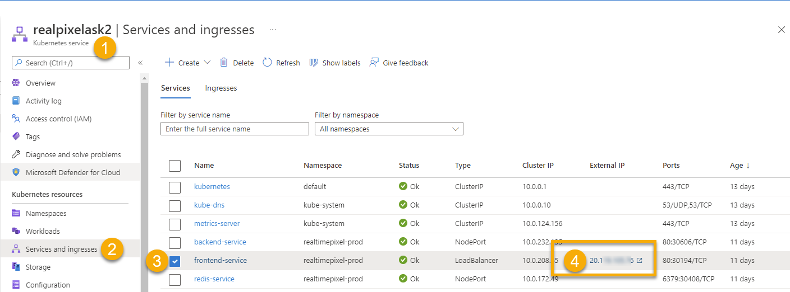
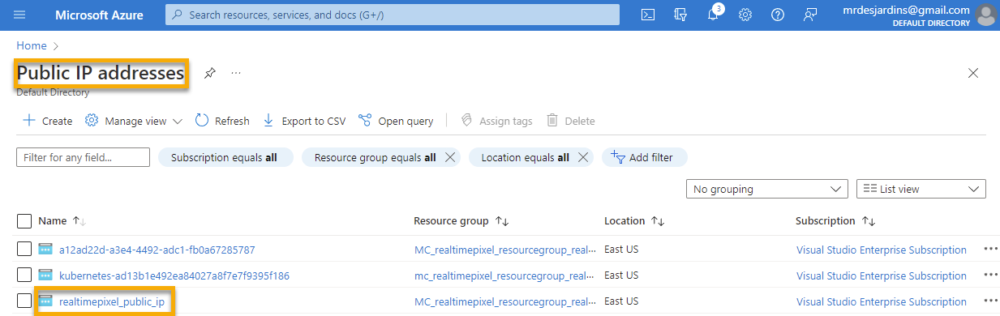

The article's goal is to expose your web application on the Internet. We already [explained how to publish with Azure and Kubernetes](./azure-intro-kubernetes) our three Docker images. However, while having the deployment and service up and running, the load-balancer was still not accessible when performing an HTTP request.

# Pre-Requisite

## Reverse Proxy
Between the article where I [explained how to publish with Azure and Kubernetes](./azure-intro-kubernetes) and now, I decided to perform a change: using a [reverse proxy using a single container for the frontend](./docker-image-reverse-proxy-node) to redirect API calls to a second docker container that has the backend API logics. It is not a required step but it allows us to have in Kubernetes only the frontend with a service exposed publicly. It also has many other advantages, but for our goal to deploy on Microsoft Azure Kubernetes, we want to simplify our infrastructure. The reverse proxy works for all the HTTP requests that the web application performs and for the WebSocket connections.

## New Docker Images
The reverse proxy required many changes. For once, we are using NGINX to reverse proxy. So, there was a need to build and publish frontend images. The backend also changed with a different endpoint for the WebSocket that is now served under the path `/ws/` to differentiate from the GET/POST of HTTP which are directly under the `/`. That is true for the backend. From the perspective of the frontend, GET/POST is performed toward the frontend server with the path `/api/`.

The new images are created automatically since we created an [Github Action that builds and push to the Microsoft Azure Registry Container service](./azure-docker-container-repository-github).


# The Service Load-Balancer

The backend and Redis services are of type `NodePort`, and the frontend service is of type `LoadBalancer`. That is one key point in allowing the frontend server to be accessible outside your controlled Kubernetes environment. In the Azure portal, you can see the IP if you go under your Kubernetes Service, and click _Services and ingresses_.



It is also possible to get the same information with the `kubectrl`:

```
kubectl get services -n realtimepixel-prod
```

Which should give something in this format:

```
NAME               TYPE           CLUSTER-IP     EXTERNAL-IP     PORT(S)          AGE
backend-service    NodePort       10.0.232.135   <none>          80:30606/TCP     10d
frontend-service   LoadBalancer   10.0.208.65    20........ .6   80:30194/TCP     10d
redis-service      NodePort       10.0.172.49    <none>          6379:30408/TCP   10d
```

If your code is working well on all your pods under all these services, the IP will provide your web application. Same thing if you use the frontend to perform an API call using the `/api`; it will work. However, if one pod is in a bad state, it will not work but still provide you with an IP. I was stubborn, and though I had a Kubernetes issue while I had a code issue. In my case, environment variables were not properly passed. If the link (ip and port) is not providing your the expected result, it is important to not assume that the code is executing properly. Maybe the pod is not crashing but the actual code is not executing the server as expected.

# Static IP for the frontend service
In this step, we will assign a static IP to the frontend. The IP is still not using an ingress but shows how to have permanent access to the frontend.

```sh
az aks show \
  --resource-group realtimepixel_resourcegroup \
  --name realpixelask2 \
  --query nodeResourceGroup \
  -o tsv

az network public-ip create \
  --resource-group MC_realtimepixel_resourcegroup_realpixelask2_eastus \
  --name realtimepixel_public_ip \
  --sku Standard \
  --allocation-method static \
  --query publicIp.ipAddress \
  -o tsv
```

The result was for me `20.121.6.121`

On the Microsoft Azure Portal, we can see the new entry under the _Public IP addresses_ service.




Update the frontend service Helm chart to receive a new annotation and the new IP.

```yml {4-6}
apiVersion: v1
kind: Service
metadata:
  {{- with .Values.frontend.annotations }}
  annotations:
    {{- toYaml . | nindent 4 }}
  {{- end }}
  name: {{ .Values.frontendServiceName }}
  namespace: {{ .Values.namespace }}
  labels:
    app: {{ .Values.frontendServiceName }}
spec:
  loadBalancerIP: {{ .Values.azureLoadBalancerIP }}
  type: {{ .Values.frontendService.type }}
  ports:
    - port: {{ .Values.frontendService.port }}
      targetPort: {{ .Values.frontendContainerPort }}
  selector:
    app: {{ .Values.frontendContainerName }}
```

and inside the value.yml file:

```yml
frontend:
  annotations: {
    "service.beta.kubernetes.io/azure-load-balancer-resource-group": "MC_realtimepixel_resourcegroup_realpixelask2_eastus"
  }
azureLoadBalancerIP: "20.121.6.121"
```

The change will make the frontend service IP remain static regardless of any other new deployment that would have changed the service IP. Still, at this point, who still does not have a domain (DNS) attached to the service? Nor do we have an HTTPS certificate (TLS/SSL).

# Set an Azure DNS address to the static IP

Let's find the unique id of the public IP created in the previous step.

```
az network public-ip list \
  --query "[?ipAddress!=null]|[?contains(ipAddress, '20.121.6.121')].[id]" \
  --output tsv
```

The result:
```
/subscriptions/972d99d7-1ce0-4e2a-881b-43969768a358/resourceGroups/mc_realtimepixel_resourcegroup_realpixelask2_eastus/providers/Microsoft.Network/publicIPAddresses/realtimepixel_public_ip_ingress
```

Apply the DNS `realtimepixel` for the ip:

```
az network public-ip update \
  --ids /subscriptions/972d99d7-1ce0-4e2a-881b-43969768a358/resourceGroups/mc_realtimepixel_resourcegroup_realpixelask2_eastus/providers/Microsoft.Network/publicIPAddresses/realtimepixel_public_ip_ingress \
  --dns-name realtimepixel
```

At this point, the service has a public DNS name: `realtimepixel.eastus.cloudapp.azure.com` pointing to `20.121.6.121` that point to our frontend web server.


<TocAzureContainerSeries/>

