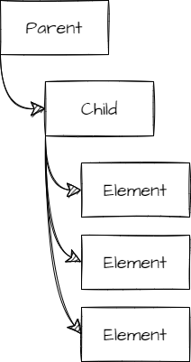
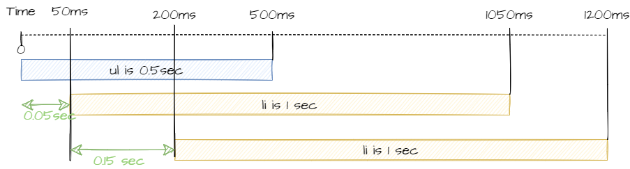

Imagine the situation where you have one parent and a direct child component. The child component has a list of elements. These elements are animated as the parent component is mounted.



The parent renders the child that renders the list of elements, and each element is animated in a staggered fashion. The tricky part is how do you animate when the parent component is unmounted to have the children unmounted that trigger the list of elements to be animated oppositely from the mounted animation?

# Structure of the Prototype

First, let's define what we need. The application needs to host a component that will remain mounted. This mounted component is called `Parent`.

```tsx
export default function App() {
  return (
    <div className="App">
      <div className="Main">
        <div className="BoxContainer">
          <Parent />
        </div>
      </div>
    </div>
  );
}
```

The parent contains a component that will be mounted and unmounted. The component is named `Child`. That is the one we want to have an animation on many items to fade in and out as the component mount and unmount.

```tsx
export const Parent = () => {
  const [mountParentCount, setParentMountCount] = useState(0);
  useEffect(() => {
    console.log("Parent Mounting");
    return () => {
      console.log("Parent UnMounting");
    };
  });
  return (
    <div className="Parent">
      <Child />
      <br />
      <h3>Mounting Parent count: {mountParentCount}</h3>
      <button
        onClick={() => {
          setParentMountCount((prev) => ++prev);
        }}
      >
        Remount Parent
      </button>
    </div>
  );
};
```
The `Parent` component has a `useEffect` to have some insight into whether the `Parent` component mounts and unmounts. Otherwise, it has a `useState` that will force a render of the `Parent`. Also, there is a button. Every click changes the state making a new render of the `Parent`. At that point, the `Child` remains the same as it does not have any change and hence does not mount and unmount on the button click. We will change that soon.

Finally, we need to define the `Child`. Similarly, we will have a `useEffect` to see when the component mounts and unmounts.

```tsx
export const Child = () => {
  useEffect(() => {
    console.log("Child Mounting");
    return () => {
      console.log("Child UnMounting");
    };
  });

  return (
    <ul
      className="Child"
    >
      <li key="Child1">
        <div>😊</div>
      </li>
      <li key="Child2">
        <div>🥶</div>
      </li>
    </ul>
  );
};
```

# Mounting and Unmounting

To perform the desired effect of mounting and unmounting the `Child` component on the button click, React must know that the `Child` has changed. The usage of `key` does the trick. Hence, in the `Parent` container, we will assign a unique `key` property to the `Child` component that is crafted with the incremental state.

```tsx
<Child key={"unique_" + mountParentCount} />
```

# Animation

The animation occurs inside the `Child` components. The idea is to have each `li` having an opacity change from 0 to 1 and simultaneously have the `li` move from right to left with a rotating effect.


React Framer Motion has the concept of `Variants` that define specific animation by name. We will define two sets of variants. One set that will take care of the opacity, movement and rotation on each `LI`. The second variant will take care of the `UL` to ensure each `LI` animation is not coinciding: we want each ``LI` to stagger its animation. That way, the visualization is more fluid with each `LI` starting with a slight delay between each other.

The variants for the `LI` are called `inScreen` and `outScreen`. The name can be anything you like, but you need to be consistent between all your animation sets to ensure they are performed together. In the `LI` case, we see we are setting the `x` position to 0, and when the component leaves the screen, it moves to the right of 40 pixels in half a second.

```typescript
  const variantsList: Variants = {
    inScreen: {
      x: 0,
      rotate: 0,
      transition: { duration: 0.5 }
    },
    outScreen: {
      x: 40,
      rotate: 180,
      transition: { duration: 0.5 }
    }
  };
```

The other set of variants is more complex because it has a staggering effect.

```typescript {8,9,10,19,20,21}
  const variants: Variants = {
    inScreen: {
      opacity: 1,
      transition: {
        opacity: {
          duration: 1
        },
        staggerChildren: 0.15,
        delayChildren: 0.05,
        staggerDirection: 1
      }
    },
    outScreen: {
      opacity: 0,
      transition: {
        opacity: {
          duration: 1
        },
        staggerChildren: 0.15,
        delayChildren: 0.05,
        staggerDirection: -1
      }
    }
  };
```

Nonetheless, the same principle of naming phases exists. In that particular one, you can see that the whole `UL` has an opacity and that the duration is set for that specific property. What is the most important for this variant is the `staggerChildren`, which indicates the delay between each `LI` as well as the `delayChildren` which indicates when we start batching all the `LI`. In that case, we wait 50ms before starting to move the first `LI`, then wait 150ms before starting the second `LI`.



The illustration above shows when each of the `UL` and `LI` gets animated with the above variants.

# Framer Motion
To apply the variant, we need to rely on Framer Motion and it means some adjustment. First of all, we cannot use the `UL` and `LI directly.` The `Child` needs to use the `motion.ul` and `motion.li`, which has additional property like setting the variant and which step to use.

```tsx {1, 8, 11}
<motion.ul
  className="Child"
  variants={variants}
  initial="outScreen"
  animate="inScreen"
  exit="outScreen"
>
  <motion.li key="Child1" variants={variantsList}>
    <div>😊</div>
  </motion.li>
  <motion.li key="Child2" variants={variantsList}>
    <div>🥶</div>
  </motion.li>
</motion.ul>
```

At this point, the animation works halfway. It should mount with the animation, but when unmounting, no animation occurs. The reason is that we need to tell Framer Motion that we need to execute the animation and not unmount the component directly. Wrapping the `Child` with `AnimatedPresence` triggers the `exit` animation. Here is the modified parent:

```tsx {1,2}
<div className="Parent">
<AnimatePresence exitBeforeEnter={true}>
  <Child key={"unique_" + mountParentCount} />
</AnimatePresence>
<br />
<h3>Mounting Parent count: {mountParentCount}</h3>
<button
  onClick={() => {
    setParentMountCount((prev) => ++prev);
  }}
>
  Remount Parent
</button>
</div>
```

At this point, unmounting will wait for the `exit` animation occurs to unmount. The `exitBeforeEnter={true}` tells of hiding the previous component while the second one is mounting. It ensures that you do not see two components. The reason is that while animating the unmount of the former component (remember we change the `key` hence different component), we want to start the animation of the mounting of the new component. They occur at the same time and can be in the DOM tree at the same time. Using the `exitBeforeEnter` property will play the `exit` animation and then `initial` of the new component.

# Code Sandbox and Final Tips
Here is the complete code. Minor detail: if you use a different transition timing, the basic `duration`, you may fall into a more complicated visualization bug. For example, if you use one of the many physic transitions, you may have an element that bounces very little for a long time, causing the unmounting to take a long time. Visually, it might be so subtle that you do not realize that something is happening, and you might scratch your head to figure out why the mounting effect takes so long to start. The answer is that the unmounting might take longer. A good debug tip is to use a fixed `duration` and move with some fancier animation if required.

<CodeSandbox codeSandboxId="framer-motion-unmounting-children-animation-part-4-u0mi46" />
