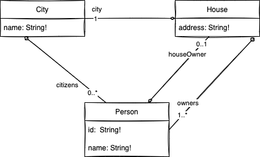
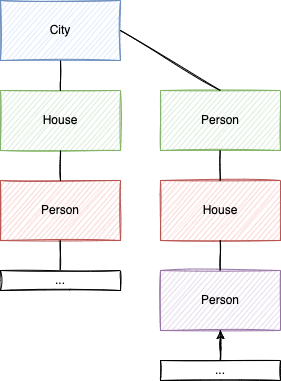

The battle between science and art in software engineering is constantly appearing. On one end, softwares are based on scientific mathematical concepts. On the other end, it lies in opinions and personal preferences. However, regardless of your situation, you must decide and move on. This article will describe many solutions to handle maps with GraphQL. We will expose the pros and cons of each of them. Finally, we will identify a satisfactory solution for most cases, which I strongly recommend following.

# Preface

The topic of map is controversal in GraphQL because the GraphQL standard does [not support the idea of a key-value](https://github.com/graphql/graphql-spec/issues/101) structure. In some language it is called a [Map](https://developer.mozilla.org/en-US/docs/Web/JavaScript/Reference/Global_Objects/Map), in some other it is called a [Dictionary](https://docs.microsoft.com/en-us/dotnet/api/system.collections.generic.dictionary-2?view=net-6.0).

# Example

Before getting into a concrete solution, let's define a structure of the types that will help us determine what a request and a response would look like for each solution.

```graphql
type City {
  name: String!
  citizens: [Person!]
  # Need a map from PersonID -> House
}

type House {
  address: String!
  city: City!
  owners: [Person!]!
}

type Person {
  id: String!
  name: string!
  houseOwner: House
}
```




The model is simple -- three entities. There is a top entity that is a `City`. It has a primitive scalar type `name` and requires a map with a key that will be the owner's unique identifier (`PersonId`) to a `House`. It is also possible to get the complete list of people living in the city.

The house references the `City` and a list of owners.

Finally, the `Person` entity has few properties but can also have a `House` optionally.

# Solution #1: Store the Map into a Single String

A solution is to store the whole map in a single string. The concept is to mark the map as a string and serialize the entire map into a string.

```graphql {4}
type City {
  name: String!
  citizens: [Person!]
  personToHouse: String!
}
```

From the GraphQL server-side point of view, it is simple: you serialize the whole map. For example, if you are using Java:

```java
ObjectMapper mapper = new ObjectMapper();
String jsonResult = mapper.writerWithDefaultPrettyPrinter().writeValueAsString(map);
```

If you are building the GraphQL server is TypeScript, you take the whole map and call `JSON.stringify()` if you are using a JS Object or use [something more complex](https://stackoverflow.com/questions/29085197/how-do-you-json-stringify-an-es6-map) if you are using the ES6 Map. In all cases, it is pretty straightforward.

Also, from the server-side perspective, it is convenient because it does not require creating any additional GraphQL type. It's a one-solution shop where any map is transformed into a single type: a string.

## Limitations

From the GraphQL client-side, it gets tricky.

### Limitation #1: Un-Document the Graph

First of all, you need _to know_ that the string is a structure that must be deserialized. Suddenly, the concept breaks one of the strengths of GraphQL. There is always the possibility to create a custom scalar to differentiate a JSON structure from a String. The problem is that their JSON can still be from any shape, and without performing the query and observing, it is impossible to know from the client-side. Also, if the structure changes depending on external factors, nasty surprises can occur on the consumption side.

```graphql
scalar JSON
```

Furthermore, the client-side must deserialize the content of the string properly. Beyond executing the deserialization, it implies handling the `JSON` scalar with a custom CodeGen policy and using a `typePolicies` for Apollo `InMemoryCache` if you want a clean solution does not make the client-side have custom management of the `JSON` type at each server calls. In this previous article, you can read more about [CodeGen and Apollo Custom Scalar](typescript-codegen-graphql-custom-scalar). The one-liner is: that it is not simple for the consumer, and the solution varies depending on the consumer technologies to query the GraphQL server.

### Limitation #2: Reduce Discovery and Remove Fields Picking

Second, there is a typing issue. The generated type of `City` will have a property `personToHouse` of `String`. It is impossible to specify which property you want to consume.

```graphql {3}
query SolutionOne {
  city(name: "SanJose") {
    personToHouse { # 🛑 Error
      name # 🛑 Error
    } # 🛑 Error
  }
}
```

As you can see, writing the query failed at design time. You cannot specify the field you want to use: the value is a string. Hence, you are forced to return the whole object. Replacing the entire object is subjective to whom is writing the server-side that returns the object. For some engineers, it means returning only the primitive types. For others, only the primary key for the children is to avoid expanding the tree of objects too deep.


In this image, the server-side engineer can cut in many places the tree. A decision must be made since the client-side cannot provide hints about how much is needed.


As you can see, there are many ways not to return the whole graph, which in many cases is not practical. The consequence is an inconsistency for the consumers. Depending on the map, the returned payload will have a different granularity of information. Removing the power to pick which field desire in the response payload is against GraphQL mentality. It is also prone to error and forces the consumer to perform additional queries to get the assemble of information needed -- it brings us back to the REST API style of consumer patterns.

### Limitation #3: No Generated Type

Third, Suppose you are using [CodeGen](how-to-automatically-generate-typescript-for-consumer-of-your-graphql) to generate your TypeScript from your GraphQL to have all your type generated for you. In that case, you will be out of luck. Of course, you can coarse the return value of the `JSON.parse` to the generated type of `Person` but that is wrong. The actual type of the map should be what the user picked. In GraphQL, it could be an explicit fragment or a subset of fields but rarely the complete list of properties.

```typescript
const { data } = useQuery<MyQuery, MyQueryVariables>(GRAPHQL_DOC);
const payload: string = data.city.personToHouse;
const mapData = JSON.parse(payload) as { [key: string]: House }; // Coarse to House
```

Because of limitation #2, The query assumes the client request all the person's properties. The reality is that the server might not return the entire `Person` but a shallow version of the `Person`. For example, `Person` has a reference to `House`. Because the consumer cannot specify the structure desired, the server must decide where to cut the graph. Otherwise, it can be very deep. In that example, the relationship can be infinite with a `Person`→`House`→`Person`→`House`→...

### Limitation #4: Runtime Exception

With the data in a string, it opens an issue if the schema evolves. If a field is removed on the server-side, the generated code will not indicate to the client that the type has changed until the code is executed. It opens the door to bugs at run time.

```typescript
const { data } = useQuery<MyQuery, MyQueryVariables>(GRAPHQL_DOC);
const payload: string = data.city.personToHouse;
const mapData = JSON.parse(payload) as { [key: string]: House }; // Coarse to House
console.log(mapData["123"].owners[0].name); // Work well
```

In the above code, everything works well until `owners` is removed from the response but kept in the `House` type. That is a limited issue if the `House` is a type generated from an automatic process. However, because the server needs to make the decision about where to cut the relationship, it opens the door to the runtime issue. As we recall, the `House` type is **not** the type of the query since there is no way to define which field to receive from a `String`. A GraphQL response type is defined by the user's request. The problem increases if the content of the value is not well defined by the server-side. On some occasions, the server-side might want to rely on a map because they have a loose schema, a value that can be anything, and using a string as a value is a way to circumspect the problem by pushing the responsibility to make sense of the data to the consumer. To some extent, mostly theoretically, a runtime exception can occur if the serialization/deserialization differs from the server-side and client-side.

## Pros/Cons

| Pros                                                 | Cons                                                                 |
| ---------------------------------------------------- | -------------------------------------------------------------------- |
| 1. Server-side: Easy to implement                    | 1. Client-side: Hard to know what will be the structure of the value |
| 2. Server-side: No need to build custom mapping type | 2. Client-side: Cannot define field to fetch                         |
|                                                      | 3. Client-side: No accurate type to coarse                           |
|                                                      | 4. Client-side: Possible runtime exception                           |

# Solution #2: Strongly Typed Type per Map

The second solution is to create a wrapper type with a key and a value. The key can be of `String` or `Int` and the value of the kind you want to map.

```graphql
type City {
  name: String!
  citizens: [Person!]
  personToHouse: [MapPersonHouse!]!
}

type MapPersonHouse {
  personId: String! # Key
  house: House! # Value
}
```

You see the main inconvenience in the code above: we need to create a `MapPersonHouse`. If you expect to have 100 maps to different key-value within your application, you will need to have 100 additional types. The concept is to transform the map from the server-side into a list of strongly typed key-value. The benefices are many. First of all, it is well defined: we know which fields are available.

Secondly, the user can query the exact field desired. For example, the following snippet of code shows that in that case, we only want the `address` of the `House`.

```graphql
query SolutionTwo {
  city(name: "SanJose") {
    personToHouse {
      address
    }
  }
}
```

The third benefit is that we can continue to leverage GraphQL subtype selection and that the server-side does not have to decide how deep to send to the client.

```graphql
query SolutionTwo {
  city(name: "SanJose") {
    personToHouse {
      address
      owners {
        name
        hourseOwner {
          owners {
            name
          }
        }
      }
    }
  }
}
```

In that query, we fetch for the city of `SanJose` a map of people that gives the address of each house and the list of owners and go deeper and deeper until the client decides to stop diving.

The fourth benefit is that CodeGen can generate a proper type to consume.

```typescript
const { data } = useQuery<MyQuery, MyQueryVariables>(GRAPHQL_DOC);
const list: MapPersonHouse = data.city.personToHouse;
const map = new Map();
for (const element of list) {
  map.set(element.personId, element.house);
}
const houseId123 = map.get(123); // Type here is not House, it is a subset of House but still strongly typed
```

From the list, it is possible to build back a map. The idea is to loop the list and take the `key` of each `MapPersonHouse` as the map's key and the value to be set as the value. The last line of the code above defines a variable `houseId123` that is typed from a dynamic type of the subset of fields selected.

## Limitations

Limitations are now divided more equally between the server and client.

### Limitation 1: More GraphQL Type

The principal argument against the solution is it requires adding an additional type for each map. GraphQL does not have a generic type, and to have a `value` strongly typed, we must define a new type. The limitation weight is balanced by keeping the schema discoverable, generating type possible, and the client can determine the desired field using all the common GraphQL capabilities.

### Limitation 2: Construct the Map

A minor inconvenience is constructing the map from the list on the client-side.

## Pros/Cons

| Pros                                                                                               | Cons                                                 |
| -------------------------------------------------------------------------------------------------- | ---------------------------------------------------- |
| 1. Client-side: Schema continues to be documented                                                  | 1. Server-side: Must defined more GraphQL types      |
| 2. Client-side: Strongly-Typed                                                                     | 2. Client-side: must rebuild the map or use the list |
| 3. Client-side: Define which field to fetch                                                        |                                                      |
| 4. Server-side: No need to take decision to where to stop diving. Sub-types are handled by GraphQL |                                                      |

# Solution #3: Primitive Map

Another solution is to use a map for only primitive types. It entails defining a `KeyValues` type. The type has one property per different values. For example, if you expect a map from key to boolean, you will need a `BooleanKeyValue`. If you desire a map to a type, you need to add another property.

```graphql
type KeyValues {
  booleanKeyValues: [BooleanKeyValue!]
  intKeyValues: [IntKeyValue!]
  stringKeyValues: [StringKeyValue!]
}

type BooleanKeyValue {
  key: String
  value: Boolean
}
type IntKeyValue {
  key: String
  value: Int
}
type StringKeyValue {
  key: String
  value: String
}
```

Unfortunatelly, this solution breaks many scenarios. First of all, it only works with primitive types. In fact, it is impossible to get our example using this structure without polluting the `KeyValues` and then getting into the rabbit hole of adjusting the schema in such a way that it is questionable. For example, we would need alter the `KeyValue` with an optional `houseKeyValues`

```graphql {5}
type KeyValues {
  booleanKeyValues: [BooleanKeyValue!]
  intKeyValues: [IntKeyValue!]
  stringKeyValues: [StringKeyValue!]
  houseKeyValues: [HouseKeyValue!]
}
type HouseKeyValue {
  key: String!
  value: House!
}
type City {
  name: String!
  citizens: [Person!]
  personToHouse: [KeyValues!]!
}
```

You can see two issues right here: You need to create an additional type, hence not better than the previous solution. Second, the `KeyValues` will grow quite a lot. If you have 100 maps in your system, this type will be hard to understand for the server and client. The problem is that the client will need to _guess_ which property of `KeyValues` to use. Having to _guess_ defeats the purpose of GraphQL, which is a protocol that steward the client toward writing a proper request.

```graphql
query SolutionThree {
  city(name: "SanJose") {
    personToHouse {
      houseKeyValues {
        key
        value {
          address
        }
      }
    }
  }
}
```

The problem is the client could have written:

```graphql
query SolutionThree {
  city(name: "SanJose") {
    personToHouse {
      intKeyValues {
        key
        value
      }
    }
  }
}
```

It would have been valid but not practical as it does not exist and would return null. Overall, trying to push a single `KeyValues` brings more complexity for little gain.

## Pros/Cons

| Pros                                                                                               | Cons                                                 |
| -------------------------------------------------------------------------------------------------- | ---------------------------------------------------- |
| 1. Client-side: Strongly-Typed                                                                     | 1. Client-side: must rebuild the map or use the list |
| 2. Client-side: Define which field to fetch                                                        | 2. Client-side: must guess which field to use        |
| 3. Server-side: No need to take decision to where to stop diving. Sub-types are handled by GraphQL | 3. Server-side: Must defined more GraphQL types      |

# What to use?

After building GraphQL on the server-side and consuming it with GraphQL, I strongly recommend using solution #2: _Strongly Typed Type per Map_. My main argument can be summarized to:

1. Stay as close to GraphQL standard as possible. The server should let the user decide how deep and which fields to select. The solution should continue to be self-documented and guide the client toward a scalable and robust solution.
2. The addition of a map type per type that requires to be in a type might look annoying but is a small price to pay to continue leveraging the GraphQL philosophy.

Indeed, there are exceptions. For example, suppose you have a case of a field that needs to be loosely coupled, something that can key-value of anything. In that case, I believe that you should have the same principle: a type that wraps key-value that is `String` and `String`, allowing to store "anything" in the value. But that should be very exceptional. In most cases, even in a system with hundreds of types, embracing a strongly typed schema that converts the server-side map into a list is the most convenient and closest solution to GraphQL.
