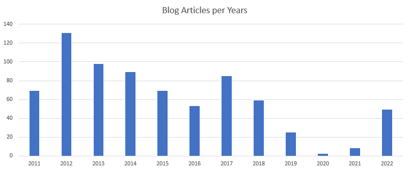
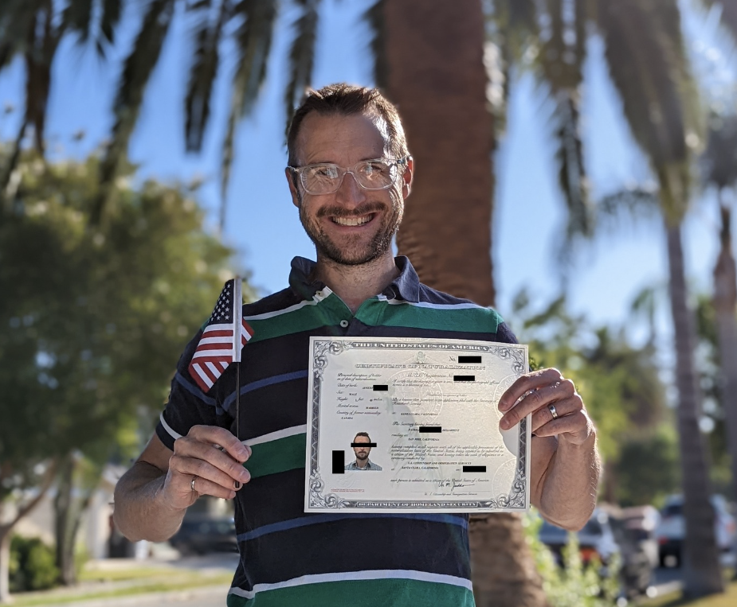

Last year I started my recapitulation with the impression that it was not a year in which I accomplished much compared to all the previous years. 2022 was similar in the sense of feeling but taking the time to write about my years showed me wrong.

# Blog Articles and Books

2021 was low in blog posts with [8 articles](for/2021). 2022 was way more prolific, with [49 articles](for/2022)! The topics of the article show the evolution of my years with a start focusing more on TypeScript, SolidJS, Kubernetes, and finally on, Rust. 2022 is like 2021, with the absence of books. I wrote [11 books](https://www.amazon.com/Patrick-Desjardins/e/B01MZBUL14) in my life and the time dedicated to each was tremendous. I will write again, but I need to find a topic that interests me immensely.

# Videos
I published most of my tutorial videos on Youtube in 2020. 2021 was low in volume, and 2022 was even lower. I enjoy recording videos but also it is time-consuming. Early in 2022, I had the idea to come back but could not find a new topic to develop a long series without getting back into TypeScript or React. I recorded one video for the [audiobook machine](https://youtu.be/-lAeRB1GZUo) I built for my daughter and recorded a video about it. With time, I realized a lot of areas where I can improve to deliver material using videos, and I am looking forward to getting back into the production of material once I find the right topic.

# Built Projects
In 2022, I have a single complete project: an audiobook machine. The machine's input is a card that transmits which story that the device reads. The project uses a Raspberry Pi and an RFID card reader. When the card is close to the machine, it starts recording my wife or me reading a novel. 

<iframe width="560" height="315" src="https://www.youtube.com/embed/-lAeRB1GZUo" title="YouTube video player" frameborder="0" allow="accelerometer; autoplay; clipboard-write; encrypted-media; gyroscope; picture-in-picture" allowfullscreen></iframe>

# Technologies

## SolidJS and Docker

My interest in writing articles is strongly correlated to my interest in learning new technologies. In 2022, I pivoted my focus on more side projects since I completed my [Master Degree](i-completed-my-master-degree), which gave me more free time. One of my biggest projects was an [exercise machine using water](gym-project). The front end was using [SolidJS](https://www.solidjs.com/). I was impressed by the framework but could not justify using it professionally. That being said, the learning curve was low coming from React, and I enjoyed my experience during these few weeks. The project motivated me to invest more time in learning Docker to have a more robust way to develop the front end and backend in containers. I am satisfied with the pattern I implemented, which allows [sharing code between the frontend and backend](docker-nodejs-shared-folder).

## Kubernetes

I spent several weeks during the summer of 2021 to explore [Kubernetes](https://kubernetes.io/). I wrote in July, August, and September several blog articles on the topic using Microsoft Azure. However, the more I advanced with Kubernetes, the more I realized that it is a full-time job to understand all the details. Configurations can get overwhelming, and the multiple options and vendor specifics made me realize that I enjoy coding much more than working on the infrastructure side. Hence, I took a break to focus on a language that my new 2021 job is using: Rust.

## Rust

Learning Rust is something I've been doing slowly. I am using NodeJS with TypeScript for my backend work. It has a lot of benefits since the reusability and zero barriers to learning a new language to jump back end front is a massive gain at the cost of performance. 

I'm learning Rust and it has a way higher bar than all the other languages I learned in the past (VB, PHP, C#, JS, TS). I will likely produce more content in the next year around Rust. Concrete accomplishments in Rust are a couple of open source libraries in Rust like the [Hilbert Curve](https://github.com/MrDesjardins/hilbert-curve-rust), the [Prettty Byte Rust library](https://github.com/MrDesjardins/pretty-bytes-rust) and the [Pretty Duration](https://github.com/MrDesjardins/pretty-duration) in Rust.

# Leaving Netflix and Joining Jump Trading

The biggest news of 2022 is my decision to leave Netflix. I always thought people were leaving Netflix because there were fired. However, it is only sometimes the case since I went on an excellent term. After five years, I decided to find another challenge, even though Netflix is still a good company. At the moment, Netflix is not only the company I remained with the most time; it is the company I worked the longest with the same team and also on the same set of applications.

## Reasons

My main motivations were mostly related to how the culture is changing. A lot of the core fundamental unique aspects of Netflix changed around 2021 and 2022. The second motivation to seek outside was that my growth was hitting the ceiling; I could not stand to remain in my comfort zone and, for about a year, asked explicitly to explore another area without opening. Finally, and related to the culture, the compensation was generous but not at the top of my personal market.

## My New Role
While in an outstanding organization and an excellent team at Netflix, I noticed many things I liked morphing into a shape I initially did not sign up. So, I had an opportunity to work with some old-Netflixer in a private investment firm called Jump Trading. I cannot disclose much of what I am working on, but the work environment brings me back to working on a full stack codebase. I am touching front end with TypeScript and React, performing API development, and using GraphQL. Also, I am going more profound in the stack by connecting databases and communication frameworks. Also, I had the privilege to be a central part of the architecture of the new system we are building. 

On top of the great technical surroundings, I have received a lot of positive feedback during my first six months at the firm. I got praise for my documentation, communication, and how out-of-the-box my user interfaces grow iteration after iteration. All that positivity boosts my motivation to continue working hard and do innovative work.

# Free Time

As mentioned, I had more free time without spending time on [my machine learning master's degree](i-completed-my-master-degree). I have two children but still, have plenty of free time once they sleep. I am still figuring out if it is because of the last four years when I had less free time because of all the course assignments, but this year was when my motivation was not always present. I was surprised since I always had so many projects to motivate me. 

In 2021, my motivation after work was up and down. For a few weeks, I was inspired by Kubernetes, but many evenings were wasted doing superficial configurations. Similarly, I desired to learn in the last three months the programming language called "Rust". However, the learning curve is steeper than anticipated. 

In parallel, I got a desktop machine because my new work requires me to have a personal computer to do anything personal (like looking at my Gmail). Outside personal use for development, I use it to play video games - something I have yet to do for over 15 years. I enjoy franchises I played only a few first iterations in early 2000 and now can binge-play them. For example, the Rainbow Six, Starcraft, Diablo, Doom, and the Shadow Tactics Blades of the Shogun series. All excellent games. What I am looking for next year is diminishing the time spent on games and balancing it more with new projects.

# Exercise

Since I changed job, I have been more dedicated to training before work. I drop my son at school and train for 30 minutes four days per week before getting head down to work. The result is five minutes more per day than last year and changed from 3 times a week to 4 (and sometimes 5) times every week. The success of working out more comes from the experimentation of working out early instead of once the kids are asleep. The change helped me to have longer evenings and wake up my system to focus right away when I turn on my work computer.

# Citizenship

Another big news was that I officially got my American citizenship this year. It is a significant milestone since my wife and I were unsure if we wanted to stay in the US. We decided to move forward two years ago, and now it is official.

# What Next?

I am constantly improving, and I acknowledge some stagnations in few areas of my life that I want to get back on track. I am thinking of bringing back a [monthly accomplishment goal like I did in 2017](2017-accomplishment-goals), or maybe doing it quarterly to have more deepness in each accomplishment. As I am drafting this post, I am taking measures to get back into a more strict schedule with a timeframe for learning, writing blog posts, and playing to ensure some advancement even if, at some times, I feel less motivated. Overall, I am reaching an age where I 

# Previous Recapitulations

You can see my previous year recapitulation of  [2021](recaptulation-year-2021), [2020](my-recapitulation-of-2020-another-great-year), [2018](recapitulation-of-2018), and [2017](recapitulation-of-2017).
