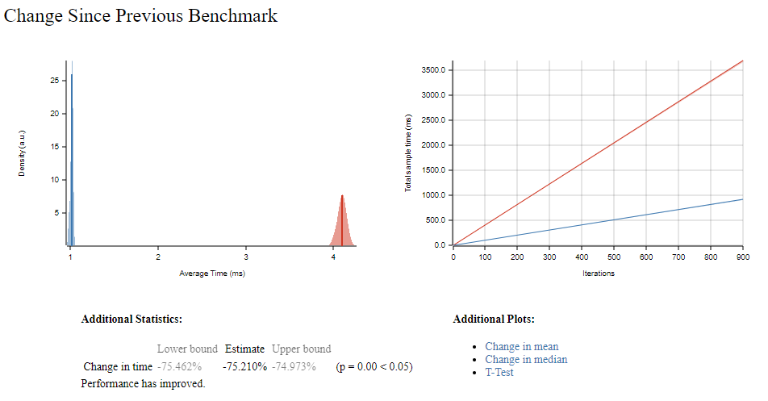

I developed a [TypeScript library](https://github.com/MrDesjardins/hilbert-curve-ts) to compute the [Hilbert Curve](https://en.wikipedia.org/wiki/Hilbert_curve) a few months ago. The library transforms from a point to a coordinate (1d to 2d) and the other way around. In addition, I am slowly getting familiar with [Rust](https://en.wikipedia.org/wiki/Rust_(programming_language)), a language developed to be as fast as C++ with type safety in the last few days.

One way to learn is to develop small code and slowly grow the scope. Porting the TypeScript code into Rust is manageable for someone with previous experience because of its simplicity. The algorithm has less than 200 lines of Typescript code, and I already had a lot of unit tests that I could also port.

# The Differences

Like any new language, start with what you know and try to replicate it. Managing the scope of variable memory made me think of the first few times I coded in C++ over 20 years ago with reference and dereferencing. With Rust, there is the notion of borrowing and many other paradigms like `struct` being in the foreground instead of classes. I will only go a little with the difference, but having to think twice before using a number happens often. In Rust, you must specify if your number is signed or unsigned and how many bytes you want to reserve.

My first iteration, which compiled with 100% unit tests coverage, was faster than my TypeScript code but very slow compared to existing Rust libraries that perform the same Hilbert Curve.

The two plots in the image above show my first and second attempt's performance changes with an order 8. The red color is the first iteration of the code; the blue is the second iteration. Performance can be tweaked in many ways in Rust, and one way is to avoid creating too many variables. For example, my TypeScript code uses an immutable function that takes input and returns a new version in the output -- that is what I did in the first iteration in Rust. However, the amount of memory is adding up. So the second iteration passes a reference down many functions, reducing the memory footprint. The change saved 75%!

# Benchmarks

Rust is an exciting ecosystem with many concepts right in the language or ecosystem. There is the concept of benchmarking that allows comparing functions quickly. I create a benchmark using four other Rust libraries that perform the same operations as mine. After a few minutes, I understood that my implementation of the Hilbert Curve was similar to most.

The graph above shows five algorithms (one is mine, and four are others). The x-axis is the order for the Hilbert Curve. A higher-order means more points in the curve, meaning more time to compute all positions. The y-axis represents the average time performing the entire computation of an order (the benchmark was trying ten times for each algorithm).

It is unsurprising to see all algorithms having an exponential shape since the number increase by `O(2^N)`, the number of points. However, I was surprised to see that two outliers were present. One that was doing a lot worse and one quite good.

# Conclusion

This post has a vague goal besides saying that I am learning Rust and need more than watching videos and reading the tremendous official documentation. Getting into writing is the key to struggle, learn and remember. A small library is a crucial point to not getting discouraged. In this repository, I have learned the basics of Rust but also how to manage modules (import/export), do unit tests and integration tests, do benchmarks, create a crate, publish coverage reports, what Cargo is, etc. I still have a long way in front of me, but I have absolutely no rush -- I'm enjoying and savoring the difference between paradigms.

