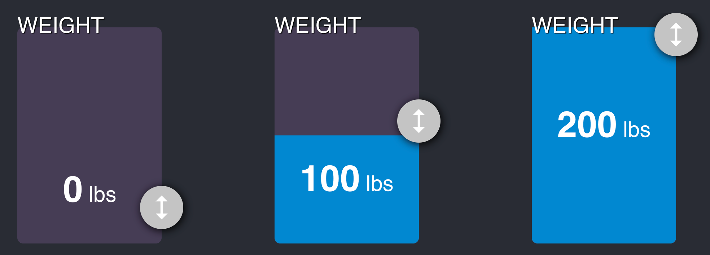

After building a smallish component in a few hours, this blog post is a quick review of [SolidJS](https://www.solidjs.com/) framework. Thus, it is not an in-depth review.

In a nutshell, SolidJS is an alternative to React. The main selling point of the SolidJS framework is that it relies on JSX, with a very similar way to build components like React but handles rendering in a less error-prone and faster way than React.

I'll go through a couple of features in a second, but if you are interested in learning more about SolidJS, I recommend the [step-by-step tutorial on their website](https://www.solidjs.com/tutorial/introduction_basics). You will understand why it is a step forward to React within one hour.

# The Project: Small Component
The project is a slider that lets me move up and down a `div` that acts like a handle that allows the user to adjust the weight. The quantity of water determines the weight in a tank.




# State
React Hook relies on Hook and has the `useState`. A change in the state renders the component again. With SolidJS, we must use `createSignal`. The name is different but also how it behaves. Instead of rendering the whole component again, the framework is smart enough to render only the portion using the state. It means that if you have a `console.log` in your component, you will get an entry the first time the component is rendered but not every time the state changes.

Here is an example where the weight is entered with a default value, and when the user adjusts the weight, we are setting the value again.

```typescript
const [currentWeight, setCurrentWeight] = createSignal(props.defaultWeight);
```

In my code, I have the `setCurrentWeight` called directly on the `mousemove`. The component does not render all over again while the user drags the handler. 

```typescript {2}
<span class={styles.SingleWeightSelectorWeight_Number}>
  {currentWeight()}
</span>
```
There is a minor difference: the state is accessible with a function instead of a variable. The difference makes the framework known when the state is changing to alter this portion of the component instead of the whole component.

# CreateMemo
The water height (in pixel) is calculated from the weight (lbs) in this demo. Hence, we need to calculate get the pixel from a function. SolidJS has effect (Like React Effect but called `createEffect`) and Memoization function. The `createMemo` function is very similar to `useMemo` with a small difference.

```typescript
const getWaterHeight = createMemo((): number => {
  return (
    (currentWeight() / (props.maximumWeight - props.minimumWeight)) *
    props.height
  );
});
```
The memo does not need to have the array of dependencies. Nor need the `useEffect`. The SolidJS handles it for you. In the example above, the `currentWeight()` is detected by SolidJS to be a dependency. When the state change, it invalidates the memoization. The implicit dependency is great because you do not have to rely on an external tool (like a Linter) to handle dependencies. You can code without worrying about side effects like stale data.


# Styles
By default, a new project with SolidJS comes with CSS module. So you only need to have a file with a suffix `.module.css`, and then you can import it and use it.

```typescript
import styles from "./SingleWeightSelectorHandle.module.css";

// Later in the file
<div class={styles.SingleWeightSelectorHandleData}>
        //...
</div>
```
SolidJS has more than just `class`. It also support `className` like React and a very useful `classList` that allows conditional style. In the small demo, a handle changes if the handle is pushed.

```typescript
classList={{
  [styles.SingleWeightSelectorHandle]: true,
  [styles.SingleWeightSelectorHandle_Unpressed]: !isDragging(),
  [styles.SingleWeightSelectorHandle_Pressed]: isDragging(),
}}
```
As you can see, there is no need of a third-party library or to have conditional code for assigning a class.

# Caveats
I wanted to have the drag-and-drop capability. I found online a third-party library for SolidJS. After 30 minutes, I could not figure out how to use it. It relies on the concept of _directive_, which is a concept that short-cut a more traditional JSX format. I would not say that the problem is directly SolidJS, but the third-party documentation was small with barely any community posts. Hence, I fall back to basic mouse events. However, it shows that the community around SolidJS is not as mature as React and might cause future challenges. For example, many projects might rely on popular UI components with a React wrapper but not SolidJS wrapper. Furthermore, SolidJS's code is not compatible with React. Thus, many existing codes are not re-usable.

# Extends of SolidJS
SolidJS is more than just state and effect. The library handles the asynchronous load with a React's suspense type of component to display before the actual one. Also, SolidJS has a whole store system (`createStore`) with immutability (`subscribe`) capability.

# Conclusion
There is a lot more, and it does not give justice to how enjoyable is SolidJS. Overall, there is more to like if you enjoy React and not really Vue.JS or Angular, or Svelte. For me, it was being as close as JavaScript is the best. That is why React was always more intuitive because you do not need to learn a template to perform actions. SolidJS is more like React and has a foot toward custom templating with optimized control flow and directive while not being required. I have not discussed these topics in this post but will in the future. So far, highly recommend giving it a try if you enjoy React.